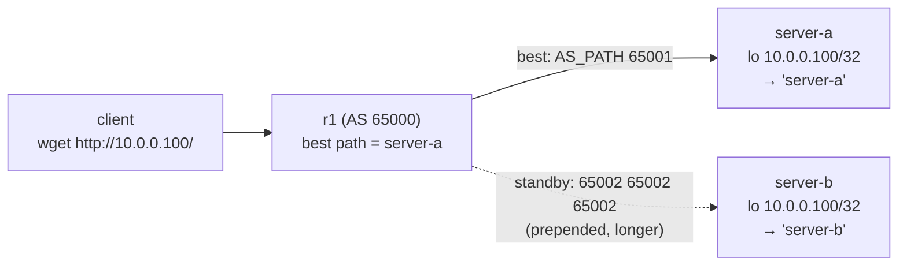

# Lab #31: Anycast — One Address, Many Servers, Routing Decides

Expected time: 45 to 60 minutes  
日本語: 想定時間 45〜60分

Reading guide: [`../rfc-notes/anycast.md`](../rfc-notes/anycast.md)

Prerequisite: [BGP Lab 01: Announcing a Prefix over eBGP](bgp-01-ebgp-announce.md)

## Goal

Multicast (Lab 29) sent one packet *to a group*. **Anycast** does the opposite trick: the *same address* lives on **several** servers, and the routing system steers each client to **one** of them. Nothing in the packet says "nearest server" — BGP already knows one best path to that address, and the packet just follows it.

Two servers both announce `10.0.0.100/32` into BGP:

- `server-b` prepends its AS (a longer AS_PATH), so `r1` prefers **server-a**,
- the client fetches `http://10.0.0.100/` and gets **`server-a`**,
- then `server-a`'s uplink **fails**; BGP withdraws its route and `r1` reconverges onto **server-b**,
- the client fetches the **same** `http://10.0.0.100/` and now gets **`server-b`** — automatic failover, no client change.

日本語: Multicast(Lab 29)は1パケットを *group へ* 送りました。**Anycast** は逆の技です——*同じアドレス* が **複数**のサーバに存在し、routing が各クライアントを **1つ**へ導く。パケットに「最寄りへ」とは書かれておらず、BGP が既にそのアドレスへの best path を1つ持ち、パケットはそれに従うだけ。2台のサーバが同じ `10.0.0.100/32` を BGP に announce し、`server-b` は AS を prepend(AS_PATH を長く)するので `r1` は **server-a** を優先。クライアントが `http://10.0.0.100/` を取得すると **`server-a`**。`server-a` のリンクが落ちると BGP がその経路を withdraw し、`r1` は **server-b** に再収束、同じ VIP が今度は **`server-b`** を返す——クライアント無変更の自動フェイルオーバー。

By the end, you should be able to explain this:

| State | r1's best path to `10.0.0.100` | client gets |
|---|---|---|
| both up | via server-a (AS_PATH `65001`, shorter) | `server-a` |
| server-a down | via server-b (AS_PATH `65002 65002 65002`) | `server-b` |

## What You Will Learn

理解したいこと:

- What **anycast** is: one prefix announced from many places, routing installs one best path.
- Why "nearest" means **nearest in routing terms** (AS_PATH length here), not geographic.
- How BGP **best-path selection** turns two identical announcements into one installed route.
- How **failover** works: withdraw the winner's route and routing reconverges automatically.
- Where anycast is used (root DNS, `1.1.1.1`/`8.8.8.8`, CDNs, DDoS absorption) and its caveats for stateful traffic.

This lab does not cover:

- Fine-grained load balancing across instances (anycast pins a client to one).
- Stateful anycast (session sync, consistent hashing) for long-lived TCP.
- IGP-based anycast (OSPF/IS-IS metrics) — here we use eBGP AS_PATH.

日本語: anycast とは何か(1 prefix を複数箇所から announce、routing が best を1つ入れる)、「最寄り」が routing metric 上の最寄りである理由、BGP best-path 選択が2つの同一 announce を1経路にする仕組み、withdraw による自動フェイルオーバー、利用例(root DNS、`1.1.1.1`、CDN、DDoS 吸収)と stateful 通信での注意を学びます。細かい負荷分散、stateful anycast、IGP ベースの anycast は扱いません。

## RFCで読む場所

| 資料 | 読むポイント |
|---|---|
| RFC 4271 §9.1 | BGP best-path 選択(AS_PATH 長で1つ選ぶ) |
| RFC 4786 | anycast サービスの運用(複数 announce、catchment、切り替え) |
| RFC 7094 | anycast の定義と stateful 通信での注意 |
| RFC 5737 / RFC 1918 | Lab で使うアドレスがローカル/ドキュメント用であること |

## 実験の全体像

client の後ろに r1(AS 65000)。r1 は server-a(AS 65001)と server-b(AS 65002)に eBGP で接続。両サーバが同じ VIP を announce する。

```text
 client            r1 (AS 65000)          server-a (AS 65001)  lo 10.0.0.100/32
 10.0.9.2 --- eth1 ---+--- eth2 --- 10.0.1.0/30 --- (BGP: network 10.0.0.100/32)
                      |
                      +--- eth3 --- 10.0.2.0/30 --- server-b (AS 65002)  lo 10.0.0.100/32
                                    (BGP: network 10.0.0.100/32, prepend 65002 65002)
```

r1 は VIP への2経路を受け取り、AS_PATH が短い server-a を best に選ぶ。server-a 障害時は server-b に再収束。



`10.0.0.0/8` はローカル閉域。VIP は `10.0.0.100`。

## 必要なもの

推奨環境:

- Linux / WSL2 / Linux VM
- Docker
- containerlab

使用イメージ:

- `frrouting/frr:latest`（r1・server-a・server-b の BGP。python3 も同梱で HTTP responder に使う）
- `nicolaka/netshoot:latest`（client。`wget`、`traceroute`）

追加イメージは不要。

## 実行手順

```bash
./scripts/labctl.sh run anycast-31
```

### 1. 作業ディレクトリへ移動する

```bash
cd protocol-lab/examples/anycast-31
```

### 2. 起動する

```bash
sudo containerlab deploy -t anycast-31.clab.yml
```

両サーバは `lo` に `10.0.0.100/32`(VIP)を持ち、FRR で `network 10.0.0.100/32` を announce する。server-b は outbound route-map で自 AS を prepend する。

### 3. サーバの identity responder を起動する

```bash
docker exec -d clab-anycast-31-server-a python3 /responder.py server-a
docker exec -d clab-anycast-31-server-b python3 /responder.py server-b
```

各サーバは 0.0.0.0:80 で「自分の名前」を返す小さな HTTP responder（VIP でも応答する）。

### 4. BGP の best path を確認する（server-a が優先）

```bash
docker exec clab-anycast-31-r1 vtysh -c "show bgp ipv4 unicast 10.0.0.100/32"
docker exec clab-anycast-31-r1 ip route get 10.0.0.100     # via 10.0.1.2 (server-a)
```

2経路が見え、AS_PATH の短い server-a(`65001`)が best。

### 5. クライアントから VIP を取得する（server-a が応答）

```bash
docker exec clab-anycast-31-client wget -qO- http://10.0.0.100/     # → server-a
docker exec clab-anycast-31-client traceroute -n 10.0.0.100
```

### 6. フェイルオーバー: server-a のリンクを落とす

```bash
docker exec clab-anycast-31-server-a ip link set eth1 down
sleep 5
docker exec clab-anycast-31-r1 ip route get 10.0.0.100     # via 10.0.2.2 (server-b)
docker exec clab-anycast-31-client wget -qO- http://10.0.0.100/     # → server-b
```

同じ VIP のまま、応答が server-b に切り替わる。

### 7. 戻す

```bash
docker exec clab-anycast-31-server-a ip link set eth1 up
```

## 期待出力

- `show bgp ... 10.0.0.100/32`: 2経路、best は AS_PATH の短い server-a。
- `ip route get 10.0.0.100`: 障害前は `via 10.0.1.2`(server-a)、障害後は `via 10.0.2.2`(server-b)。
- `wget http://10.0.0.100/`: 障害前は `server-a`、障害後は `server-b`(宛先 IP は不変)。

## なぜそう動くのか

**anycast** は「1つのアドレス、複数のインスタンス、routing が決める」。同じ prefix(ここでは `10.0.0.100/32`)を複数ノードが routing に announce し、各ルータはその prefix への **best path を1つ**だけ FIB に入れる。だから、そのルータ配下のクライアントは常に1インスタンスへ届く。送信側は特別なことをしない——宛先はただの1つの IP。

- **best-path 選択**: r1 は VIP への2経路を受け取る。BGP は1つを best に選ぶ。ここでは **AS_PATH 長**が決め手: server-a は `65001`(長さ1)、server-b は prepend で `65002 65002 65002`(長さ3)。短い server-a が勝つ。だから「nearest」は物理距離ではなく **routing metric 上の近さ**。
- **catchment**: どのクライアントがどのインスタンスに落ちるかは routing のトポロジが決める。実運用では地理と相関することが多いが、決めているのは BGP/IGP。
- **フェイルオーバー**: server-a のリンクが落ちると、r1–server-a の BGP セッションが切れ、server-a の経路が無効化される。r1 は残る server-b を best に選び、FIB を更新(再収束)。同じ宛先アドレスのまま、トラフィックは server-b へ。クライアントの設定変更は不要。
- **なぜ便利か**: root DNS や `1.1.1.1`/`8.8.8.8`、CDN は、同じ IP を世界中の多数インスタンスで提供する。最寄りに落ちて低遅延、1つ落ちても自動で別へ、攻撃も分散して吸収できる。

要点は、**同一 prefix を複数から announce するだけで、通常の routing が「選択」と「フェイルオーバー」を担う**こと。専用プロトコルは要らない。

## 詰まりやすい点

- **anycast をロードバランサと混同する**。1クライアントは基本1インスタンスに固定的に落ちる。分散は「多数のクライアントが別々の best を持つ」ことで生じる。細かい負荷分散は別の仕組み。
- **「最寄り」を地理と思う**。実際は AS_PATH/IGP metric 上の最寄り。prepend の数で優先度が変わる。
- **stateful 通信の移動**。長寿命 TCP 中に best path が変わると別インスタンスへ飛び接続が切れうる。古典的には DNS(UDP)向き。CDN は収束安定を前提に HTTP でも使う。
- **VIP を router-id にしない**。FRR の router-id は VIP と別にする(この Lab は `10.11.11.11` / `10.22.22.22`)。
- **戻り経路**。サーバは client サブネットへの戻り経路が要る(この Lab は default route を r1 へ向けている)。
- **収束時間**。フェイルオーバーは即時ではない。BGP セッション断の検出+再計算に数秒かかる(この環境で約2秒)。

## 後片付け

```bash
sudo containerlab destroy -t anycast-31.clab.yml --cleanup
```

`labctl.sh run anycast-31` を使った場合は、スクリプトが最後に destroy する。

## 確認問題

1. anycast とは何か。unicast / multicast と何が違うか。
2. 2つのサーバが同じ `10.0.0.100/32` を announce したとき、r1 はなぜ1つだけを使うのか。
3. この Lab で「server-a が優先」になるのはなぜか。server-b は何をしているか。
4. 「最寄り」とは何の意味での最寄りか。地理的距離とどう違いうるか。
5. server-a が落ちたとき、同じ VIP がなぜ server-b から応答できるのか。何が起きているか。
6. anycast が DNS に向き、長寿命 TCP には注意が要るのはなぜか。

## References

- [RFC 4271: A Border Gateway Protocol 4 (BGP-4)](https://www.rfc-editor.org/rfc/rfc4271)
- [RFC 4786: Operation of Anycast Services](https://www.rfc-editor.org/rfc/rfc4786)
- [RFC 7094: Architectural Considerations of IP Anycast](https://www.rfc-editor.org/rfc/rfc7094)
- [RFC 5737: IPv4 Address Blocks Reserved for Documentation](https://www.rfc-editor.org/rfc/rfc5737)

## 検証済み実行ログ (2026-07-07)

このLabは実機で再現性を確認済みです。

実行環境:

- Ubuntu 26.04 LTS (kernel 7.0.0-27-generic, x86_64)
- Docker 29.1.3
- containerlab 0.77.0
- r1 / server-a / server-b: `frrouting/frr:latest`（BGP + python3 responder）
- client: `nicolaka/netshoot:latest`（wget、traceroute）

`PATH="/tmp/pl-shim:$PATH" ./scripts/labctl.sh run anycast-31` で deploy → verify → destroy を実行し、`verification.json` は `"status": "verified"` を返した。

### 同じ VIP が、障害前は server-a・障害後は server-b

```text
[protocol-lab][anycast-31] r1 route to 10.0.0.100 is via 10.0.1.2 (after 8s)
[protocol-lab][anycast-31] before failover: server-a server-a server-a
[protocol-lab][anycast-31] + docker exec clab-anycast-31-server-a ip link set eth1 down
[protocol-lab][anycast-31] r1 route to 10.0.0.100 is via 10.0.2.2 (after 2s)
[protocol-lab][anycast-31] after failover: server-b server-b server-b
```

クライアントは終始 `http://10.0.0.100/`(同一 VIP)を叩いているだけ。障害前は3回とも `server-a`、server-a のリンクを落とすと **約2秒で再収束**し、以後3回とも `server-b`。宛先アドレスは一切変えていない。

### r1 の BGP best-path が語る「選択」と「フェイルオーバー」

```text
# 障害前 — 2経路。AS_PATH の短い server-a が best
Paths: (2 available, best #2, table default)
  65002 65002 65002        <- server-b(prepend で長い)
    10.0.2.2 from 10.0.2.2 (10.22.22.22)
  65001                    <- server-a(短い)
    10.0.1.2 from 10.0.1.2 (10.11.11.11)
      Origin IGP, metric 0, valid, external, best (AS Path)

# 障害後 — server-a の経路が消え、残る server-b が best
Paths: (1 available, best #1, table default)
  65002 65002 65002
    10.0.2.2 from 10.0.2.2 (10.22.22.22)
      Origin IGP, metric 0, valid, external, best (First path received)
```

- 障害前は `best (AS Path)` の理由で server-a(`65001`)が選ばれている。server-b は prepend で `65002 65002 65002`(長さ3)なので非優先の待機系。
- server-a のリンク断で BGP セッションが落ち、その経路が withdraw される。r1 は残る server-b を best に選び直し、FIB を `via 10.0.2.2` に更新。専用の切り替え機構ではなく、**通常の BGP 再収束**がフェイルオーバーそのものになっている。

`traceroute 10.0.0.100`(障害前)は `client → 10.0.9.1 (r1) → 10.0.0.100` の2ホップで、VIP へ素直に届いていることを示した。

### Cleanup

```bash
containerlab destroy -t anycast-31.clab.yml --cleanup
```
