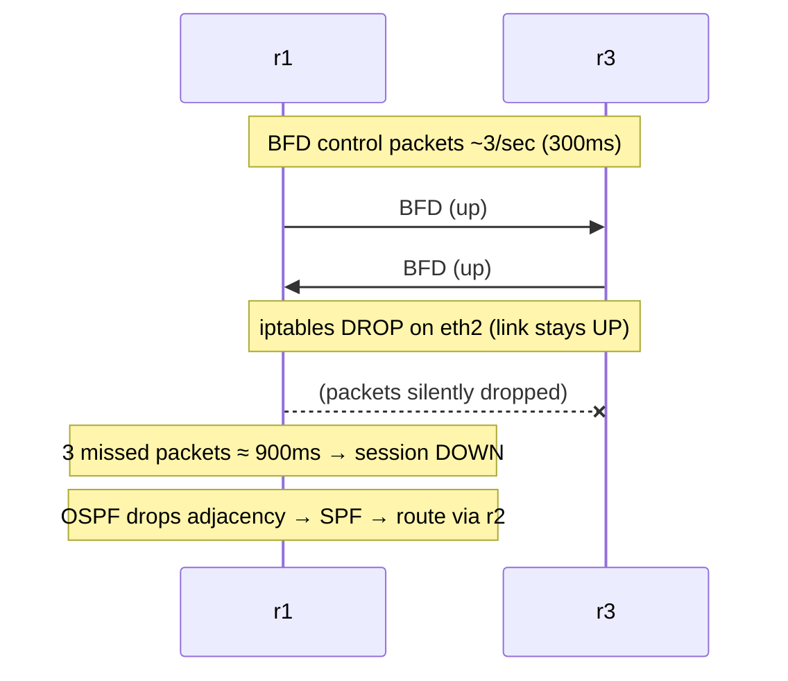

# Lab #35: BFD — Catching a Silent Failure in Under a Second

Expected time: 40 to 55 minutes  
日本語: 想定時間 40〜55分

Reading guide: [`../rfc-notes/bfd.md`](../rfc-notes/bfd.md)

Prerequisite: [Lab 34: OSPF — Flood the Map, Compute the Shortest Path](ospf-34-link-state.md)

## Goal

Lab 34 reconverged fast because bringing an interface *down* is detected instantly. Real failures are not always so polite: a link can stay **up** (carrier present) while forwarding is silently broken — a dumb switch in the middle, a one-way fault, a wedged neighbor. Then OSPF notices only when its **dead timer** expires (default **40 seconds**), black-holing traffic the whole time.

**BFD** (Bidirectional Forwarding Detection) fixes this. It runs a tiny hello between neighbors several times a second; when a few go missing it declares the path down and tells OSPF immediately.

- r1/r2/r3 run OSPF **plus BFD** (300 ms × 3 ≈ **900 ms** detection) on every adjacency,
- r1 reaches the target over the direct r1-r3 link,
- we simulate a **silent failure** — drop all packets on r1's `eth2` while the link stays **UP**,
- BFD catches it and OSPF reconverges onto r2 in **~900 ms**, versus **40 s** with OSPF alone.

日本語: Lab 34 が速く再収束したのは、インターフェースを *down* にすると即検出できるから。現実の障害はそう親切とは限らず、**リンクは up(carrier あり)なのに転送だけ静かに壊れる**ことがある——間の dumb スイッチ、片方向障害、wedge した隣接。すると OSPF は **dead timer**(既定 **40 秒**)が切れるまで気づかず、その間トラフィックを blackhole する。**BFD** はこれを解決します。隣接間で極小 hello を毎秒数回やり取りし、数個欠ければ path down と判断して OSPF に即通知する。r1/r2/r3 は OSPF に **BFD**(300ms × 3 ≈ **900ms** 検出)を足し、r1 は直リンク r1-r3 で target に到達。**silent failure**(eth2 の全パケットを drop、リンクは **UP** のまま)を再現すると、BFD が捕捉して OSPF は **約 900ms** で r2 へ再収束——OSPF 単独の **40 秒** に対して。

By the end, you should be able to explain this:

| | detection of a silent failure | time |
|---|---|---|
| OSPF alone | dead timer expires | 40 s |
| OSPF + BFD | missed BFD packets (300 ms × 3) | ~0.9 s |

## What You Will Learn

理解したいこと:

- What **BFD** is and why routing protocols' own hellos are too slow.
- How **detection time = receive interval × detect multiplier** (300 ms × 3 ≈ 900 ms).
- The difference between a **link-down** failure and a **silent** forwarding failure.
- How OSPF **registers** with BFD (`ip ospf bfd`) and reacts to a BFD "down".
- Why BFD only reports up/down — the routing protocol still computes the paths.

This lab does not cover:

- BFD echo mode, or micro-BFD on LAG members.
- Multihop BFD (RFC 5883).
- Tuning timers against flap/false-positive trade-offs in depth.

日本語: BFD とは何か、routing 自身の hello が遅い理由、検出時間=受信間隔×detect multiplier、link-down 障害と silent 障害の違い、OSPF が BFD に登録し down に反応する仕組み(`ip ospf bfd`)、BFD は up/down 報告のみで経路計算は routing が行うこと、を学びます。echo モード、micro-BFD、multihop BFD、timer チューニングの詳細は扱いません。

## RFCで読む場所

| 資料 | 読むポイント |
|---|---|
| RFC 5880 | BFD 本体(session, timer, detection time) |
| RFC 5881 | 隣接間 single-hop の BFD |
| RFC 5882 | OSPF/BGP が BFD down をどう使うか |
| RFC 2328 | OSPF の dead 間隔(BFD が置き換える遅い検出) |

## 実験の全体像

Lab 34 と同じ OSPF area-0 三角形。全隣接に BFD を追加。

```text
              r1
    (OSPF+BFD)/  \(OSPF+BFD)
             r2 -- r3 --- target 10.0.30.1
                (OSPF+BFD)
```

r1→target は直リンク r1-r3。eth2 を `iptables DROP`(リンクは up)で silent failure にする。



`10.0.0.0/8` はローカル閉域。

## 必要なもの

推奨環境:

- Linux / WSL2 / Linux VM
- Docker
- containerlab

使用イメージ:

- `frrouting/frr:latest`（r1/r2/r3、ospfd + bfdd）
- `nicolaka/netshoot:latest`（target）

追加イメージは不要。

## 実行手順

```bash
./scripts/labctl.sh run bfd-35
```

### 1. 作業ディレクトリへ移動する

```bash
cd protocol-lab/examples/bfd-35
```

### 2. 起動する

```bash
sudo containerlab deploy -t bfd-35.clab.yml
```

各ルータは OSPF(area 0)に加え、transit インターフェースで `ip ospf bfd` により BFD を有効化。

### 3. BFD セッションとタイマを確認する

```bash
docker exec clab-bfd-35-r1 vtysh -c "show bfd peers"
docker exec clab-bfd-35-r1 vtysh -c "show ip ospf interface eth2" | grep "Timer intervals"
```

`Status: up`、`Receive/Transmission interval: 300ms`、`Detect-multiplier: 3`(≈900ms 検出)。OSPF は `Dead 40s`。

### 4. 直リンク経由の到達を確認する

```bash
docker exec clab-bfd-35-r1 ip route get 10.0.30.1     # via 10.0.13.2 (r3 direct)
docker exec clab-bfd-35-r1 ping -c2 10.0.30.1
```

### 5. silent failure を起こす（リンクは up のまま転送を殺す）

```bash
docker exec clab-bfd-35-r1 sh -c 'iptables -A INPUT -i eth2 -j DROP; iptables -A OUTPUT -o eth2 -j DROP'
sleep 2
docker exec clab-bfd-35-r1 ip -br link show eth2       # まだ UP,LOWER_UP
docker exec clab-bfd-35-r1 ip route get 10.0.30.1      # もう via 10.0.12.2 (r2)
docker exec clab-bfd-35-r1 ping -c2 10.0.30.1          # まだ届く
```

BFD が約 900ms で down を検出し、OSPF が r2 へ再収束する。リンクは依然 UP。

### 6. 戻す

```bash
docker exec clab-bfd-35-r1 sh -c 'iptables -D INPUT -i eth2 -j DROP; iptables -D OUTPUT -o eth2 -j DROP'
```

## 期待出力

- `show bfd peers`: 2 セッションが `Status: up`、間隔 300ms、multiplier 3。
- OSPF interface: `Dead 40s`(BFD 無しなら待つ時間)。
- silent failure 後: eth2 は `UP,LOWER_UP` のまま、route は `via 10.0.12.2`(r2)へ、reconverge は **1 秒未満**(この環境で約 900ms)。
- target は終始到達可能。

## なぜそう動くのか

**BFD** は「next-hop 用の高速なデッドマンスイッチ」。routing プロトコルも自前の hello で障害を検出するが、タイマが遅い(OSPF の dead は 40 秒)。

- **なぜ hello だけでは遅いか**: OSPF Hello は 10 秒毎、dead 40 秒。間隔を詰めると負荷・誤検出が増える。そこで **検出専用の軽量プロトコル(BFD)** を分けて走らせ、routing はそれに「down を教えて」と登録する。
- **検出時間**: BFD は制御パケットを交渉した間隔(ここは 300ms)でやり取りし、**detect multiplier**(既定 3)個連続で欠けたら down とみなす。つまり ≈ 300ms × 3 = **900ms**。OSPF の 40 秒の約 1/40。
- **silent failure が肝**: リンクが **down** すれば OS が carrier loss を即検出でき、routing もすぐ反応する(Lab 34 の veth はこれで速かった)。だが現実には **リンク up・転送死** の障害がある(間の dumb スイッチ、片方向、wedge した隣接)。carrier が生きているので routing は dead 間隔まで気づけない。この Lab は `iptables DROP` でリンクを up のまま転送を殺し、この状況を作る。BFD の制御パケットも drop されるので、r1 は 900ms で session down を宣言する。
- **OSPF との結合**: `ip ospf bfd` でその隣接に BFD を紐づける。BFD が down を報告すると、OSPF は隣接を即 down 扱いにし、SPF をやり直して r2 経由に再収束する。**BFD は経路を選ばない**——up/down を報告するだけで、経路は OSPF が計算する。

要点は、**遅い routing hello の代わりに、軽量な BFD が silent failure を 1 秒未満で検出し、routing の再収束を早める**こと。検出(BFD)と経路計算(OSPF/BGP)の役割分担。

## 詰まりやすい点

- **BFD が経路を選ぶと思う**。選ばない。up/down を報告するだけ。経路は OSPF/BGP。
- **リンク down のために BFD が要ると思う**。link-down は OS が即検出する。BFD の価値は **silent failure**(リンク up・転送死)。この Lab の `iptables DROP` がその再現。
- **hello を詰めれば十分と思う**。routing hello の過度な短縮は負荷・誤検出増。軽量 BFD を分けるのが定石。
- **速いほど良いと思う**。攻めすぎると瞬断で誤 down(フラップ)。timer/multiplier は環境に合わせる。
- **BFD 単独で動くと思う**。routing と結合して初めて再収束が起きる。

## 後片付け

```bash
sudo containerlab destroy -t bfd-35.clab.yml --cleanup
```

`labctl.sh run bfd-35` を使った場合は、スクリプトが最後に destroy する。

## 確認問題

1. BFD は何をするプロトコルか。経路選択をするか。
2. 検出時間はどう決まるか。300ms・multiplier 3 なら何 ms か。
3. link-down 障害と silent failure の違いは何か。どちらで BFD が効くか。
4. OSPF の dead 間隔(40秒)に対し、BFD はなぜ桁違いに速いのか。
5. OSPF は BFD の down をどう使うか。`ip ospf bfd` は何をするか。
6. BFD の timer を攻めすぎると何が起きうるか。

## References

- [RFC 5880: Bidirectional Forwarding Detection (BFD)](https://www.rfc-editor.org/rfc/rfc5880)
- [RFC 5881: BFD for IPv4 and IPv6 (Single Hop)](https://www.rfc-editor.org/rfc/rfc5881)
- [RFC 5882: Generic Application of BFD](https://www.rfc-editor.org/rfc/rfc5882)
- [FRRouting BFD documentation](https://docs.frrouting.org/en/latest/bfd.html)
- [RFC 5737: IPv4 Address Blocks Reserved for Documentation](https://www.rfc-editor.org/rfc/rfc5737)

## 検証済み実行ログ (2026-07-07)

このLabは実機で再現性を確認済みです。

実行環境:

- Ubuntu 26.04 LTS (kernel 7.0.0-27-generic, x86_64)
- Docker 29.1.3
- containerlab 0.77.0
- r1 / r2 / r3: `frrouting/frr:latest`（ospfd + bfdd）
- target: `nicolaka/netshoot:latest`

`PATH="/tmp/pl-shim:$PATH" ./scripts/labctl.sh run bfd-35` で deploy → verify → destroy を実行し、`verification.json` は `"status": "verified"` を返した。

### BFD セッション（サブ秒タイマ）と OSPF の 40 秒 dead

```text
peer 10.0.13.2 vrf default interface eth2
    Status: up
    Detect-multiplier: 3
    Receive interval: 300ms
    Transmission interval: 300ms

OSPF: Timer intervals configured, Hello 10s, Dead 40s, Wait 40s, Retransmit 5
```

BFD の検出時間 ≈ 300ms × 3 = **約 900ms**。OSPF 単独の dead は **40 秒**——BFD は約 40 倍速い。

### silent failure を 918ms で検出・再収束

r1 の eth2 に `iptables DROP`(in/out 両方)を入れ、リンクを **UP のまま** 転送を殺した:

```text
reconverged: 1
elapsed_ms: 918
link_at_failure: eth2@if1136  UP  <BROADCAST,MULTICAST,UP,LOWER_UP>
```

- 障害の瞬間も eth2 は **`UP,LOWER_UP`**(carrier あり)——OS からは「リンクは生きている」ように見える silent failure。
- それでも BFD が制御パケットの途絶を約 900ms で検知し、OSPF が r2 経由へ **918ms** で再収束した。
- 同じ状況で BFD が無ければ、OSPF は Hello が dead 間隔(40 秒)ぶん途切れるまで壊れた直リンクを使い続け、その間トラフィックを blackhole する。
- 再収束後も target(10.0.30.1)は r2 経由で到達可能だった。

### Cleanup

```bash
containerlab destroy -t bfd-35.clab.yml --cleanup
```
