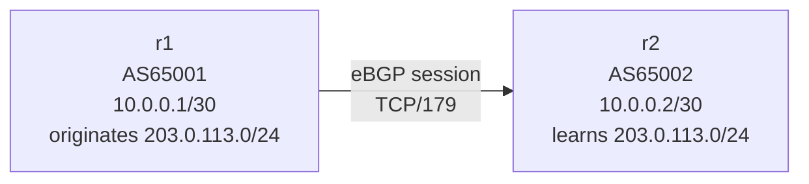
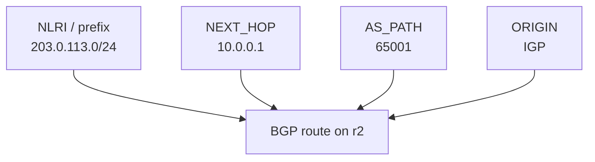

# BGP Lab #1: One Prefix Announcement You Can Explain

Expected time: 45 to 60 minutes  
日本語: 想定時間 45〜60分

Reading guide: [`../rfc-notes/bgp-rfc4271.md`](../rfc-notes/bgp-rfc4271.md)  
日本語の補助資料: [`../rfc-notes/bgp-rfc4271.md`](../rfc-notes/bgp-rfc4271.md)

## Goal

In this lab, you will build a tiny eBGP session between two ASNs, advertise one prefix, and explain the route that the other side learns.

The theme is simple: one prefix announcement to a route you can explain.

By the end, you should be able to explain this route using RFC 4271 terms:

```text
203.0.113.0/24 via 10.0.0.1, AS_PATH 65001, ORIGIN IGP
```

日本語: このLabでは、2つのASの間でeBGP neighborを張り、片方のASが1つのprefixを広告し、もう片方のASが学習した経路を説明します。最後に、上の1本のrouteをRFC 4271の言葉で読める状態を目指します。

## What You Will Learn

理解したいこと:

- AS は BGP の外部経路交換における管理単位である。
- prefix は到達可能な宛先アドレス範囲である。
- BGP の route は `prefix + path attributes` である。
- UPDATE message で経路広告が運ばれる。
- 受信側では、NLRI、AS_PATH、NEXT_HOP、ORIGIN を対応づけて読む。

This lab does not cover:

- 経路選択アルゴリズムの詳細
- withdraw
- RPKI / ROA / ROV
- iBGP
- route reflector
- 本物のインターネットへの広告

## RFCで読む場所

今回の必読は RFC 4271 の以下。

| 章 | 読むポイント |
|---|---|
| 1.1 | AS、BGP speaker、EBGP、IBGP、NLRI、Route |
| 3 | BGP が network reachability information を交換すること |
| 3.1 | route は prefix と path attributes の組で、UPDATE で広告されること |
| 4.2 | OPEN message に My Autonomous System が入ること |
| 4.3 | UPDATE message の構造。Path Attributes と NLRI を見る |
| 5 | ORIGIN、AS_PATH、NEXT_HOP が mandatory attributes であること |
| 5.1.1 | ORIGIN |
| 5.1.2 | AS_PATH |
| 5.1.3 | NEXT_HOP |

## 実験の全体像

2台の仮想ルータを作る。

```text
AS65001 / r1                         AS65002 / r2
10.0.0.1/30  ----------------------  10.0.0.2/30

r1 advertises:
  203.0.113.0/24

r2 learns:
  prefix:   203.0.113.0/24
  next hop: 10.0.0.1
  as path:  65001
  origin:   IGP
```

`203.0.113.0/24` は RFC 5737 の documentation prefix。外部へ広告せず、Lab 内だけで使う。



この図で見てほしい点:

- `r1` と `r2` は別々の AS にいるので、この session は eBGP。
- `r1` は `203.0.113.0/24` を originate する。
- `r2` は UPDATE を受け取り、`203.0.113.0/24` への route を BGP table に入れる。

## 必要なもの

推奨環境:

- Linux / WSL2 / Linux VM
- Docker
- containerlab
- ホスト側の tcpdump
- Wireshark

使用イメージ:

- `frrouting/frr:latest`

macOS の場合は、Linux VM、WSL 相当の環境、または OrbStack/Colima 上の Linux VM で実行する想定にする。BGP の packet capture は Linux namespace 上で見る方が教材として扱いやすい。

## 実行手順

この手順は、containerlab を実行する Linux 環境の中で行う。

macOS で読む人は、macOS のターミナルから直接 containerlab を動かすのではなく、Linux VM / OrbStack / Colima などの Linux 環境に入ってから実行する。packet capture も同じ Linux 環境で行い、生成した pcap を必要に応じて macOS 側の Wireshark で開く。

このリポジトリを持っている場合は、Linux 環境で検証スクリプトを実行できる。

```bash
./scripts/labctl.sh run bgp-01
```

`labctl.sh run bgp-01` は、topology deploy、FRR 出力確認、pcap 取得、destroy まで行う。

### 1. 作業ディレクトリを作る

このリポジトリを持っている場合は、サンプル設定をそのまま使える。

```bash
cd protocol-lab/examples/bgp-01
```

記事だけを読んでいる場合は、空の作業ディレクトリを作って、以降のファイルを作成する。

```bash
mkdir -p bgp-01
cd bgp-01
```

### 2. containerlab topology を作る

`bgp-01.clab.yml`:

```yaml
name: bgp-01

topology:
  nodes:
    r1:
      kind: linux
      image: frrouting/frr:latest
      binds:
        - ./r1/frr.conf:/etc/frr/frr.conf
        - ./r1/vtysh.conf:/etc/frr/vtysh.conf
        - ./r1/daemons:/etc/frr/daemons
      exec:
        - ip addr add 10.0.0.1/30 dev eth1
        - ip link set eth1 up
        - ip addr add 203.0.113.1/24 dev lo
        - sysctl -w net.ipv4.ip_forward=1
    r2:
      kind: linux
      image: frrouting/frr:latest
      binds:
        - ./r2/frr.conf:/etc/frr/frr.conf
        - ./r2/vtysh.conf:/etc/frr/vtysh.conf
        - ./r2/daemons:/etc/frr/daemons
      exec:
        - ip addr add 10.0.0.2/30 dev eth1
        - ip link set eth1 up
        - sysctl -w net.ipv4.ip_forward=1

  links:
    - endpoints: ["r1:eth1", "r2:eth1"]
```

### 3. FRRouting config を作る

```bash
mkdir -p r1 r2
```

`r1/daemons`:

```text
zebra=yes
bgpd=yes
```

`r1/vtysh.conf`:

```text
service integrated-vtysh-config
```

`r2/daemons`:

```text
zebra=yes
bgpd=yes
```

`r2/vtysh.conf`:

```text
service integrated-vtysh-config
```

`r1/frr.conf`:

```text
frr version 10.0
frr defaults traditional
hostname r1
service integrated-vtysh-config
!
router bgp 65001
 bgp router-id 1.1.1.1
 no bgp ebgp-requires-policy
 neighbor 10.0.0.2 remote-as 65002
 !
 address-family ipv4 unicast
  network 203.0.113.0/24
 exit-address-family
!
line vty
```

`r2/frr.conf`:

```text
frr version 10.0
frr defaults traditional
hostname r2
service integrated-vtysh-config
!
router bgp 65002
 bgp router-id 2.2.2.2
 no bgp ebgp-requires-policy
 neighbor 10.0.0.1 remote-as 65001
 !
 address-family ipv4 unicast
 exit-address-family
!
line vty
```

### 4. 起動する

```bash
sudo containerlab deploy -t bgp-01.clab.yml
```

起動後、コンテナが作られていることを確認する。

```bash
docker ps --format "table {{.Names}}\t{{.Status}}"
```

期待する確認ポイント:

- `clab-bgp-01-r1` が起動している。
- `clab-bgp-01-r2` が起動している。

neighbor が Established になるまで数秒待ってから BGP summary を見る。

```bash
docker exec -it clab-bgp-01-r1 vtysh -c "show bgp summary"
docker exec -it clab-bgp-01-r2 vtysh -c "show bgp summary"
```

観察ポイント:

- `r1` の AS は `65001`
- `r2` の AS は `65002`
- peer が `Established` 相当の状態になる。
- `r2` 側の `PfxRcd` や `State/PfxRcd` に `1` が表示される。
- `r1` 側は、受信 prefix が `0` でもよい。今回 `r2` は prefix を広告していない。

### 5. r2 で受け取った経路を見る

```bash
docker exec -it clab-bgp-01-r2 vtysh -c "show bgp ipv4 unicast"
```

期待する読み方:

```text
Network          Next Hop        Path
*> 203.0.113.0/24 10.0.0.1       65001 i
```

実際の表示形式は FRRouting のバージョンで少し変わる。見るべき列は同じ。

| 表示 | RFC 4271 の対応 |
|---|---|
| `203.0.113.0/24` | NLRI / prefix |
| `10.0.0.1` | NEXT_HOP |
| `65001` | AS_PATH |
| `i` | ORIGIN = IGP |



日本語: `show bgp ipv4 unicast` の1行は、単なる表示ではなく、RFC 4271 の `route = prefix + path attributes` を小さく観察したものです。

詳細表示も見る。

```bash
docker exec -it clab-bgp-01-r2 vtysh -c "show bgp ipv4 unicast 203.0.113.0/24"
```

観察ポイント:

- `Paths` に `65001` が出る。
- `from 10.0.0.1` または `nexthop 10.0.0.1` が出る。
- `origin IGP` が出る。
- この1行が、RFC 4271 の `route = prefix + path attributes` に対応する。

### 6. UPDATE を packet capture で見る

別ターミナルを開き、containerlab を動かしている Linux 環境の中で r2 側のインターフェースを capture する。

FRRouting のコンテナに tcpdump が入っているとは限らないので、ホスト側から containerlab が作った network namespace に入って capture する。

まず network namespace が見えることを確認する。

```bash
sudo ip netns list | grep clab-bgp-01
```

期待する確認ポイント:

- `clab-bgp-01-r1` が見える。
- `clab-bgp-01-r2` が見える。

capture を開始する。

```bash
sudo ip netns exec clab-bgp-01-r2 tcpdump -i eth1 -nn -s 0 -w bgp-01-r2.pcap tcp port 179
```

capture を開始したまま、r1 から BGP session を一度張り直す。

```bash
docker exec -it clab-bgp-01-r1 vtysh -c "clear bgp 10.0.0.2"
```

数秒後に tcpdump を `Ctrl-C` で止める。`bgp-01-r2.pcap` が現在の作業ディレクトリに残る。

Wireshark で開く。

見る場所:

- `BGP OPEN`
  - `My AS: 65001`
  - `BGP Identifier: 1.1.1.1`
- `BGP UPDATE`
  - `Path attributes`
  - `ORIGIN`
  - `AS_PATH: 65001`
  - `NEXT_HOP: 10.0.0.1`
  - `NLRI: 203.0.113.0/24`

macOS 側の Wireshark で開く場合は、生成された `bgp-01-r2.pcap` を共有ディレクトリや `scp` で macOS に移してから開く。

## 期待出力

完全一致よりも以下のフィールドが取れることを重視する。

### `show bgp summary`

`r2` 側で確認すること:

```text
Local AS number 65002
Neighbor        V         AS   MsgRcvd   MsgSent   ...   State/PfxRcd
10.0.0.1        4      65001   ...       ...       ...   1
```

見るポイント:

- local AS が `65002`。
- neighbor が `10.0.0.1`。
- neighbor AS が `65001`。
- `State/PfxRcd` が `1`、または Established 状態で prefix を1本受信していることが分かる表示。

### `show bgp ipv4 unicast`

`r2` 側で確認すること:

```text
Network          Next Hop        Path
*> 203.0.113.0/24 10.0.0.1       65001 i
```

見るポイント:

- `203.0.113.0/24` が BGP table にある。
- NEXT_HOP が `10.0.0.1`。
- AS_PATH が `65001`。
- ORIGIN が `i` または詳細表示で `IGP`。

### `show bgp ipv4 unicast 203.0.113.0/24`

詳細表示で確認すること:

```text
Paths: (1 available, best #1, table default)
  65001
    10.0.0.1 from 10.0.0.1 ...
      Origin IGP ...
```

見るポイント:

- `65001` が path として出る。
- `from 10.0.0.1` または `nexthop 10.0.0.1` が出る。
- `Origin IGP` が出る。

## なぜそう動くのか

`r1` は `router bgp 65001` の中で `network 203.0.113.0/24` を設定している。さらに `lo` に `203.0.113.1/24` を持たせているので、FRRouting はその prefix を BGP で originate できる。

`r1` は external peer である `r2` に UPDATE を送る。RFC 4271 Section 5.1.2 の考え方では、originating speaker が external peer に送るとき、AS_PATH には自分の AS 番号が入る。だから `r2` から見る AS_PATH は `65001` になる。

`r2` は `203.0.113.0/24` へ向かうには `10.0.0.1` に送ればよい、と学ぶ。これが NEXT_HOP。

## よくある誤解

- `Network` 列の prefix は next hop ではない。到達したい宛先範囲である。
- `Next Hop` は origin AS ではない。転送時に次に向かう IP アドレスである。
- AS_PATH は「物理的なルータ名の列」ではない。AS 番号の列である。
- `i` は iBGP の意味ではない。ORIGIN attribute の `IGP` を表す表示である。
- BGP table に出たからといって、実インターネットに広告されたわけではない。この Lab は閉じた Docker 環境だけで動く。

## 詰まりやすい点

### `show bgp summary` で Established にならない

確認すること:

```bash
docker exec -it clab-bgp-01-r1 ip addr show eth1
docker exec -it clab-bgp-01-r2 ip addr show eth1
docker exec -it clab-bgp-01-r1 ping -c 3 10.0.0.2
docker exec -it clab-bgp-01-r2 ping -c 3 10.0.0.1
```

`eth1` に `10.0.0.1/30` と `10.0.0.2/30` が入っていない場合は、containerlab の exec が期待通り動いていない可能性がある。

### `r2` に `203.0.113.0/24` が出ない

`r1` がその prefix をローカルに持っているか確認する。

```bash
docker exec -it clab-bgp-01-r1 ip addr show lo
docker exec -it clab-bgp-01-r1 vtysh -c "show running-config"
```

FRRouting の `network 203.0.113.0/24` は、対応する prefix が routing table に存在するときに広告される。今回の topology では `r1` の loopback に `203.0.113.1/24` を入れることで、その条件を満たしている。

### `tcpdump` で namespace が見つからない

containerlab を実行している Linux 環境で以下を確認する。

```bash
sudo ip netns list
```

macOS 側のターミナルで実行している場合、Linux network namespace は見えない。Linux VM / OrbStack / Colima の中で実行する。

### pcap に UPDATE が見えない

BGP session がすでに Established になった後に capture を始めると、最初の UPDATE を取り逃がすことがある。capture を開始してから、以下で session を張り直す。

```bash
docker exec -it clab-bgp-01-r1 vtysh -c "clear bgp 10.0.0.2"
```

それでも見えない場合は、`tcpdump` の対象インターフェースを確認する。

```bash
sudo ip netns exec clab-bgp-01-r2 ip link
```

## 練習問題

1. `r2` で `show bgp ipv4 unicast` を見たとき、`203.0.113.0/24` の NLRI、AS_PATH、NEXT_HOP、ORIGIN はどれか。
2. `r1` の AS 番号を `65010` に変えたら、`r2` から見える AS_PATH はどう変わるか。
3. `r1` の `network 203.0.113.0/24` を消して FRR を再読み込みしたら、`r2` の BGP table はどう変わるか。これは RFC 4271 のどの概念につながるか。
4. `NEXT_HOP` が `10.0.0.1` になる理由を、自分の言葉で説明する。
5. `ORIGIN = IGP` は、どんな意味で「IGP」なのか。OSPF で学習したという意味か。

## 後片付け

Lab を終えたら containerlab の topology を破棄する。

```bash
sudo containerlab destroy -t bgp-01.clab.yml
```

コンテナが残っていないことを確認する。

```bash
docker ps --format "table {{.Names}}\t{{.Status}}" | grep clab-bgp-01 || true
```

pcap を残す場合は、`assets/bgp-01/` に移す。

```bash
mkdir -p ../assets/bgp-01
cp bgp-01-r2.pcap ../assets/bgp-01/
```

pcap を残さない場合は削除する。

```bash
rm -f bgp-01-r2.pcap
```

## 次に読むRFC / 次のLab

次の Lab では、AS を3つに増やして AS_PATH が伸びる様子と、経路取り消し withdraw を見る。

次に読む場所:

- RFC 4271 Section 4.3 UPDATE Message Format
- RFC 4271 Section 5.1.2 AS_PATH
- RFC 4271 Section 5.1.3 NEXT_HOP
- RFC 4271 Section 3.1 の withdraw の説明

## References

- RFC 4271, Section 1.1: Definition of common BGP terms
- RFC 4271, Section 3: Summary of Operation
- RFC 4271, Section 3.1: Routes, UPDATE messages, and withdrawn routes
- RFC 4271, Section 4.2: OPEN Message Format
- RFC 4271, Section 4.3: UPDATE Message Format
- RFC 4271, Section 5.1.1: ORIGIN
- RFC 4271, Section 5.1.2: AS_PATH
- RFC 4271, Section 5.1.3: NEXT_HOP
- RFC 5737, Section 3: Documentation address blocks, including `203.0.113.0/24`
