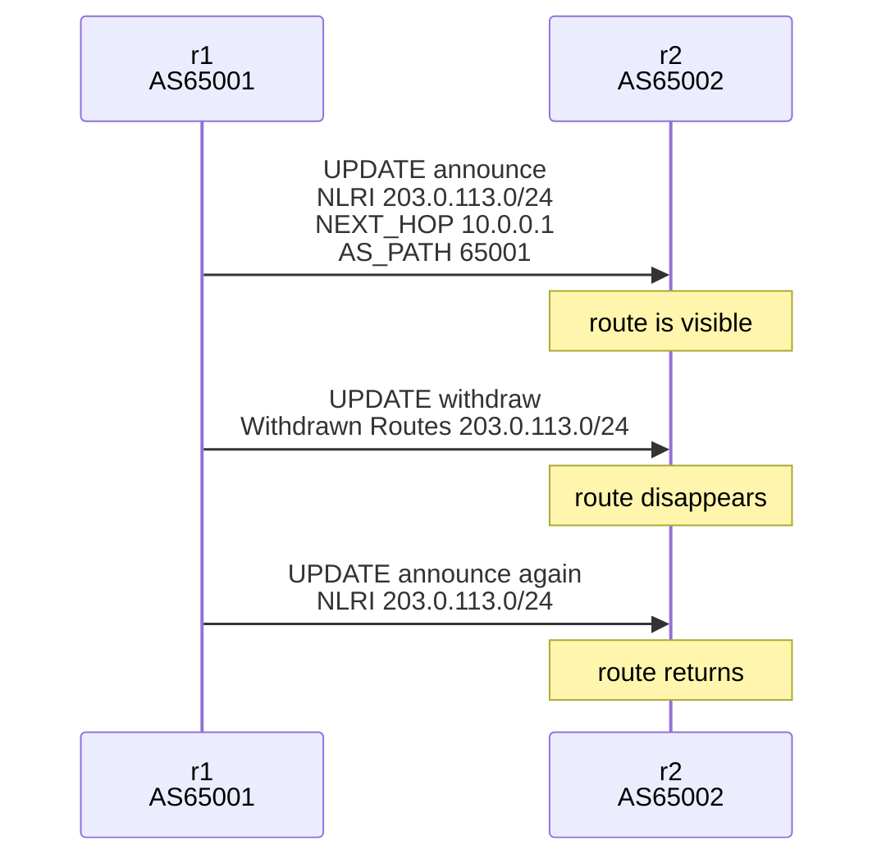
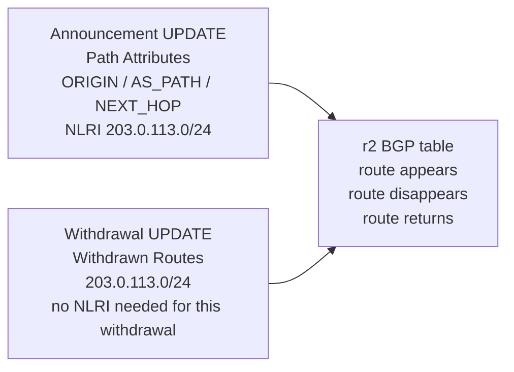

# BGP Lab #2: Watch a Route Appear, Disappear, and Come Back

Expected time: 45 to 60 minutes  
日本語: 想定時間 45〜60分

Reading guide: [`../rfc-notes/bgp-rfc4271-lab02.md`](../rfc-notes/bgp-rfc4271-lab02.md)

## Goal

In this lab, you will watch one BGP route appear on `r2`, disappear after a withdrawal, and come back after it is announced again.

The theme is simple: an UPDATE message can announce reachability, and an UPDATE message can withdraw reachability.

By the end, you should be able to explain this sequence:

```text
203.0.113.0/24 is visible on r2
203.0.113.0/24 is withdrawn by r1
203.0.113.0/24 disappears from r2
203.0.113.0/24 is announced again by r1
203.0.113.0/24 returns on r2
```

日本語: このLabでは、`r2` の BGP table に1本のrouteが現れ、withdrawで消え、再広告で戻るところを観察します。Lab 01 で読んだ1本の経路を、UPDATE message の広告と取り下げという動きとして見直します。

## What You Will Learn

理解したいこと:

- BGP UPDATE message は route announcement と route withdrawal の両方に使われる。
- announcement では、prefix が NLRI に入り、ORIGIN、AS_PATH、NEXT_HOP などの path attributes が付く。
- withdrawal では、取り下げる prefix が Withdrawn Routes に入る。
- withdraw は、その route の AS_PATH や NEXT_HOP を再説明しなくてもよい。
- BGP table から route が消えることを、FRRouting output と pcap の両方で確認できる。

This lab does not cover:

- competing origins
- route leaks
- RPKI / ROA / ROV
- BGP decision process
- iBGP
- route reflector
- public Internet announcements

## RFCで読む場所

今回の必読は RFC 4271 の以下。

| 章 | 読むポイント |
|---|---|
| 3.1 | route は UPDATE で広告され、withdraw されること |
| 4.3 | UPDATE message の `Withdrawn Routes`、`Path Attributes`、`NLRI` |
| 5 | UPDATE に NLRI がある場合の mandatory attributes |
| 5.1.1 | ORIGIN |
| 5.1.2 | AS_PATH |
| 5.1.3 | NEXT_HOP |

## 実験の全体像

Lab 01 と同じ2台構成を使う。

```text
AS65001 / r1                         AS65002 / r2
10.0.0.1/30  ----------------------  10.0.0.2/30

Step 1:
  r1 announces 203.0.113.0/24
  r2 learns 203.0.113.0/24

Step 2:
  r1 withdraws 203.0.113.0/24
  r2 removes 203.0.113.0/24

Step 3:
  r1 announces 203.0.113.0/24 again
  r2 learns 203.0.113.0/24 again
```

`203.0.113.0/24` は RFC 5737 の documentation prefix。外部へ広告せず、Lab 内だけで使う。





## 必要なもの

推奨環境:

- Linux / WSL2 / Linux VM
- Docker
- containerlab
- ホスト側の tcpdump
- Wireshark or tshark

使用イメージ:

- `frrouting/frr:latest`

macOS の場合は、Linux VM、WSL 相当の環境、または OrbStack/Colima 上の Linux VM で実行する想定にする。BGP の packet capture は Linux namespace 上で見る方が教材として扱いやすい。

## 実行手順

この手順は、containerlab を実行する Linux 環境の中で行う。

このリポジトリを持っている場合は、Linux 環境で検証スクリプトを実行できる。

```bash
./scripts/labctl.sh run bgp-02
```

`labctl.sh run bgp-02` は、topology deploy、route の出現確認、withdraw、消失確認、再広告、pcap 取得、destroy まで行う。

### 1. 作業ディレクトリへ移動する

```bash
cd protocol-lab/examples/bgp-02
```

### 2. 起動する

```bash
sudo containerlab deploy -t bgp-02.clab.yml
```

起動後、コンテナが作られていることを確認する。

```bash
docker ps --format "table {{.Names}}\t{{.Status}}"
```

期待する確認ポイント:

- `clab-bgp-02-r1` が起動している。
- `clab-bgp-02-r2` が起動している。

neighbor が Established になるまで数秒待ってから BGP summary を見る。

```bash
docker exec -it clab-bgp-02-r2 vtysh -c "show bgp summary"
```

観察ポイント:

- local AS が `65002`。
- neighbor が `10.0.0.1`。
- neighbor AS が `65001`。
- `State/PfxRcd` が `1`、または Established 状態で prefix を1本受信していることが分かる表示。

### 3. route がある状態を見る

```bash
docker exec -it clab-bgp-02-r2 vtysh -c "show bgp ipv4 unicast"
```

期待する読み方:

```text
Network          Next Hop        Path
*> 203.0.113.0/24 10.0.0.1       65001 i
```

見るポイント:

- `203.0.113.0/24` が BGP table にある。
- NEXT_HOP が `10.0.0.1`。
- AS_PATH が `65001`。
- ORIGIN が `i` または詳細表示で `IGP`。

### 4. packet capture を開始する

別ターミナルを開き、containerlab を動かしている Linux 環境の中で r2 側のインターフェースを capture する。

```bash
sudo ip netns list | grep clab-bgp-02
```

期待する確認ポイント:

- `clab-bgp-02-r1` が見える。
- `clab-bgp-02-r2` が見える。

capture を開始する。

```bash
sudo ip netns exec clab-bgp-02-r2 tcpdump -i eth1 -nn -s 0 -w bgp-02-r2.pcap tcp port 179
```

### 5. route を withdraw する

capture を開始したまま、別ターミナルで `r1` から `network` statement を外す。

```bash
docker exec -it clab-bgp-02-r1 vtysh \
  -c "configure terminal" \
  -c "router bgp 65001" \
  -c "address-family ipv4 unicast" \
  -c "no network 203.0.113.0/24"
```

数秒待ってから `r2` を見る。

```bash
docker exec -it clab-bgp-02-r2 vtysh -c "show bgp ipv4 unicast"
```

期待する確認ポイント:

- `203.0.113.0/24` が表示されない。
- neighbor は Established のままでもよい。消えたのは session ではなく route。

### 6. route を再広告する

同じ `r1` で `network` statement を戻す。

```bash
docker exec -it clab-bgp-02-r1 vtysh \
  -c "configure terminal" \
  -c "router bgp 65001" \
  -c "address-family ipv4 unicast" \
  -c "network 203.0.113.0/24"
```

数秒待ってから `r2` を見る。

```bash
docker exec -it clab-bgp-02-r2 vtysh -c "show bgp ipv4 unicast"
```

期待する確認ポイント:

- `203.0.113.0/24` が戻る。
- NEXT_HOP は `10.0.0.1`。
- AS_PATH は `65001`。
- ORIGIN は `i` または `IGP`。

tcpdump を `Ctrl-C` で止める。`bgp-02-r2.pcap` が現在の作業ディレクトリに残る。

### 7. pcap で UPDATE を見る

Wireshark で `bgp-02-r2.pcap` を開く。

見る場所:

- announce UPDATE
  - `Path attributes`
  - `ORIGIN`
  - `AS_PATH: 65001`
  - `NEXT_HOP: 10.0.0.1`
  - `NLRI: 203.0.113.0/24`
- withdraw UPDATE
  - `Withdrawn Routes`
  - `203.0.113.0/24`

ポイント:

- announcement は `Path Attributes + NLRI` を見る。
- withdrawal は `Withdrawn Routes` を見る。
- withdraw は NEXT_HOP や AS_PATH を再説明する message ではない。

macOS 側の Wireshark で開く場合は、生成された `bgp-02-r2.pcap` を共有ディレクトリや `scp` で macOS に移してから開く。

## 期待出力

完全一致よりも、route の状態変化を確認することを重視する。

### before withdraw

`r2` 側で確認すること:

```text
Network          Next Hop        Path
*> 203.0.113.0/24 10.0.0.1       65001 i
```

見るポイント:

- `203.0.113.0/24` が BGP table にある。
- NEXT_HOP が `10.0.0.1`。
- AS_PATH が `65001`。

### after withdraw

`r2` 側で確認すること:

```text
Displayed 0 routes and 0 total paths
```

FRRouting のバージョンによって表示は少し変わる。重要なのは `203.0.113.0/24` が表示されないこと。

### after reannounce

`r2` 側で確認すること:

```text
Network          Next Hop        Path
*> 203.0.113.0/24 10.0.0.1       65001 i
```

見るポイント:

- `203.0.113.0/24` が戻る。
- NEXT_HOP と AS_PATH は最初の announcement と同じ。

## なぜそう動くのか

RFC 4271 Section 4.3 の UPDATE message には、`Withdrawn Routes`、`Path Attributes`、`Network Layer Reachability Information` がある。

`r1` が `network 203.0.113.0/24` を持っているとき、`r1` は `203.0.113.0/24` を NLRI として広告する。この UPDATE には、ORIGIN、AS_PATH、NEXT_HOP などの path attributes が付く。

`r1` で `no network 203.0.113.0/24` を実行すると、`r1` は以前広告した reachability を取り下げる。withdrawal UPDATE では、取り下げる prefix が `Withdrawn Routes` に入る。`r2` はその UPDATE を受け取り、該当 route を BGP table から消す。

再び `network 203.0.113.0/24` を設定すると、`r1` は同じ prefix を再広告する。`r2` は新しい announcement を受け取り、route を BGP table に戻す。

## よくある誤解

- withdraw は BGP session を切ることではない。neighbor は Established のままでも、route だけが消える。
- withdraw は「到達不能な next hop」を送ることではない。取り下げる prefix を Withdrawn Routes に載せる。
- `no network 203.0.113.0/24` は、loopback の IP address を消す操作ではない。BGP で originate する設定を外している。
- `203.0.113.0/24` が BGP table から消えても、実インターネットに何かを広告したわけではない。この Lab は閉じた Docker 環境だけで動く。

## 詰まりやすい点

### withdraw 後も route が残っている

数秒待ってから再確認する。

```bash
docker exec -it clab-bgp-02-r2 vtysh -c "show bgp ipv4 unicast"
```

まだ残っている場合は、`r1` の running config を確認する。

```bash
docker exec -it clab-bgp-02-r1 vtysh -c "show running-config"
```

`address-family ipv4 unicast` の中に `network 203.0.113.0/24` が残っているなら、withdraw 操作が入っていない。

### 再広告しても route が戻らない

`r1` が `203.0.113.0/24` をローカルに持っているか確認する。

```bash
docker exec -it clab-bgp-02-r1 ip addr show lo
```

FRRouting の `network 203.0.113.0/24` は、対応する prefix が routing table に存在するときに広告される。今回の topology では `r1` の loopback に `203.0.113.1/24` を入れることで、その条件を満たしている。

### pcap に withdraw が見えない

capture を開始する前に withdraw してしまうと、withdraw UPDATE を取り逃がす。先に tcpdump を開始し、その後に `no network 203.0.113.0/24` を実行する。

`tcpdump` の対象インターフェースも確認する。

```bash
sudo ip netns exec clab-bgp-02-r2 ip link
```

## 練習問題

1. announcement UPDATE で `203.0.113.0/24` はどの部分に入るか。
2. withdrawal UPDATE で `203.0.113.0/24` はどの部分に入るか。
3. withdraw に AS_PATH や NEXT_HOP が必須ではない理由を、自分の言葉で説明する。
4. withdraw 後も BGP neighbor が Established のままでよい理由を説明する。
5. `no network 203.0.113.0/24` と `ip addr del 203.0.113.1/24 dev lo` は、観察結果として何が似ていて、何が違うか。

## 後片付け

Lab を終えたら containerlab の topology を破棄する。

```bash
sudo containerlab destroy -t bgp-02.clab.yml
```

コンテナが残っていないことを確認する。

```bash
docker ps --format "table {{.Names}}\t{{.Status}}" | grep clab-bgp-02 || true
```

pcap を残す場合は、`assets/bgp-02/` に移す。

```bash
mkdir -p ../../assets/bgp-02
cp bgp-02-r2.pcap ../../assets/bgp-02/
```

pcap を残さない場合は削除する。

```bash
rm -f bgp-02-r2.pcap
```

## 次に読むRFC / 次のLab

次の Lab では、同じ prefix が異なる origin AS から見える状態を作り、competing origins と route leak の入口を見る。

次に読む場所:

- RFC 4271 Section 5.1.2 AS_PATH
- RFC 4271 Section 9 UPDATE Message Handling
- RPKI / ROA の入口として、どの AS が prefix を originate してよいかという問い

## References

- RFC 4271, Section 3.1: Routes, advertisement, and withdrawal
- RFC 4271, Section 4.3: UPDATE Message Format
- RFC 4271, Section 5: Path Attributes
- RFC 4271, Section 5.1.1: ORIGIN
- RFC 4271, Section 5.1.2: AS_PATH
- RFC 4271, Section 5.1.3: NEXT_HOP
- RFC 5737, Section 3: Documentation address blocks, including `203.0.113.0/24`
