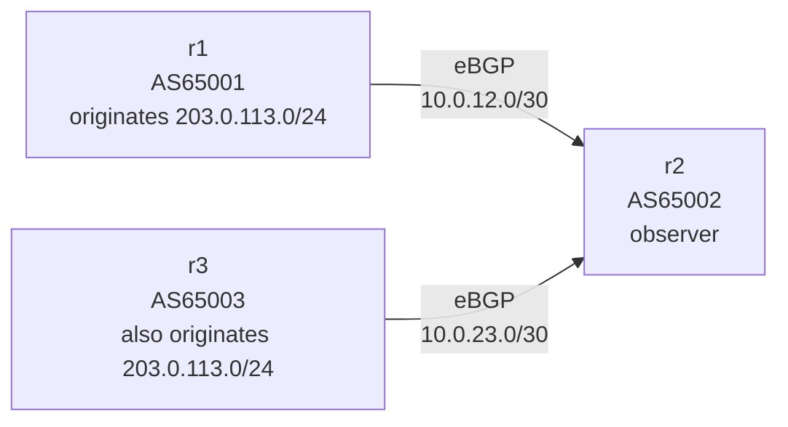
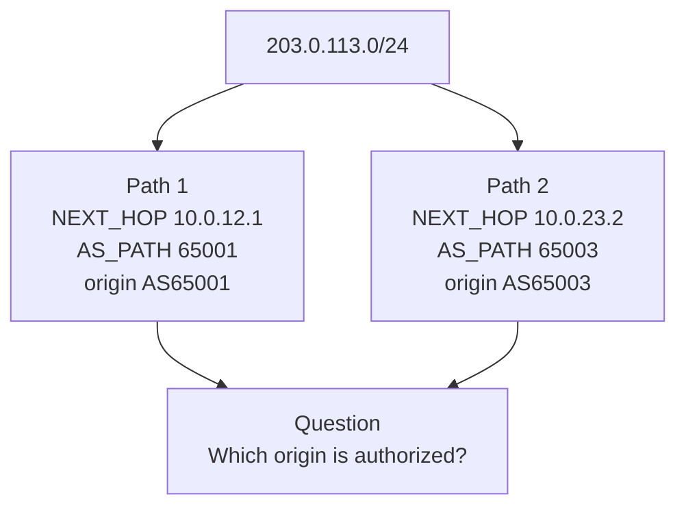

# BGP Lab #3: Competing Origins and the First Route-Leak Question

Expected time: 45 to 60 minutes  
日本語: 想定時間 45〜60分

Reading guide: [`../rfc-notes/bgp-rfc4271-lab03.md`](../rfc-notes/bgp-rfc4271-lab03.md)

## Goal

In this lab, you will make two different ASNs announce the same prefix and observe how an upstream router sees competing origins.

The theme is simple: seeing a prefix in BGP is not the same as knowing who is allowed to originate it.

By the end, you should be able to explain this observation:

```text
203.0.113.0/24 has two BGP paths on r2
path via 10.0.12.1 has origin AS65001
path via 10.0.23.2 has origin AS65003
```

日本語: このLabでは、2つのASが同じprefixを広告し、観察者である `r2` が同一prefixに対する2つのpathを見る状態を作ります。最後に、AS_PATH の右端にある origin AS を読み、competing origin がなぜ危険の入口になるのかを説明します。

## What You Will Learn

理解したいこと:

- AS_PATH の右端にある AS が、その route の origin AS として読まれる。
- 同じ prefix が複数の origin AS から見えることがある。
- competing origin は、誤設定、意図したマルチホーム、route leak、hijack など複数の理由で起きうる。
- BGP table だけでは、その origin AS が本当に許可されているかは分からない。
- RPKI origin validation は、次のLabでこの問いに答えるための材料になる。

This lab does not cover:

- RPKI / ROA / ROV
- route leak taxonomy in detail
- BGP decision process in detail
- AS path validation
- public Internet announcements

## RFCで読む場所

今回の必読は RFC 4271 の以下。

| 章 | 読むポイント |
|---|---|
| 1.1 | AS、BGP speaker、route、RIB の用語 |
| 3.1 | route は prefix と path attributes の組であること |
| 4.3 | UPDATE message が path attributes と NLRI を運ぶこと |
| 5.1.2 | AS_PATH と AS_SEQUENCE |
| 9 | BGP speaker が受け取った UPDATE を処理し、route を保持・選択すること |

補助的に、route leak の入口として RFC 7908 の problem statement を読む。

## 実験の全体像

3台の仮想ルータを作る。

```text
AS65001 / r1                         AS65002 / r2                         AS65003 / r3
10.0.12.1/30  ----------------------  10.0.12.2/30
                                      10.0.23.1/30  ----------------------  10.0.23.2/30

r1 advertises:
  203.0.113.0/24

r3 also advertises:
  203.0.113.0/24

r2 observes:
  203.0.113.0/24 via 10.0.12.1, AS_PATH 65001
  203.0.113.0/24 via 10.0.23.2, AS_PATH 65003
```

`203.0.113.0/24` は RFC 5737 の documentation prefix。外部へ広告せず、Lab 内だけで使う。





## 必要なもの

推奨環境:

- Linux / WSL2 / Linux VM
- Docker
- containerlab
- ホスト側の tcpdump
- Wireshark or tshark

使用イメージ:

- `frrouting/frr:latest`

macOS の場合は、Linux VM、WSL 相当の環境、または OrbStack/Colima 上の Linux VM で実行する想定にする。

## 実行手順

この手順は、containerlab を実行する Linux 環境の中で行う。

このリポジトリを持っている場合は、Linux 環境で検証スクリプトを実行できる。

```bash
./scripts/labctl.sh run bgp-03
```

`labctl.sh run bgp-03` は、topology deploy、FRR 出力確認、pcap 取得、destroy まで行う。

### 1. 作業ディレクトリへ移動する

```bash
cd protocol-lab/examples/bgp-03
```

### 2. 起動する

```bash
sudo containerlab deploy -t bgp-03.clab.yml
```

起動後、コンテナが作られていることを確認する。

```bash
docker ps --format "table {{.Names}}\t{{.Status}}"
```

期待する確認ポイント:

- `clab-bgp-03-r1` が起動している。
- `clab-bgp-03-r2` が起動している。
- `clab-bgp-03-r3` が起動している。

neighbor が Established になるまで数秒待ってから BGP summary を見る。

```bash
docker exec -it clab-bgp-03-r2 vtysh -c "show bgp summary"
```

観察ポイント:

- `r2` の local AS は `65002`。
- neighbor `10.0.12.1` の AS は `65001`。
- neighbor `10.0.23.2` の AS は `65003`。
- どちらのneighborからも prefix を受信していることが分かる。

### 3. r2 で同じ prefix の2pathを見る

```bash
docker exec -it clab-bgp-03-r2 vtysh -c "show bgp ipv4 unicast 203.0.113.0/24"
```

期待する読み方:

```text
Paths: (2 available, best #...)
  65001
    10.0.12.1 from 10.0.12.1 ...
      Origin IGP ...
  65003
    10.0.23.2 from 10.0.23.2 ...
      Origin IGP ...
```

FRRouting のバージョンや best path の選び方によって順序は変わる。重要なのは、同じ `203.0.113.0/24` に対して `65001` と `65003` の2つの origin AS が見えること。

### 4. packet capture で2つの UPDATE を見る

別ターミナルを開き、containerlab を動かしている Linux 環境の中で r2 側 namespace を capture する。

```bash
sudo ip netns exec clab-bgp-03-r2 tcpdump -i any -nn -s 0 -w bgp-03-r2.pcap tcp port 179
```

capture を開始したまま、別ターミナルで r2 の BGP session を張り直す。

```bash
docker exec -it clab-bgp-03-r2 vtysh -c "clear bgp *"
```

数秒後に tcpdump を `Ctrl-C` で止める。`bgp-03-r2.pcap` が現在の作業ディレクトリに残る。

Wireshark で開く。

見る場所:

- `10.0.12.1 -> 10.0.12.2` の BGP UPDATE
  - `AS_PATH: 65001`
  - `NLRI: 203.0.113.0/24`
- `10.0.23.2 -> 10.0.23.1` の BGP UPDATE
  - `AS_PATH: 65003`
  - `NLRI: 203.0.113.0/24`

ポイント:

- prefix は同じ。
- origin AS は違う。
- BGP UPDATE だけでは、どちらが許可された origin なのかは分からない。

## 期待出力

完全一致よりも以下のフィールドが取れることを重視する。

### `show bgp summary`

`r2` 側で確認すること:

```text
Local AS number 65002
Neighbor        V         AS   ...   State/PfxRcd
10.0.12.1       4      65001   ...   1
10.0.23.2       4      65003   ...   1
```

### `show bgp ipv4 unicast 203.0.113.0/24`

`r2` 側で確認すること:

```text
Paths: (2 available, best #...)
  65001
    10.0.12.1 from 10.0.12.1 ...
      Origin IGP ...
  65003
    10.0.23.2 from 10.0.23.2 ...
      Origin IGP ...
```

見るポイント:

- `203.0.113.0/24` が2pathで見える。
- 片方の AS_PATH は `65001`。
- もう片方の AS_PATH は `65003`。
- AS_PATH の右端が origin AS として読める。

## なぜそう動くのか

`r1` は `AS65001` として `203.0.113.0/24` を originate する。`r3` も `AS65003` として同じ `203.0.113.0/24` を originate する。

`r2` は2つの eBGP neighbor から、同じ NLRI を持つ UPDATE を受け取る。どちらの UPDATE にも path attributes があり、AS_PATH はそれぞれ違う。

この時点で `r2` は「同じ prefix へ行けるという2つの主張」を見ている。BGP はbest pathを1つ選ぶかもしれないが、観察すべき重要点は、同じ prefix に複数の origin AS が見えていること。

これが常に攻撃とは限らない。意図されたマルチホームや移行作業でも複数originは起きうる。一方で、誤広告、route leak、prefix hijack の入口にもなる。BGP table だけでは、その origin AS が許可されているかを判断できない。

## よくある誤解

- competing origin は必ず hijack という意味ではない。
- route leak と competing origin は同義ではない。route leak は経路広告の伝播範囲や関係性の問題で、competing origin は同じ prefix の origin AS が複数見える状態。
- best path に選ばれなかった path も、観察上は重要である。
- AS_PATH は「prefixを所有している証明」ではない。
- このLabは閉じたDocker環境だけで動く。documentation prefix を実インターネットへ広告してはいけない。

## 詰まりやすい点

### r2 に1pathしか見えない

neighbor が2つとも Established になっているか確認する。

```bash
docker exec -it clab-bgp-03-r2 vtysh -c "show bgp summary"
```

`10.0.12.1` と `10.0.23.2` の両方が見えない場合は、interface address を確認する。

```bash
docker exec -it clab-bgp-03-r1 ip addr show eth1
docker exec -it clab-bgp-03-r2 ip addr show eth1
docker exec -it clab-bgp-03-r2 ip addr show eth2
docker exec -it clab-bgp-03-r3 ip addr show eth1
```

### r1 または r3 が prefix を広告しない

それぞれの loopback と FRR config を確認する。

```bash
docker exec -it clab-bgp-03-r1 ip addr show lo
docker exec -it clab-bgp-03-r3 ip addr show lo
docker exec -it clab-bgp-03-r1 vtysh -c "show running-config"
docker exec -it clab-bgp-03-r3 vtysh -c "show running-config"
```

FRRouting の `network 203.0.113.0/24` は、対応する prefix が routing table に存在するときに広告される。

### pcap に片方の UPDATE しか見えない

capture を開始した後に BGP session を張り直す。

```bash
docker exec -it clab-bgp-03-r2 vtysh -c "clear bgp *"
```

それでも片方しか見えない場合は、`r2` namespace で `-i any` を使っているか確認する。

## 練習問題

1. `r2` で見える `203.0.113.0/24` の2つの AS_PATH は何か。
2. それぞれの origin AS はどれか。
3. 同じ prefix に複数originが見えることは、なぜ危険の入口になるのか。
4. competing origin と route leak は何が違うか。
5. BGP table だけでは「許可されたorigin」か判断できない理由を説明する。

## 後片付け

Lab を終えたら containerlab の topology を破棄する。

```bash
sudo containerlab destroy -t bgp-03.clab.yml
```

コンテナが残っていないことを確認する。

```bash
docker ps --format "table {{.Names}}\t{{.Status}}" | grep clab-bgp-03 || true
```

pcap を残す場合は、`assets/bgp-03/` に移す。

```bash
mkdir -p ../../assets/bgp-03
cp bgp-03-r2.pcap ../../assets/bgp-03/
```

pcap を残さない場合は削除する。

```bash
rm -f bgp-03-r2.pcap
```

## 次に読むRFC / 次のLab

次の Lab では、RPKI の ROA / VRP と BGP route を照合し、origin AS が valid / invalid / not found になる理由を見る。

次に読む場所:

- RFC 6482 Route Origin Authorization
- RFC 6811 BGP Prefix Origin Validation
- RFC 8210 RPKI to Router Protocol

## References

- RFC 4271, Section 1.1: Definition of common BGP terms
- RFC 4271, Section 3.1: Routes, advertisement, and storage
- RFC 4271, Section 4.3: UPDATE Message Format
- RFC 4271, Section 5.1.2: AS_PATH
- RFC 4271, Section 9: UPDATE Message Handling
- RFC 5737, Section 3: Documentation address blocks, including `203.0.113.0/24`
- RFC 7908: Problem Definition and Classification of BGP Route Leaks
