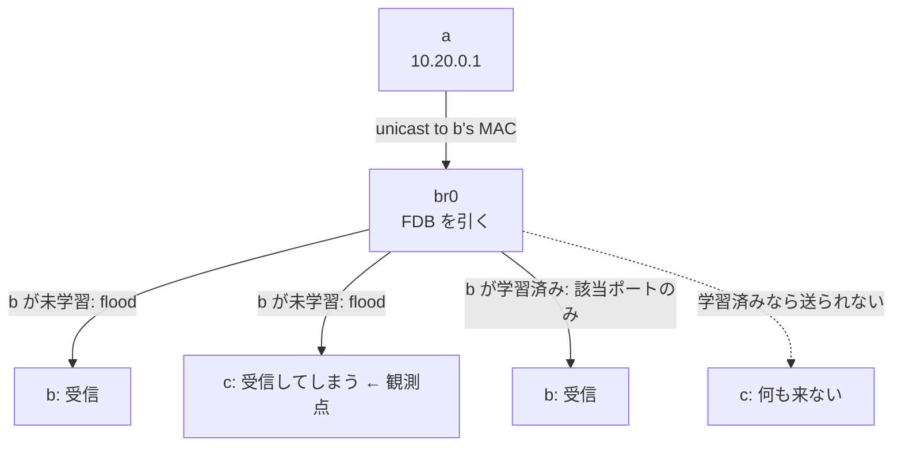

# Lab #44: Linux Bridge Deep Dive — What a Switch Learns, and When It Stops Shouting

Expected time: 30 to 45 minutes  
日本語: 想定時間 30〜45分

Reading guide: [`../rfc-notes/bridge-learning.md`](../rfc-notes/bridge-learning.md)

Prerequisite: [Lab 43: Network Namespaces from Scratch](netns-43-namespaces-from-scratch.md)

## Goal

Lab 43 ended with a bridge that had learned two MAC addresses. This lab opens that table and watches it work.

Three namespaces — `a`, `b` and `c` — hang off one bridge. `a` pings `b`. `c` is a bystander that never sends anything; its only job is to report whether the frame reached it. Because the frame is addressed to `b`, `c` should not see it — **unless the bridge does not yet know where `b` is, and floods it to every port**.

The same ping is run three times: with `b` unknown (flooded, `c` sees it), with `b` learned (`c` sees nothing), and after deleting exactly that one FDB entry (flooded again). The only thing that changes between runs is one row in a table.

日本語: Lab 43 は「bridge が2つの MAC を学習した」ところで終わりました。この Lab はその表を開けて、動いているところを見ます。`a`・`b`・`c` の3 namespace が1つの bridge にぶら下がり、`a` が `b` に ping します。`c` は何も送らない傍観者で、フレームが自分に届いたかを報告するだけの役です。フレームは `b` 宛なので `c` には届かないはず——**bridge が `b` の居場所をまだ知らず、全ポートへ flood する場合を除いて**。同じ ping を3回走らせます: `b` が未学習(flood され `c` に届く)、`b` が学習済み(`c` には届かない)、そのFDBエントリ1行だけを削除した後(再び flood)。回ごとに変わるのは表の1行だけです。

By the end, you should be able to explain this:

| the bridge's knowledge of `b` | frames `c` received | what the bridge did |
|---|---|---|
| unknown | 1 | flooded to every port but the ingress |
| learned | 0 | forwarded to `veth-b` only |
| deleted again | 1 | flooded again |

## What You Will Learn

理解したいこと:

- That learning reads the **source** address while forwarding reads the **destination** — two different fields of one frame.
- Why an unknown destination is flooded, and why that is correct rather than broken.
- That the bridge learns where `b` is from **`b`'s reply**, not from `a`'s request.
- Why observing flooding requires promiscuous capture.
- What `ageing_time` is for, and the centisecond unit trap.

This lab does not cover: STP (no loops here), VLAN filtering on the bridge (Lab 26 covers 802.1Q tagging), IGMP snooping (Lab 29), or bridge netfilter.

日本語: STP(ここにループはない)、bridge の VLAN filtering(802.1Q のタグ付けは Lab 26)、IGMP snooping(Lab 29)、bridge netfilter は扱いません。

## RFCで読む場所

L2 の switch は IETF の RFC ではなく IEEE の規格です。

| 資料 | 読むポイント |
|---|---|
| IEEE 802.1D | learning process、filtering database、ageing |
| bridge(8) | `bridge fdb show / del` の読み方 |
| ip-link(8) | bridge の `ageing_time`(単位はセンチ秒) |
| RFC 1918 | Lab のアドレスが private 用であること |

## 実験の全体像

```text
        netns a                netns b                netns c
     10.20.0.1              10.20.0.2              10.20.0.3
       eth0                   eth0                   eth0
         |                      |                      |
      veth-a                 veth-b                 veth-c
         |                      |                      |
         +----------------[  br0 (bridge)  ]-----------+

  a -> b の unicast を、c が「見えてしまうか」で flood かどうかを判定する
```



アドレスは `10.20.0.0/24`(RFC 1918)。

### 測定を成立させるための2つの下ごしらえ

- **IPv6 を無効化する。** インターフェースが up になった瞬間 IPv6 のリンクローカル自動設定が喋り出し、実験を始める前に bridge が全員を学習してしまいます。FDB が空の状態を作れません。
- **ARP を静的エントリで消す。** ARP request は **broadcast** なので、学習の有無に関係なく **常に** flood されます。残しておくと「unicast がどう扱われたか」という測りたい一点がぼやけます。

## 必要なもの

推奨環境:

- Linux / WSL2 / Linux VM
- Docker

containerlab は不要です(Lab 43 と同じく、特権コンテナ1つで完結)。

使用イメージ:

- `protocol-lab/bridge-lab:alpine3.21`（run.sh が Dockerfile からビルド。`iproute2` / `iputils` / `tcpdump`）

## 実行手順

```bash
./scripts/labctl.sh run bridge-44
```

### 1. 作業ディレクトリへ移動する

```bash
cd protocol-lab/examples/bridge-44
```

### 2. イメージをビルドして実行する

```bash
docker build -t protocol-lab/bridge-lab:alpine3.21 .
docker run --rm --privileged protocol-lab/bridge-lab:alpine3.21
```

### 3. 学習済みエントリだけを見る

```bash
bridge fdb show br br0 | grep -v permanent | grep -v self
```

`permanent` は各ポート自身のアドレス、`self` は bridge デバイスのもので、どちらも学習の結果ではありません。**学習されたエントリだけ**を見るために除外します。

### 4. 傍観者の視点で捕捉する

```bash
ip netns exec c tcpdump -i eth0 -nn -e -Q in icmp
```

`-Q in` で受信方向だけに絞ります。このフレームは `c` 宛ではないので、tcpdump が既定で有効にする **promiscuous mode** が無ければそもそも見えません。「自分宛でないフレームが見える」こと自体が flood の証拠です。

## 期待出力

- step 2: 学習済みエントリなし。
- step 3: `c` が受け取った `b` 宛フレーム = **1**(flood された)。
- step 4: FDB に `a` と `b` の2エントリ。
- step 5: 同じ通信で `c` が受け取った数 = **0**。
- step 6: `b` のエントリだけを削除すると再び **1**。
- step 7: `ageing_time` を縮めて無通信で待つと、学習済みエントリが自然に消える。

## なぜそう動くのか

switch は **「表 + 3つの規則」** です。

- **学習は送信元から**: フレームを受け取るたび、bridge は **送信元 MAC** と「入ってきたポート」を FDB に書きます。宛先からは学習しません——宛先が本当にそこにいるという証拠がないからです。
- **転送は宛先で**: 宛先 MAC が表にあれば、そのポート **だけ** に出します。他のポートには一切流れません。
- **不明なら flood**: 表に無ければ、入ってきたポート以外の **全ポート** へ複製します。届けること自体は達成され、代償は他ポートの帯域です。これは故障ではなく、安全側の既定動作です。
- **なぜ1往復で止まるのか**: step 3 で `a` が送った時点で、bridge が学習したのは **`a` の位置だけ** です(送信元が `a` なので)。`b` の位置を知るのは **`b` が応答を返した瞬間** です。だから最初の1フレームだけが flood され、以降は unicast になります。step 4 の FDB に両方載っているのは、往復が完了した後だからです。
- **step 6 が証明していること**: 削除したのは FDB の1行だけで、配線もアドレスも ping コマンドも一切変えていません。それで flood が復活する。つまり **flood と unicast を分けているのはこの表以外にない**、と言い切れます。
- **ageing がある理由**: ホストが別のポートに移動したとき、古いエントリが残っていると、そのホストは「間違ったポート」へ転送され続けて到達不能になります。エントリが期限切れで消えるからこそ、次の flood で正しい位置が学習し直されます。Linux の既定は 300 秒。**`ip link set ... type bridge ageing_time N` の単位はセンチ秒** なので、`500` は 5 秒です(ここが引っかかりやすい)。

要点は、**switch の賢さは「送信元を覚える」という1点だけ**であり、それ以外は表を引くか、引けなければ全部に配るか、という単純な分岐だということです。

## 詰まりやすい点

- **「学習したのに ARP がまだ全員に届く」**。broadcast は表と無関係に常に flood されます。学習では止められません。
- **FDB が最初から埋まっている**。IPv6 のリンクローカル自動設定が原因です。実験前に無効化するか、対象エントリを `bridge fdb del` で名指しで消します。
- **`bridge fdb flush dev X` が `Not supported` を返す**。環境によって効きません。`bridge fdb del <mac> dev <port> master` で1件ずつ消すほうが確実です。
- **`permanent` / `self` を学習結果だと思う**。前者は各ポート自身のアドレス、後者は bridge デバイスのものです。
- **promiscuous mode 無しで観測しようとする**。自分宛でないフレームは捨てられるので flood が見えません。tcpdump は既定で有効にします。
- **`ageing_time` の単位**。センチ秒。秒だと思って `300` を入れると 3 秒になります。
- **1発の ping で判断する**。最初の1フレームは学習前なので flood されて当然です。学習の効果は2発目以降に出ます。

## 後片付け

```bash
docker rm -f protocol-lab-bridge-44
```

`labctl.sh run bridge-44` を使った場合は、スクリプトが最後に削除します。

## 確認問題

1. bridge はフレームのどのフィールドから学習し、どのフィールドで転送先を決めるか。
2. `a` が `b` へ1フレーム送った直後、bridge は何を知っていて、何をまだ知らないか。
3. なぜ最初の1フレームだけが flood され、2発目からは flood されないのか。
4. step 6 で、配線もアドレスも変えずに flood が復活したのはなぜか。それは何を証明しているか。
5. 傍観者 `c` が flood を観測するのに promiscuous mode が要るのはなぜか。
6. ageing が無いと、ホストがポートを移動したとき何が起きるか。
7. ARP request は学習によって flood されなくなるか。理由も述べよ。

## References

- [bridge(8)](https://man7.org/linux/man-pages/man8/bridge.8.html)
- [ip-link(8)](https://man7.org/linux/man-pages/man8/ip-link.8.html)
- [Linux bridge — kernel documentation](https://www.kernel.org/doc/html/latest/networking/bridge.html)
- IEEE 802.1D — MAC Bridges
- [RFC 1918: Address Allocation for Private Internets](https://www.rfc-editor.org/rfc/rfc1918)

## 検証済み実行ログ (2026-08-06)

このLabは実機で再現性を確認済みです。

実行環境:

- Ubuntu 26.04 LTS (kernel 7.0.0-28-generic, x86_64)
- Docker 29.1.3
- lab container: `protocol-lab/bridge-lab:alpine3.21`（Alpine 3.21 + iproute2 6.11.0）

`./scripts/labctl.sh run bridge-44` で build → deploy → verify → destroy を実行し、`verification.json` は `"status": "verified"` を返した。

この実行での MAC:

```text
a=46:d2:d2:0d:88:b0  b=9a:a4:07:67:00:c9  c=52:64:00:5b:84:8a
```

### 表は空から始まる

```text
+ bridge fdb show br br0 (learned entries only)
(no learned entries — the bridge has seen nothing yet)
```

### 宛先不明の unicast は flood される

```text
a -> b, one packet, with b's address unknown to the bridge
frames c received that were addressed to b: 1 (expect 1 — flooded)

-- what c captured --
00:20:09.284445 46:d2:d2:0d:88:b0 > 9a:a4:07:67:00:c9, ethertype IPv4 (0x0800), length 98: 10.20.0.1 > 10.20.0.2: ICMP echo request, id 53, seq 1, length 64
```

捕捉されたフレームの宛先 MAC は **`9a:a4:07:67:00:c9`(= `b`)** で、`c` 自身(`52:64:00:5b:84:8a`)ではありません。`c` 宛でないフレームが `c` に届いている——これが flood の直接の証拠です。

### 往復が両方の位置を教えた

```text
46:d2:d2:0d:88:b0 dev veth-a master br0
9a:a4:07:67:00:c9 dev veth-b master br0
```

`a` は自分の request の送信元として、`b` は応答の送信元として学習されました。

### 同じ通信が、もう傍観者に届かない

```text
a -> b, three packets, with b's address now learned
frames c received that were addressed to b: 0 (expect 0 — forwarded to one port)
```

3発送って **0**。`veth-b` にだけ転送されています。

### 1行消すと flood が戻る

```text
+ bridge fdb del 9a:a4:07:67:00:c9 dev veth-b master
46:d2:d2:0d:88:b0 dev veth-a master br0
frames c received after deleting b's entry: 1 (expect 1 — flooded again)
```

`b` のエントリだけを削除。`a` のエントリは残ったまま。配線もアドレスも ping も変えていないのに、`c` が再び受信しました。**flood と unicast を分けているのはこの表だけ**だと確認できます。

### エントリは放っておくと消える

```text
+ ip link set br0 type bridge ageing_time 500
ageing_time set to 5s; entries present now:
46:d2:d2:0d:88:b0 dev veth-a master br0
9a:a4:07:67:00:c9 dev veth-b master br0
waiting 12s without traffic...
entries after the wait:
(all learned entries aged out)
```

`ageing_time 500` は **5秒**(センチ秒)。無通信で12秒待つと、学習済みエントリは両方とも消えました。

### Cleanup

```bash
docker rm -f protocol-lab-bridge-44
```
