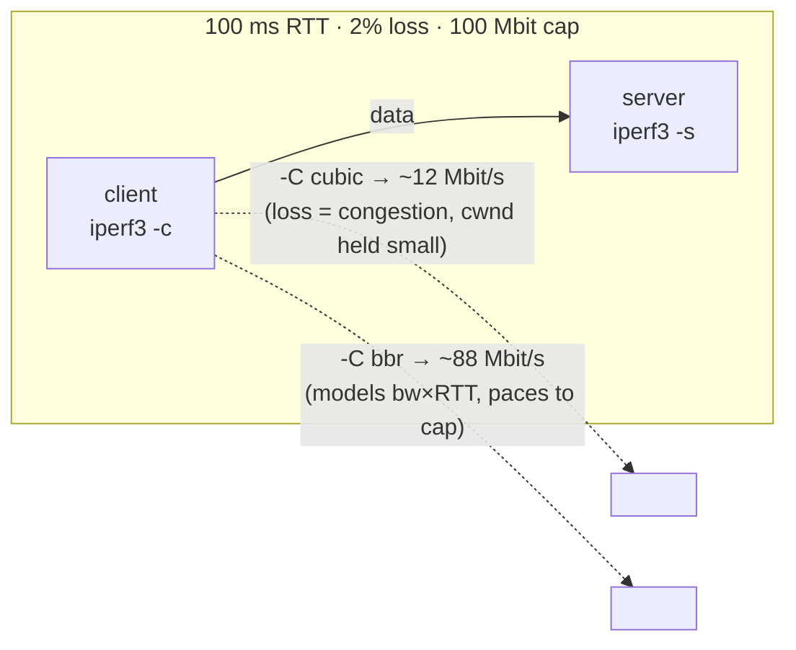

# Lab #30: TCP Congestion Control — CUBIC vs BBR on a Lossy Path

Expected time: 40 to 55 minutes  
日本語: 想定時間 40〜55分

Reading guide: [`../rfc-notes/tcp-congestion-control.md`](../rfc-notes/tcp-congestion-control.md)

Prerequisite: [TCP Lab 08: Loss, Retransmission, and the Window](tcp-08-retransmission-windowing-loss.md)

## Goal

Lab 08 watched TCP react to loss and delay. This lab shows that *how* TCP reacts is a **choice** — the **congestion control algorithm** — and that on a lossy, long-RTT path the choice changes throughput by nearly an order of magnitude.

You impair one path (100 ms RTT, 2% random loss, 100 Mbit/s cap via `tc netem`) and run `iperf3` twice over it:

- with **CUBIC** (Linux default, **loss-based**): every drop is read as congestion, so cwnd is held small → throughput **collapses far below the cap**,
- with **BBR** (**model-based**): it estimates the bottleneck bandwidth and RTT and paces to them, largely ignoring random loss → throughput stays **near the cap**.

日本語: Lab 08 は TCP が loss と delay にどう反応するかを見ました。この Lab は、その反応の *仕方* が **選択**(輻輳制御アルゴリズム)であり、lossy で長 RTT な path ではその選択が throughput をほぼ一桁変えることを示します。1本の path を障害化(RTT 100ms、ランダム loss 2%、100 Mbit/s の上限を `tc netem` で)し、`iperf3` を2回流します。**CUBIC**(Linux 既定、loss-based)は全ドロップを輻輳とみなし cwnd を小さく抑え、throughput が上限を大きく下回ります。**BBR**(model-based)は bottleneck 帯域と RTT を推定して pacing し、ランダム loss を概ね無視して throughput を上限付近に保ちます。

By the end, you should be able to explain this:

| Algorithm | signal for "too fast" | throughput on 100 ms / 2% loss / 100 Mbit path |
|---|---|---|
| CUBIC (loss-based) | a packet drop | ~12 Mbit/s (collapses) |
| BBR (model-based) | bandwidth/RTT model | ~88 Mbit/s (near the cap) |

## What You Will Learn

理解したいこと:

- What a **congestion window (cwnd)** is, and why throughput ≈ cwnd / RTT.
- The difference between **loss-based** (Reno, CUBIC) and **model-based** (BBR) congestion control.
- Why **random (non-congestive) loss** wrecks a loss-based algorithm but not BBR.
- How to read congestion state from **`ss -ti`** (cwnd, ssthresh, pacing_rate, the algorithm's own stats).
- How to select an algorithm per connection (`iperf3 -C`) or system-wide (`sysctl`).

This lab does not cover:

- Fairness between competing flows (BBR vs CUBIC sharing one bottleneck).
- BBRv2/v3 specifics, or ECN-based control (DCTCP).
- Tuning buffers/bufferbloat in depth (touched on in Lab 28).

日本語: congestion window(cwnd)とは何か、throughput ≈ cwnd/RTT の理由、loss-based(Reno/CUBIC)と model-based(BBR)の違い、ランダム loss が loss-based を壊し BBR を壊さない理由、`ss -ti` から輻輳状態(cwnd, ssthresh, pacing_rate, アルゴリズム固有の統計)を読む方法、接続ごと(`iperf3 -C`)/システム全体(`sysctl`)での選択方法を学びます。フロー間の公平性、BBRv2/v3 や ECN(DCTCP)、buffer/bufferbloat の詳細は扱いません。

## RFCで読む場所

| 資料 | 読むポイント |
|---|---|
| RFC 5681 | TCP 輻輳制御の中核(slow start, congestion avoidance, cwnd/ssthresh) |
| RFC 8312 | CUBIC(loss-based、高 BDP 向け、Linux 既定) |
| BBR 論文 (Cardwell et al.) | model-based(bottleneck bandwidth × RTT の推定と pacing) |
| RFC 5737 | Lab で使うアドレスがローカル閉域であること(補足) |

## 実験の全体像

client と server の2ノード。path に netem で障害を入れる。

```text
client (10.0.0.1) --- eth1/eth1 --- server (10.0.0.2, iperf3 -s)
  netem: 50ms delay,                 netem: 50ms delay (return path)
         2% loss, 100mbit rate cap
  → RTT ~100ms, lossy, capped at 100 Mbit/s
```

同じ障害 path 上で、CUBIC と BBR を切り替えて `iperf3` の throughput を測る。



`10.0.0.0/24` はローカル閉域。

## 必要なもの

推奨環境:

- Linux / WSL2 / Linux VM（BBR が使えるモダンな kernel）
- Docker
- containerlab

使用イメージ:

- `nicolaka/netshoot:latest`（`tc`、`iperf3`、`ss` 同梱）

前提: host kernel に BBR があること。`sysctl net.ipv4.tcp_available_congestion_control` に `bbr` が含まれること（無ければ `modprobe tcp_bbr`）。輻輳制御は host の TCP スタックで動くので、コンテナ側の追加は不要。

## 実行手順

```bash
./scripts/labctl.sh run cc-30
```

### 1. 作業ディレクトリへ移動する

```bash
cd protocol-lab/examples/cc-30
```

### 2. 起動して iperf3 サーバを立てる

```bash
sudo containerlab deploy -t cc-30.clab.yml
docker exec -d clab-cc-30-server iperf3 -s
```

### 3. path を障害化する（100ms RTT・2% loss・100mbit 上限）

```bash
docker exec clab-cc-30-client tc qdisc add dev eth1 root netem delay 50ms loss 2% rate 100mbit
docker exec clab-cc-30-server tc qdisc add dev eth1 root netem delay 50ms
docker exec clab-cc-30-client ping -c3 10.0.0.2   # RTT ~100ms
```

### 4. CUBIC で測る（loss-based）

```bash
docker exec clab-cc-30-client iperf3 -c 10.0.0.2 -C cubic -t 10
# 転送中に別ターミナルで cwnd を覗く:
docker exec clab-cc-30-client sh -c "ss -tin dst 10.0.0.2 | tr ',' '\n' | grep -E 'cubic|cwnd|ssthresh|retrans'"
```

throughput は上限 100 Mbit を大きく下回る（loss で cwnd が抑えられる）。

### 5. BBR で測る（model-based）

```bash
docker exec clab-cc-30-client iperf3 -c 10.0.0.2 -C bbr -t 10
docker exec clab-cc-30-client sh -c "ss -tin dst 10.0.0.2 | tr ',' '\n' | grep -E 'bbr|cwnd|pacing_rate'"
```

throughput は上限付近まで戻る（BBR は帯域を推定して pacing する）。

### 6. 障害を外して戻す

```bash
docker exec clab-cc-30-client tc qdisc del dev eth1 root
docker exec clab-cc-30-server tc qdisc del dev eth1 root
```

## 期待出力

- ping の RTT は約 100ms。
- CUBIC: throughput は上限 100 Mbit を大きく下回る（この環境で約 12 Mbit/s）。`ss` の cwnd/ssthresh は小さい。
- BBR: throughput は上限付近（この環境で約 88 Mbit/s）。`ss` の cwnd は大きく、`pacing_rate` が約 99 Mbit、`bbr:(bw:...)` が約 100 Mbit を示す。

## なぜそう動くのか

TCP には「このリンクは 100 Mbit/s」というダイヤルが無い。送信側は使える速度を **推測** し、**congestion window (cwnd)**（同時に in-flight にできるバイト数）で送信量を制御する。実効速度 ≈ **cwnd / RTT**。「何を『速すぎる』の合図とみなすか」がアルゴリズムの違い。

- **CUBIC(loss-based)**: パケットドロップを輻輳の合図とみなし、見るたびに cwnd を大きく削る（回復は cubic 曲線で速めるが、前提は loss=輻輳）。ところがこの path の loss は netem による **ランダムな** ドロップで、輻輳ではない。それでも CUBIC は折るので、cwnd が小さく張り付き、`cwnd/RTT` が上限より遥かに小さくなる。RTT 100ms・loss 2% では Mathis 近似 `MSS/(RTT·√p)` 程度まで落ちる。
- **BBR(model-based)**: loss を輻輳の合図に使わない。代わりに **bottleneck bandwidth** と **RTprop**（最小 RTT）を継続推定し、送信を **pace** して帯域に合わせる。ランダム loss は「帯域が減った」証拠にならないので速度を落とさない。結果、cwnd を大きく保ち上限付近を維持する。BBR も再送はする（`retrans` は出る）が、**cwnd を折らない**のが要点。
- だから同じ path で、CUBIC 12 Mbit と BBR 88 Mbit のように **7 倍以上**変わる。「遅い」の原因は帯域不足とは限らず、loss × RTT × 輻輳制御の相互作用のことがある。

要点は、**リンク帯域と RTT は path が決めるが、それをどれだけ使えるかは送信側の輻輳制御が決める**こと。loss をどう解釈するかで、lossy path の結果は大きく変わる。

## 詰まりやすい点

- **loss を必ず輻輳と思う**。無線・ビットエラー・軽い netem の loss は輻輳でない。loss-based はそれでも折る。ここが CUBIC 崩れの核心。
- **BBR が loss を無視 = 信頼性を捨てる、と誤解する**。再送はする（信頼性は TCP が担保）。折らないのは cwnd だけ。
- **速度は帯域だけで決まると思う**。cwnd/RTT が縛る。RTT が大きいほど、同じ cwnd でも遅い。
- **輻輳制御はコンテナ内の設定と思う**。実際は host の TCP スタックで動く。host に BBR が無ければ `bbr` を選べない。
- **測定のばらつき**。netem のランダム loss で結果は揺れる。桁で見る（CUBIC は上限の何分の一、BBR は上限付近か）。
- **MSS が大きい**。コンテナの MTU は 9500（jumbo）。`ss` の mss が 9448 でも挙動の本質は同じ。

## 後片付け

```bash
sudo containerlab destroy -t cc-30.clab.yml --cleanup
```

`labctl.sh run cc-30` を使った場合は、スクリプトが最後に destroy する。

## 確認問題

1. congestion window(cwnd)とは何か。throughput が cwnd/RTT に比例するのはなぜか。
2. loss-based(CUBIC)と model-based(BBR)は、それぞれ何を「速すぎる」の合図にするか。
3. ランダムな(輻輳でない)loss が、CUBIC の throughput を大きく下げるのはなぜか。
4. BBR は loss をどう扱うか。BBR も再送するのに throughput が高いのはなぜか。
5. `ss -ti` の cwnd / ssthresh / pacing_rate から、CUBIC と BBR の状態をどう読み分けるか。
6. 「回線は速いのに遅い」とき、輻輳制御が原因になりうるのはどんな path か。

## References

- [RFC 5681: TCP Congestion Control](https://www.rfc-editor.org/rfc/rfc5681)
- [RFC 8312: CUBIC for Fast and Long-Distance Networks](https://www.rfc-editor.org/rfc/rfc8312)
- [BBR: Congestion-Based Congestion Control (Cardwell et al., 2016)](https://research.google/pubs/pub45646/)
- [tc-netem(8) manual page](https://man7.org/linux/man-pages/man8/tc-netem.8.html)
- [RFC 5737: IPv4 Address Blocks Reserved for Documentation](https://www.rfc-editor.org/rfc/rfc5737)

## 検証済み実行ログ (2026-07-07)

このLabは実機で再現性を確認済みです。

実行環境:

- Ubuntu 26.04 LTS (kernel 7.0.0-27-generic, x86_64)
- Docker 29.1.3
- containerlab 0.77.0
- client / server: `nicolaka/netshoot:latest`（tc、iperf3、ss 同梱）
- host kernel の `tcp_available_congestion_control`: `reno cubic bbr`

`PATH="/tmp/pl-shim:$PATH" ./scripts/labctl.sh run cc-30` で deploy → verify → destroy を実行し、`verification.json` は `"status": "verified"` を返した。

### 同じ lossy path で CUBIC と BBR を比較

path: RTT 約 100ms、ランダム loss 2%、100 Mbit/s 上限（`tc netem`）。

```text
[protocol-lab][cc-30] impairing the path: 50ms each way (RTT ~100ms), 2% loss, 100mbit cap
rtt min/avg/max/mdev = 100.043/100.058/100.075/0.013 ms
[protocol-lab][cc-30] cubic: 12 Mbit/s
[protocol-lab][cc-30] bbr: 88 Mbit/s
```

同一の障害 path 上で、**CUBIC は 12 Mbit/s**（上限 100 の約 1/8 まで崩れる）、**BBR は 88 Mbit/s**（上限付近を維持)。アルゴリズム選択だけで **7 倍以上** の差が出た。

### ss -ti が語る cwnd の違い

転送中の `ss -tin` スナップショット（要点抜粋）:

```text
# CUBIC — loss で cwnd/ssthresh が小さく張り付く
cubic ... cwnd:15 ssthresh:9 bytes_retrans:141720 delivery_rate:9601152 ...

# BBR — 帯域を約100 Mbit と推定し、大きな cwnd を許して pacing
bbr ... cwnd:276 ssthresh:142 bbr:(bw:100181184bps cwnd_gain:2)
       pacing_rate:99179368bps delivery_rate:94801776 ...
```

- CUBIC は `cwnd:15`（`throughput ≈ cwnd/RTT` が小さい）。ランダム loss を輻輳とみなして折り続けている。
- BBR は `bbr:(bw:100181184bps)` = 約 100 Mbit の帯域を推定し、`pacing_rate` 約 99 Mbit で送出、`cwnd:276` と大きい。
- 興味深い点: BBR の絶対再送量（`bytes_retrans` 992040）は CUBIC（141720）より **多い**。BBR は loss があっても送り続ける(=再送も増える)が、**cwnd を折らない**ので throughput は高い。loss を「速度を落とす合図」に使わない、という設計が数値に現れている。

### Cleanup

```bash
containerlab destroy -t cc-30.clab.yml --cleanup
```
