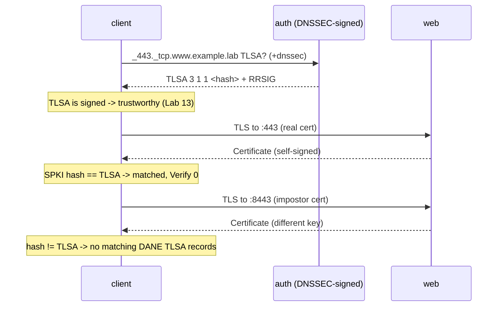

# Lab #17: DANE — When DNS Vouches for the Certificate

Expected time: 55 to 70 minutes  
日本語: 想定時間 55〜70分

Reading guide: [`../rfc-notes/dane-tlsa.md`](../rfc-notes/dane-tlsa.md)

Prerequisites: [DNS Lab 13: DNSSEC](dns-13-dnssec-validation.md), [TLS Lab 09: What Is Visible Before Encryption](tls-09-handshake-certificates.md)

## Goal

Normally a TLS client trusts a certificate because a **Certificate Authority** signed it (Lab 09). **DANE** offers a different anchor of trust: the domain owner publishes a **TLSA** record in DNS that pins the certificate, and **DNSSEC** (Lab 13) makes that record trustworthy. No CA required — DNS itself vouches for the cert.

This lab ties Lab 13 (DNSSEC) and Lab 09 (TLS certificates) together:

- A DNSSEC-signed `example.lab` publishes a **TLSA** record for `_443._tcp.www.example.lab` that pins the web server's certificate.
- The client fetches that TLSA (it carries an **RRSIG**, so it is trustworthy) and validates the server's **self-signed** cert against it → **matched**, `Verify return code: 0`.
- An **impostor** server with a *different* cert is checked against the same TLSA → **rejected**: `no matching DANE TLSA records`.

日本語: 通常、TLS クライアントは **認証局(CA)** が署名したから証明書を信じます(Lab 09)。**DANE** は別の信頼の起点を与えます。ドメイン所有者が DNS に **TLSA** レコードを載せて証明書を pin し、**DNSSEC**(Lab 13)がそのレコードを信頼できるものにする。CA は不要——DNS 自身が証明書を保証します。この Lab は Lab 13(DNSSEC)と Lab 09(TLS 証明書)をつなぎます。署名済み `example.lab` が `_443._tcp.www.example.lab` の TLSA で web の証明書を pin し、client はその TLSA(RRSIG 付き=信頼できる)を取得して **自己署名** 証明書を検証 → **一致**。別の証明書を持つ **impostor** は同じ TLSA と照合され **拒否**(`no matching DANE TLSA records`)。

By the end, you should be able to explain this:

| Server | Cert | Checked against the signed TLSA | Result |
|---|---|---|---|
| real web (`:443`) | self-signed, key pinned by TLSA | matches | `Verify return code: 0 (ok)` |
| impostor (`:8443`) | different key | does not match | `65 (no matching DANE TLSA records)` |

## What You Will Learn

理解したいこと:

- What a **TLSA** record is, and how `_port._proto.name` names it.
- What the `3 1 1` selector means (DANE-EE / SubjectPublicKeyInfo / SHA-256).
- Why **DANE only makes sense with DNSSEC** — an unsigned TLSA could be forged.
- How DANE lets a **self-signed** cert be trustworthy (the CA's job is done by DNS).
- Why a cert that does not match the published TLSA is rejected, even if it looks valid.

This lab does not cover:

- DANE for SMTP (RFC 7672) or other application profiles.
- Certificate-usage modes other than `3` (DANE-EE), or selectors/matching other than `1 1`.
- Running a full DNSSEC-validating resolver in the client path (we read the RRSIG directly from the authoritative server; a validating resolver would set the AD flag as in Lab 13).

日本語: TLSA レコードと `_port._proto.name` の命名、`3 1 1`(DANE-EE / SPKI / SHA-256)の意味、DANE が DNSSEC 前提である理由(署名なしの TLSA は偽装できる)、自己署名証明書が DANE で信頼できるようになること、公開された TLSA に一致しない証明書が拒否されることを学びます。

## RFCで読む場所

| RFC | 章 | 読むポイント |
|---|---|---|
| RFC 6698 | 2 | TLSA レコードの構造(usage / selector / matching type) |
| RFC 6698 | 3 | `_port._proto.name` の命名、DANE の使い方 |
| RFC 7671 | 4-5 | DANE の運用上の更新(DANE-EE `3` の推奨など) |
| RFC 4034 | 3 | RRSIG(TLSA も署名される。Lab 13 の復習) |
| RFC 5737 | 3 | Lab で使うアドレスが documentation 用であること |

## 実験の全体像

client 1台、auth(DNSSEC 署名済み `example.lab` を配信、TLSA を含む)1台、web(TLSA が pin する証明書を持つ TLS サーバ)1台。

```text
auth (10.0.1.2) --- eth1 --- client --- eth2 --- web (10.0.2.2)
  BIND, signed             dig +dnssec TLSA      openssl s_server
  example.lab + TLSA       openssl s_client-dane :443 real / :8443 impostor
```

client は auth から TLSA を引き(RRSIG 付き)、web の証明書をその TLSA と照合する。`:443` は TLSA が pin した本物、`:8443` は別鍵の impostor。



`203.0.113.0/24` は使わないが、`10.0.1.0/24` と `10.0.2.0/24` はローカル閉域。

## 必要なもの

推奨環境:

- Linux / WSL2 / Linux VM
- Docker
- containerlab

使用イメージ:

- `protocol-lab/bind9:9.20`(`examples/dane-17/Dockerfile` からローカルビルド。auth 用)
- `nicolaka/netshoot:latest`(client と web。`dig`、`openssl` 同梱)

証明書とゾーン署名は `run.sh` が実行時に行う(web 証明書 → TLSA 計算 → ゾーン署名)。何もコミットしない。openssl の DANE 検証(`-dane_tlsa_rrdata`)を使う。

## 実行手順

```bash
./scripts/labctl.sh run dane-17
```

`labctl.sh run dane-17` は、deploy、web 証明書生成と TLSA 計算、TLSA 入りゾーンの DNSSEC 署名、TLSA の取得、本物証明書の DANE 検証(一致)、impostor の DANE 検証(拒否)、後片付けまで行う。

### 1. 作業ディレクトリへ移動する

```bash
cd protocol-lab/examples/dane-17
```

### 2. web の証明書と TLSA

```bash
sudo containerlab deploy -t dane-17.clab.yml
# web: 本物 + impostor の自己署名証明書
docker exec clab-dane-17-web sh -c \
  "openssl req -x509 -newkey rsa:2048 -nodes -keyout /tmp/real.key -out /tmp/real.crt -subj '/CN=www.example.lab' -addext 'subjectAltName=DNS:www.example.lab' -days 3650"
# TLSA (3 1 1) = DANE-EE / SPKI / SHA-256 of the real cert
docker exec clab-dane-17-web sh -c \
  "openssl x509 -in /tmp/real.crt -pubkey -noout | openssl pkey -pubin -outform DER | openssl dgst -sha256"
# TLS サーバ: 本物を :443、impostor を :8443 で
docker exec -d clab-dane-17-web sh -c "openssl s_server -accept 443 -cert /tmp/real.crt -key /tmp/real.key -www -quiet"
```

### 3. TLSA 入りゾーンを DNSSEC 署名する

`example.lab` に `_443._tcp.www.example.lab. IN TLSA 3 1 1 <hash>` を入れ、Lab 13 と同様に署名して auth に読ませる(`run.sh` が自動でやる)。

```text
_443._tcp.www.example.lab. 300 IN TLSA 3 1 1 <hash>
_443._tcp.www.example.lab. 300 IN RRSIG TLSA ...   <- DNSSEC 署名
```

### 4. TLSA を取得する（署名付き＝信頼できる）

```bash
docker exec clab-dane-17-client dig +dnssec @10.0.1.2 _443._tcp.www.example.lab TLSA
```

`TLSA 3 1 1 ...` と、その隣に `RRSIG TLSA ...`。RRSIG があるので、この pin は DNSSEC で守られている。

### 5. 本物の証明書を DANE で検証する（CA 不要）

```bash
RR=$(docker exec clab-dane-17-client dig +short @10.0.1.2 _443._tcp.www.example.lab TLSA | head -1)
docker exec clab-dane-17-client sh -c \
  "echo Q | openssl s_client -connect 10.0.2.2:443 -dane_tlsa_domain www.example.lab -dane_tlsa_rrdata '$RR'"
```

見るポイント:

```text
DANE TLSA 3 1 1 ...<hash> matched the EE certificate at depth 0
Verify return code: 0 (ok)
```

証明書は **自己署名**(CA なし)なのに、`Verify return code: 0`。DNS(DNSSEC 付き)が保証しているから。

### 6. impostor を同じ TLSA で検証する（拒否）

```bash
docker exec clab-dane-17-client sh -c \
  "echo Q | openssl s_client -connect 10.0.2.2:8443 -dane_tlsa_domain www.example.lab -dane_tlsa_rrdata '$RR'"
```

見るポイント:

```text
Verification error: no matching DANE TLSA records
Verify return code: 65 (no matching DANE TLSA records)
```

別鍵の証明書は、公開された TLSA と一致しないので拒否される。

## 期待出力

- `dig +dnssec ... TLSA`: `TLSA 3 1 1 <hash>` と `RRSIG TLSA`。
- 本物 (`:443`): `matched the EE certificate`、`Verify return code: 0 (ok)`。
- impostor (`:8443`): `no matching DANE TLSA records`、`Verify return code: 65`。

## なぜそう動くのか

DANE(DNS-based Authentication of Named Entities)は、「どの証明書が正しいか」を **DNS で宣言**する仕組み。証明書の信頼を CA ではなく、ドメイン所有者 + DNSSEC に置く。

- **TLSA レコード**: `_443._tcp.www.example.lab` のように「ポート・プロトコル・ホスト名」で名前を作り、そのサービスが使う証明書を pin する。`3 1 1` は「usage=DANE-EE(end-entity 証明書そのもの)/ selector=SPKI(公開鍵情報)/ matching=SHA-256」。つまり「この公開鍵の SHA-256 を持つ証明書だけを信じよ」。
- **なぜ DNSSEC が必須か**: TLSA が署名されていなければ、攻撃者が偽の TLSA を注入して別の証明書を pin できてしまう。DNSSEC(Lab 13)の RRSIG が TLSA の真正性を保証して初めて、DANE は安全になる。だから DANE は DNSSEC の上に成り立つ。
- **CA が要らない**: 通常は「CA が署名 → client が CA を信頼」で証明書を信じる。DANE では「ドメイン所有者が DNS で pin → DNSSEC が保証」。だから **自己署名でも**、TLSA と一致すれば信頼できる。CA の役割を DNS が肩代わりしている。
- **impostor が弾かれる理由**: たとえ見た目が正しく、別の CA で署名されていても、公開された TLSA(= 本物の鍵の指紋)と一致しなければ DANE は拒否する。証明書の「すり替え」を、DNS に固定した指紋で検出する。

要点は、**「この名前にはこの証明書」という宣言を、DNSSEC で守られた DNS に置くことで、CA なしに(あるいは CA に加えて)証明書を認証できる** ということ。

## 詰まりやすい点

- **DANE を DNSSEC 抜きで語る**。署名のない TLSA は偽装できる。DANE は DNSSEC(Lab 13)が前提。
- **TLSA の名前を間違える**。`_443._tcp.www.example.lab`(ポート・プロトコルが頭に付く)。
- **`3 1 1` の意味**。usage=3(DANE-EE)、selector=1(SPKI)、matching=1(SHA-256)。
- **自己署名を「危険」と決めつける**。DANE の文脈では、TLSA が pin していれば自己署名でも正当。
- **impostor が別 CA で署名されていれば通ると思う**。DANE は「公開された指紋と一致するか」だけを見る。CA は無関係。
- **AD フラグ**。このLabは auth から直接 TLSA を引くので AD は付かない(RRSIG で署名は確認できる)。検証リゾルバ経由なら Lab 13 のように AD が立つ。

## 後片付け

```bash
sudo containerlab destroy -t dane-17.clab.yml --cleanup
```

`labctl.sh run dane-17` を使った場合は、スクリプトが最後に destroy する。

## 確認問題

1. TLSA レコードは何を pin するか。名前 `_443._tcp.www.example.lab` の各部分は何を表すか。
2. `3 1 1` の3つの数字はそれぞれ何を意味するか。
3. DANE がなぜ DNSSEC を前提にするのか。署名のない TLSA だと何が問題か。
4. DANE では、自己署名の証明書がなぜ信頼できるのか。CA の役割は誰が担うか。
5. impostor の証明書が別の有効な CA で署名されていても、この web で拒否されるのはなぜか。
6. このLabで AD フラグが付かないのはなぜか。どうすれば付くか(Lab 13 参照)。

## References

- [RFC 6698: The DNS-Based Authentication of Named Entities (DANE) Transport Layer Security (TLS) Protocol: TLSA](https://www.rfc-editor.org/rfc/rfc6698)
- [RFC 7671: The DANE Protocol: Updates and Operational Guidance](https://www.rfc-editor.org/rfc/rfc7671)
- [RFC 4034: Resource Records for the DNS Security Extensions](https://www.rfc-editor.org/rfc/rfc4034)
- [RFC 5737: IPv4 Address Blocks Reserved for Documentation](https://www.rfc-editor.org/rfc/rfc5737)
- [openssl s_client manual page](https://docs.openssl.org/master/man1/openssl-s_client/)

## 検証済み実行ログ (2026-07-07)

このLabは実機で再現性を確認済みです。

実行環境:

- Ubuntu 26.04 LTS (kernel 7.0.0-27-generic, x86_64)
- Docker 29.1.3
- containerlab 0.77.0
- auth: `internetsystemsconsortium/bind9:9.20` (BIND 9.20.24) を薄くラップした `protocol-lab/bind9:9.20`
- client / web: `nicolaka/netshoot:latest` (dig 9.20.23, openssl 3.x)

`PATH="/tmp/pl-shim:$PATH" ./scripts/labctl.sh run dane-17` で deploy → verify → destroy を実行し、`verification.json` は `"status": "verified"` を返した。web 証明書は実行時に生成し、その公開鍵から TLSA (`3 1 1`) を計算して DNSSEC 署名済みゾーンに載せた。

### TLSA レコードを取得（DNSSEC 署名付き）

```text
$ docker exec clab-dane-17-client dig +dnssec @10.0.1.2 _443._tcp.www.example.lab TLSA

_443._tcp.www.example.lab. 300 IN TLSA  3 1 1 5E26EC745C33B4CACA06BC6BA2AE55E0D5BA0FDDB729616613AC1AAC3D3D82D6
_443._tcp.www.example.lab. 300 IN RRSIG TLSA 13 5 300 20360704090109 20260707090109 12614 example.lab. ...
```

`TLSA 3 1 1 ...` の隣に `RRSIG TLSA`。DNSSEC で署名されているので、この pin は信頼できる。

### 本物の証明書を DANE で検証（自己署名なのに Verify 0）

```text
$ echo Q | openssl s_client -connect 10.0.2.2:443 \
    -dane_tlsa_domain www.example.lab -dane_tlsa_rrdata '3 1 1 5E26...3D3D82D6'

DANE TLSA 3 1 1 ...b729616613ac1aac3d3d82d6 matched the EE certificate at depth 0
Verify return code: 0 (ok)
```

証明書は CA が署名していない(自己署名)にもかかわらず、`Verify return code: 0`。DNSSEC で守られた TLSA が保証しているため。

### impostor の証明書を同じ TLSA で検証（拒否）

```text
$ echo Q | openssl s_client -connect 10.0.2.2:8443 \
    -dane_tlsa_domain www.example.lab -dane_tlsa_rrdata '3 1 1 5E26...3D3D82D6'

verify error:num=65:no matching DANE TLSA records
Verify return code: 65 (no matching DANE TLSA records)
```

別鍵の証明書は、公開された TLSA と一致しないので拒否される。DANE は「DNS に固定した指紋」で証明書のすり替えを検出する——CA 抜き(あるいは CA に加えて)で。

### Cleanup

```bash
containerlab destroy -t dane-17.clab.yml --cleanup
```
