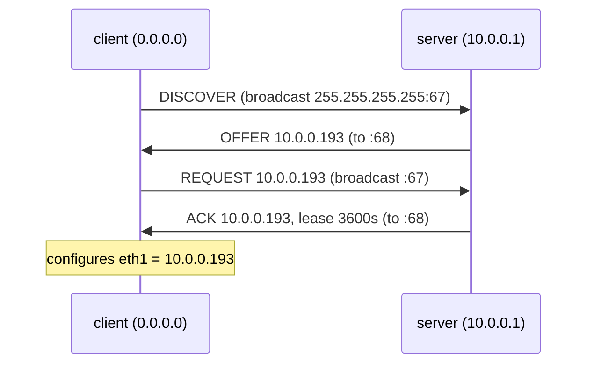

# Lab #22: DHCP — Four Messages for an Address

Expected time: 40 to 55 minutes  
日本語: 想定時間 40〜55分

Reading guide: [`../rfc-notes/dhcp-dora.md`](../rfc-notes/dhcp-dora.md)

Prerequisite: [TCP Lab 07](tcp-07-handshake-teardown.md) (reading captures)

## Goal

Every host so far in these labs had its address configured for it. But how does a machine that just booted — with **no IP at all** — get one? The answer is **DHCP**, and it takes exactly four messages, often called **DORA**:

- **D**iscover — the client shouts "is there a DHCP server?" (broadcast, from `0.0.0.0`),
- **O**ffer — a server replies "you can have `10.0.0.193`",
- **R**equest — the client says "yes, I'll take `10.0.0.193`",
- **A**ck — the server confirms "it's yours, for 3600 seconds".

You will start a client with an address-less link, run a DHCP client, and capture the whole DORA exchange on the wire.

日本語: これまでのホストはアドレスを設定してもらっていました。では、起動直後で **IP を持たない** マシンは、どうやってアドレスを得るのか。答えが **DHCP** で、ちょうど4つのメッセージ、**DORA** と呼ばれる流れで進みます。**D**iscover(client が「DHCP サーバいる?」とブロードキャスト、送信元 `0.0.0.0`)、**O**ffer(server が「`10.0.0.193` をどうぞ」)、**R**equest(client が「では `10.0.0.193` をもらう」)、**A**ck(server が「あなたのものです、3600秒」)。アドレスなしの client を起動し、DHCP クライアントを走らせ、DORA のやり取りを capture します。

By the end, you should be able to label this exchange:

| Step | From → To | Meaning |
|---|---|---|
| Discover | `0.0.0.0:68` → `255.255.255.255:67` | any server out there? |
| Offer | server:67 → client:68 | here is an address you can use |
| Request | `0.0.0.0:68` → `255.255.255.255:67` | I request that offered address |
| Ack | server:67 → client:68 | confirmed, with lease time |

## What You Will Learn

理解したいこと:

- Why a host with no address must use **broadcast** to reach a server it does not yet know.
- The four DHCP messages (DORA) and what each one carries.
- What a **lease** is and why addresses are temporary.
- What options DHCP delivers besides the address (router, DNS, lease time).
- Why the DHCP ports are 67 (server) and 68 (client).

This lab does not cover:

- DHCP relay (across subnets), reservations, or failover.
- DHCPv6 or IPv6 SLAAC (a different mechanism).
- Rebinding/renewing timers (T1/T2) in depth.

日本語: アドレスを持たないホストがなぜ **broadcast** を使うか、DORA の4メッセージと中身、**lease**(貸与)がなぜ一時的か、アドレス以外に配る option(router, DNS, lease time)、DHCP のポート 67/68 を学びます。DHCP relay・DHCPv6・SLAAC・T1/T2 の詳細は扱いません。

## RFCで読む場所

| RFC | 章 | 読むポイント |
|---|---|---|
| RFC 2131 | 3.1 | クライアントがアドレスを得る流れ(DORA) |
| RFC 2131 | 2 | DHCP メッセージ形式(BOOTP をベースに) |
| RFC 2131 | 4.1 | broadcast の使い方、ポート 67/68 |
| RFC 2132 | 3, 9 | DHCP options(subnet, router, DNS, lease time, message type 53) |

## 実験の全体像

client(アドレスなし)と server(10.0.0.1、udhcpd)を1本のリンクで繋ぐ。

```text
client (no IP) ==== eth1/eth1 ==== server (10.0.0.1)
   udhcpc                             udhcpd, pool 10.0.0.100-.200
```

client の eth1 はリンクだけ up、IP なし。DHCP で得る。



`10.0.0.0/24` はローカル閉域。

## 必要なもの

推奨環境:

- Linux / WSL2 / Linux VM
- Docker
- containerlab

使用イメージ:

- `nicolaka/netshoot:latest`（`udhcpd`(サーバ)、`udhcpc`(クライアント)、`tcpdump` 同梱）

追加イメージは不要。DHCP サーバ設定は `examples/dhcp-22/udhcpd.conf`。

## 実行手順

```bash
./scripts/labctl.sh run dhcp-22
```

### 1. 作業ディレクトリへ移動する

```bash
cd protocol-lab/examples/dhcp-22
```

### 2. 起動して DHCP サーバを立てる

```bash
sudo containerlab deploy -t dhcp-22.clab.yml
docker exec clab-dhcp-22-server sh -c ": > /tmp/udhcpd.leases; udhcpd -f /etc/udhcpd.conf &"
```

`udhcpd.conf` は `10.0.0.100-.200` を配り、router/DNS/lease を option で渡す。

### 3. capture を仕込んで、client にアドレスを取らせる

```bash
docker exec -d clab-dhcp-22-client tcpdump -i eth1 -n "udp port 67 or udp port 68"
docker exec clab-dhcp-22-client udhcpc -i eth1 -q -f -n
docker exec clab-dhcp-22-client ip -4 addr show eth1
```

`udhcpc` の出力に `lease of 10.0.0.193 obtained from 10.0.0.1` のような行。`ip addr` で eth1 にアドレスが付く。

### 4. DORA を capture で読む

```bash
docker exec clab-dhcp-22-client tcpdump -n -vv -r /tmp/dhcp.pcap
```

```text
0.0.0.0.68 > 255.255.255.255.67: BOOTP/DHCP ... DHCP-Message: Discover
... > ...68: DHCP-Message: Offer
0.0.0.0.68 > 255.255.255.255.67: DHCP-Message: Request, Requested-IP 10.0.0.193
... > ...68: DHCP-Message: ACK
```

## 期待出力

- `udhcpc`: `lease of 10.0.0.1xx obtained from 10.0.0.1`。
- `ip addr show eth1`: `inet 10.0.0.1xx`。
- capture: `Discover` → `Offer` → `Request`(Requested-IP 付き)→ `ACK` の4つ。

## なぜそう動くのか

DHCP は「アドレスを持たないホストに、アドレスと必要な設定を配る」仕組み。難しいのは「相手(サーバ)をまだ知らず、自分のアドレスも無い」状態から始めること。

- **なぜ broadcast か**: client はサーバの IP も自分の IP も知らない。だから宛先を `255.255.255.255`(broadcast)、送信元を `0.0.0.0` にして、同じリンク上の全員に届ける。サーバだけが応答する。
- **DORA の4段**:
  - **Discover**: 「DHCP サーバいる?」。broadcast。
  - **Offer**: サーバが「この住所どう?」と候補を提示。複数サーバがいれば複数 Offer が来うる。
  - **Request**: client が「その住所をください」と(どのサーバの Offer を受けるか含めて)要求。これも broadcast(選ばれなかったサーバにも「あなたのは断った」と伝わる)。
  - **Ack**: サーバが確定し、lease time やオプションを付けて返す。
- **lease(貸与)**: アドレスは買い切りでなく期限付きの貸与。期限が来る前に client は更新(renew)する。これで、いなくなったホストのアドレスを再利用でき、限りある空間を回せる。
- **アドレス以外も配る**: DHCP は subnet mask、default router、DNS サーバ、lease time などを **option**(RFC 2132)で一緒に渡す。だから DHCP でつながると、ゲートウェイや DNS まで自動で設定される。
- **ポート 67/68**: サーバは 67、client は 68。両方 UDP。固定ポートなので、IP が未確定でもやり取りできる。

要点は、**「相手も自分のアドレスも分からない」状態を、broadcast と4メッセージで解決して、アドレス一式を借りる**こと。

## 詰まりやすい点

- **DORA の R をサーバからと思う**。Request は client が出す(offered address を要求)。
- **Offer で確定と思う**。確定は Ack。Offer は候補。複数サーバがいれば複数来る。
- **broadcast の理由**。client は自分の IP もサーバの IP も知らないから。
- **アドレスが恒久と思う**。lease は期限付き。更新しないと失う。
- **DHCP はアドレスだけと思う**。router/DNS/lease など option も配る。
- **ポート**。サーバ 67、client 68。取り違えるとフィルタが合わない。

## 後片付け

```bash
sudo containerlab destroy -t dhcp-22.clab.yml --cleanup
```

`labctl.sh run dhcp-22` を使った場合は、スクリプトが最後に destroy する。

## 確認問題

1. DORA の4つのメッセージは何か。それぞれ誰が出すか。
2. アドレスを持たない client が broadcast を使うのはなぜか。送信元アドレスは何か。
3. Offer と Ack の違いは何か。どちらで住所が確定するか。
4. lease(貸与)とは何か。なぜアドレスは期限付きか。
5. DHCP はアドレス以外に何を配るか(3つ挙げよ)。
6. DHCP のサーバ/クライアントのポート番号は何か。

## References

- [RFC 2131: Dynamic Host Configuration Protocol](https://www.rfc-editor.org/rfc/rfc2131)
- [RFC 2132: DHCP Options and BOOTP Vendor Extensions](https://www.rfc-editor.org/rfc/rfc2132)
- [RFC 5737: IPv4 Address Blocks Reserved for Documentation](https://www.rfc-editor.org/rfc/rfc5737)
- [udhcpd / udhcpc (BusyBox) documentation](https://busybox.net/downloads/BusyBox.html)

## 検証済み実行ログ (2026-07-07)

このLabは実機で再現性を確認済みです。

実行環境:

- Ubuntu 26.04 LTS (kernel 7.0.0-27-generic, x86_64)
- Docker 29.1.3
- containerlab 0.77.0
- client / server: `nicolaka/netshoot:latest`（udhcpd 1.38.0 / udhcpc、tcpdump 同梱）

`PATH="/tmp/pl-shim:$PATH" ./scripts/labctl.sh run dhcp-22` で deploy → verify → destroy を実行し、`verification.json` は `"status": "verified"` を返した。

### client がアドレスを得る

```text
$ docker exec clab-dhcp-22-client udhcpc -i eth1 -q -f -n
udhcpc: lease of 10.0.0.193 obtained from 10.0.0.1, lease time 3600

$ docker exec clab-dhcp-22-client ip -4 addr show eth1
    inet 10.0.0.193/24 ... scope global eth1
```

### DORA が wire に見える

```text
$ docker exec clab-dhcp-22-client tcpdump -n -vv -r dhcp.pcap
0.0.0.0.68 > 255.255.255.255.67: BOOTP/DHCP, Request ... DHCP-Message: Discover
        ... > ...68: DHCP-Message: Offer
0.0.0.0.68 > 255.255.255.255.67: BOOTP/DHCP, Request ... DHCP-Message: Request
        Requested-IP: 10.0.0.193
        ... > ...68: DHCP-Message: ACK
```

**D**iscover(送信元 `0.0.0.0`、宛先 broadcast `255.255.255.255:67`)→ **O**ffer → **R**equest(`Requested-IP 10.0.0.193`)→ **A**ck。アドレスも相手も知らない状態から、broadcast と4メッセージで、アドレス一式(ここでは router/DNS/lease も)を借りている。

### Cleanup

```bash
containerlab destroy -t dhcp-22.clab.yml --cleanup
```
