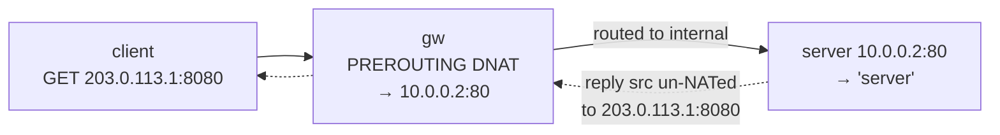

# Lab #40: DNAT — Publishing an Internal Service with Port Forwarding

Expected time: 35 to 50 minutes  
日本語: 想定時間 35〜50分

Reading guide: [`../rfc-notes/dnat-port-forwarding.md`](../rfc-notes/dnat-port-forwarding.md)

Prerequisite: [Lab 20: NAT — Source Address Translation](nat-20-source-nat.md)

## Goal

Lab 20 used **source NAT** (masquerade) so many inside hosts could reach out through one public address. This lab is the inbound complement: **destination NAT** (port forwarding), which lets the outside reach a *chosen* inside service through a public `address:port`.

An internal server sits on a private network the client cannot address directly. The gateway owns a public address:

- **before** any rule, the client's request to the public `203.0.113.1:8080` gets nothing (no service there),
- a **DNAT** rule maps `203.0.113.1:8080` → the internal `10.0.0.2:80`,
- now the client reaches the server through the **public** address (it never learns the internal IP), and conntrack un-NATs the reply so it appears to come from `203.0.113.1:8080`.

日本語: Lab 20 は **source NAT**(masquerade)で、多数の内側ホストが1つの公開アドレス経由で外へ出られるようにしました。この Lab はその入り方向の対、**destination NAT**(ポートフォワード)で、外側が公開 `アドレス:ポート` 経由で *選ばれた* 内側サービスに届くようにします。内部サーバはクライアントが直接アドレスできない private 網にいます。gw が公開アドレスを持ちます。**規則の前** はクライアントの公開 `203.0.113.1:8080` への要求は何も返らない(そこにサービスが無い)。**DNAT** 規則が `203.0.113.1:8080` → 内部 `10.0.0.2:80` に写すと、クライアントは **公開** アドレス経由でサーバに到達(内部 IP は知らないまま)、conntrack が応答を un-NAT して `203.0.113.1:8080` から返ったように見せる。

By the end, you should be able to explain this:

| | client → 203.0.113.1:8080 |
|---|---|
| before DNAT | nothing (no published service) |
| after DNAT → 10.0.0.2:80 | reaches the internal server |

## What You Will Learn

理解したいこと:

- What **DNAT** (destination NAT / port forwarding) is and how it differs from SNAT (Lab 20).
- Why DNAT happens in **PREROUTING** (before routing) and SNAT in POSTROUTING.
- How **conntrack** un-NATs the reply so the client sees the public address.
- Why the internal host must **return through the gateway**.
- How this relates to L4 load balancing (Lab 33, DNAT to a pool) and firewalling (Lab 36).

This lab does not cover:

- Hairpin NAT / NAT reflection (inside clients using the public IP).
- 1:1 NAT (netmap) or full cone/restricted cone behaviour.
- Combining DNAT with a firewall policy (mentioned, not built).

日本語: DNAT(destination NAT / ポートフォワード)とは何か、SNAT(Lab 20)との違い、DNAT が PREROUTING(ルーティング前)で起きる理由、conntrack が応答を un-NAT する仕組み、内部ホストが gw 経由で返す必要、L4 LB(Lab 33)や firewall(Lab 36)との関係を学びます。hairpin NAT、1:1 NAT、cone 挙動、DNAT+firewall 併用の構築は扱いません。

## RFCで読む場所

| 資料 | 読むポイント |
|---|---|
| RFC 3022 | basic NAT / NAPT(ポート変換)。DNAT の位置づけ |
| RFC 2663 | NAT の用語(inside/outside) |
| RFC 7857 | conntrack のタイムアウト/状態 |
| RFC 5737 | Lab で使う 203.0.113.0/24 が documentation 用であること |

## 実験の全体像

client(外)、gw(公開 203.0.113.1 / 内部 10.0.0.1)、server(内部 private 10.0.0.2)。

```text
 client (203.0.113.2) --- eth1 [ gw ] eth2 --- server (10.0.0.2, private, :80)
                              公開 203.0.113.1
   client → 203.0.113.1:8080  --DNAT-->  10.0.0.2:80
```



`203.0.113.0/24`(RFC 5737)を公開側、`10.0.0.0/24` を内部に使う(ローカル閉域)。

## 必要なもの

推奨環境:

- Linux / WSL2 / Linux VM
- Docker
- containerlab

使用イメージ:

- `nicolaka/netshoot:latest`（`iptables`、`conntrack`、`curl`、`python3` 同梱）

追加イメージは不要。

## 実行手順

```bash
./scripts/labctl.sh run dnat-40
```

### 1. 作業ディレクトリへ移動する

```bash
cd protocol-lab/examples/dnat-40
```

### 2. 起動して内部サーバを立てる

```bash
sudo containerlab deploy -t dnat-40.clab.yml
docker exec -d clab-dnat-40-server python3 /responder.py server
```

### 3. DNAT 前に公開ポートを叩く（届かない）

```bash
docker exec clab-dnat-40-client curl -s --max-time 4 http://203.0.113.1:8080/ || echo "(nothing published)"
```

### 4. DNAT でサービスを公開する

```bash
docker exec clab-dnat-40-gw iptables -t nat -A PREROUTING -d 203.0.113.1 -p tcp --dport 8080 -j DNAT --to-destination 10.0.0.2:80
docker exec clab-dnat-40-gw iptables -t nat -L PREROUTING -n -v
```

### 5. もう一度叩く（内部サーバに届く）

```bash
docker exec clab-dnat-40-client curl -s http://203.0.113.1:8080/   # server
```

### 6. 変換を conntrack で確認する

```bash
docker exec clab-dnat-40-gw conntrack -L | grep dport=8080
```

`dst=203.0.113.1 dport=8080` の flow が、戻りで `src=10.0.0.2 sport=80` になっている。

## 期待出力

- DNAT 前: 公開 `203.0.113.1:8080` は無応答。
- `iptables -t nat -L PREROUTING`: `DNAT tcp dpt:8080 to:10.0.0.2:80`。
- DNAT 後: client が `server` を取得(公開アドレス経由)。
- conntrack: 宛先が `10.0.0.2:80` に書き換わっている。

## なぜそう動くのか

**DNAT**(destination NAT / ポートフォワード)は「外側が、公開アドレス:ポート経由で、選ばれた内側サービスに届く」。

- **SNAT との対比**: SNAT(Lab 20)は outbound の **送信元** を書き換え(多数の内側→1公開 IP)、POSTROUTING で行う。DNAT は inbound の **宛先** を書き換え(公開→特定内部サービス)、**PREROUTING** で行う。方向も目的もチェインも対。
- **PREROUTING(ルーティング前)**: 入ってきたパケットの宛先を、**ルーティング判断の前** に `10.0.0.2:80` へ書き換える。その後 gw は書き換わった宛先へ普通にルーティングし、内部インターフェースへ転送する。だから公開アドレス宛が内部ホストに届く。クライアントは内部 IP を知らない。
- **conntrack で戻す**: DNAT した flow は conntrack に「行き/戻り」で1エントリ記録される。内部サーバの応答(src=10.0.0.2:80)が gw を通るとき、conntrack が **src を公開 203.0.113.1:8080 に戻す**(un-NAT)。だからクライアントには公開アドレスから返ってきたように見える。
- **戻り経路が要件**: 内部サーバの default route が gw を指していないと、応答が gw を通らず un-NAT されない。Lab はサーバの default gw を gw にしてある。
- **用途**: 1つの公開 IP の裏に複数の内部サービスを、ポート違いで公開する(80→web、8080→別 web、等)。誰に見せるかは firewall(Lab 36)で絞る。L4 LB(Lab 33)は DNAT を複数 backend に広げたもの。

要点は、**入口(PREROUTING)で宛先を内部サービスに書き換え、conntrack で応答を公開アドレスに戻す**こと。SNAT の入り方向の対。

## 詰まりやすい点

- **SNAT と混同する**。DNAT は宛先(入・PREROUTING)、SNAT は送信元(出・POSTROUTING)。
- **戻り経路を忘れる**。内部サーバは gw 経由で返さないと un-NAT されず壊れる。
- **firewall が不要と思う**。DNAT は届けるだけ。公開範囲は別途 firewall で制御する。
- **ポート番号が同じと思う**。公開 8080→内部 80 のように付け替え可能(NAPT)。
- **hairpin を仮定する**。内側から公開 IP でアクセスするには追加 NAT(reflection)が要る。
- **conntrack モジュール**。nat/conntrack が要る(netshoot は利用可)。

## 後片付け

```bash
sudo containerlab destroy -t dnat-40.clab.yml --cleanup
```

`labctl.sh run dnat-40` を使った場合は、スクリプトが最後に destroy する。

## 確認問題

1. DNAT とは何か。SNAT(Lab 20)と方向・目的・チェインの点でどう違うか。
2. DNAT が PREROUTING で起きるのはなぜか。
3. クライアントは内部サーバの応答を、どのアドレスから来たものとして見るか。なぜか。
4. 内部サーバの戻り経路が gw を通らないと何が起きるか。
5. 1つの公開 IP で複数サービスを公開するにはどうするか。
6. DNAT と L4 ロードバランサ(Lab 33)の関係は何か。

## References

- [RFC 3022: Traditional IP Network Address Translator (Traditional NAT)](https://www.rfc-editor.org/rfc/rfc3022)
- [RFC 2663: IP Network Address Translator (NAT) Terminology and Considerations](https://www.rfc-editor.org/rfc/rfc2663)
- [RFC 7857: Updates to Network Address Translation (NAT) Behavioral Requirements](https://www.rfc-editor.org/rfc/rfc7857)
- [RFC 5737: IPv4 Address Blocks Reserved for Documentation](https://www.rfc-editor.org/rfc/rfc5737)

## 検証済み実行ログ (2026-07-08)

このLabは実機で再現性を確認済みです。

実行環境:

- Ubuntu 26.04 LTS (kernel 7.0.0-27-generic, x86_64)
- Docker 29.1.3
- containerlab 0.77.0
- client / gw / server: `nicolaka/netshoot:latest`（iptables、conntrack、curl、python3）

`PATH="/tmp/pl-shim:$PATH" ./scripts/labctl.sh run dnat-40` で deploy → verify → destroy を実行し、`verification.json` は `"status": "verified"` を返した。

### DNAT 前は無応答、後は内部サーバに到達

```text
before: '<unreachable>'
after:  'server'
```

DNAT 規則の前は、公開 `203.0.113.1:8080` に何も公開されておらず client は届かない。規則追加後、同じ公開アドレス:ポートで内部サーバ(private `10.0.0.2:80`)に到達し `server` を取得した。client は内部 IP を一切使っていない。

### ポートフォワード規則と conntrack の変換

```text
# iptables -t nat -L PREROUTING
DNAT  tcp  --  0.0.0.0/0  203.0.113.1  tcp dpt:8080 to:10.0.0.2:80

# conntrack
src=203.0.113.2 dst=203.0.113.1 sport=33104 dport=8080
src=10.0.0.2    dst=203.0.113.2 sport=80    dport=33104 [ASSURED]
```

- 規則は公開 `203.0.113.1:8080` 宛を内部 `10.0.0.2:80` に写す(ポート 8080→80 の付け替えも同時)。
- conntrack の1行目が「行き」(client→公開)、2行目が「戻り」(内部サーバ→client)。応答は gw で src を公開 `203.0.113.1:8080` に戻して(un-NAT)client へ返る。だから client には公開アドレスから返ったように見える。SNAT(Lab 20)の入り方向の対であることが確認できる。

### Cleanup

```bash
containerlab destroy -t dnat-40.clab.yml --cleanup
```
