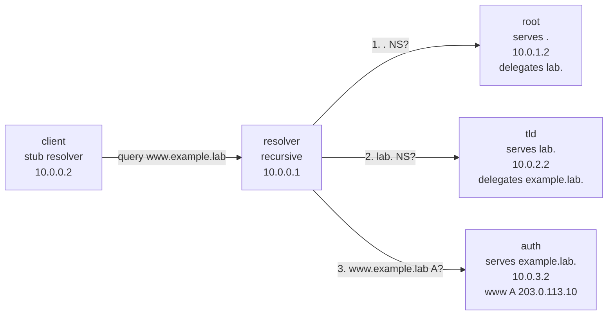
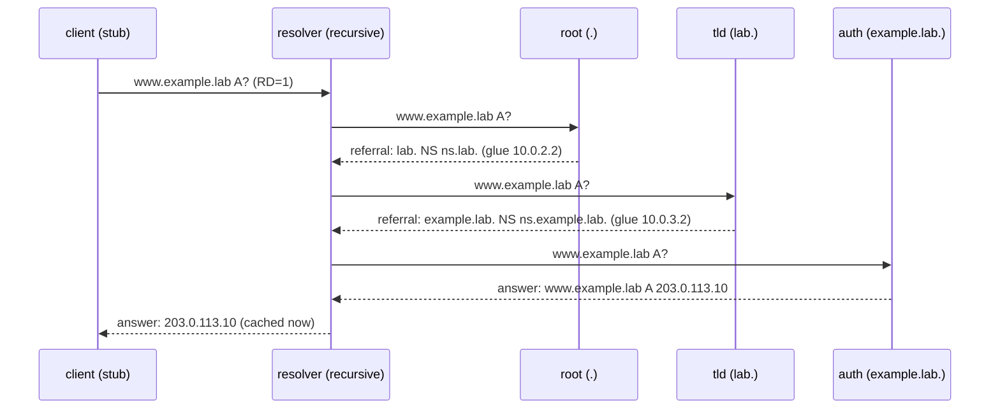

# DNS Lab #5: Recursive Resolution You Can Trace

Expected time: 50 to 65 minutes  
日本語: 想定時間 50〜65分

Reading guide: [`../rfc-notes/dns-recursive-resolution.md`](../rfc-notes/dns-recursive-resolution.md)

## Goal

In this lab, you will build a tiny DNS hierarchy of your own and watch one name get resolved from the top down:

- a **stub resolver** (`dig` on the client) that just asks one question,
- a **recursive resolver** that does the real work,
- a fake **root**, a **TLD** (`lab.`), and an **authoritative** server (`example.lab.`).

The theme is simple: the client asks one question, but behind it the recursive resolver walks the delegation chain `. -> lab. -> example.lab.` until it reaches the server that actually holds the answer.

日本語: このLabでは、自分専用の小さな DNS 階層を作り、1つの名前が上から下へ解決される様子を観察します。client の `dig`(stub resolver)は1回聞くだけですが、その裏で recursive resolver が `. -> lab. -> example.lab.` という委任の連鎖をたどって、答えを持つ authoritative server まで到達します。

By the end, you should be able to fill in this table for `www.example.lab`:

| Step | Who is asked | What comes back |
|---|---|---|
| 1 | root (`a.root.`) | referral: ask `ns.lab.` for `lab.` |
| 2 | TLD (`ns.lab.`) | referral: ask `ns.example.lab.` for `example.lab.` |
| 3 | authoritative (`ns.example.lab.`) | answer: `www.example.lab. A 203.0.113.10` |

## What You Will Learn

理解したいこと:

- The difference between a stub resolver, a recursive resolver, and an authoritative server.
- What a **referral** (a delegation with NS records and glue) looks like.
- How a recursive resolver uses **root hints** to know where to start.
- Why `dig +trace` shows one line per level of the hierarchy.
- How a cached answer differs from a freshly resolved one (query time and TTL).

This lab does not cover:

- DNSSEC validation (our hierarchy is unsigned on purpose).
- Caching, TTL expiry, and negative answers in depth (that is Lab 06).
- Real root/TLD operations or zone transfers.
- Reverse DNS (PTR) or IPv6 (AAAA) resolution.

## RFCで読む場所

今回の必読は以下。

| RFC | 章 | 読むポイント |
|---|---|---|
| RFC 1034 | 2.3, 3.1 | domain name space、ラベル、ゾーンと委任 |
| RFC 1034 | 4.3.1-4.3.2 | recursive と iterative の違い、name server の解決アルゴリズム |
| RFC 1034 | 5.3.3 | resolver が referral をたどる流れ |
| RFC 1035 | 3.7, 4.1 | question / answer / authority / additional セクション |
| RFC 8499 | 2, 6 | stub resolver、recursive resolver、authoritative server、glue の用語 |
| RFC 5737 | 3 | `203.0.113.0/24` が documentation prefix であること |

## 実験の全体像

client 1台、recursive resolver 1台、そして root / TLD / authoritative の3台を作る。

```text
client ---- resolver ----+---- root  (serves ".",         delegates lab.)
         (recursive)      +---- tld   (serves "lab.",       delegates example.lab.)
                          +---- auth  (serves "example.lab.", holds the A record)

答え:
  www.example.lab.  A  203.0.113.10   (TTL 60)
```

resolver は hub。すべての authoritative server に直接届き、client の `dig +trace` パケットも中継する。root / tld / auth は互いに通信しない。resolver(または `+trace` 中の client)が順番に各サーバへ問い合わせる。

`203.0.113.0/24` は RFC 5737 の documentation prefix。外部へ出さず、Lab 内だけで使う。





## 必要なもの

推奨環境:

- Linux / WSL2 / Linux VM
- Docker
- containerlab
- BIND9 container image
- netshoot container image (client tools)

使用イメージ:

- `protocol-lab/bind9:9.20`(`examples/dns-05/Dockerfile` からローカルビルド。`internetsystemsconsortium/bind9:9.20` に `iproute2` を足し、named を foreground で動かすだけの薄いラッパー)
- `nicolaka/netshoot:latest`

上流の ISC BIND イメージには `ip` コマンドが入っておらず、containerlab が `exec` で使う `ip addr add` が通らない。そのため `iproute2` を足したイメージをローカルにビルドしてから使う。`run.sh` は deploy の前に自動でビルドする。

macOS の場合は、Linux VM、WSL 相当の環境、または OrbStack/Colima 上の Linux VM で実行する想定にする。

## 実行手順

この手順は、containerlab を実行する Linux 環境の中で行う。

このリポジトリを持っている場合は、Linux 環境で検証スクリプトを実行できる。

```bash
./scripts/labctl.sh run dns-05
```

`labctl.sh run dns-05` は、topology deploy、名前解決の確認、`dig +trace` の収集、cache 動作の確認、destroy まで行う。

### 1. 作業ディレクトリへ移動する

```bash
cd protocol-lab/examples/dns-05
```

### 2. ゾーンと委任を読む

実験を動かす前に、3つのゾーンがどう繋がっているかを読む。

```bash
cat root/db.root
cat tld/db.lab
cat auth/db.example.lab
cat resolver/root.hints
```

読み方:

- `root/db.root` は `.` を持ち、`lab.` を `ns.lab.` (10.0.2.2) に委任する。
- `tld/db.lab` は `lab.` を持ち、`example.lab.` を `ns.example.lab.` (10.0.3.2) に委任する。
- `auth/db.example.lab` は `example.lab.` を持ち、`www.example.lab. A 203.0.113.10` を答える。
- `resolver/root.hints` は resolver に「まず `a.root.` (10.0.1.2) から始めよ」と教える。

各委任は「NS レコード + glue の A レコード」の組で書かれている。glue がないと、resolver は `ns.lab.` の住所を知るために別の解決が必要になってしまう。

### 3. 起動する

まず BIND イメージ(iproute2 入り)をビルドしてから deploy する。

```bash
docker build -t protocol-lab/bind9:9.20 .
sudo containerlab deploy -t dns-05.clab.yml
```

起動後、コンテナが作られていることを確認する。

```bash
docker ps --format "table {{.Names}}\t{{.Status}}"
```

期待する確認ポイント:

- `clab-dns-05-root` が起動している。
- `clab-dns-05-tld` が起動している。
- `clab-dns-05-auth` が起動している。
- `clab-dns-05-resolver` が起動している。
- `clab-dns-05-client` が起動している。

### 4. client から1回だけ聞く(stub の視点)

```bash
docker exec -it clab-dns-05-client dig @10.0.0.1 www.example.lab A
```

期待する確認ポイント:

```text
;; ANSWER SECTION:
www.example.lab.  60  IN  A  203.0.113.10

;; Query time: 3 msec
;; SERVER: 10.0.0.1#53(10.0.0.1)
```

client は1回聞くだけ。`RD` (recursion desired) フラグが立っており、resolver が残りをやってくれる。

### 5. 委任の連鎖をたどる(iterative の視点)

`dig +trace` は resolver に丸投げせず、自分で referral を1段ずつたどる。

```bash
docker exec -it clab-dns-05-client dig +trace @10.0.0.1 www.example.lab A
```

期待する確認ポイント(要点だけ):

```text
.                 NS  a.root.
a.root.           A   10.0.1.2
;; Received ... from 10.0.0.1 ...

lab.              NS  ns.lab.
ns.lab.           A   10.0.2.2
;; Received ... from 10.0.1.2 ...    <- root が答えた

example.lab.      NS  ns.example.lab.
ns.example.lab.   A   10.0.3.2
;; Received ... from 10.0.2.2 ...    <- tld が答えた

www.example.lab.  60  IN  A  203.0.113.10
;; Received ... from 10.0.3.2 ...    <- auth が答えた
```

`;; Received ... from <IP>` の行に注目する。答えた相手が root(10.0.1.2)→ tld(10.0.2.2)→ auth(10.0.3.2)と下りていく。これが iterative resolution。

### 6. cache を観察する

もう一度、同じ名前を普通に聞く。

```bash
docker exec -it clab-dns-05-client dig @10.0.0.1 www.example.lab A
```

見るポイント:

- `Query time` が1回目より小さい(多くの場合 0 msec)。
- `A` レコードの TTL が `60` より小さくなっている(例: `54`)。resolver が cache に入れてから経過した秒数だけ減る。

cache に入っていることは、recursion を切っても確かめられる。

```bash
docker exec -it clab-dns-05-client dig +norecurse @10.0.0.1 www.example.lab A
```

`RD` を落としても、resolver は cache から答えられるので `203.0.113.10` が返る。cache が空のときに `+norecurse` で聞くと、答えは返らない(resolver は新しく解決しに行かない)。

### 7. resolver が受け取った質問を見る

resolver は受信した query をログに出す。

```bash
docker logs clab-dns-05-resolver 2>&1 | grep query | tail
```

期待する確認ポイント:

```text
client 10.0.0.2#... query: www.example.lab IN A +
```

client からの1回の query が見える。`+` は recursion desired。resolver はこの1問を受けて、root/tld/auth への iterative query を裏で行う。

## 期待出力

完全一致よりも以下が取れることを重視する。

### `dig @10.0.0.1 www.example.lab A`

見るポイント:

- `ANSWER SECTION` に `203.0.113.10`。
- `flags` に `qr rd ra`(ra = recursion available)。

### `dig +trace @10.0.0.1 www.example.lab A`

見るポイント:

- `.` → `lab.` → `example.lab.` の順に referral が並ぶ。
- `;; Received ... from 10.0.1.2 / 10.0.2.2 / 10.0.3.2` が段階的に現れる。
- 最後に `www.example.lab. A 203.0.113.10`。

### 2回目の `dig`

見るポイント:

- `Query time` が減る。
- TTL が `60` からカウントダウンしている。

## なぜそう動くのか

DNS の名前空間は木構造で、各ゾーンは子ゾーンを **委任 (delegation)** で切り出す。委任は「子ゾーンの NS レコード」と、その NS の住所を教える **glue** の A レコードで表される。

client の stub resolver は木を歩かない。`RD=1` を立てて、recursive resolver に「最後まで解決して」と丸投げする。

recursive resolver は **root hints** で最初の一歩(`a.root.` の住所)を知り、そこから:

1. root に `www.example.lab A?` と聞く → root は答えを持たないが、`lab.` の委任(referral)を返す。
2. `lab.` の NS(tld)に同じ質問 → `example.lab.` の referral を返す。
3. `example.lab.` の NS(auth)に同じ質問 → 今度は authoritative な答え(`AA` フラグ付き)を返す。

resolver はこの答えを client に返し、同時に TTL の間だけ cache する。だから2回目は速く、TTL がカウントダウンして見える。

`dig +trace` は、この resolver の仕事を client 側で1段ずつ再現して見せてくれる。だから各段の「誰が答えたか」が読める。

## 詰まりやすい点

- **stub と recursive を混同する**。client の `dig` は stub。実際に木を歩くのは resolver。
- **referral を answer と読み違える**。root や tld が返すのは答えではなく「次に聞く相手」。`ANSWER SECTION` ではなく `AUTHORITY` / `ADDITIONAL` に NS と glue が入る。
- **glue を忘れる**。委任で NS 名だけ書いて A(glue)を書かないと、resolver が NS の住所を知るために追加の解決が必要になり、この閉じた lab では詰まる。
- **`+trace` は system の resolver を使う**。`@10.0.0.1` を付けて、最初の `. NS` をこの lab の resolver に聞かせている。付け忘れると本物の root を探しに行く。
- **DNSSEC**。この階層は署名していないので、resolver は `dnssec-validation no`。本番の resolver は root の trust anchor で検証する。
- **qname minimization**。最近の resolver は full name をいきなり全部聞かず、各段で必要なラベルだけ聞くことがある。`+trace` の見え方が上の例と少し違っても、委任の連鎖という骨格は同じ。

## 後片付け

手動で起動した場合は topology を削除する。

```bash
sudo containerlab destroy -t dns-05.clab.yml --cleanup
```

`labctl.sh run dns-05` を使った場合は、スクリプトが最後に destroy する。

## 確認問題

1. client の `dig` は stub resolver か recursive resolver か。どちらが実際に木を歩くか。
2. root が返すのは `www.example.lab` の答えか、それとも referral か。referral には何が入っているか。
3. glue レコードとは何か。なぜ委任に必要か。
4. `dig +trace` の `;; Received ... from <IP>` の行から何が読めるか。
5. 2回目の query が速いのはなぜか。TTL が `60` より小さく見えるのはなぜか。
6. `+norecurse` で聞いたとき、答えが返るのはどんな場合か。

## References

- [RFC 1034: Domain Names - Concepts and Facilities](https://www.rfc-editor.org/rfc/rfc1034)
- [RFC 1035: Domain Names - Implementation and Specification](https://www.rfc-editor.org/rfc/rfc1035)
- [RFC 8499: DNS Terminology](https://www.rfc-editor.org/rfc/rfc8499)
- [RFC 5737: IPv4 Address Blocks Reserved for Documentation](https://www.rfc-editor.org/rfc/rfc5737)
- [BIND 9 Administrator Reference Manual](https://bind9.readthedocs.io/en/latest/)
- [netshoot: a Docker + Kubernetes network troubleshooting swiss-army container](https://github.com/nicolaka/netshoot)
