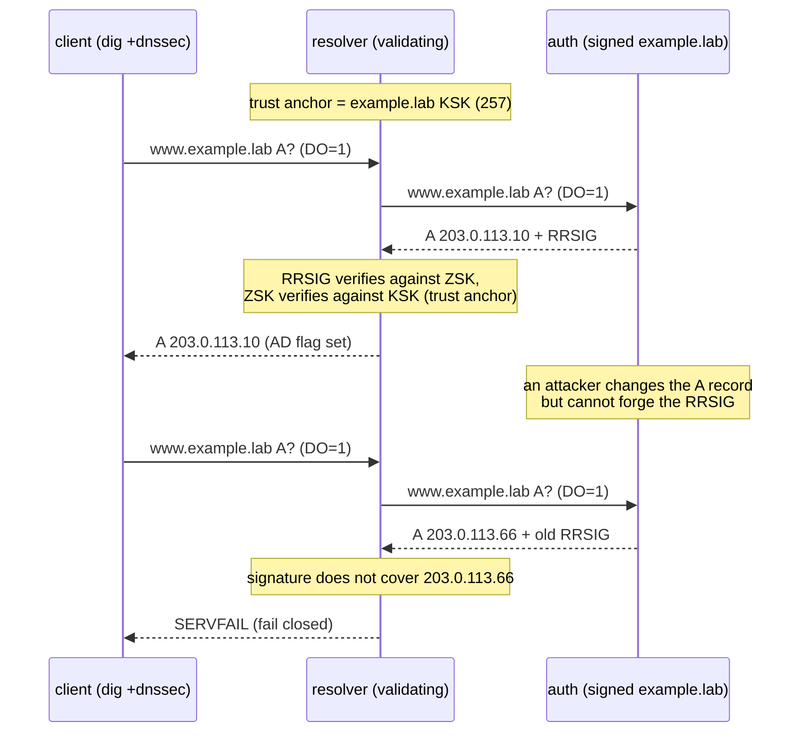

# DNS Lab #13: DNSSEC — Signatures, Trust Anchors, and the AD Flag

Expected time: 55 to 70 minutes  
日本語: 想定時間 55〜70分

Reading guide: [`../rfc-notes/dns-dnssec-validation.md`](../rfc-notes/dns-dnssec-validation.md)

Prerequisite: [DNS Lab 05: Recursive Resolution You Can Trace](dns-05-recursive-resolution.md)

## Goal

Lab 05 and 06 trusted whatever the authoritative servers said. This lab adds **cryptographic proof**: the zone is signed, and a validating resolver checks the signatures before it believes an answer.

You will watch three things:

- A **validated answer** whose response carries the **AD** (Authenticated Data) flag, alongside the **RRSIG** signature record.
- The zone's **public keys** — a **KSK** (key signing key, DNSKEY flag `257`) and a **ZSK** (zone signing key, `256`).
- A **tampered answer** that the resolver refuses to return, replying **SERVFAIL** because the signature no longer matches — and how **`+cd`** (checking disabled) bypasses that check.

日本語: Lab 05・06 は権威サーバの言うことをそのまま信じていました。この Lab では **暗号的な証明** を足します。ゾーンに署名し、検証リゾルバが署名を確認してから答えを信じます。観察するのは3つ。**AD**(Authenticated Data)フラグ付きの検証済み応答と **RRSIG** 署名、ゾーンの公開鍵(**KSK**=flag `257` と **ZSK**=`256`)、そして改ざんされた答えを resolver が拒否して **SERVFAIL** を返す様子(署名が合わないため)と、`+cd` で検証を外すとどうなるか、です。

By the end, you should be able to fill in this table for `www.example.lab`:

| Query | Resolver behavior | Status | AD flag |
|---|---|---|---|
| signed, untouched | validates the RRSIG against the trust anchor | `NOERROR` | set |
| tampered A record | signature no longer covers the data → reject | `SERVFAIL` | — |
| tampered, with `+cd` | validation disabled, returns data as-is | `NOERROR` | — |

## What You Will Learn

理解したいこと:

- What a **signed zone** contains: `RRSIG`, `DNSKEY`, and `NSEC` records next to the normal data.
- The split between the **KSK** and the **ZSK**, and why a resolver needs a **trust anchor**.
- How a validating resolver sets the **AD** flag only when the chain of signatures checks out.
- Why a single altered byte turns a good answer into **SERVFAIL** (a fail-closed design).
- What the **`+cd`** (Checking Disabled) flag does, and why it is a debugging tool, not a fix.

This lab does not cover:

- The full chain of trust from the real root (`.` → `lab.` → `example.lab.`); here we configure the `example.lab` key as a direct trust anchor (an "island of trust").
- NSEC3, DNSSEC key rollovers (RFC 5011), or algorithm rollovers.
- DANE / TLSA or other records that build on DNSSEC.

日本語: 署名済みゾーンの中身(`RRSIG`/`DNSKEY`/`NSEC`)、KSK と ZSK の役割分担と trust anchor の必要性、検証が通ったときだけ AD フラグが立つこと、1バイトの改変が SERVFAIL になる fail-closed 設計、そして `+cd` が何をする(デバッグ用であって解決策ではない)かを学びます。実際の root からの信頼の連鎖や NSEC3・鍵ロールオーバーは扱わず、`example.lab` の鍵を直接 trust anchor に置く「island of trust」で観察します。

## RFCで読む場所

今回の必読は以下。DNSSEC は RFC 4033/4034/4035 の3本セット。

| RFC | 章 | 読むポイント |
|---|---|---|
| RFC 4033 | 2, 5 | DNSSEC の目的、trust anchor と authentication chain の考え方 |
| RFC 4034 | 2, 3 | `DNSKEY` と `RRSIG` の形式(KSK/ZSK、署名の対象) |
| RFC 4034 | 4 | `NSEC`(存在しない名前の否定証明) |
| RFC 4034 | 5 | `DS`(親から子ゾーンの鍵をつなぐレコード) |
| RFC 4035 | 3.2.3, 4.3 | validating resolver の動作、**AD** フラグと **CD** フラグ |
| RFC 6605 | 全体 | ECDSA(このLabのアルゴリズム 13, ECDSAP256SHA256) |

## 実験の全体像

client 1台、validating resolver 1台、署名済みゾーンを持つ authoritative 1台。

```text
client (10.0.0.2) --- resolver (10.0.0.1 / 10.0.1.1) --- auth (10.0.1.2)
    dig +dnssec        validating recursive              serves signed example.lab
                       trust-anchor: example.lab KSK      (RRSIG / DNSKEY / NSEC)
```

resolver は `example.lab` の **KSK を trust anchor として静的に設定**してある。`example.lab` に関する答えは、この鍵につながる RRSIG を伴っていなければ「bogus(偽物)」とみなして SERVFAIL を返す。実際の運用では root からの `DS` レコードで信頼が連鎖するが、ここでは1つのゾーンだけの island of trust にして観察を単純化する。

`203.0.113.0/24` は RFC 5737 の documentation prefix。外部へ出さず Lab 内だけで使う。



## 必要なもの

推奨環境:

- Linux / WSL2 / Linux VM
- Docker
- containerlab
- BIND9 container image
- netshoot container image (client tools)

使用イメージ:

- `protocol-lab/bind9:9.20`(`examples/dns-13/Dockerfile` からローカルビルド。`internetsystemsconsortium/bind9:9.20` に `iproute2` を足した薄いラッパー)
- `nicolaka/netshoot:latest`

ゾーンは事前に署名済み(`examples/dns-13/auth/db.example.lab.signed`)。署名は `dnssec-keygen` と `dnssec-signzone` で作ってあり、resolver の trust anchor はその KSK から取っている。`run.sh` は deploy の前に BIND イメージをビルドする。

## 実行手順

この手順は、containerlab を実行する Linux 環境の中で行う。

このリポジトリを持っている場合は、Linux 環境で検証スクリプトを実行できる。

```bash
./scripts/labctl.sh run dns-13
```

`labctl.sh run dns-13` は、topology deploy、署名済みゾーンの読み込み、検証済み応答(AD)の確認、ゾーン改ざんによる SERVFAIL の確認、後片付けまで行う。

### 1. 作業ディレクトリへ移動する

```bash
cd protocol-lab/examples/dns-13
```

### 2. 署名済みゾーンを読む

実験の前に、署名でゾーンがどう変わったかを見る。

```bash
cat auth/db.example.lab          # 署名前(人間が読める素のゾーン)
cat auth/db.example.lab.signed   # 署名後(RRSIG / DNSKEY / NSEC が増えている)
```

読み方:

- 素のゾーンには `www.example.lab. A 203.0.113.10` などの通常レコードだけ。
- 署名後は、各 RRset の隣に `RRSIG`(署名)、apex に `DNSKEY`(公開鍵 KSK/ZSK)、名前の連鎖を示す `NSEC` が入る。
- resolver の trust anchor は `resolver/named.conf` の `trust-anchors { "example.lab." static-key 257 3 13 "..."; };`。これは署名に使った KSK の公開鍵。

### 3. 起動する

まず BIND イメージ(iproute2 入り)をビルドしてから deploy する。

```bash
docker build -t protocol-lab/bind9:9.20 .
sudo containerlab deploy -t dns-13.clab.yml
```

`clab-dns-13-{client,resolver,auth}` が起動していることを確認する。

```bash
docker ps --format "table {{.Names}}\t{{.Status}}"
```

### 4. 検証済みの答えを見る(AD フラグ)

```bash
docker exec -it clab-dns-13-client dig +dnssec @10.0.0.1 www.example.lab A
```

期待する確認ポイント:

```text
;; ->>HEADER<<- opcode: QUERY, status: NOERROR, ...
;; flags: qr rd ra ad; ...

;; ANSWER SECTION:
www.example.lab.  300  IN  A      203.0.113.10
www.example.lab.  300  IN  RRSIG  A 13 3 300 (...) example.lab. ...
```

- `flags: ... ad`: **AD**(Authenticated Data)。resolver が署名を検証できたという印。
- `RRSIG A 13 ...`: A レコードに対する署名。`13` は ECDSAP256SHA256。

### 5. ゾーンの公開鍵を見る(KSK / ZSK)

```bash
docker exec -it clab-dns-13-client dig +dnssec @10.0.0.1 example.lab DNSKEY
```

- `DNSKEY 257 3 13 ...`: **KSK**(flag 257)。trust anchor になっている鍵。
- `DNSKEY 256 3 13 ...`: **ZSK**(flag 256)。日々のレコードを署名する鍵。

KSK が ZSK を署名し、ZSK が各レコードを署名する。resolver は trust anchor(KSK)から ZSK、各 RRSIG へと連鎖をたどる。

### 6. 改ざんを検出させる(SERVFAIL)

`run.sh` は、auth が配信しているゾーンの `www` の A レコードを `203.0.113.10` → `203.0.113.66` に書き換え、署名はそのままにして reload する(攻撃者はデータは変えられても正しい署名は作れない、という状況の再現)。その後 resolver の cache を flush して聞き直す。

手で再現するなら:

```bash
# auth の配信中コピー(/var/cache/bind/…)を書き換えて reload
docker exec clab-dns-13-auth sh -c \
  "sed 's/203.0.113.10/203.0.113.66/' /var/cache/bind/db.example.lab.signed > /var/cache/bind/db.tmp \
     && mv /var/cache/bind/db.tmp /var/cache/bind/db.example.lab.signed \
     && chown bind /var/cache/bind/db.example.lab.signed; kill -HUP \$(pidof named)"
docker exec clab-dns-13-resolver rndc flush
docker exec -it clab-dns-13-client dig +dnssec @10.0.0.1 www.example.lab A
```

期待する確認ポイント:

```text
;; ->>HEADER<<- opcode: QUERY, status: SERVFAIL, ...
;; flags: qr rd ra; ...   (ad は付かない)
```

resolver のログには失敗理由が出る:

```bash
docker logs clab-dns-13-resolver 2>&1 | grep -i "no valid signature"
```

### 7. 検証を外して中身を見る(+cd)

`+cd`(Checking Disabled)を付けると、resolver は検証をスキップして生のデータを返す。

```bash
docker exec -it clab-dns-13-client dig +cd @10.0.0.1 www.example.lab A +short
```

改ざん後は `203.0.113.66` が返る。つまり **データは届いているが、DNSSEC が「信用できない」と判断していた** ということ。`+cd` は原因調査には便利だが、これを常用すると DNSSEC の保護を捨てることになる。

## 期待出力

完全一致よりも以下が取れることを重視する。

- 署名済みの `www`: `status: NOERROR`、`flags: ... ad`、`RRSIG` 付き、`203.0.113.10`。
- `DNSKEY`: `257`(KSK)と `256`(ZSK)が1つずつ。
- 改ざん後の `www`: `status: SERVFAIL`、`ad` なし。resolver ログに `no valid signature`。
- `+cd` 付き: `203.0.113.66`(検証を外すと改ざんデータが見える)。

## なぜそう動くのか

DNSSEC は、DNS の答えに **発信元認証** と **完全性** を足す。暗号化はしない(中身は見える)。守るのは「この答えは本当にそのゾーンが出したもので、途中で書き換えられていない」こと。

- **署名(RRSIG)**: ゾーンの各 RRset に対して秘密鍵で署名を作る。resolver は対応する公開鍵(DNSKEY)で検証する。データが1バイトでも変われば署名は合わなくなる。
- **KSK と ZSK の分離**: ZSK は頻繁に使う(全レコードを署名)ので短命・交換しやすく作る。KSK は DNSKEY RRset だけを署名し、trust anchor になる。KSK を長寿命にしておけば、ZSK を回しても親に登録した信頼(DS / trust anchor)を変えずに済む。
- **trust anchor と連鎖**: resolver は最初から信頼する鍵(trust anchor)を持つ。本番では root の KSK。root は TLD の `DS` を署名し、TLD は子ゾーンの `DS` を署名し…と連鎖する。このLabでは連鎖を省き、`example.lab` の KSK を直接 trust anchor にした。
- **AD フラグ**: resolver が trust anchor まで連鎖を検証できたときだけ、応答に AD を立てる。stub(client の dig)はこの1ビットで「検証済み」を知る(ただし client と resolver の間が信頼できる経路であることが前提)。
- **fail closed**: 署名が検証できなければ、resolver は古い/怪しいデータを返すより **SERVFAIL** で拒否する。安全側に倒す設計。
- **CD フラグ**: client が「検証はこちらでやるから、resolver は検証せず生データをよこせ」と指示するのが `+cd`。デバッグや、検証を自前でやる特殊な用途向け。

要点は、**DNSSEC は「答えの出所と完全性」を鍵で保証し、壊れていれば黙って捨てる** ということ。

## 詰まりやすい点

- **DNSSEC は暗号化ではない**。中身は平文で見える(Lab 09 の TLS とは別物)。守るのは真正性と完全性。
- **AD と RRSIG を混同する**。RRSIG はサーバが付ける署名データ。AD は resolver が「検証できた」と示すフラグ。両者は別物。
- **SERVFAIL を「サーバ障害」と読む**。DNSSEC 検証失敗も SERVFAIL になる。原因はログの `no valid signature` などで切り分ける。
- **`+cd` で直った、と思う**。`+cd` は検証を **無効化** しているだけ。答えが返るようになっても、正しさは保証されていない。
- **署名の有効期限**。RRSIG には inception/expiration がある。このLabのゾーンは長め(〜2036年)に署名してあるが、本番は定期的に再署名が要る。期限切れも SERVFAIL の原因になる。
- **trust anchor の取り違え**。resolver の trust anchor がゾーンの実際の KSK と一致していないと、正しい署名でも検証できず SERVFAIL になる。

## 後片付け

手動で起動した場合は topology を削除する。

```bash
sudo containerlab destroy -t dns-13.clab.yml --cleanup
```

`labctl.sh run dns-13` を使った場合は、スクリプトが最後に destroy する。

## 確認問題

1. 署名済みゾーンには、通常のレコードに加えてどんな種類のレコードが増えるか(3つ挙げよ)。
2. KSK と ZSK は何が違うか。なぜ2種類に分けるのか。
3. resolver が応答に AD フラグを立てるのはどんなときか。stub はそれをどう使うか。
4. A レコードを1バイト書き換えると、なぜ答えが SERVFAIL になるのか。
5. `+cd`(Checking Disabled)は何をするか。なぜ常用すべきでないか。
6. このLabは `example.lab` の KSK を直接 trust anchor にした。本番の DNS では、その信頼はどこからどうつながるか。

## References

- [RFC 4033: DNS Security Introduction and Requirements](https://www.rfc-editor.org/rfc/rfc4033)
- [RFC 4034: Resource Records for the DNS Security Extensions](https://www.rfc-editor.org/rfc/rfc4034)
- [RFC 4035: Protocol Modifications for the DNS Security Extensions](https://www.rfc-editor.org/rfc/rfc4035)
- [RFC 6605: Elliptic Curve Digital Signature Algorithm (DSA) for DNSSEC](https://www.rfc-editor.org/rfc/rfc6605)
- [RFC 5737: IPv4 Address Blocks Reserved for Documentation](https://www.rfc-editor.org/rfc/rfc5737)
- [BIND 9 Administrator Reference Manual](https://bind9.readthedocs.io/en/latest/)
- [netshoot: a Docker + Kubernetes network troubleshooting swiss-army container](https://github.com/nicolaka/netshoot)

## 検証済み実行ログ (2026-07-05)

このLabは実機で再現性を確認済みです。

実行環境:

- Ubuntu 26.04 LTS (kernel 7.0.0-27-generic, x86_64)
- Docker 29.1.3
- containerlab 0.77.0
- resolver / auth: `internetsystemsconsortium/bind9:9.20` (BIND 9.20.24) を薄くラップした `protocol-lab/bind9:9.20`
- client: `nicolaka/netshoot:latest` (dig 9.20.23)

`PATH="/tmp/pl-shim:$PATH" ./scripts/labctl.sh run dns-13` で deploy → verify → destroy を実行し、`verification.json` は `"status": "verified"` を返した。ゾーンは ECDSAP256SHA256(アルゴリズム 13)で事前署名し、RRSIG の有効期限は約10年後(〜2036)に設定してある。

### 検証済みの答え(AD フラグ + RRSIG)

```text
$ docker exec clab-dns-13-client dig +dnssec @10.0.0.1 www.example.lab A

;; ->>HEADER<<- opcode: QUERY, status: NOERROR, id: 29151
;; flags: qr rd ra ad; QUERY: 1, ANSWER: 2, AUTHORITY: 0, ADDITIONAL: 1

;; ANSWER SECTION:
www.example.lab.	300	IN	A	203.0.113.10
www.example.lab.	300	IN	RRSIG	A 13 3 300 20360702202237 20260705202237 11788 example.lab. vlD55Qq025WbrlJYwdCrzP0EszjfbGZUBl37DPL9Bd0E43tHyLWwNq0z NwZCptsHI2FoCPkb/o9P9qHDZc6+qQ==
```

`flags: ... ad` が立ち、A レコードの隣に `RRSIG A 13`(ECDSAP256SHA256、鍵タグ 11788 = ZSK)が付く。resolver が trust anchor まで検証できたことを示す。

### ゾーンの公開鍵(KSK 257 / ZSK 256)

```text
$ docker exec clab-dns-13-client dig +dnssec @10.0.0.1 example.lab DNSKEY

;; ANSWER SECTION:
example.lab.	300	IN	DNSKEY	257 3 13 <KSK public key>
example.lab.	300	IN	DNSKEY	256 3 13 <ZSK public key>
```

`257` が KSK(trust anchor 元)、`256` が ZSK。

### 改ざん → SERVFAIL(fail closed)

`www` の A を `203.0.113.10` → `203.0.113.66` に書き換え(署名はそのまま)、cache flush 後に再問い合わせ:

```text
$ docker exec clab-dns-13-client dig +dnssec @10.0.0.1 www.example.lab A

;; ->>HEADER<<- opcode: QUERY, status: SERVFAIL, id: 20532
;; flags: qr rd ra; QUERY: 1, ANSWER: 0, AUTHORITY: 0, ADDITIONAL: 1
```

`status: SERVFAIL`、`ad` なし、ANSWER 0。resolver のログ:

```text
$ docker logs clab-dns-13-resolver | grep "no valid signature"
validating www.example.lab/A: no valid signature found
```

### 検証を外すと改ざんデータが見える(+cd)

```text
$ docker exec clab-dns-13-client dig +cd @10.0.0.1 www.example.lab A +short
203.0.113.66
```

`+cd`(Checking Disabled)は検証をスキップするので、改ざんされた `203.0.113.66` がそのまま返る。DNSSEC は「データを隠す」のではなく「壊れていたら拒否する」仕組みであることが分かる。

### Cleanup

```bash
containerlab destroy -t dns-13.clab.yml --cleanup
```
