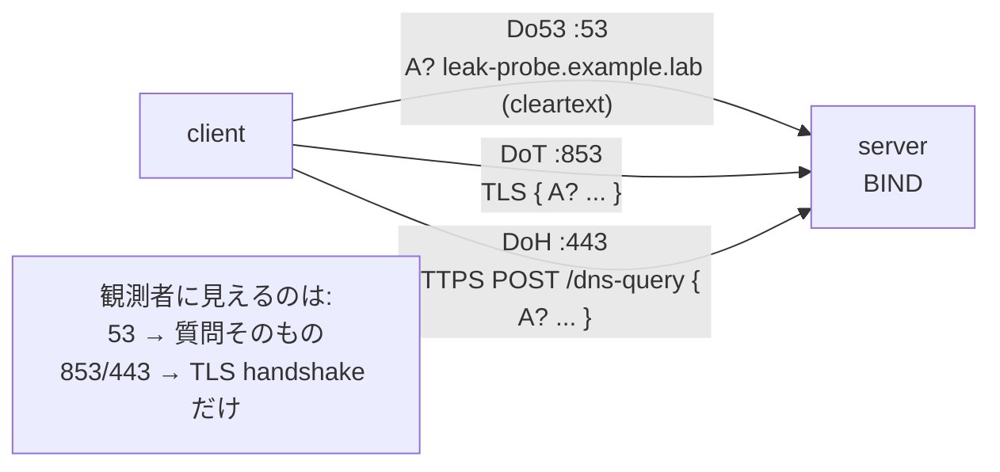

# DNS Lab #14: Encrypted DNS — DoT and DoH

Expected time: 45 to 60 minutes  
日本語: 想定時間 45〜60分

Reading guide: [`../rfc-notes/dns-encrypted-dot-doh.md`](../rfc-notes/dns-encrypted-dot-doh.md)

Prerequisites: [DNS Lab 05: Recursive Resolution You Can Trace](dns-05-recursive-resolution.md), [TLS Lab 09: What Is Visible Before Encryption](tls-09-handshake-certificates.md)

## Goal

Lab 13 made DNS answers *tamper-evident* (DNSSEC). This lab makes the DNS query itself *private on the wire*. The same name is resolved three ways and you watch what an on-path observer can read:

- **Do53** — classic DNS on port 53. The query name is **cleartext**.
- **DoT** — DNS over TLS (RFC 7858), port 853. The query rides **inside TLS**.
- **DoH** — DNS over HTTPS (RFC 8484), port 443, `/dns-query`. Also **inside TLS**, and it looks like ordinary HTTPS.

日本語: Lab 13 は DNS の答えを「改ざん検出できる」ようにしました(DNSSEC)。この Lab は DNS の**問い合わせそのものを経路上で秘匿**します。同じ名前を3通りで解決し、経路上の観測者に何が読めるかを見ます。Do53(53番、平文)、DoT(DNS over TLS、853番、TLS の中)、DoH(DNS over HTTPS、443番 `/dns-query`、これも TLS の中で、見た目は普通の HTTPS)。

By the end, you should be able to fill in this table for a query name on the wire:

| Transport | Port | Query name visible to an observer? | What the observer sees instead |
|---|---|---|---|
| Do53 | 53 | yes (cleartext) | the full question, e.g. `A? leak-probe.example.lab` |
| DoT | 853 | no | a TLS handshake, then encrypted records |
| DoH | 443 | no | a TLS handshake that looks like HTTPS |

## What You Will Learn

理解したいこと:

- That DNSSEC (Lab 13) and encrypted DNS solve **different** problems: integrity vs privacy.
- What DoT and DoH are, which ports they use, and how they relate to the TLS from Lab 09.
- Why Do53 leaks the query name to anyone on the path, and DoT/DoH do not.
- What encrypted DNS still does **not** hide (the server you talk to, and — via SNI — often the destination name).

This lab does not cover:

- Encrypted Client Hello (ECH), which also hides the SNI.
- Oblivious DoH (ODoH) or DNS over QUIC (DoQ).
- Picking or configuring a public resolver; here we run our own server.

日本語: DNSSEC(完全性)と暗号化DNS(秘匿性)が別問題であること、DoT/DoH のポートと Lab 09 の TLS との関係、Do53 が query 名を漏らし DoT/DoH が漏らさない理由、そして暗号化DNS でも**隠れない**もの(通信相手のサーバ、SNI 経由で宛先名が見えることが多い)を学びます。ECH・ODoH・DoQ は扱いません。

## RFCで読む場所

| RFC | 章 | 読むポイント |
|---|---|---|
| RFC 7858 | 3 | DNS over TLS(DoT)、ポート 853、TLS の張り方 |
| RFC 8484 | 4, 5 | DNS over HTTPS(DoH)、`/dns-query`、GET/POST と `application/dns-message` |
| RFC 9499 | 6 | Do53 / DoT / DoH の用語 |
| RFC 8446 | 2 | 下地となる TLS 1.3 handshake(Lab 09 の復習) |
| RFC 5737 | 3 | `203.0.113.0/24` が documentation prefix であること |

## 実験の全体像

client 1台、server 1台。server は BIND で、同じ `example.lab` ゾーンを Do53(53)・DoT(853)・DoH(443)の3つの transport で配信する。

```text
client (10.0.0.1) ------ eth1 ------ server (10.0.0.2)
  dig            @server :53         BIND
  dig +tls       @server :853        Do53 / DoT / DoH
  dig +https     @server :443        cert: dns.example.lab
```

client は同じ名前を `dig`(Do53)、`dig +tls`(DoT)、`dig +https`(DoH)で引く。その間 client 側でパケットを capture し、query 名が平文で見えるかどうかを比べる。DoT/DoH の TLS 証明書は `dns.example.lab` の自己署名(run.sh が生成)。

`203.0.113.0/24` は RFC 5737 の documentation prefix。外部へ出さず Lab 内だけで使う。



## 必要なもの

推奨環境:

- Linux / WSL2 / Linux VM
- Docker
- containerlab
- BIND9 container image
- netshoot container image (dig 9.18+ で `+tls` / `+https`、tshark、openssl)

使用イメージ:

- `protocol-lab/bind9:9.20`(`examples/dns-14/Dockerfile` からローカルビルド)
- `nicolaka/netshoot:latest`

DoT/DoH の観察には、client の `dig` が `+tls`(DoT)と `+https`(DoH)に対応している必要がある。netshoot の dig 9.20 は両対応。証明書は `run.sh` が deploy 前に自己署名で生成する(コミットしない)。

## 実行手順

```bash
./scripts/labctl.sh run dns-14
```

`labctl.sh run dns-14` は、証明書生成、deploy、3 transport で同じ答えが返ることの確認、各 transport の capture と「query 名が平文で見えるか」の比較、後片付けまで行う。

### 1. 作業ディレクトリへ移動する

```bash
cd protocol-lab/examples/dns-14
```

### 2. 起動する

`run.sh` が証明書を作ってから deploy する。手で追うなら:

```bash
# self-signed cert for dns.example.lab -> ./server/tls/
mkdir -p server/tls
docker run --rm -v "$PWD/server/tls:/w" -w /w --entrypoint sh nicolaka/netshoot:latest -c \
  'openssl req -x509 -newkey rsa:2048 -nodes -keyout server.key -out server.crt \
     -subj "/CN=dns.example.lab" -addext "subjectAltName=DNS:dns.example.lab" -days 3650; \
   chmod 644 server.key server.crt'
docker build -t protocol-lab/bind9:9.20 .
sudo containerlab deploy -t dns-14.clab.yml
```

### 3. 同じ名前を3通りで引く

```bash
docker exec clab-dns-14-client dig +short        @10.0.0.2 www.example.lab A   # Do53
docker exec clab-dns-14-client dig +tls +short   @10.0.0.2 www.example.lab A   # DoT (853)
docker exec clab-dns-14-client dig +https +short  @10.0.0.2 www.example.lab A   # DoH (443)
```

どれも `203.0.113.10` を返す。答えは同じ。違うのは**運び方**。

（自己署名なので `dig +tls` は既定では証明書検証をしない。実運用では resolver の証明書を検証し、`dig +tls-hostname=...` で名前も確認する。）

### 4. 平文かどうかを capture で比べる

client 側で、transport ごとに capture しながら目印になる名前(`leak-probe.example.lab`)を引く。

```bash
# Do53: 53番を capture して、query 名が平文で見えるか
docker exec -d clab-dns-14-client sh -c "tcpdump -i eth1 -A -s0 -w /tmp/do53.pcap 'port 53'"
docker exec clab-dns-14-client dig @10.0.0.2 leak-probe.example.lab A >/dev/null
docker exec clab-dns-14-client pkill -INT tcpdump
docker exec clab-dns-14-client sh -c "tcpdump -A -r /tmp/do53.pcap | grep leak-probe"
```

Do53 では `A? leak-probe.example.lab.` がそのまま読める。同じことを 853(`+tls`)と 443(`+https`)でやると、`leak-probe` は**出てこない**(TLS の中)。

### 5. DoT/DoH には TLS handshake が見える

```bash
docker exec clab-dns-14-client tshark -r /tmp/dot.pcap -Y "tls.handshake" -T fields -e tls.handshake.type
```

`1`(ClientHello)、`2`(ServerHello)…と TLS の handshake が並ぶ。つまり観測者には「TLS を張った」ことは分かるが、**中の質問は読めない**。

## 期待出力

- Do53 / DoT / DoH の3通りとも `www.example.lab` → `203.0.113.10`。
- Do53 の capture には `leak-probe.example.lab` が平文で出る。
- DoT(853)・DoH(443)の capture には `leak-probe` が出ない。
- DoT/DoH の capture には TLS handshake(ClientHello=1, ServerHello=2)が見える。

## なぜそう動くのか

DNS はもともと平文(Do53)で、経路上の誰でも「誰が何を引いたか」を読めた。DoT と DoH は、その DNS メッセージを **TLS(Lab 09)で包む**ことで query を秘匿する。

- **DoT(RFC 7858)**: 専用ポート 853 で TLS を張り、その中で普通の DNS メッセージをやり取りする。DNS 専用だと分かりやすいが、853 番が塞がれると使えない。
- **DoH(RFC 8484)**: 443 番の HTTPS の上に載せ、`/dns-query` へ `application/dns-message` を POST(または GET)する。見た目が普通の Web トラフィックと区別しにくいので、ブロックされにくい。
- **どちらも中身は暗号化**され、query 名・答えは経路から読めない。ただし **TLS handshake は見える**ので、「暗号化された DNS を使っている」ことや、接続先サーバの IP は分かる。
- **隠れないもの**: 通信相手の resolver(IP)。そして TLS の **SNI** は既定で平文なので、DoH で公開 resolver に対して特定の仮想ホストを指定する場合など、宛先名が漏れることがある(それを隠すのが ECH)。

要点は、**DNSSEC(Lab 13)は「答えの真正性」、DoT/DoH は「問い合わせの秘匿」** という、別々の目的を別々の仕組みで満たしていること。両方を組み合わせて初めて「正しくて、かつ覗かれない DNS」になる。

## 詰まりやすい点

- **DNSSEC と暗号化DNS を混同する**。DNSSEC は改ざん検出(署名)、DoT/DoH は盗聴防止(暗号化)。守る対象が違う。
- **暗号化DNS ですべてが隠れると思う**。相手サーバの IP、TLS handshake、しばしば SNI は見える。
- **`dig +tls` が証明書を検証していると思う**。既定では検証しないことが多い。実運用は CA/anchor で検証する。
- **DoH をただの HTTPS と侮る**。中身は DNS だが、443 に相乗りするので運用上ブロックしにくい、という性質が要点。
- **ポートの取り違え**。DoT=853、DoH=443。53 は平文。
- **capture の port フィルタ**。853/443 は TCP。53 は UDP と TCP 両方あり得る。フィルタを合わせる。

## 後片付け

```bash
sudo containerlab destroy -t dns-14.clab.yml --cleanup
```

`labctl.sh run dns-14` を使った場合は、スクリプトが最後に destroy する。

## 確認問題

1. Do53・DoT・DoH はそれぞれどのポートを使うか。
2. DoT と DoH の違いは何か。DoH が 443 に載る利点は何か。
3. 暗号化DNS を使うと、経路上の観測者から何が隠れ、何は隠れないか。
4. DNSSEC(Lab 13)と DoT/DoH は、それぞれ何を守るための仕組みか。
5. `dig +tls` が自己署名証明書でもエラーにならなかったのはなぜか。実運用ではどうすべきか。
6. capture で、DoT の通信が「DNS だ」と外から断定しにくいのはなぜか。

## References

- [RFC 7858: Specification for DNS over Transport Layer Security (TLS)](https://www.rfc-editor.org/rfc/rfc7858)
- [RFC 8484: DNS Queries over HTTPS (DoH)](https://www.rfc-editor.org/rfc/rfc8484)
- [RFC 9499: DNS Terminology](https://www.rfc-editor.org/rfc/rfc9499)
- [RFC 8446: TLS 1.3](https://www.rfc-editor.org/rfc/rfc8446)
- [RFC 5737: IPv4 Address Blocks Reserved for Documentation](https://www.rfc-editor.org/rfc/rfc5737)
- [BIND 9 Administrator Reference Manual](https://bind9.readthedocs.io/en/latest/)

## 検証済み実行ログ (2026-07-07)

このLabは実機で再現性を確認済みです。

実行環境:

- Ubuntu 26.04 LTS (kernel 7.0.0-27-generic, x86_64)
- Docker 29.1.3
- containerlab 0.77.0
- server: `internetsystemsconsortium/bind9:9.20` (BIND 9.20.24) を薄くラップした `protocol-lab/bind9:9.20`
- client: `nicolaka/netshoot:latest` (dig 9.20.23, tshark, openssl)

`PATH="/tmp/pl-shim:$PATH" ./scripts/labctl.sh run dns-14` で deploy → verify → destroy を実行し、`verification.json` は `"status": "verified"` を返した。

### 3 transport とも同じ答え

```text
$ dig +short       @10.0.0.2 www.example.lab A   # Do53
203.0.113.10
$ dig +tls +short  @10.0.0.2 www.example.lab A   # DoT (853)
203.0.113.10
$ dig +https +short @10.0.0.2 www.example.lab A  # DoH (443)
203.0.113.10
```

### Do53 は query 名が平文（port 53 の capture）

```text
$ tcpdump -A -r do53.pcap | grep leak-probe
09:28:21.443917 IP 10.0.0.1.40349 > 10.0.0.2.53: 10833+ [1au] A? leak-probe.example.lab. (63)
```

`leak-probe.example.lab` が3回、平文で現れる。経路上の観測者に丸見え。

### DoT / DoH は query 名が見えない

```text
$ tcpdump -A -r dot.pcap | grep -c leak-probe
0
$ tcpdump -A -r doh.pcap | grep -c leak-probe
0
```

DoT(853)・DoH(443)の capture には `leak-probe` が一度も出てこない(TLS の中)。

### DoT / DoH には TLS handshake だけが見える

```text
$ tshark -r dot.pcap -Y "tls.handshake" -T fields -e tls.handshake.type
1 2      # 1=ClientHello, 2=ServerHello
$ tshark -r doh.pcap -Y "tls.handshake" -T fields -e tls.handshake.type
1 2
```

観測者には「TLS を張った」ことは分かるが、質問の中身は読めない。DNSSEC(Lab 13)が答えの真正性を守るのに対し、DoT/DoH は問い合わせの秘匿を担う——別々の目的を別々の層で満たしている。

### Cleanup

```bash
containerlab destroy -t dns-14.clab.yml --cleanup
```
