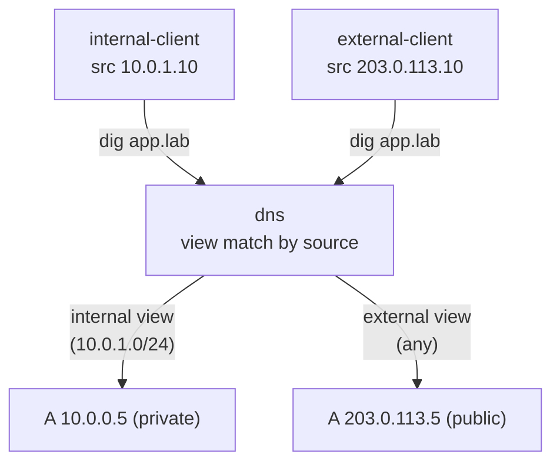

# Lab #42: Split-Horizon DNS — One Name, Different Answers by Who Asks

Expected time: 35 to 50 minutes  
日本語: 想定時間 35〜50分

Reading guide: [`../rfc-notes/split-horizon-dns.md`](../rfc-notes/split-horizon-dns.md)

Prerequisite: [DNS Lab 05: Resolving a Name Through the Hierarchy](dns-05-recursive-resolution.md)

## Goal

Round-robin (Lab 41) rotated the *order* of one name's records. Split-horizon DNS changes the *answer itself* based on **who is asking**: an authoritative server keeps several **views** of the same zone and picks one by the client's source address.

One name (`app.lab.`) is served through two views:

- an **internal** view (`match-clients { 10.0.1.0/24; }`) answers with the **private** address `10.0.0.5`,
- an **external** view (`match-clients { any; }`) answers with the **public** address `203.0.113.5`,
- two clients on different networks resolve the *same* `app.lab.` and get *different* addresses — the basis of split-brain DNS used to give insiders a private path and outsiders a public one.

日本語: round-robin(Lab 41)は1名前のレコードの *順序* を回しました。split-horizon DNS は **聞く相手** によって *答えそのもの* を変えます。authoritative サーバが同じゾーンの複数 **view** を保ち、クライアントの送信元アドレスで選ぶ。1つの名前(`app.lab.`)を2つの view で提供: **internal** view(`match-clients { 10.0.1.0/24; }`)は **private** アドレス `10.0.0.5`、**external** view(`match-clients { any; }`)は **public** アドレス `203.0.113.5` を返す。別ネットワークの2クライアントが *同じ* `app.lab.` を解決して *違う* アドレスを得る——内部に private、外部に public を渡す split-brain DNS の基礎。

By the end, you should be able to explain this:

| client (source) | app.lab. resolves to |
|---|---|
| internal (10.0.1.0/24) | 10.0.0.5 (private) |
| external (any other) | 203.0.113.5 (public) |

## What You Will Learn

理解したいこと:

- What a BIND **view** is and how `match-clients` selects one by source address.
- Why view order matters (specific first, `any` last).
- How the same name resolves to different records per view.
- Where split-horizon is used (internal vs public path, hiding topology).
- The caveats: caching across boundaries and keeping two zone copies consistent.

This lab does not cover:

- Recursive resolvers and cache separation in depth.
- TSIG-key-based view selection or EDNS Client Subnet.
- Automated zone-data generation for multiple views.

日本語: BIND の view とは何か、`match-clients` が送信元で選ぶ仕組み、view の順序(具体を先に、`any` を最後)、同一名が view ごとに別レコードに解決すること、用途(内外の経路分け・トポロジ隠蔽)、注意点(境界越えのキャッシュ・2コピーの一貫性)を学びます。再帰 resolver とキャッシュ分離の詳細、TSIG 鍵ベースの view、複数 view のデータ自動生成は扱いません。

## RFCで読む場所

| 資料 | 読むポイント |
|---|---|
| RFC 8499 | "view" / split DNS の用語 |
| RFC 1034 | authoritative / zone の基本 |
| RFC 6950 | スコープ付き応答の注意点 |
| RFC 5737 / RFC 1918 | Lab のアドレスがローカル/documentation 用であること |

## 実験の全体像

DNS サーバが internal / external の2面に接続。各面のクライアントが同じ名前を引く。

```text
 internal-client (10.0.1.10) --- eth1 [ dns (views) ] eth2 --- external-client (203.0.113.10)
                             10.0.1.2                203.0.113.2
   internal: app.lab -> 10.0.0.5     external: app.lab -> 203.0.113.5
```



`10.0.1.0/24` 内部リンク、`203.0.113.0/24`(RFC 5737)外部リンク。

## 必要なもの

推奨環境:

- Linux / WSL2 / Linux VM
- Docker
- containerlab

使用イメージ:

- `protocol-lab/bind9:9.20`（run.sh が Dockerfile からビルド）
- `nicolaka/netshoot:latest`（`dig`）

## 実行手順

```bash
./scripts/labctl.sh run dns-views-42
```

### 1. 作業ディレクトリへ移動する

```bash
cd protocol-lab/examples/dns-views-42
```

### 2. イメージをビルドして起動する

```bash
docker build -t protocol-lab/bind9:9.20 .
sudo containerlab deploy -t dns-views-42.clab.yml
```

### 3. 内部と外部で同じ名前を引く

```bash
docker exec clab-dns-views-42-internal-client dig +short app.lab @10.0.1.2      # 10.0.0.5
docker exec clab-dns-views-42-external-client dig +short app.lab @203.0.113.2   # 203.0.113.5
```

同じ `app.lab` が、送信元によって別のアドレスに解決する。

## 期待出力

- internal-client: `app.lab` → `10.0.0.5`(private)。
- external-client: `app.lab` → `203.0.113.5`(public)。
- 2つが異なる(split-horizon 成立)。

## なぜそう動くのか

**split-horizon DNS** は「1つの authoritative な名前、複数の答えの組、問い合わせ元で選ぶ」。

- **view**: 独自のゾーン定義(ファイル)を持つ名前付きコンテナ。サーバは同じゾーンを複数 view で別々に持てる。
- **match-clients で選ぶ**: 受け取ったクエリの **送信元アドレス** を、view の `match-clients` に **上から順** に照合し、最初に一致した view のゾーンで答える。Lab では internal(`10.0.1.0/24`)→ external(`any`)の順。内部クライアント(10.0.1.10)は internal に一致 → `10.0.0.5`。外部(203.0.113.10)は internal に一致せず external(any)→ `203.0.113.5`。
- **順序が肝**: 具体的な view を先に、`any` を最後に。逆にすると全員が最初の view に落ちる。
- **なぜ便利か**: 内部ユーザには private IP(社内直結)、外部には public IP(公開経路)を返せる。外部に private アドレスや内部専用ホストを見せない(トポロジ隠蔽)。ユーザは同じ名前(URL)を使い続けられる。
- **注意**: 応答は resolver にキャッシュされる。内外の resolver を分けないと view の答えが混ざりうる。また view ごとにゾーンのコピーを保つので、更新漏れで内外がずれる。送信元判定なので NAT/VPN で送信元が変わると意図と違う view に落ちうる。

要点は、**送信元で view を選び、同じ名前を場所に応じて正しい面に解決させる**こと。round-robin(順序を変える)と違い、答えそのものを相手で変える。

## 詰まりやすい点

- **round-robin と混同する**。RR(Lab 41)は順序、views は答えそのものを変える。
- **view の順序**。上から照合し最初の一致が勝つ。`any` を先に置くと全員そこへ。
- **1ゾーンで済むと思う**。各 view は自分のゾーンコピーを持つ。同期の運用が要る。
- **キャッシュ**。内外の resolver を分けないと答えが混ざる。
- **送信元を信頼しすぎる**。NAT/VPN/spoof で送信元は変わりうる。ACL は慎重に。
- **recursion**。この Lab は authoritative 直問い合わせ。再帰 resolver を挟むと view 判定は resolver の送信元で決まる。

## 後片付け

```bash
sudo containerlab destroy -t dns-views-42.clab.yml --cleanup
```

`labctl.sh run dns-views-42` を使った場合は、スクリプトが最後に destroy する。

## 確認問題

1. BIND の view とは何か。match-clients は何で view を選ぶか。
2. view の照合順序はどう効くか。`any` を先に置くと何が起きるか。
3. Lab で内部と外部が同じ名前に別アドレスを得るのはなぜか。
4. split-horizon と round-robin(Lab 41)の違いは何か。
5. split-horizon の運用上の注意を2つ挙げよ(キャッシュ / 一貫性)。
6. NAT や VPN があると view 判定はどう影響を受けるか。

## References

- [RFC 1034: Domain Names — Concepts and Facilities](https://www.rfc-editor.org/rfc/rfc1034)
- [RFC 8499: DNS Terminology](https://www.rfc-editor.org/rfc/rfc8499)
- [RFC 6950: Architectural Considerations on Application Features in the DNS](https://www.rfc-editor.org/rfc/rfc6950)
- [RFC 5737: IPv4 Address Blocks Reserved for Documentation](https://www.rfc-editor.org/rfc/rfc5737)

## 検証済み実行ログ (2026-07-08)

このLabは実機で再現性を確認済みです。

実行環境:

- Ubuntu 26.04 LTS (kernel 7.0.0-27-generic, x86_64)
- Docker 29.1.3
- containerlab 0.77.0
- dns: `protocol-lab/bind9:9.20`（run.sh が Dockerfile からビルド）
- internal-client / external-client: `nicolaka/netshoot:latest`（dig）

`PATH="/tmp/pl-shim:$PATH" ./scripts/labctl.sh run dns-views-42` で build → deploy → verify → destroy を実行し、`verification.json` は `"status": "verified"` を返した。

### 同じ名前が送信元で別の答えに

```text
internal: 10.0.0.5
external: 203.0.113.5
```

- **internal-client**(送信元 `10.0.1.10`、`10.0.1.0/24` に一致)は internal view に落ち、`app.lab` → **`10.0.0.5`**(private アドレス)。
- **external-client**(送信元 `203.0.113.10`)は internal に一致せず external(`any`)view で、同じ `app.lab` → **`203.0.113.5`**(public アドレス)。
- 同一の authoritative な名前が、`match-clients` による view 選択で送信元ごとに別レコードに解決した。内部に private・外部に public を渡す split-horizon が成立している。

### Cleanup

```bash
containerlab destroy -t dns-views-42.clab.yml --cleanup
```
