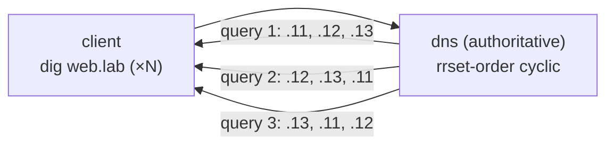

# Lab #41: DNS Round-Robin — Spreading Clients at the Naming Layer

Expected time: 30 to 45 minutes  
日本語: 想定時間 30〜45分

Reading guide: [`../rfc-notes/dns-round-robin.md`](../rfc-notes/dns-round-robin.md)

Prerequisite: [DNS Lab 05: Resolving a Name Through the Hierarchy](dns-05-recursive-resolution.md)

## Goal

The load-distribution labs so far worked in the network: anycast (Lab 31) let routing pick an instance, ECMP (Lab 32) hashed flows across links, IPVS (Lab 33) had a director distribute connections. This lab spreads clients one layer earlier — at **name resolution**.

One name (`web.lab.`) holds **three A records**. With **`rrset-order cyclic`**, the authoritative server rotates their order on every response:

- a client that keeps re-resolving `web.lab.` gets a **different first address** each time (`.11 → .12 → .13 → …`),
- since clients typically connect to the first address returned, successive clients land on different backends,
- it's the simplest, cheapest spread — but the coarsest: no health checks, and caching blunts it.

日本語: これまでの負荷分散 Lab はネットワークで働きました。anycast(31)は routing がインスタンスを選び、ECMP(32)は flow をリンクに hash、IPVS(33)は director が接続を分配。この Lab はもう1つ手前、**名前解決** でクライアントを散らします。1つの名前(`web.lab.`)が **3つの A レコード** を持ち、**`rrset-order cyclic`** でサーバが応答ごとに順序を回すと、`web.lab.` を再解決し続けるクライアントは毎回 **異なる先頭アドレス**(`.11 → .12 → .13 → …`)を受け取る。クライアントはふつう先頭に接続するので、次々のクライアントが別 backend に落ちる。最も手軽で安価だが最も粗い(健全性チェック無し、caching で鈍る)。

By the end, you should be able to explain this:

| query | first A record returned |
|---|---|
| 1 | 203.0.113.11 |
| 2 | 203.0.113.12 |
| 3 | 203.0.113.13 |
| 4 | 203.0.113.11 … |

## What You Will Learn

理解したいこと:

- How one name can hold multiple **A records** (an RRset).
- Why clients using the **first** record makes the order matter.
- How **`rrset-order cyclic`** rotates the RRset per response (round-robin).
- Where DNS round-robin sits among anycast / ECMP / IPVS, and its trade-offs.
- Why **TTL** and caching limit how well it spreads.

This lab does not cover:

- Health-checked DNS load balancing (GSLB) or weighted records.
- GeoDNS / EDNS Client Subnet.
- Combining DNS with a real L4/L7 balancer (mentioned only).

日本語: 1名前が複数 A レコード(RRset)を持てること、クライアントが先頭を使うので順序が効くこと、`rrset-order cyclic` が応答ごとに回す仕組み、anycast/ECMP/IPVS の中での位置づけとトレードオフ、TTL/caching が分散を鈍らせる理由を学びます。健全性チェック付き(GSLB)、weighted、GeoDNS、実 LB との併用は扱いません。

## RFCで読む場所

| 資料 | 読むポイント |
|---|---|
| RFC 1035 §3.4.1 | A レコード、RRset |
| RFC 1794 | round-robin による負荷分散 |
| RFC 8499 | RRset / authoritative / resolver |
| RFC 5737 | Lab の 203.0.113.0/24 が documentation 用であること |

## 実験の全体像

client と、`web.lab.` を持つ authoritative DNS の2ノード。

```text
 client (10.0.0.1) --- dns (10.0.0.2, authoritative for web.lab.)
    dig web.lab @10.0.0.2   →  A .11 / .12 / .13  (順序は毎回回転)
```



`10.0.0.0/24` はラボリンク、`203.0.113.0/24`(RFC 5737)は A レコードの指す documentation 空間。

## 必要なもの

推奨環境:

- Linux / WSL2 / Linux VM
- Docker
- containerlab

使用イメージ:

- `protocol-lab/bind9:9.20`（run.sh が Dockerfile からビルド）
- `nicolaka/netshoot:latest`（`dig`）

## 実行手順

```bash
./scripts/labctl.sh run dnsrr-41
```

### 1. 作業ディレクトリへ移動する

```bash
cd protocol-lab/examples/dnsrr-41
```

### 2. イメージをビルドして起動する

```bash
docker build -t protocol-lab/bind9:9.20 .
sudo containerlab deploy -t dnsrr-41.clab.yml
```

### 3. 3つの A レコードを確認する

```bash
docker exec clab-dnsrr-41-client dig +noall +answer web.lab @10.0.0.2
```

`web.lab.` に `A 203.0.113.11 / .12 / .13` の3レコード。

### 4. 繰り返して先頭の回転を見る

```bash
for i in $(seq 1 6); do
  docker exec clab-dnsrr-41-client sh -c 'dig +short web.lab @10.0.0.2 | head -1'
done
```

先頭が `.11 → .12 → .13 → .11 → …` と巡回する。

## 期待出力

- `dig +noall +answer`: `web.lab.` に3つの A レコード。
- 連続クエリの先頭: `.11 → .12 → .13` を巡回(cyclic)。
- 6クエリで先頭が3種類すべて現れる。

## なぜそう動くのか

**DNS round-robin** は「1つの名前、複数のアドレス、応答ごとに順序を回す」。

- **RRset**: 同じ名前・型の複数レコードは1つの集合(RRset)。`web.lab. A .11/.12/.13` は3レコード。応答はふつう **全部** を返す。
- **先頭を使う慣習**: 多くのクライアント/stub resolver は返ってきた **先頭** のアドレスに接続する。だから **順序** が「誰にどの backend が当たるか」を決める。
- **cyclic で回す**: サーバが応答のたびに RRset の順序を回転させる(BIND `rrset-order cyclic`)。連続クエリで先頭が `.11 → .12 → .13` と巡回し、次々のクライアントが別 backend に落ちる。**名前解決の層** で分散する(routing/転送層の anycast/ECMP/IPVS とは層が違う)。
- **粗さと caching**: DNS RR は最も手軽だが最も粗い。**健全性チェックが無く**、死んだ backend の A も返し続ける。加えて応答は **TTL** の間キャッシュされ、その間は同じ順序が使い回されて回転が効かない。だから RR 用の A は **短い TTL**(Lab は 30 秒)にする。分散はベストエフォート。
- **実運用**: DNS RR 単体は簡易分散。まじめには GSLB(健全性付き)や、DNS RR + 実 LB(Lab 33)/ anycast(Lab 31)を組み合わせる。

要点は、**1名前に複数アドレスを持たせ、順序を回すことで、名前解決の段階でクライアントを backend 群に散らす**こと。手軽さと引き換えに粗い。

## 詰まりやすい点

- **真のロードバランスと思う**。粗い分散。実負荷・接続数は見ない。
- **健全性を見ると思う**。素の RR は死んだ backend も返す。監視+低 TTL+撤去 or 実 LB が要る。
- **必ず均等と思う**。caching・resolver 実装・クライアント選択でばらつく。
- **TTL を無視する**。長い TTL はキャッシュで回転を殺す。RR には短い TTL。
- **先頭以外も使われると思う**。多くは先頭のみ。だから順序が効く。
- **再帰 resolver を挟むと**。resolver がキャッシュ/並べ替えするため、authoritative 直問い合わせより回転が見えにくいことがある。

## 後片付け

```bash
sudo containerlab destroy -t dnsrr-41.clab.yml --cleanup
```

`labctl.sh run dnsrr-41` を使った場合は、スクリプトが最後に destroy する。

## 確認問題

1. RRset とは何か。1つの名前が複数 A を持てるのはなぜか。
2. クライアントが先頭を使う慣習は、round-robin にどう効くか。
3. `rrset-order cyclic` は何をするか。Lab で先頭が巡回するのはなぜか。
4. DNS round-robin を anycast(31)/ECMP(32)/IPVS(33)と、分散する層の観点で対比せよ。
5. DNS round-robin の弱点を2つ挙げよ(健全性 / caching)。
6. RR 用の A レコードの TTL を短くするのはなぜか。短すぎる欠点は。

## References

- [RFC 1035: Domain Names — Implementation and Specification](https://www.rfc-editor.org/rfc/rfc1035)
- [RFC 1794: DNS Support for Load Balancing](https://www.rfc-editor.org/rfc/rfc1794)
- [RFC 8499: DNS Terminology](https://www.rfc-editor.org/rfc/rfc8499)
- [RFC 5737: IPv4 Address Blocks Reserved for Documentation](https://www.rfc-editor.org/rfc/rfc5737)

## 検証済み実行ログ (2026-07-08)

このLabは実機で再現性を確認済みです。

実行環境:

- Ubuntu 26.04 LTS (kernel 7.0.0-27-generic, x86_64)
- Docker 29.1.3
- containerlab 0.77.0
- dns: `protocol-lab/bind9:9.20`（run.sh が Dockerfile からビルド）
- client: `nicolaka/netshoot:latest`（dig）

`PATH="/tmp/pl-shim:$PATH" ./scripts/labctl.sh run dnsrr-41` で build → deploy → verify → destroy を実行し、`verification.json` は `"status": "verified"` を返した。

### 1名前・3アドレスの RRset

```text
web.lab.  30  IN  A  203.0.113.11
web.lab.  30  IN  A  203.0.113.12
web.lab.  30  IN  A  203.0.113.13
```

`web.lab.` は3つの A レコード(RRset)を持ち、TTL は 30 秒(キャッシュを短くして再解決・再分散を促す)。

### 応答ごとに先頭が巡回する

6回の `dig +short web.lab @10.0.0.2 | head -1`(先頭アドレスのみ):

```text
203.0.113.12 → 203.0.113.13 → 203.0.113.11 → 203.0.113.12 → 203.0.113.13 → 203.0.113.11
```

`rrset-order cyclic` により、authoritative サーバが応答のたびに RRset の順序を回転させている。6クエリで先頭が **3種類すべて**(distinct = 3)現れ、クライアントを3つの backend におおまかに分散していることが確認できる。ネットワーク層(anycast/ECMP/IPVS)ではなく **名前解決層** での分散。

### Cleanup

```bash
containerlab destroy -t dnsrr-41.clab.yml --cleanup
```
