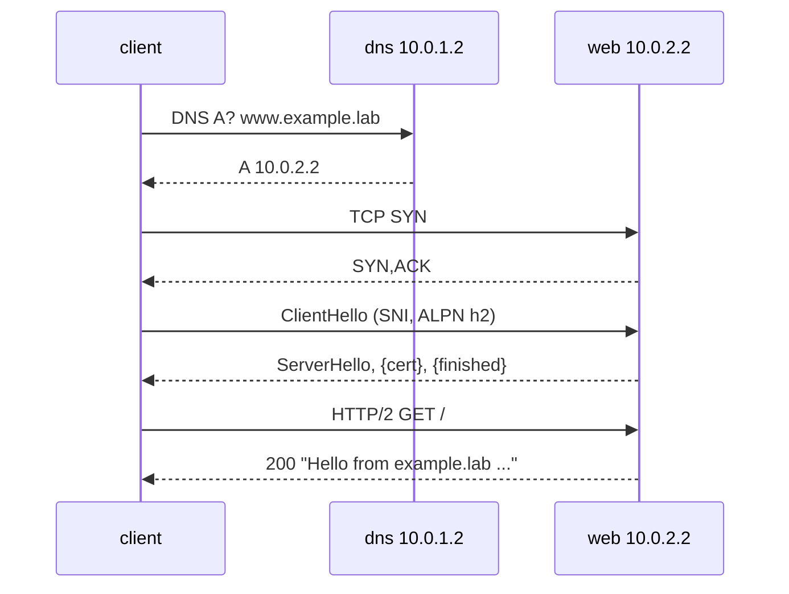

# Lab #12: One Web Request, End to End

Expected time: 60 to 80 minutes  
日本語: 想定時間 60〜80分

Reading guide: [`../rfc-notes/e2e-web-request.md`](../rfc-notes/e2e-web-request.md)

Prerequisites: Labs 05-11 (DNS, TCP, TLS, HTTP, HTTP/2).

## Goal

This is the capstone. Every earlier lab looked at one layer. Here you run a single command — `curl https://www.example.lab/` — and watch it cross **all** of them, in order:

1. **DNS**: resolve `www.example.lab` to an address (Labs 05-06).
2. **TCP**: three-way handshake to that address (Lab 07).
3. **TLS**: handshake with SNI, ALPN (Lab 09).
4. **HTTP**: the request and the `200` response (Labs 10-11).

日本語: これは総まとめです。ここまでは1つの層だけを見てきました。ここでは1つのコマンド `curl https://www.example.lab/` を実行し、それが全部の層を順にまたぐ様子を観察します。DNS で名前を解決し、TCP で繋ぎ、TLS で handshake し、HTTP で `200` を受け取る、その一連を1つの request path として追います。

By the end, you should be able to narrate the whole path:

```text
www.example.lab
  │  DNS  A? ─────────────► resolver (10.0.1.2)
  │       ◄──────── A 10.0.2.2
  │  TCP  SYN ─────────────► web (10.0.2.2:443)
  │       ◄──────── SYN,ACK
  │  TLS  ClientHello (SNI=www.example.lab, ALPN=h2) ─►
  │       ◄──────── ServerHello, {cert, finished}
  │  HTTP GET / (HTTP/2) ──►
  │       ◄──────── 200, "Hello from example.lab ..."
  ▼
```

## What You Will Learn

理解したいこと:

- The order in which the layers run for one web request.
- Which node each layer talks to (resolver vs web server).
- How the output of one layer (an address) becomes the input of the next.
- How to point at each layer in two captures (DNS on one link, TCP/TLS/HTTP on the other).

This lab does not cover:

- Real public DNS, CAs, or the Internet.
- Performance, connection reuse, or HTTP/3 migration (see Lab 11).
- Load balancing, proxies, or CDNs.

## RFCで読む場所

新しい RFC は増やさない。今までの Lab の RFC を「順番」という視点で読み返す。

| 層 | RFC | 見直すポイント |
|---|---|---|
| DNS | RFC 1034 / 1035 | 名前 → アドレスの解決(Lab 05-06) |
| TCP | RFC 9293 | handshake で接続を確立(Lab 07) |
| TLS | RFC 8446 / 6066 / 7301 | SNI と ALPN、暗号化の境界(Lab 09) |
| HTTP | RFC 9110 / 9113 | request/response と version(Lab 10-11) |

## 実験の全体像

client を中心に、DNS server と web server を左右に置く。

```text
client ---- eth1 ---- dns   (resolver + authoritative for example.lab)
  |                    www.example.lab. A 10.0.2.2
  +------- eth2 ---- web   (Caddy: TLS + HTTP/2 over TCP)
```

client の `/etc/resolv.conf` は dns(10.0.1.2)を指す。`curl https://www.example.lab/` は、まず eth1 で DNS を引き、返ってきた 10.0.2.2 へ eth2 で TCP/TLS/HTTP する。



イメージは `./dns/Dockerfile`(BIND + iproute2)と `./web/Dockerfile`(Caddy + iproute2)から `run.sh` がビルドする。client は netshoot。

## 必要なもの

推奨環境:

- Linux / WSL2 / Linux VM
- Docker
- containerlab

使用イメージ:

- `protocol-lab/bind9:9.20`(ローカルビルド)
- `protocol-lab/caddy:2`(ローカルビルド)
- `nicolaka/netshoot:latest`

## 実行手順

```bash
./scripts/labctl.sh run e2e-12
```

`labctl.sh run e2e-12` は、両イメージのビルド、deploy、resolver 設定、各層の capture、1リクエストの実行、層ごとの確認、後片付けまで行う。

### 1. 作業ディレクトリへ移動する

```bash
cd protocol-lab/examples/e2e-12
```

### 2. ビルドして起動する

```bash
docker build -t protocol-lab/bind9:9.20 ./dns
docker build -t protocol-lab/caddy:2 ./web
sudo containerlab deploy -t e2e-12.clab.yml
```

### 3. client の resolver を設定する

```bash
docker exec clab-e2e-12-client sh -c "printf 'nameserver 10.0.1.2\n' > /etc/resolv.conf"
```

### 4. 層 1(DNS): 名前を解決する

```bash
docker exec clab-e2e-12-client dig www.example.lab A
```

`ANSWER SECTION` に `www.example.lab. ... A 10.0.2.2`。これが次の層の宛先になる。

### 5. 層 2-4(TCP/TLS/HTTP): 1リクエストを送る

2つの capture を仕込む(片方は DNS、もう片方は web)。

```bash
docker exec -d clab-e2e-12-client tcpdump -i eth1 -n -w /tmp/e2e-dns.pcap "udp port 53"
docker exec -d clab-e2e-12-client tcpdump -i eth2 -n -s0 -w /tmp/e2e-web.pcap "tcp port 443"
```

そして1つのコマンドで全層をまたぐ。

```bash
docker exec clab-e2e-12-client curl -k --http2 -v https://www.example.lab/
```

`curl -v` の出力を上から読むと、層の順番がそのまま見える:

```text
* Host www.example.lab:443 was resolved.       <- DNS の結果
*   Trying 10.0.2.2:443...
* Connected to www.example.lab (10.0.2.2)      <- TCP 確立
* ALPN: offers h2
* SSL connection using TLSv1.3 ...             <- TLS
* ALPN: server accepted h2
> GET / HTTP/2                                 <- HTTP
< HTTP/2 200
Hello from example.lab, served over HTTP/2.0
```

### 6. capture で層を指す

```bash
docker exec clab-e2e-12-client tcpdump -n -r /tmp/e2e-dns.pcap   # DNS の query/response
docker exec clab-e2e-12-client tcpdump -n -r /tmp/e2e-web.pcap   # SYN, TLS records, ...
```

- `e2e-dns.pcap`: eth1 に DNS の A query と応答。
- `e2e-web.pcap`: eth2 に TCP handshake、そして TLS レコード(ClientHello は平文、以降は暗号化)。

## 期待出力

- `dig`: `www.example.lab. A 10.0.2.2`。
- `curl -v`: `Connected to www.example.lab (10.0.2.2)`、`TLSv1.3`、`ALPN: server accepted h2`、`HTTP/2 200`、本文 `Hello from example.lab ...`。
- DNS capture: eth1 に A query/response。
- web capture: eth2 に SYN、そして TLS。

## なぜそう動くのか

1つの web request は、独立した層の連鎖として動く。各層の出力が次の層の入力になる。

1. **DNS**: `www.example.lab` という名前だけでは接続できない。まず resolver に聞いて、アドレス `10.0.2.2` を得る(Lab 05-06)。この結果が次の宛先。
2. **TCP**: そのアドレスの 443 番へ 3-way handshake で接続を確立する(Lab 07)。信頼できるバイトストリームができる。
3. **TLS**: その上で handshake する。ClientHello の SNI に `www.example.lab` を入れ、ALPN で `h2` を選ぶ。鍵が決まると以降は暗号化される(Lab 09)。
4. **HTTP**: 暗号化されたストリームの中で `GET /` を送り、`200` と本文を受け取る(Lab 10-11)。

大事なのは、各層が**関心事を分けている**こと。DNS は名前解決だけ、TCP は届けることだけ、TLS は暗号化と認証だけ、HTTP は意味だけを担当する。だから1つ1つは単純なまま、積み重ねて1つの安全な web request になる。

このLabは、その積み重ねを1つのコマンドと2つの capture で「順番に」見えるようにしたもの。

## 詰まりやすい点

- **層の順番**。DNS → TCP → TLS → HTTP。TLS は TCP の後、HTTP の前。
- **どのノードと話すか**。DNS は resolver(10.0.1.2)、それ以外は web(10.0.2.2)。capture を2つに分けるのはこのため。
- **resolv.conf**。client がどの resolver を使うかを設定しないと、名前解決が別へ行ってしまう。
- **`-k` が要る理由**。web は internal CA の自己署名証明書。公開 CA ではない。
- **暗号化の境界**。web の capture では TLS の ClientHello までは読めるが、HTTP の中身は暗号化されている(Lab 09 の復習)。
- **1コマンド、複数層**。`curl` は内部で DNS→TCP→TLS→HTTP を順にやっている。`-v` はそれを上から下へ見せてくれる。

## 後片付け

```bash
sudo containerlab destroy -t e2e-12.clab.yml --cleanup
```

`labctl.sh run e2e-12` を使った場合は、スクリプトが最後に destroy する。

## 確認問題

1. `curl https://www.example.lab/` が使う4つの層を、順番に挙げよ。
2. 各層は client 以外のどのノードと話すか(DNS と web)。
3. DNS の出力(アドレス)は、次のどの層の入力になるか。
4. TLS は TCP と HTTP のどちらの後・前に来るか。なぜその順か。
5. web の capture で、暗号化されていて読めないのはどの層か。読めるのはどこまでか。
6. 「関心の分離」という観点で、各層が何を担当しているかを説明せよ。

## References

- [RFC 1034 / 1035: Domain Names](https://www.rfc-editor.org/rfc/rfc1034)
- [RFC 9293: TCP](https://www.rfc-editor.org/rfc/rfc9293)
- [RFC 8446: TLS 1.3](https://www.rfc-editor.org/rfc/rfc8446)
- [RFC 9110 / 9113: HTTP Semantics and HTTP/2](https://www.rfc-editor.org/rfc/rfc9110)
- [RFC 5737: IPv4 Address Blocks Reserved for Documentation](https://www.rfc-editor.org/rfc/rfc5737)

## 検証済み実行ログ (2026-07-05)

このLabは実機で再現性を確認済みです。

実行環境:

- Ubuntu 26.04 LTS (kernel 7.0.0-27-generic, x86_64)
- Docker 29.1.3
- containerlab 0.77.0
- dns: `internetsystemsconsortium/bind9:9.20` (BIND 9.20.24) を薄くラップした `protocol-lab/bind9:9.20`
- web: `caddy:2` に iproute2 を足した `protocol-lab/caddy:2`（internal CA）
- client: `nicolaka/netshoot:latest`（curl 8.21.0）

`PATH="/tmp/pl-shim:$PATH" ./scripts/labctl.sh run e2e-12` で deploy → verify → destroy を実行し、`verification.json` は `"status": "verified"` を返した。

### 環境ドリフト / 設計上の修正（この検証で必要になった）

- **BIND イメージが Alpine ベースに**。`examples/e2e-12/dns/Dockerfile` を `apk add iproute2` + `ENTRYPOINT []` + foreground `named -g` に更新（Lab 05 と同じ）。
- **bare `:443` サイトでは internal CA が証明書を発行できない**。`examples/e2e-12/web/Caddyfile` のサイトを `www.example.lab:443` に変更（bind は wildcard :443 のまま）。client は DNS で解決した実名 `www.example.lab` で接続するので、SNI がこのサイトに一致する。
- **ヘルスチェックを名前接続に**。`run.sh` の `wait_ready` が web を IP (`https://10.0.2.2/`) で叩いていたが、名前付きサイトは SNI 不一致だと証明書を出さない。`set_resolv` 済みなので `https://www.example.lab/` で叩くよう変更。

### レイヤ1（DNS）: 名前を解決

```text
$ docker exec clab-e2e-12-client dig @10.0.1.2 www.example.lab A
;; ANSWER SECTION:
www.example.lab.	300	IN	A	10.0.2.2
```

client は resolv.conf を dns ノード（10.0.1.2）に向け、`www.example.lab` を web ノードのアドレス `10.0.2.2` に解決する。

### レイヤ2-4（TCP + TLS + HTTP）: 1本のリクエスト

```text
$ docker exec clab-e2e-12-client curl -k --http2 -sv https://www.example.lab/
*   Trying 10.0.2.2:443...
* SSL connection using TLSv1.3 / TLS_AES_128_GCM_SHA256 / X25519MLKEM768 / id-ecPublicKey
* ALPN: server accepted h2
*   issuer: CN=Caddy Local Authority - ECC Intermediate
* using HTTP/2
< HTTP/2 200
Hello from example.lab, served over HTTP/2.0
```

DNS で得た `10.0.2.2` に TCP で繋ぎ、TLS 1.3 handshake（ALPN h2、Caddy internal CA の証明書）を経て、HTTP/2 で `200` と本文を得る。

### 1枚の capture に全レイヤが順番に現れる

client の eth1（DNS）と eth2（web）を同時に capture すると、DNS 応答の直後に TCP handshake が始まっているのがタイムスタンプで分かる:

```text
# eth1: DNS (udp/53)
13:17:59.124646 IP 10.0.1.1.33829 > 10.0.1.2.53: A? www.example.lab. (56)
13:17:59.125014 IP 10.0.1.2.53 > 10.0.1.1.33829: 1/0/1 A 10.0.2.2 (88)

# eth2: TCP+TLS+HTTP (tcp/443) — DNS 応答の 0.1ms 後に SYN
13:17:59.125132 IP 10.0.2.1.60632 > 10.0.2.2.443: Flags [S],  ...
13:17:59.125155 IP 10.0.2.2.443 > 10.0.2.1.60632: Flags [S.], ...
```

`www.example.lab` の A レコードが返った瞬間（`...125014`）に、client がそのアドレス宛ての SYN（`...125132`）を出している。DNS →（TCP → TLS → HTTP）という、これまでの Lab 全部が1つの `curl` に畳み込まれている。

### Cleanup

```bash
containerlab destroy -t e2e-12.clab.yml --cleanup
```
