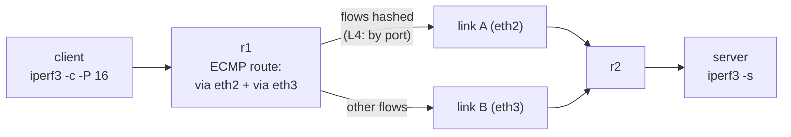

# Lab #32: ECMP — Two Equal Paths, and the Kernel Hashes Flows

Expected time: 40 to 55 minutes  
日本語: 想定時間 40〜55分

Reading guide: [`../rfc-notes/ecmp.md`](../rfc-notes/ecmp.md)

Prerequisite: [Lab 31: Anycast — One Address, Many Servers, Routing Decides](anycast-31-bgp.md)

## Goal

Anycast (Lab 31) had routing pick **one** best path out of many. **ECMP** (equal-cost multipath) does the opposite: when several paths tie, routing keeps **all** of them and spreads traffic across them — hashing each *flow* onto one link.

Two routers are joined by **two parallel links**. r1 learns the server subnet over both eBGP sessions and, with `maximum-paths 2`, installs a **two-next-hop route**. When the client opens many TCP flows to the server:

- with **L4 hashing** (`fib_multipath_hash_policy=1`), the flows split ~evenly across both links,
- with the default **L3 hashing** (`=0`), every flow shares the same src/dst IP and so hashes to the **same** link — the other sits idle (the classic ECMP gotcha).

日本語: Anycast(Lab 31)は多数から **1本** の best を選びました。**ECMP**(equal-cost multipath)は逆で、複数経路が同点なら routing は **全部** 保持し、トラフィックを分散します——各 *フロー* を hash で1リンクに載せて。2台のルータを **2本の並行リンク**でつなぎ、r1 は両 eBGP セッションでサーバ subnet を学び、`maximum-paths 2` で **2 next-hop の経路**を入れます。クライアントが多数の TCP flow を開くと、**L4 hashing**(`fib_multipath_hash_policy=1`)では flow が両リンクにほぼ均等に分かれ、既定の **L3 hashing**(`=0`)では全 flow が同じ src/dst IP なので **同じ**リンクに集中し、もう1本は遊ぶ(ECMP の典型的な落とし穴)。

By the end, you should be able to explain this:

| hash policy | what's hashed | 16 flows, same client→server |
|---|---|---|
| `0` (L3, default) | src/dst IP | all on one link (other ~0) |
| `1` (L4) | IP + ports | ~half on each link |

## What You Will Learn

理解したいこと:

- What **ECMP** is and how `maximum-paths` puts several equal paths in the FIB.
- Why routers hash **per flow** (5-tuple), not per packet (reordering).
- How Linux's **`fib_multipath_hash_policy`** decides L3 vs L4 hashing.
- The gotcha: same src/dst IP + L3 hashing → one link does all the work.
- How ECMP differs from anycast (Lab 31): keep many paths vs pick one.

This lab does not cover:

- Weighted / unequal-cost multipath (UCMP).
- LAG / bonding (L2 link aggregation) — similar hashing, different layer.
- Per-packet spraying and flowlet switching.

日本語: ECMP とは何か、`maximum-paths` が複数の equal path を FIB に入れる仕組み、なぜ per-flow(5-tuple)hash か(reordering 回避)、Linux の `fib_multipath_hash_policy`(L3 vs L4)、同一 IP ペア + L3 hashing の落とし穴、anycast(Lab 31)との違い(複数保持 vs 1本選択)を学びます。UCMP、LAG/bonding、per-packet spraying は扱いません。

## RFCで読む場所

| 資料 | 読むポイント |
|---|---|
| RFC 2992 | per-flow(hash-threshold)方式 |
| RFC 4271 §9.1 + `maximum-paths` | 複数 equal-cost path が RIB に載る条件 |
| RFC 7424 | 実トラフィックの偏り(flow entropy) |
| RFC 5737 / RFC 1918 | Lab のアドレスがローカル用であること |

## 実験の全体像

client の後ろに r1、r2 の後ろに server。r1↔r2 は **2本の並行リンク**で eBGP。

```text
 client            r1 (AS 65001)      link A: 10.0.12.0/30      r2 (AS 65002)         server
 10.0.9.2 -- eth1 --+-- eth2 =========================== eth1 --+-- eth3 -- 10.0.8.2
                    +-- eth3 =========================== eth2 --+
                            link B: 10.0.13.0/30
```

r1 は 10.0.8.0/24 を両リンク経由で学び、`maximum-paths 2` で 2 next-hop の ECMP 経路を FIB に入れる。多数の flow が両リンクに hash される。



`10.0.0.0/8` はローカル閉域。

## 必要なもの

推奨環境:

- Linux / WSL2 / Linux VM
- Docker
- containerlab

使用イメージ:

- `frrouting/frr:latest`（r1・r2 の BGP multipath）
- `nicolaka/netshoot:latest`（client・server。`iperf3`）

追加イメージは不要。

## 実行手順

```bash
./scripts/labctl.sh run ecmp-32
```

### 1. 作業ディレクトリへ移動する

```bash
cd protocol-lab/examples/ecmp-32
```

### 2. 起動する

```bash
sudo containerlab deploy -t ecmp-32.clab.yml
```

r1/r2 は `maximum-paths 2`、`fib_multipath_hash_policy=1`(L4)で起動する。

### 3. ECMP 経路を確認する

```bash
docker exec clab-ecmp-32-r1 ip route show 10.0.8.0/24
```

2つの `nexthop`(via 10.0.12.2 / via 10.0.13.2)が見える。

### 4. 多数の flow を流し、両リンクの使用量を見る

```bash
docker exec -d clab-ecmp-32-server iperf3 -s
# before
docker exec clab-ecmp-32-r1 cat /sys/class/net/eth2/statistics/tx_bytes
docker exec clab-ecmp-32-r1 cat /sys/class/net/eth3/statistics/tx_bytes
# 16 parallel flows
docker exec clab-ecmp-32-client iperf3 -c 10.0.8.2 -P 16 -t 6
# after — both counters moved
docker exec clab-ecmp-32-r1 cat /sys/class/net/eth2/statistics/tx_bytes
docker exec clab-ecmp-32-r1 cat /sys/class/net/eth3/statistics/tx_bytes
```

両リンクの tx_bytes がほぼ半々に増える。

### 5. 落とし穴を見る: L3 hashing に戻す

```bash
docker exec clab-ecmp-32-r1 sysctl -w net.ipv4.fib_multipath_hash_policy=0
docker exec clab-ecmp-32-client iperf3 -c 10.0.8.2 -P 16 -t 5
# 片方のリンクだけが増える(全 flow が同じ src/dst IP → 同じ hash)
docker exec clab-ecmp-32-r1 sysctl -w net.ipv4.fib_multipath_hash_policy=1   # 戻す
```

## 期待出力

- `ip route show 10.0.8.0/24`: 2つの nexthop。
- policy=1: 16 flow で eth2/eth3 の tx_bytes がほぼ半々(この環境で約 131 GB / 133 GB)。
- policy=0: ほぼ片方に集中(一方が全体、他方はほぼ 0)。

## なぜそう動くのか

**ECMP**(equal-cost multipath)は「同じ良さの経路が複数あるとき、全部使う」。

- **複数経路の由来**: BGP は既定で prefix ごとに best を1つだけ入れる(Lab 31)。`maximum-paths 2` を付けると、**同点**の経路を2本まで FIB に入れる。ここでは r1–r2 が2本の並行リンクで eBGP を張り、両方が同じ prefix を同じ AS_PATH 長で広告するので同点 → 2 next-hop の ECMP。
- **per-flow hashing**: ルータはパケットを交互に振らない(同一接続が別経路を通ると遅延差で **並べ替え** が起き、TCP が loss と誤認しかねない)。代わりに各パケットの **5-tuple**(src/dst IP・protocol・src/dst port)を hash し、同じ flow は常に同じ next-hop に固定する。別々の flow は別々に散る。
- **hash に何を入れるか**: Linux の `fib_multipath_hash_policy` が決める。`0`=L3(IP のみ)、`1`=L4(IP+ポート)。この Lab は1台のクライアント→1台のサーバなので、全 flow の src/dst IP が同じ。L3 hashing だと全 flow が同じ hash になり **1リンクに集中**する。ポートを入れる L4 hashing にすると、送信ポートの違う各 flow が別々に散り、両リンクが使われる。
- **均等さ**: flow が多いほど統計的に均等へ近づく。少数だと偏る(この Lab で 16 flow だとほぼ半々)。1本の flow は1リンク止まりで、ECMP が増やすのは **多数 flow の総和**。

要点は、**routing が複数の equal path を保持し、kernel が flow ごとに hash して1本に割り当てる**こと。anycast(1本に絞る)の双対で、同じ BGP 経路選択の別の面。

## 詰まりやすい点

- **ECMP はパケットを交互に振る、と思う**。実際は flow 単位の hash(reordering 回避)。
- **同一 IP ペアなのに両リンク使われると思う**。L3 hashing(既定)では1リンクに集中。**L4 hashing(policy=1)**が要る。これが最大の落とし穴。
- **常に均等と思う**。flow 数が少ないと偏る。均等は多数 flow の統計。
- **1接続が速くなると思う**。1 flow は1リンク止まり。ECMP は総スループットを増やす。
- **maximum-paths を忘れる**。無いと best が1本だけ入り ECMP にならない。
- **veth は非常に速い**。この Lab の絶対値(数百 Gbit/s)は環境依存。見るべきは2リンクの **比率**。

## 後片付け

```bash
sudo containerlab destroy -t ecmp-32.clab.yml --cleanup
```

`labctl.sh run ecmp-32` を使った場合は、スクリプトが最後に destroy する。

## 確認問題

1. ECMP とは何か。BGP はどうやって複数の equal-cost 経路を FIB に入れるか。
2. なぜルータは per-packet でなく per-flow で分散するのか。per-packet だと何が起きるか。
3. `fib_multipath_hash_policy` の 0 と 1 は何が違うか。
4. 1台のクライアント→1台のサーバで、L3 hashing だと片リンクに集中するのはなぜか。
5. ECMP と anycast(Lab 31)の違いを、経路数と目的の観点で述べよ。
6. 1本の TCP 接続のスループットは ECMP で上がるか。理由は。

## References

- [RFC 2992: Analysis of an Equal-Cost Multi-Path Algorithm](https://www.rfc-editor.org/rfc/rfc2992)
- [RFC 4271: A Border Gateway Protocol 4 (BGP-4)](https://www.rfc-editor.org/rfc/rfc4271)
- [RFC 7424: Mechanisms for Optimizing LAG/ECMP Component Link Utilization](https://www.rfc-editor.org/rfc/rfc7424)
- [RFC 5737: IPv4 Address Blocks Reserved for Documentation](https://www.rfc-editor.org/rfc/rfc5737)

## 検証済み実行ログ (2026-07-07)

このLabは実機で再現性を確認済みです。

実行環境:

- Ubuntu 26.04 LTS (kernel 7.0.0-27-generic, x86_64)
- Docker 29.1.3
- containerlab 0.77.0
- r1 / r2: `frrouting/frr:latest`（BGP multipath）
- client / server: `nicolaka/netshoot:latest`（iperf3）

`PATH="/tmp/pl-shim:$PATH" ./scripts/labctl.sh run ecmp-32` で deploy → verify → destroy を実行し、`verification.json` は `"status": "verified"` を返した。

### 2 next-hop の ECMP 経路

```text
10.0.8.0/24 nhid 25 proto bgp metric 20
	nexthop via 10.0.12.2 dev eth2 weight 1
	nexthop via 10.0.13.2 dev eth3 weight 1
```

`maximum-paths 2` により、r1 はサーバ subnet への2本の equal-cost 経路を next-hop group として FIB に入れた。

### L4 hashing で両リンクがほぼ半々

16 本の並行 TCP flow(`iperf3 -c 10.0.8.2 -P 16`)を流し、r1 の2つの egress リンクの tx_bytes を測定:

```text
policy: 1
eth2 (link A) tx delta: 131801067437 bytes   (49.6%)
eth3 (link B) tx delta: 133902251068 bytes   (50.4%)
total:                  265703318505 bytes
```

`fib_multipath_hash_policy=1`(L4、ポート込み)で、送信ポートの異なる各 flow が両リンクにほぼ均等に散った。

### 落とし穴: L3 hashing は1リンクに集中

同じ 16 flow を `fib_multipath_hash_policy=0`(L3、IP のみ)で流すと:

```text
L3 hashing (policy=0):
  eth2 delta: 151 bytes
  eth3 delta: 133854511558 bytes
```

全 flow が同じ src/dst IP(1クライアント→1サーバ)なので L3 hash が同一値になり、**ほぼ全部が片方のリンク**に載った(eth2 は 151 bytes = 実質ゼロ)。ECMP を効かせるには、hash にポートを含める L4 policy が要る——これが最も嵌まりやすい点。

### Cleanup

```bash
containerlab destroy -t ecmp-32.clab.yml --cleanup
```
