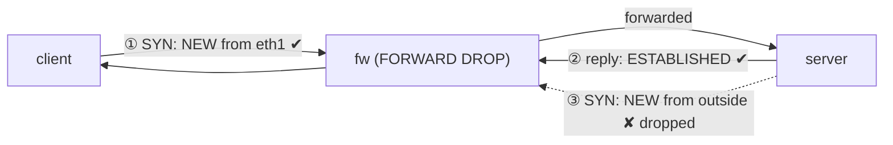

# Lab #36: Stateful Firewall — Decide by the Connection, Not the Packet

Expected time: 40 to 55 minutes  
日本語: 想定時間 40〜55分

Reading guide: [`../rfc-notes/stateful-firewall.md`](../rfc-notes/stateful-firewall.md)

Prerequisite: [Lab 20: NAT — Source Address Translation](nat-20-source-nat.md)

## Goal

NAT (Lab 20) used the kernel's connection tracker to translate addresses. This lab uses the *same* conntrack for the other classic job: a **stateful firewall**. Instead of judging each packet alone, the firewall remembers **flows** and lets a packet through if it belongs to an allowed conversation.

A firewall router sits between a client and a server with `FORWARD` policy **DROP**, allowing only:

- packets in an **ESTABLISHED** or **RELATED** flow, and
- **NEW** connections that arrive **from the client side**.

So:

- **client → server** works: the SYN is NEW-from-inside (allowed), and the server's reply is ESTABLISHED (allowed),
- **server → client** is **blocked**: the server's SYN is an unsolicited NEW-from-outside — no rule allows it, so the default DROP applies.

Both directions carry server→client packets; what differs is the **conntrack state**.

日本語: NAT(Lab 20)はカーネルの connection tracker をアドレス変換に使いました。この Lab は *同じ* conntrack をもう1つの定番、**ステートフルファイアウォール** に使います。各パケットを単独で判定せず、**flow** を覚えて、許可済み会話に属するパケットだけ通す。fw ルータが client と server の間にあり、`FORWARD` を **DROP** 既定にして、(1) **ESTABLISHED/RELATED** の flow と、(2) **client 側から** 来る **NEW** 接続だけ許可します。よって **client → server** は成立(SYN は内側発 NEW で許可、server の応答は ESTABLISHED で許可)、**server → client** は **遮断**(server の SYN は外側発の勝手な NEW で default DROP)。どちらも server→client 向きのパケットは流れる——違いは **conntrack の状態**。

By the end, you should be able to explain this:

| direction | first packet's state | result |
|---|---|---|
| client → server | NEW from inside (eth1) | allowed; reply is ESTABLISHED |
| server → client | NEW from outside | dropped (default DROP) |

## What You Will Learn

理解したいこと:

- The difference between a **stateless** filter and a **stateful** firewall.
- What **conntrack** records (both directions of a flow in one entry).
- What **ctstate** NEW / ESTABLISHED / RELATED / INVALID mean and how a policy matches them.
- The **default-drop + allow-established + allow-new-from-inside** idiom.
- Why the reply to an allowed connection needs no rule of its own.

This lab does not cover:

- L7 / application-aware firewalling (deep packet inspection).
- nftables syntax (the newer front-end to the same engine).
- NAT/port-forwarding (Lab 20) or full zone-based policy.

日本語: stateless と stateful の違い、conntrack が記録するもの(flow の双方向を1エントリ)、ctstate(NEW/ESTABLISHED/RELATED/INVALID)とポリシーの照合、default-drop + established 許可 + 内側発 NEW 許可 の定石、許可接続の戻りに個別規則が要らない理由を学びます。L7 firewall、nftables 構文、NAT/ポートフォワード(Lab 20)、zone ベースは扱いません。

## RFCで読む場所

| 資料 | 読むポイント |
|---|---|
| RFC 2979 | firewall の要件、default-deny |
| RFC 9293 §3.3 | TCP 状態機械(conntrack が写す) |
| RFC 7857 | conntrack のタイムアウト/状態 |
| RFC 5737 / RFC 1918 | Lab のアドレスがローカル用であること |

## 実験の全体像

client と server の間に fw(ルータ)。fw が FORWARD を DROP 既定にし、state で許可する。

```text
 client (10.0.9.2) --- eth1 [ fw ] eth2 --- server (10.0.8.2)
                            FORWARD policy DROP
                            + ESTABLISHED,RELATED  ACCEPT
                            + (in eth1) NEW         ACCEPT
```

両ホストは HTTP responder を持ち、双方向に到達性を試す。



`10.0.0.0/8` はローカル閉域。

## 必要なもの

推奨環境:

- Linux / WSL2 / Linux VM
- Docker
- containerlab

使用イメージ:

- `nicolaka/netshoot:latest`（`iptables`、`conntrack`、`curl`、`python3` 同梱）

追加イメージは不要。

## 実行手順

```bash
./scripts/labctl.sh run fw-36
```

### 1. 作業ディレクトリへ移動する

```bash
cd protocol-lab/examples/fw-36
```

### 2. 起動する

```bash
sudo containerlab deploy -t fw-36.clab.yml
```

### 3. ステートフルなポリシーを入れる

```bash
docker exec clab-fw-36-fw sh -c '
  iptables -P FORWARD DROP
  iptables -A FORWARD -m conntrack --ctstate ESTABLISHED,RELATED -j ACCEPT
  iptables -A FORWARD -i eth1 -m conntrack --ctstate NEW -j ACCEPT
'
docker exec clab-fw-36-fw iptables -L FORWARD -n -v
```

### 4. responder を立てて双方向を試す

```bash
docker exec -d clab-fw-36-client python3 /responder.py client
docker exec -d clab-fw-36-server python3 /responder.py server

# client -> server（内側発。通る）
docker exec clab-fw-36-client curl -s --max-time 4 http://10.0.8.2/

# server -> client（外側発の新規。落ちる）
docker exec clab-fw-36-server curl -s --max-time 4 http://10.0.9.2/ || echo "blocked"
```

### 5. conntrack のエントリを見る

```bash
docker exec clab-fw-36-fw conntrack -L | grep 10.0.9.2
```

行き(client→server)と戻り(server→client)が **1エントリ**に両方記録されている。

## 期待出力

- `iptables -L FORWARD`: `policy DROP`、ESTABLISHED,RELATED 許可、eth1 の NEW 許可。
- client → server: `server`(到達)。
- server → client: `blocked`(遮断)。
- conntrack: `src=10.0.9.2 dst=10.0.8.2 ... src=10.0.8.2 dst=10.0.9.2 ... [ASSURED]`(双方向1エントリ)。

## なぜそう動くのか

**ステートフルファイアウォール**は「パケット単体でなく接続で判断する」。

- **stateless vs stateful**: stateless は各パケットを単独で判定するので、戻りを通すには「戻り用の穴」を明示的に開ける必要があり広くなりがち。stateful は **flow を追跡** し、戻りを「既存会話の一部」として自動で通す。だから inbound の穴を開けずに、outbound とその応答だけ許せる。
- **conntrack**: box を通る各 flow を **双方向で1エントリ**として記録する。行き(client→server)を見た瞬間、戻り(server→client)も導かれる。だから応答は即 ESTABLISHED と分かる。
- **ctstate で判定**: ポリシーは各パケットの状態で判断する。**NEW**(会話の最初=SYN)、**ESTABLISHED**(既存 flow)、**RELATED**(関連 flow: ICMP エラーや FTP データ)、**INVALID**。
- **なぜ client は通り server は通らないか**:
  - client→server の SYN は内側(eth1)からの **NEW** → 許可。server の応答は **ESTABLISHED** → 許可。会話成立。
  - server→client の SYN は外側からの **NEW**。内側限定の NEW 規則にも、ESTABLISHED 規則にも当てはまらず、**default DROP**。
  - 肝心なのは、どちらでも「server→client 向き」のパケットは存在するのに、**conntrack の状態**(応答=ESTABLISHED か、勝手な新規=NEW か)で結果が分かれること。向きではなく状態が決める。
- **default-deny**: 既定を DROP にして必要な物だけ開ける(RFC 2979 の deny-by-default)。許可接続の戻りは state が通すので、それ用の規則は要らない。

要点は、**flow を追跡して「許可済み会話の続き」を自動で通し、勝手な新規だけを default-drop で遮断する**こと。NAT(Lab 20)と同じ conntrack の、別の使い方。

## 詰まりやすい点

- **戻り用の穴を開けようとする**。stateful では不要。戻りは state で自動許可。開けると逆に危険。
- **向きで許可が決まると思う**。決めるのは **conntrack の状態**。同じ向きでも ESTABLISHED は通り NEW は落ちる。
- **default ACCEPT にして個別に塞ぐ**。逆。**default DROP** にして必要分だけ開ける。
- **RELATED を忘れる**。ICMP エラー(PMTUD の frag-needed 等)や FTP データは RELATED。落とすと不具合が出る。
- **conntrack モジュール**。`--ctstate` は nf_conntrack が要る(netshoot では利用可)。
- **NAT と混同する**。基盤は同じ conntrack だが、NAT は変換、firewall は許可判定。

## 後片付け

```bash
sudo containerlab destroy -t fw-36.clab.yml --cleanup
```

`labctl.sh run fw-36` を使った場合は、スクリプトが最後に destroy する。

## 確認問題

1. stateless フィルタと stateful firewall の違いは何か。
2. conntrack は1つの flow をどう記録するか(行き/戻り)。
3. ctstate の NEW / ESTABLISHED / RELATED はそれぞれ何か。
4. client→server が通り server→client が落ちるのはなぜか。向きではなく何が効くか。
5. 許可した接続の戻りに、なぜ個別の許可規則が要らないのか。
6. default を DROP にする(deny-by-default)のはなぜ安全か。

## References

- [RFC 2979: Behavior of and Requirements for Internet Firewalls](https://www.rfc-editor.org/rfc/rfc2979)
- [RFC 9293: Transmission Control Protocol](https://www.rfc-editor.org/rfc/rfc9293)
- [RFC 7857: Updates to Network Address Translation (NAT) Behavioral Requirements](https://www.rfc-editor.org/rfc/rfc7857)
- [RFC 5737: IPv4 Address Blocks Reserved for Documentation](https://www.rfc-editor.org/rfc/rfc5737)

## 検証済み実行ログ (2026-07-07)

このLabは実機で再現性を確認済みです。

実行環境:

- Ubuntu 26.04 LTS (kernel 7.0.0-27-generic, x86_64)
- Docker 29.1.3
- containerlab 0.77.0
- client / fw / server: `nicolaka/netshoot:latest`（iptables、conntrack、curl、python3）

`PATH="/tmp/pl-shim:$PATH" ./scripts/labctl.sh run fw-36` で deploy → verify → destroy を実行し、`verification.json` は `"status": "verified"` を返した。

### ステートフルなポリシー（default-drop + state 許可）

```text
Chain FORWARD (policy DROP 0 packets, 0 bytes)
1  ACCEPT  all  --  *     *   ctstate RELATED,ESTABLISHED
2  ACCEPT  all  --  eth1  *   ctstate NEW
```

FORWARD は既定 DROP。ESTABLISHED/RELATED と、内側(eth1)からの NEW のみ許可。

### 内側発は通り、外側発の新規は落ちる

```text
client_to_server: ok
server_to_client: blocked
```

- **client → server**: SYN が内側発の NEW(規則2で許可)、応答が ESTABLISHED(規則1で許可)→ 到達(`server` を取得)。
- **server → client**: server の SYN は外側発の勝手な NEW。内側限定の NEW 規則にも ESTABLISHED にも当てはまらず default DROP → 遮断。

### conntrack が双方向を1エントリで追跡

```text
tcp 6 119 TIME_WAIT src=10.0.9.2 dst=10.0.8.2 sport=38018 dport=80
                     src=10.0.8.2 dst=10.0.9.2 sport=80    dport=38018 [ASSURED]
```

許可した client→server の flow が、行き(1行目)と戻り(2行目)を **1エントリ**で記録されている。だから server→client 向きの **応答** は ESTABLISHED として自動で通り、一方 server が始める **新規** の server→client は同じ向きでも NEW なので落ちる——向きではなく **状態** が結果を決めている。

### Cleanup

```bash
containerlab destroy -t fw-36.clab.yml --cleanup
```
