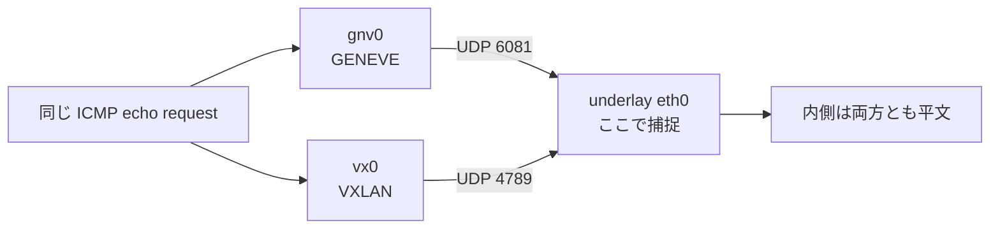

# Lab #45: GENEVE — The Encapsulation That Admits It Will Need More Fields

Expected time: 30 to 45 minutes  
日本語: 想定時間 30〜45分

Reading guide: [`../rfc-notes/geneve-encapsulation.md`](../rfc-notes/geneve-encapsulation.md)

Prerequisite: [Lab 18: VXLAN — an Overlay You Can Read on the Wire](vxlan-18-l2-overlay.md)

## Goal

Lab 18 built a VXLAN overlay and read the inner frame off the underlay. GENEVE (RFC 8926) does the same job — outer UDP, a 24-bit VNI, an Ethernet frame inside — so the interesting question is not *what it does* but *why it exists*.

This lab answers that by running both at once. One underlay, two hosts, and each host gets **both** a GENEVE and a VXLAN interface carrying **the same VNI**. Every difference in the captures is therefore a difference between the two encapsulations and nothing else. The answer turns out to be two fields, four bytes, and one admission: that a tunnel should say what it carries, and that today's header will not be enough forever.

日本語: Lab 18 は VXLAN の overlay を作り、内側フレームを underlay 上で読みました。GENEVE(RFC 8926)は同じ仕事——外側 UDP、24bit の VNI、内側に Ethernet フレーム——をします。だから面白い問いは「何をするか」ではなく「なぜ存在するか」です。この Lab は両方を同時に走らせて答えます。1つの underlay に2ホスト、各ホストに **GENEVE と VXLAN の両方** のインターフェースを **同じ VNI** で作る。したがって捕捉結果の差は、すべて2つのカプセル化の差です。答えは2つのフィールド、4バイト、そして1つの認め——「トンネルは自分が何を運んでいるか言うべきだ」「今日のヘッダはいつまでも足りはしない」。

By the end, you should be able to explain this:

| | GENEVE | VXLAN |
|---|---|---|
| outer UDP port | 6081 | 4789 |
| base header | 8 bytes | 8 bytes |
| says what it carries | yes — `Protocol Type 0x6558` | no field for it |
| extensible | yes — `Opt Len` + TLVs | no |
| inner frame on the underlay | in the clear | in the clear |
| MTU in this lab | 1450 | 1500 ← trap |

## What You Will Learn

理解したいこと:

- The GENEVE header field by field, read from raw bytes rather than a diagram.
- Which two fields VXLAN does not have, and what each one buys.
- Why `Opt Len` matters more than any single option does.
- That the outer UDP source port is a hash of the inner flow, and what that is for.
- That encapsulation overhead may or may not be reflected in the tunnel's MTU.

This lab does not cover: GENEVE options in flight (populating TLVs needs a control plane such as OVN or NSX; here `Opt Len` reads 0), the OAM and critical bits, IPv6 underlays, multicast VNI learning, or EVPN.

日本語: 実際に TLV を載せた通信(オプションの投入には OVN/NSX のようなコントロールプレーンが要ります。この Lab では `Opt Len` は 0)、OAM/critical ビット、IPv6 underlay、multicast による VNI 学習、EVPN は扱いません。

## RFCで読む場所

| 資料 | 読むポイント |
|---|---|
| RFC 8926 §3 | GENEVE ヘッダの各フィールド |
| RFC 8926 §3.5 | 可変長オプション(TLV)の考え方 |
| RFC 7348 §5 | VXLAN ヘッダ(対比用) |
| ip-link(8) | `type geneve` / `type vxlan` |
| RFC 1918 | Lab のアドレスが private 用であること |

## 実験の全体像

```text
                    underlay 10.30.0.0/24
        h1 (10.30.0.1) ------[ br-u ]------ h2 (10.30.0.2)
          |                                        |
          +-- gnv0 192.168.100.1  (GENEVE vni 100, UDP 6081)
          +-- vx0  192.168.200.1  (VXLAN  vni 100, UDP 4789)

  同じ underlay、同じ VNI、違うのはカプセル化だけ
```



## 必要なもの

推奨環境:

- Linux / WSL2 / Linux VM(`geneve` と `vxlan` カーネルモジュール)
- Docker

containerlab は不要です(Lab 43・44 と同じく特権コンテナ1つ)。

使用イメージ:

- `protocol-lab/geneve-lab:alpine3.21`（run.sh が Dockerfile からビルド）

## 実行手順

```bash
./scripts/labctl.sh run geneve-45
```

### 1. 作業ディレクトリへ移動する

```bash
cd protocol-lab/examples/geneve-45
```

### 2. イメージをビルドして実行する

```bash
docker build -t protocol-lab/geneve-lab:alpine3.21 .
docker run --rm --privileged protocol-lab/geneve-lab:alpine3.21
```

### 3. 生バイトで読む

```bash
ip netns exec h1 tcpdump -i eth0 -nn -x udp port 6081
```

外側 IP が20バイト、UDP が8バイトなので、**カプセル化ヘッダは offset `0x1c` から**始まります。デコード結果ではなく生バイトを見るのがこの Lab の要点です。

## 期待出力

- step 3: `gnv0` の MTU が 1450、`vx0` が 1500。
- step 4: GENEVE は UDP 6081、VXLAN は UDP 4789。どちらも内側 ICMP/ARP が読める。
- step 5: `0x1c` から GENEVE は `0000 6558 0000 6400`、VXLAN は `0800 0000 ...`。
- step 6: 3つの異なる内側フローが、3つの異なる外側 source port になる。

## なぜそう動くのか

**GENEVE は VXLAN と同じ形をしていて、2箇所だけ違います。** その2箇所が存在理由です。

- **8バイトの使い道が違う**: 両者ともヘッダは最小8バイト。VXLAN はそのうち4バイトを **予約のゼロ** に使っています。GENEVE は同じ場所を `Ver`/`Opt Len` と16bitの `Protocol Type` に使いました。
- **`Protocol Type` = 何を運んでいるか言える**: GENEVE は `0x6558`(Transparent Ethernet Bridging)と書きます。VXLAN には**そう書くフィールドが無く**、Ethernet を暗黙に、それだけ運びます。だから VXLAN で IP を直接運びたければ、別の仕様を作るしかありません。
- **`Opt Len` = 将来を認めた設計**: ヘッダとペイロードの間に入る TLV オプションを4バイト単位で数えるフィールドです。**この Lab では 0 です**(オプションを載せるにはコントロールプレーンが要る)。しかし値が 0 でもフィールドがあること自体が要点で、新しい機能は「新しいオプションクラス」として足せます。VXLAN で同じことをするには、新しい UDP ポートの新しいプロトコルが要りました——VXLAN-GPE、STT、NVGRE と乱立したのがまさにそれで、GENEVE はその収束案です。
- **どちらも暗号化しない**: 内側の ICMP も ARP も underlay 上でそのまま読めます。Lab 18(VXLAN)・Lab 21(GRE)と同じ結論で、GENEVE でも変わりません。**カプセル化と暗号化は別の軸**です(暗号化が要るなら Lab 16 の WireGuard)。
- **外側 source port はフローのハッシュ**: step 6 で、3つの異なる内側フローが3つの異なる外側 source port になりました。カプセル化する側が **内側フローをハッシュして外側の source port に入れている** からです。これにより ECMP(Lab 32)が中身を解析せずにトンネルを複数経路へ分散できます。逆に言えば、**1本のトンネルの中の1フローは常に同じ経路を通る**(順序が乱れない代わりに、単一フローは1経路分の帯域しか使えない)。
- **MTU の非対称が実運用の罠**: `gnv0` は 1450、`vx0` は 1500 でした。カプセル化には約50バイトかかるのに、**この作り方の VXLAN デバイスは 1500 のまま**です。上位が 1500 バイトを送ると、外側では 1550 バイトになり、underlay の MTU を超えて断片化するか、DF が立っていれば黙って落ちます。Lab 25(PMTUD)と Lab 37(MSS clamping)がまさにこの問題への対処でした。

要点は、**GENEVE の新しさは機能ではなく「拡張の余地」**だということです。同じ仕事をする8バイトのうち4バイトを、ゼロで埋めるか、将来のために取っておくか——その判断の差だけです。

## 詰まりやすい点

- **`tcpdump ... udp port 6081 and icmp` が何も捕まえない**。フィルタは **外側** ヘッダに効きます。外側は UDP なので `and icmp` は永遠に一致しません。`udp port 6081` だけにする。
- **`Opt Len` が 0 なのを「TLV が無い」と読む**。この Lab に制御プレーンが無いだけです。フィールドは存在します。
- **GENEVE を「暗号化されたトンネル」と思う**。していません。内側は平文です。
- **VXLAN の MTU 1500 を放置する**。断片化か blackhole になります。`ip link add ... type vxlan dev <underlay>` のように underlay デバイスを指定するか、MTU を明示する。
- **外側 source port を固定値だと思う**。フローごとに変わります。ファイアウォールで外側 source port を絞ると壊れます。
- **VNI が同じなら混ざると思う**。この Lab は GENEVE と VXLAN が同じ VNI 100 ですが、UDP ポートが違い、別デバイスなので混ざりません。
- **`nc -u` の挙動差**。step 6 の probe は環境の busybox/openbsd nc で挙動が違うことがあります。判定は「異なる source port が2つ以上」なので多少の差は吸収されます。

## 後片付け

```bash
docker rm -f protocol-lab-geneve-45
```

`labctl.sh run geneve-45` を使った場合は、スクリプトが最後に削除します。

## 確認問題

1. GENEVE ヘッダにあって VXLAN ヘッダに無いフィールドを2つ挙げ、それぞれ何ができるようになるか述べよ。
2. `Protocol Type` に `0x6558` が入っているとき、何を運んでいるか。
3. `Opt Len` が 0 でも、このフィールドがあることに意味があるのはなぜか。
4. GENEVE と VXLAN のどちらが内側を暗号化するか。
5. 外側 UDP の source port が内側フローごとに変わるのはなぜか。それは何を可能にするか。
6. この Lab で `gnv0` が 1450、`vx0` が 1500 だった。後者を放置すると何が起きるか。
7. なぜ VXLAN の拡張ではなく新しいプロトコルが作られたのか。

## References

- [RFC 8926: Geneve — Generic Network Virtualization Encapsulation](https://www.rfc-editor.org/rfc/rfc8926)
- [RFC 7348: VXLAN](https://www.rfc-editor.org/rfc/rfc7348)
- [ip-link(8)](https://man7.org/linux/man-pages/man8/ip-link.8.html)
- [RFC 1918: Address Allocation for Private Internets](https://www.rfc-editor.org/rfc/rfc1918)

## 検証済み実行ログ (2026-08-06)

このLabは実機で再現性を確認済みです。

実行環境:

- Ubuntu 26.04 LTS (kernel 7.0.0-28-generic, x86_64)
- Docker 29.1.3
- lab container: `protocol-lab/geneve-lab:alpine3.21`（Alpine 3.21 + iproute2 6.11.0）

`./scripts/labctl.sh run geneve-45` で build → deploy → verify → destroy を実行し、`verification.json` は `"status": "verified"` を返した。

### カーネルが2つのトンネルを別のサイズにした

```text
mtu eth0 = 1500
mtu gnv0 = 1450
mtu vx0 = 1500
```

GENEVE は自分のオーバーヘッド分を引いた。VXLAN(明示的 remote・underlay デバイス未指定)は 1500 のまま。

### 同じ ICMP が2通りに包まれる

```text
-- GENEVE (UDP 6081) --
00:26:27.143000 IP 10.30.0.1.24457 > 10.30.0.2.6081: Geneve, Flags [none], vni 0x64: IP 192.168.100.1 > 192.168.100.2: ICMP echo request, id 67, seq 1, length 64

-- VXLAN (UDP 4789) --
00:26:31.645508 IP 10.30.0.1.55829 > 10.30.0.2.4789: VXLAN, flags [I] (0x08), vni 100
IP 192.168.200.1 > 192.168.200.2: ICMP echo request, id 74, seq 1, length 64
```

`vni 0x64` = `vni 100`。どちらも内側の IP と ICMP がそのまま読めている。

### 生バイトで並べる

```text
-- GENEVE header bytes --
	0x0000:  4500 0086 9ce2 0000 4011 c946 0a1e 0001
	0x0010:  0a1e 0002 5f89 17c1 0072 0000 0000 6558
	0x0020:  0000 6400 22cf 3755 352d 7e0e 9931 ed81

-- VXLAN header bytes --
	0x0000:  4500 0086 a07e 0000 4011 c5aa 0a1e 0001
	0x0010:  0a1e 0002 da15 12b5 0072 14c2 0800 0000
```

外側 IP(20バイト)+ UDP(8バイト)なので、カプセル化ヘッダは **`0x1c`** から:

| offset | GENEVE | VXLAN |
|---|---|---|
| 0x1c | `00` = Ver 0 / **Opt Len 0** | `08` = flags(I bit) |
| 0x1d | `00` = flags (O, C) | `00` 予約 |
| 0x1e–0x1f | **`6558`** = Protocol Type (Ethernet) | `0000` 予約 |
| 0x20–0x22 | `0000 64` = VNI 100 | (次の行、tcpdump のデコードは `vni 100`) |

GENEVE が `Protocol Type` と `Opt Len` に使っている4バイトを、VXLAN は予約のゼロに使っている。**これがこの Lab の結論です。**

なお `0x1a–0x1b` の外側 UDP checksum は GENEVE 側が `0000`(無効)、VXLAN 側が `14c2`(計算済み)でした。これはカプセル化の仕様差ではなく、それぞれのデバイス既定値の差です。

### 内側フローごとに外側 source port が変わる

```text
outer source ports seen for three different inner flows:
45739
56849
60141
distinct outer source ports: 3 (expect 2 or more)
```

3つの内側フローが3つの外側 source port に散った。ECMP がトンネルの中身を見ずに分散できるのはこのため。

### Cleanup

```bash
docker rm -f protocol-lab-geneve-45
```
