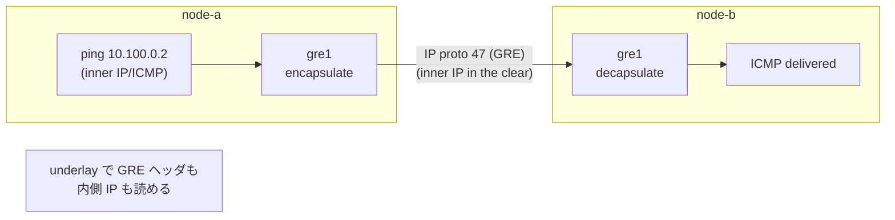

# Lab #21: GRE — an Unencrypted Layer-3 Tunnel

Expected time: 40 to 55 minutes  
日本語: 想定時間 40〜55分

Reading guide: [`../rfc-notes/gre-tunnel.md`](../rfc-notes/gre-tunnel.md)

Prerequisites: [Lab 16: WireGuard](wg-16-wireguard-tunnel.md), [Lab 18: VXLAN](vxlan-18-l2-overlay.md)

## Goal

This lab completes a small trilogy of tunnels. **GRE** (Generic Routing Encapsulation) wraps an IP packet in a GRE header inside an outer IP packet — a **Layer-3** tunnel — and, like VXLAN, does **not** encrypt. Lining the three up shows that *encapsulation* and *encryption* and *which layer you carry* are independent choices:

| Lab | Carries | Encrypted? | On the wire |
|---|---|---|---|
| 16 WireGuard | IP (L3) | **yes** | UDP 51820, ciphertext |
| 18 VXLAN | Ethernet (L2) | no | UDP 4789, inner frame visible |
| **21 GRE** | **IP (L3)** | **no** | **IP proto 47, inner IP visible** |

You will build a point-to-point GRE tunnel, ping across the overlay, and capture the underlay to see `GRE (47)` with the inner ICMP in the clear.

日本語: この Lab はトンネル三部作を完成させます。**GRE**(Generic Routing Encapsulation)は IP パケットを GRE ヘッダで包み、外側 IP パケットに入れて運ぶ **L3** トンネルで、VXLAN と同様に **暗号化しません**。3つを並べると、「カプセル化」「暗号化」「どの層を運ぶか」が独立した選択だと分かります。point-to-point の GRE トンネルを張り、overlay 越しに ping し、underlay を capture して `GRE (47)` と内側 ICMP が平文で見えることを確認します。

## What You Will Learn

理解したいこと:

- What GRE is: a generic Layer-3 tunnel, carried directly in IP as **protocol 47** (not UDP/TCP).
- That GRE encapsulates but does not encrypt (like VXLAN, unlike WireGuard).
- The overlay vs underlay distinction again, now for an L3 tunnel.
- How GRE differs from VXLAN (L3 vs L2) and from WireGuard (plaintext vs encrypted).
- Why GRE is often paired with IPsec when confidentiality is needed.

This lab does not cover:

- GRE keys, sequence numbers, or checksums (optional GRE header fields).
- Routing protocols over GRE (a common real use — e.g. GRE + OSPF).
- IPsec-protected GRE (GRE over IPsec).

日本語: GRE(IP プロトコル 47 として IP に直接載る汎用 L3 トンネル)、GRE は包むが暗号化しないこと(VXLAN と同じ、WireGuard と違う)、overlay と underlay の区別(今回は L3 トンネル)、VXLAN(L2)や WireGuard(暗号)との違い、機密性が要るとき IPsec と組み合わせる理由を学びます。

## RFCで読む場所

| RFC | 章 | 読むポイント |
|---|---|---|
| RFC 2784 | 2 | GRE パケット構造(delivery header + GRE header + payload) |
| RFC 2784 | 2.3 | Protocol Type、IP プロトコル番号 47 |
| RFC 1701 | 1 | GRE の設計思想(汎用のカプセル化) |
| RFC 5737 | 3 | Lab で使うアドレスが documentation 用であること |

## 実験の全体像

2ノード。underlay(eth1, 10.0.0.0/24)の上に GRE トンネル(gre1, 10.100.0.0/24)を張る。

```text
             overlay:  10.100.0.1  <== gre1 (IP proto 47) ==>  10.100.0.2
                            |                                       |
node-a --------------- eth1 (underlay 10.0.0.0/24) --------------- node-b
       10.0.0.1                                              10.0.0.2
```

overlay `10.100.0.2` へ ping すると、GRE が内側 IP パケットを包んで underlay の相手へ IP proto 47 で送る。GRE は暗号化しないので、underlay を覗くと GRE ヘッダと内側 IP が両方見える。



`10.0.0.0/24` underlay、`10.100.0.0/24` overlay、いずれもローカル閉域。

## 必要なもの

推奨環境:

- Linux / WSL2 / Linux VM（**ホストに ip_gre カーネルモジュールが必要**。最近の Linux は標準。トンネル作成時に自動ロード)
- Docker
- containerlab

使用イメージ:

- `nicolaka/netshoot:latest`（`ip`、`tcpdump` 同梱）

追加イメージは不要。GRE の data path はホストカーネル。

## 実行手順

```bash
./scripts/labctl.sh run gre-21
```

### 1. 作業ディレクトリへ移動する

```bash
cd protocol-lab/examples/gre-21
```

### 2. 起動する

```bash
sudo containerlab deploy -t gre-21.clab.yml
```

### 3. GRE トンネルを張る

```bash
# gre1 という名前を使う（カーネルの既定 gre0 と衝突しないため）
docker exec clab-gre-21-node-a sh -c \
  "ip link add gre1 type gre local 10.0.0.1 remote 10.0.0.2; \
   ip addr add 10.100.0.1/24 dev gre1; ip link set gre1 up"
docker exec clab-gre-21-node-b sh -c \
  "ip link add gre1 type gre local 10.0.0.2 remote 10.0.0.1; \
   ip addr add 10.100.0.2/24 dev gre1; ip link set gre1 up"
```

### 4. overlay 越しに ping する

```bash
docker exec clab-gre-21-node-a ping -c3 10.100.0.2
docker exec clab-gre-21-node-a ip -d link show gre1
```

### 5. underlay を capture して中身が見えることを確認する

```bash
docker exec -d clab-gre-21-node-a tcpdump -i eth1 -n -w /tmp/gre.pcap "proto 47"
docker exec clab-gre-21-node-a ping -c3 10.100.0.2
docker exec clab-gre-21-node-a pkill -INT tcpdump
docker exec clab-gre-21-node-a tcpdump -n -vv -r /tmp/gre.pcap
```

`proto GRE (47)` の外側 IP に続いて、内側の `10.100.0.1 > 10.100.0.2: ICMP echo request` が **そのまま** 見える。

## 期待出力

- `ping 10.100.0.2` が成功。
- `ip -d link show gre1` に `gre remote 10.0.0.2 local 10.0.0.1`。
- underlay の capture: `proto GRE (47)` / `GREv0` と、その内側の `ICMP echo`(平文)。

## なぜそう動くのか

GRE(Generic Routing Encapsulation)は、その名の通り「汎用のカプセル化」。任意の L3 パケットを GRE ヘッダで包み、外側 IP で運ぶ。

- **IP に直接載る**: VXLAN や WireGuard が UDP を使うのに対し、GRE は **IP プロトコル番号 47** として IP のペイロードに直接入る(UDP/TCP を挟まない)。だから underlay の capture では transport ポートではなく "proto GRE" として見える。
- **L3 を運ぶ**: GRE が包むのは内側の IP パケット(このLabなら ICMP を載せた IP)。VXLAN が Ethernet フレーム(L2)を運ぶのと対照的。だから GRE の overlay に付けるのは IP アドレスで、L2 の広がりは持たない。
- **暗号化しない**: GRE の仕事はカプセル化だけ。暗号化はしない。だから underlay を capture すると、GRE ヘッダも内側 IP も平文で読める。機密性が要るなら **IPsec** と組み合わせる(GRE over IPsec)のが定番。
- **三部作の位置づけ**: WireGuard(L3・暗号)、VXLAN(L2・平文)、GRE(L3・平文)。「どの層を運ぶか」と「暗号化するか」は独立した2軸で、3つはその組み合わせの別の点にいる。GRE は「暗号化しない L3 トンネル」。

要点は、**カプセル化・暗号化・運ぶ層は別々の選択肢**で、GRE はそのうち「L3 を、暗号化せずに、IP proto 47 で包む」点にある、ということ。

## 詰まりやすい点

- **GRE を暗号トンネルと思う**。GRE は暗号化しない。中身は underlay で読める。IPsec と組み合わせて初めて秘匿。
- **UDP を使うと思う**。GRE は IP プロトコル 47。UDP/TCP ではない(capture のフィルタは `proto 47`)。
- **既定の gre0 と衝突**。カーネルは gre0 を予約するので、別名(gre1 など)を使う。
- **L2 と L3 を混同**。GRE は L3(IP を運ぶ)。VXLAN は L2(Ethernet を運ぶ)。
- **overlay と underlay のアドレス**。underlay=10.0.0.0/24、overlay=10.100.0.0/24。ping は overlay。
- **MTU**。GRE ヘッダのぶん overlay の実効 MTU は小さくなる(24 バイト程度)。

## 後片付け

```bash
sudo containerlab destroy -t gre-21.clab.yml --cleanup
```

`labctl.sh run gre-21` を使った場合は、スクリプトが最後に destroy する。

## 確認問題

1. GRE は何を何に包むか。どのプロトコル番号で IP に載るか。
2. GRE は暗号化するか。機密性が必要なとき何と組み合わせるか。
3. GRE(L3)と VXLAN(L2)は、運ぶ対象がどう違うか。
4. GRE と WireGuard は、underlay の capture でどう見え方が違うか。なぜか。
5. カプセル化・暗号化・運ぶ層の3つは、独立か従属か。3つのトンネルはどこに位置づくか。
6. なぜ `gre0` ではなく別名を使うのか。

## References

- [RFC 2784: Generic Routing Encapsulation (GRE)](https://www.rfc-editor.org/rfc/rfc2784)
- [RFC 1701: Generic Routing Encapsulation (GRE)](https://www.rfc-editor.org/rfc/rfc1701)
- [RFC 5737: IPv4 Address Blocks Reserved for Documentation](https://www.rfc-editor.org/rfc/rfc5737)
- [ip-link(8) manual page (gre)](https://man7.org/linux/man-pages/man8/ip-link.8.html)

## 検証済み実行ログ (2026-07-07)

このLabは実機で再現性を確認済みです。

実行環境:

- Ubuntu 26.04 LTS (kernel 7.0.0-27-generic, x86_64)。ip_gre カーネルモジュールはトンネル作成時に自動ロードされた。
- Docker 29.1.3
- containerlab 0.77.0
- node-a / node-b: `nicolaka/netshoot:latest`（tcpdump 同梱）

`PATH="/tmp/pl-shim:$PATH" ./scripts/labctl.sh run gre-21` で deploy → verify → destroy を実行し、`verification.json` は `"status": "verified"` を返した。

### overlay 越しの ping

```text
$ docker exec clab-gre-21-node-a ping -c3 10.100.0.2
3 packets transmitted, 3 received, 0% packet loss
```

### underlay に GRE ヘッダと内側 IP が両方見える

```text
$ docker exec clab-gre-21-node-a tcpdump -n -vv -r underlay.pcap
IP (tos 0x0, ttl 64, ... proto GRE (47), length 108)
    10.0.0.1 > 10.0.0.2: GREv0, Flags [none], length 88
    10.100.0.1 > 10.100.0.2: ICMP echo request, id ..., seq 1, length 64
```

外側は `proto GRE (47)` / `GREv0`(underlay)、その内側の `ICMP echo request`(overlay)が**平文でそのまま**見える。GRE はカプセル化はするが暗号化しない。

- WireGuard(Lab 16)= L3・暗号 → underlay は暗号文のみ
- VXLAN(Lab 18)= L2・平文 → 内側 Ethernet が見える
- GRE(このLab)= L3・平文 → 内側 IP が見える

「カプセル化」「暗号化」「運ぶ層」は独立した選択で、3つのトンネルはその別々の点にいる。

### Cleanup

```bash
containerlab destroy -t gre-21.clab.yml --cleanup
```
