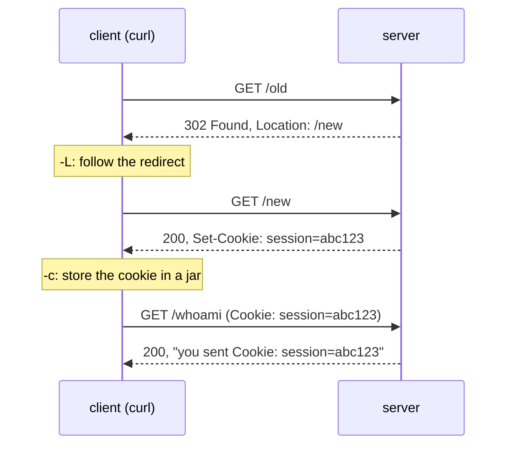

# HTTP Lab #27: Redirects and Cookies

Expected time: 40 to 55 minutes  
日本語: 想定時間 40〜55分

Reading guide: [`../rfc-notes/http-redirects-cookies.md`](../rfc-notes/http-redirects-cookies.md)

Prerequisite: [HTTP Lab 10: One Exchange, Read in the Clear](http-10-requests-responses-caching.md)

## Goal

Lab 10 read one HTTP request and response. This lab adds two things that make the web feel stateful even though HTTP is not: **redirects** (the server sends the client somewhere else) and **cookies** (the server hands the client a token to send back on every future request).

You will drive both with `curl`:

- `GET /old` returns **302 Found** with a **`Location: /new`** header — "go here instead",
- with `curl -L`, the client **follows** it and ends up at `/new`,
- `GET /new` sends **`Set-Cookie: session=abc123`** — the server hands out a token,
- the client **stores** it and **resends** it, so `GET /whoami` shows the server got **`Cookie: session=abc123`** back.

日本語: Lab 10 は1つの HTTP request/response を読みました。この Lab は、HTTP が本来 stateless なのに web が「状態を持つ」ように見える2つの仕組みを足します。**redirect**(サーバが client を別の場所へ送る)と **cookie**(サーバが client にトークンを渡し、以後のリクエストで送り返させる)。`curl` で両方を動かします。`GET /old` は **302 Found** と **`Location: /new`**(こっちへ行け)、`curl -L` で client がそれに **追従** して `/new` に着く、`GET /new` は **`Set-Cookie: session=abc123`**(トークンを渡す)、client がそれを **保存** して **再送** するので `GET /whoami` で server が **`Cookie: session=abc123`** を受け取ったと分かる。

By the end, you should be able to label this:

| Request | Response | Effect |
|---|---|---|
| `GET /old` | `302 Found`, `Location: /new` | client is told to go to `/new` |
| `GET /new` (after -L) | `200`, `Set-Cookie: session=abc123` | client stores the cookie |
| `GET /whoami` (with -b) | `200`, body echoes `Cookie: session=abc123` | server sees the cookie |

## What You Will Learn

理解したいこと:

- What a **3xx redirect** is, and the role of the **`Location`** header.
- The difference between a client that follows redirects and one that does not.
- What **`Set-Cookie`** and **`Cookie`** are, and how they create a "session" on stateless HTTP.
- Why cookies are how logins, carts, and preferences persist across requests.
- That the server is otherwise **stateless** — it only knows you by the cookie you send.

This lab does not cover:

- The difference between 301/302/303/307/308 in depth (we use 302).
- Cookie attributes for security (`Secure`, `HttpOnly`, `SameSite`) beyond naming them.
- Sessions stored server-side, JWTs, or OAuth.

日本語: 3xx redirect と `Location` ヘッダ、redirect に追従する/しない client の違い、`Set-Cookie` と `Cookie`、それが stateless な HTTP に「セッション」を作る仕組み、cookie がログイン・カート・設定を保持する理由、そして server は本来 stateless で「送られた cookie でしかあなたを識別しない」ことを学びます。

## RFCで読む場所

| RFC | 章 | 読むポイント |
|---|---|---|
| RFC 9110 | 15.4 | 3xx (Redirection) の意味、`Location` ヘッダ |
| RFC 9110 | 10.2.2 | `Location` の使われ方 |
| RFC 6265 | 3 | `Set-Cookie` と `Cookie` ヘッダの構文 |
| RFC 6265 | 4.1, 5.2 | cookie の属性(Path, Secure, HttpOnly など) |

## 実験の全体像

client 1台、server 1台。server は小さな Python アプリ。

```text
client (10.0.0.1) ------ eth1/eth1 ------ server (10.0.0.2:8080)
  curl                                     /old    -> 302 Location: /new
                                           /new    -> 200 Set-Cookie: session=abc123
                                           /whoami -> Cookie を echo
```



`10.0.0.0/24` はローカル閉域。

## 必要なもの

推奨環境:

- Linux / WSL2 / Linux VM
- Docker
- containerlab

使用イメージ:

- `nicolaka/netshoot:latest`（`curl`、`python3` 同梱）

追加イメージは不要。サーバは `examples/http-27/server/app.py`(標準ライブラリのみ)。

## 実行手順

```bash
./scripts/labctl.sh run http-27
```

### 1. 作業ディレクトリへ移動する

```bash
cd protocol-lab/examples/http-27
```

### 2. 起動してサーバを立てる

```bash
sudo containerlab deploy -t http-27.clab.yml
docker exec -d clab-http-27-server python3 /app/app.py
```

### 3. redirect を見る（追従しない / する）

```bash
# 追従しない: 302 と Location をそのまま見る
docker exec clab-http-27-client curl -sD - -o /dev/null http://10.0.0.2:8080/old
# 追従する: -L で /new まで行く
docker exec clab-http-27-client curl -sL -w "\n[final] %{url_effective}\n" http://10.0.0.2:8080/old
```

```text
HTTP/1.1 302 Found
Location: /new
...
[final] http://10.0.0.2:8080/new
```

### 4. cookie の往復を見る

```bash
# /new が Set-Cookie を返す。-c で cookie jar に保存
docker exec clab-http-27-client curl -sD - -o /dev/null -c /tmp/jar.txt http://10.0.0.2:8080/new
# /whoami へ -b で cookie を送る。server が echo する
docker exec clab-http-27-client curl -s -b /tmp/jar.txt http://10.0.0.2:8080/whoami
```

```text
Set-Cookie: session=abc123; Path=/
...
you sent Cookie: session=abc123
```

## 期待出力

- `GET /old`: `HTTP/1.1 302 Found`、`Location: /new`。
- `-L` 追従後の final URL: `.../new`。
- `GET /new`: `Set-Cookie: session=abc123`。
- `GET /whoami`(cookie 付き): 本文に `Cookie: session=abc123`。

## なぜそう動くのか

HTTP は本来 **stateless**。各リクエストは独立していて、サーバは前のリクエストを覚えていない。それでも web で「ログイン状態が続く」「カートが保たれる」のは、redirect と cookie という2つの仕組みのおかげ。

- **redirect(3xx + Location)**: サーバが「その URL ではなく、こっちを見て」と client に指示する。`302 Found` は「一時的に別の場所」。応答本文ではなく **`Location` ヘッダ** に行き先を入れる。client(ブラウザや `curl -L`)はそれを見て、自動で新しい URL へリクエストし直す。ログイン後のページ遷移、http→https、旧 URL の移設などに使う。
- **追従は client の仕事**: サーバは「行き先」を示すだけ。実際にそこへ行くかは client 次第。`curl` は既定では追従せず(302 をそのまま見せる)、`-L` で追従する。ブラウザは自動で追従する。
- **cookie(Set-Cookie / Cookie)**: サーバは応答に **`Set-Cookie: name=value`** を付けて、client に小さなトークンを渡す。client はそれを保存し、**以後、同じサーバへのリクエストに `Cookie: name=value` を自動で付ける**。サーバはその value を見て「これはさっきの client だ」と識別する。これが stateless な HTTP の上に「セッション」を作る方法。
- **サーバは cookie でしか覚えていない**: サーバ側に「あなた」の記憶があるわけではない(このLabのアプリは何も保存していない)。client が送ってくる cookie が唯一の手がかり。だから cookie を消せばログアウトになるし、cookie を盗まれるとなりすまされる(だから `Secure`/`HttpOnly`/`SameSite` 属性で守る)。

要点は、**HTTP は stateless だが、redirect で client を誘導し、cookie で「送り返させる印」を持たせることで、状態があるように振る舞える**こと。

## 詰まりやすい点

- **redirect にサーバが連れて行くと思う**。サーバは Location を示すだけ。追従は client(`-L` やブラウザ)。
- **302 の行き先を本文に探す**。行き先は `Location` ヘッダ。本文ではない。
- **cookie をサーバが覚えていると思う**。覚えているのは client。サーバは送られた cookie を見るだけ。
- **`-c` と `-b` を混同する**。`-c`(cookie jar に**保存**)、`-b`(jar から**送信**)。ブラウザは両方自動。
- **cookie の属性を軽視する**。`Secure`/`HttpOnly`/`SameSite` はセキュリティ上重要(このLabは最小限)。
- **3xx の種類**。301(恒久)/302(一時)/307/308(メソッド保持)などがある。用途で使い分ける。

## 後片付け

```bash
sudo containerlab destroy -t http-27.clab.yml --cleanup
```

`labctl.sh run http-27` を使った場合は、スクリプトが最後に destroy する。

## 確認問題

1. 3xx redirect でサーバは何を返すか。行き先はどのヘッダに入るか。
2. redirect に追従するのは誰か。`curl` で追従させるには何を付けるか。
3. `Set-Cookie` と `Cookie` は、それぞれ誰が誰に送るか。
4. HTTP は stateless なのに、なぜ「セッション」が保てるのか。
5. サーバはあなたをどうやって識別しているか。cookie を消すとどうなるか。
6. cookie の `Secure` / `HttpOnly` / `SameSite` は何のためにあるか。

## References

- [RFC 9110: HTTP Semantics (Redirection 3xx, Location)](https://www.rfc-editor.org/rfc/rfc9110)
- [RFC 6265: HTTP State Management Mechanism (Cookies)](https://www.rfc-editor.org/rfc/rfc6265)
- [RFC 5737: IPv4 Address Blocks Reserved for Documentation](https://www.rfc-editor.org/rfc/rfc5737)
- [curl manual page](https://curl.se/docs/manpage.html)

## 検証済み実行ログ (2026-07-07)

このLabは実機で再現性を確認済みです。

実行環境:

- Ubuntu 26.04 LTS (kernel 7.0.0-27-generic, x86_64)
- Docker 29.1.3
- containerlab 0.77.0
- client / server: `nicolaka/netshoot:latest`（curl / python3。server は `server/app.py`）

`PATH="/tmp/pl-shim:$PATH" ./scripts/labctl.sh run http-27` で deploy → verify → destroy を実行し、`verification.json` は `"status": "verified"` を返した。

### redirect（302 + Location、そして追従）

```text
$ curl -sD - -o /dev/null http://10.0.0.2:8080/old
HTTP/1.1 302 Found
Location: /new

$ curl -sL -w "[final] %{url_effective}\n" http://10.0.0.2:8080/old
[final] http://10.0.0.2:8080/new
```

`GET /old` は `302 Found` と `Location: /new` を返す。`curl -L` はそれに追従し、`/new` に着く。サーバは行き先を示すだけで、追従するのは client。

### cookie の往復（Set-Cookie → Cookie）

```text
$ curl -sD - -o /dev/null -c jar.txt http://10.0.0.2:8080/new
Set-Cookie: session=abc123; Path=/

$ curl -s -b jar.txt http://10.0.0.2:8080/whoami
you sent Cookie: session=abc123
```

`GET /new` が `Set-Cookie: session=abc123` を渡し、client(`-c`)が保存。次に `GET /whoami` へ `-b` で送ると、サーバは `Cookie: session=abc123` を受け取ったと echo する。**HTTP は stateless だが、cookie を「送り返させる印」にすることで、リクエストをまたいで client を識別できる**——これがセッションの正体。

### Cleanup

```bash
containerlab destroy -t http-27.clab.yml --cleanup
```
