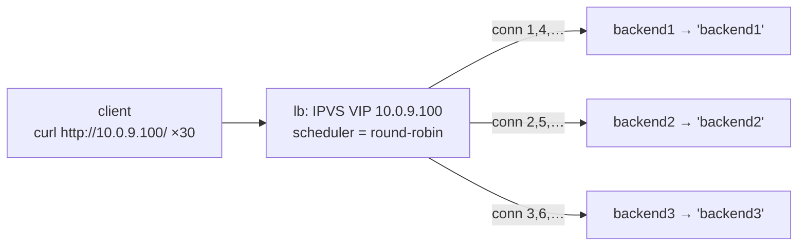

# Lab #33: L4 Load Balancing — One VIP, a Pool of Servers

Expected time: 40 to 55 minutes  
日本語: 想定時間 40〜55分

Reading guide: [`../rfc-notes/l4-load-balancing.md`](../rfc-notes/l4-load-balancing.md)

Prerequisite: [Lab 20: NAT — Source Address Translation](nat-20-source-nat.md)

## Goal

This is the third way to spread load across servers. Anycast (Lab 31) let **routing** pick one instance; ECMP (Lab 32) let **routing** hash flows across links; here a **load balancer** actively distributes **connections** to a pool.

One virtual IP (`10.0.9.100`) fronts three backends. A Linux **IPVS** director schedules each incoming connection **round-robin** and NATs it to a real backend (and NATs the reply back), so the client only ever talks to the VIP:

- the client connects to `http://10.0.9.100/` thirty times,
- IPVS sends the connections to `backend1`, `backend2`, `backend3`, `backend1`, … in turn,
- the responses cycle through all three — **10 / 10 / 10** — while the client never sees a backend address.

日本語: サーバへ負荷を分散する3つ目の方法です。Anycast(Lab 31)は **routing** が1インスタンスを選び、ECMP(Lab 32)は **routing** が flow をリンクに hash しました。ここでは **ロードバランサ** が能動的に **接続** をプールへ分配します。1つの VIP(`10.0.9.100`)が3台の backend を代表します。Linux **IPVS** の director が各接続を **round-robin** でスケジュールし、実 backend へ NAT(戻りも VIP へ NAT)するので、クライアントは常に VIP としか話しません。`http://10.0.9.100/` に30回接続すると、IPVS は接続を backend1, backend2, backend3, backend1… と順に送り、応答は3台を一巡(**10 / 10 / 10**)。クライアントは backend のアドレスを一切見ません。

By the end, you should be able to explain this:

| approach | what decides distribution | unit | state |
|---|---|---|---|
| anycast (31) | routing best-path | client → one instance | stateless |
| ECMP (32) | routing multipath + hash | flow → one link | stateless |
| **LB (33)** | **director scheduler** | **connection → one backend** | **stateful** |

## What You Will Learn

理解したいこと:

- What a **VIP + real-server pool** is, and how clients see only the VIP.
- How an **L4** load balancer distributes **connections** (not HTTP requests) by a **scheduler** (round-robin here).
- How **IPVS NAT mode** works, and why backends must default-route through the director.
- Why the director is **stateful** (a connection table) so replies rewrite back to the VIP.
- How L4 LB differs from anycast (31) and ECMP (32), and from an L7 reverse proxy.

This lab does not cover:

- L7 (HTTP-aware) load balancing — routing by URL/Cookie/host.
- Health checking / failover of dead backends (keepalived).
- DR/TUN forwarding modes, or persistence/session affinity in depth.

日本語: VIP + 実サーバプールとは何か、L4 LB が(HTTP ではなく)接続を scheduler で分配する仕組み、IPVS NAT モードと backend の戻り経路、director がステートフルな理由(接続テーブル)、anycast/ECMP や L7 reverse proxy との違いを学びます。L7 LB、ヘルスチェック(keepalived)、DR/TUN や persistence の詳細は扱いません。

## RFCで読む場所

| 資料 | 読むポイント |
|---|---|
| IPVS HOWTO | director / real server、scheduler、NAT/DR/TUN |
| RFC 2663 | IPVS NAT モードが行う NAT の用語 |
| RFC 7424 | flow 単位の分散(ECMP と共通) |
| RFC 5737 / RFC 1918 | Lab のアドレスがローカル用であること |

## 実験の全体像

client — lb(VIP + IPVS)— sw(bridge)— backend1/2/3。

```text
 client            lb (director)              backend1 (10.0.10.11)
 10.0.9.2 --- eth1 --+ VIP 10.0.9.100    +--- backend2 (10.0.10.12)
                     + eth2 10.0.10.1 -- sw --+ backend3 (10.0.10.13)
                       IPVS rr (NAT)          (default gw = lb)
```

client は VIP に接続。IPVS が接続ごとに backend を rr で選び、NAT で転送。backend の戻りは default gw(lb)経由で VIP に書き戻される。



`10.0.9.0/24`(client 側)と `10.0.10.0/24`(backend 側)はローカル閉域。

## 必要なもの

推奨環境:

- Linux / WSL2 / Linux VM（IPVS カーネルモジュール `ip_vs` が使えること）
- Docker
- containerlab

使用イメージ:

- `nicolaka/netshoot:latest`（`ipvsadm`、`curl`、`python3` 同梱）

追加イメージは不要。

## 実行手順

```bash
./scripts/labctl.sh run lb-33
```

### 1. 作業ディレクトリへ移動する

```bash
cd protocol-lab/examples/lb-33
```

### 2. 起動して backend の responder を立てる

```bash
sudo containerlab deploy -t lb-33.clab.yml
docker exec -d clab-lb-33-backend1 python3 /responder.py backend1
docker exec -d clab-lb-33-backend2 python3 /responder.py backend2
docker exec -d clab-lb-33-backend3 python3 /responder.py backend3
```

各 backend は 0.0.0.0:80 で自分の名前を返す。

### 3. IPVS を設定する（VIP・round-robin・NAT）

```bash
docker exec clab-lb-33-lb ipvsadm -A -t 10.0.9.100:80 -s rr
docker exec clab-lb-33-lb ipvsadm -a -t 10.0.9.100:80 -r 10.0.10.11:80 -m
docker exec clab-lb-33-lb ipvsadm -a -t 10.0.9.100:80 -r 10.0.10.12:80 -m
docker exec clab-lb-33-lb ipvsadm -a -t 10.0.9.100:80 -r 10.0.10.13:80 -m
docker exec clab-lb-33-lb ipvsadm -L -n
```

`-s rr` は round-robin scheduler、`-m` は masq(NAT)転送。

### 4. VIP に繰り返しアクセスする

```bash
docker exec clab-lb-33-client sh -c 'for i in $(seq 1 6); do curl -s http://10.0.9.100/; done'
```

応答が backend1 → backend2 → backend3 → … と一巡する（VIP は不変）。

### 5. 分配を数える

```bash
docker exec clab-lb-33-client sh -c 'for i in $(seq 1 30); do curl -s http://10.0.9.100/; done' | sort | uniq -c
```

3 backend にほぼ均等（10 / 10 / 10）。

## 期待出力

- `ipvsadm -L -n`: VIP `10.0.9.100:80 rr` の下に3 real server（Masq）。
- 応答の並びが backend1/2/3 を round-robin で一巡。
- 30 リクエストの分配が 10 / 10 / 10（rr なので均等）。
- クライアントが見る宛先は常に VIP（backend アドレスは見えない）。

## なぜそう動くのか

**L4 ロードバランサ**は「1つの VIP、実サーバのプール、そして各接続を1台へ割り当てる director」。

- **VIP と pool**: クライアントは VIP(`10.0.9.100`)に接続する。director はその接続を real server(`10.0.10.11` 等)へ転送する。裏のサーバはクライアントに見えない。プールの増減はクライアント無変更でできる。
- **scheduler**: どの backend を選ぶかの方針。ここは **round-robin**(順番に一巡)。他に least-connection、weighted、source-hashing など。**L4** なので HTTP の中身(URL/Cookie)は見ない——見るのは 5-tuple。中身で振るのは L7 LB(別物)。
- **NAT モード**: director は接続の宛先を backend に書き換え(DNAT)、戻りパケットの送信元を VIP に書き戻す。だから backend の戻りが director を通る必要があり、backend の default gw を director にしてある。
- **ステートフル**: director は **接続テーブル**を持ち、同じ接続の全パケットを同じ backend へ、戻りを VIP へと対応づける。ここが anycast/ECMP(ステートレスに routing/hash で散る)との決定的な違い——LB は往復整合のために状態を持つ。
- **三部作の締め**: anycast(31)=routing が1インスタンスを選ぶ、ECMP(32)=routing が flow をリンクに散らす、LB(33)=director が接続をプールに **能動的に** 分配する。

要点は、**1つの仮想アドレスの裏で、director が接続ごとに backend を選び、NAT で往復を仲介する**こと。

## 詰まりやすい点

- **L4 が HTTP を見ていると思う**。見ない。URL/Cookie で振るのは L7 LB。L4 は接続を転送するだけ。
- **VIP が backend にあると思う**。NAT モードでは VIP は director 上。backend は実 IP を持つ。
- **戻り経路**。NAT モードは backend の default gw を director にしないと、戻りが VIP に書き戻らず接続が成立しない。
- **ヘルスチェックが自動と思う**。素の IPVS は死んだ backend も回し続ける。健全性は keepalived 等が担う(範囲外)。
- **粘着性を仮定する**。rr は接続ごとに散る。同一クライアント固定には source-hashing / persistence。
- **`ip_vs` モジュール**。ホストに IPVS カーネルモジュールが要る(`ipvsadm` 実行時に自動ロード)。

## 後片付け

```bash
sudo containerlab destroy -t lb-33.clab.yml --cleanup
```

`labctl.sh run lb-33` を使った場合は、スクリプトが最後に destroy する。

## 確認問題

1. L4 ロードバランサの VIP と real server pool とは何か。クライアントには何が見えるか。
2. L4 LB は接続をどう選んで振るか。HTTP の中身は見るか。
3. IPVS NAT モードで、backend の default gw を director にする必要があるのはなぜか。
4. director が「ステートフル」とはどういう意味か。なぜ状態が要るか。
5. anycast(31)・ECMP(32)・LB(33)を、「分配を決めるもの」と「状態の有無」で対比せよ。
6. L4 LB と L7 reverse proxy の違いは何か。

## References

- [Linux Virtual Server (IPVS) documentation](http://www.linuxvirtualserver.org/Documents.html)
- [RFC 2663: IP Network Address Translator (NAT) Terminology and Considerations](https://www.rfc-editor.org/rfc/rfc2663)
- [RFC 7424: Mechanisms for Optimizing LAG/ECMP Component Link Utilization](https://www.rfc-editor.org/rfc/rfc7424)
- [RFC 5737: IPv4 Address Blocks Reserved for Documentation](https://www.rfc-editor.org/rfc/rfc5737)

## 検証済み実行ログ (2026-07-07)

このLabは実機で再現性を確認済みです。

実行環境:

- Ubuntu 26.04 LTS (kernel 7.0.0-27-generic, x86_64)
- Docker 29.1.3
- containerlab 0.77.0
- client / lb / backend1-3 / sw: `nicolaka/netshoot:latest`（ipvsadm、curl、python3）

`PATH="/tmp/pl-shim:$PATH" ./scripts/labctl.sh run lb-33` で deploy → verify → destroy を実行し、`verification.json` は `"status": "verified"` を返した。

### IPVS の設定（VIP・round-robin・NAT）

```text
TCP  10.0.9.100:80 rr
  -> 10.0.10.11:80                Masq    1      0          0
  -> 10.0.10.12:80                Masq    1      0          0
  -> 10.0.10.13:80                Masq    1      0          0
```

VIP `10.0.9.100:80` に round-robin scheduler、3つの real server を masq(NAT)で登録。

### 30 リクエストが 3 backend に均等分配

client が `http://10.0.9.100/`(同一 VIP)に30回接続した結果:

```text
最初の6回の並び: backend2 backend1 backend3 backend2 backend1 backend3
30回の分配:
     10 backend1
     10 backend2
     10 backend3
```

接続ごとに backend が round-robin で一巡し、30 リクエストが **10 / 10 / 10** ときれいに均等分配された。クライアントが指定した宛先は終始 VIP `10.0.9.100` のみで、backend のアドレスは一切見えていない——director が接続を NAT で仲介している。

（注: `ipvsadm -L -n --stats` のパケット/バイト counter はこの環境(nsenter 経由)では 0 と表示されることがあるが、実際の分配はクライアント側の応答分布 10/10/10 で確認できる。)

### Cleanup

```bash
containerlab destroy -t lb-33.clab.yml --cleanup
```
