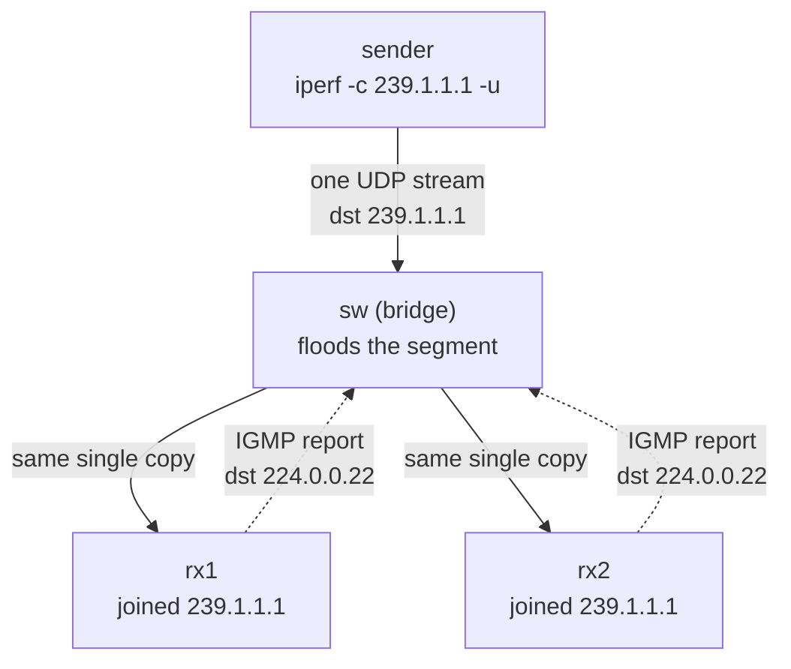

# Lab #29: Multicast and IGMP — One Sender, Many Receivers

Expected time: 40 to 55 minutes  
日本語: 想定時間 40〜55分

Reading guide: [`../rfc-notes/multicast-igmp.md`](../rfc-notes/multicast-igmp.md)

Prerequisite: [Lab 24: ARP — IPv4 Neighbor Resolution](arp-24-neighbor-resolution.md)

## Goal

So far every lab has moved packets from one host to one host (unicast). This lab uses **IP multicast**: one sender puts a *single* UDP stream onto the wire addressed to a **group** (`239.1.1.1`), and **both** receivers — which have **joined** that group via **IGMP** — receive it. The sender never sends a per-receiver copy.

- Two receivers join group `239.1.1.1` (`iperf -s -u -B 239.1.1.1`), each emitting an **IGMP membership report**,
- the sender sends one UDP stream to `239.1.1.1` (`iperf -c 239.1.1.1 -u`),
- both receivers report `0/513 (0%)` — they each got the whole stream from one send,
- a capture shows the **IGMP reports** and the multicast destination MAC **`01:00:5e:01:01:01`**.

日本語: これまでの Lab は 1 host → 1 host(unicast)でした。この Lab は **IP multicast** を扱います。1つの sender が **group**(`239.1.1.1`)宛に *1本の* UDP stream をワイヤに置き、その group に **IGMP** で **join** した **両方**の receiver がそれを受け取る。sender は receiver ごとのコピーを送りません。receiver 双方が `0/513 (0%)`(1回の送信で全体を受信)となり、capture には **IGMP report** と multicast 宛先 MAC **`01:00:5e:01:01:01`** が見えます。

By the end, you should be able to explain this:

| | destination | who receives | copies on the segment |
|---|---|---|---|
| unicast | one host | that host | one per receiver (N sends for N) |
| multicast | a group | hosts that joined | **one** (shared by all joiners) |

## What You Will Learn

理解したいこと:

- What an **IP multicast group** (class D, `224.0.0.0/4`) is, and how `239.0.0.0/8` differs from link-local control groups.
- How a host **joins** a group and how **IGMP** (membership reports) signals that to the network.
- How an IPv4 multicast address maps to the **`01:00:5e`** Ethernet MAC.
- Why one send reaches many receivers with a **single copy** on a shared segment.
- What **IGMP snooping** does (and why this lab leaves it off so the bridge floods).

This lab does not cover:

- Multicast **routing** between segments (PIM, mroute) — this is a single L2 segment.
- Source-specific multicast (SSM) filtering in depth.
- IPv6 multicast / MLD (touched on in the NDP lab).

日本語: multicast group(class D)とは何か、host が group に join し **IGMP** で網に伝える仕組み、IPv4 multicast → `01:00:5e` MAC の対応、1回の送信が共有セグメント上の **1コピー**で多数に届く理由、**IGMP snooping** の役割(この Lab では off にして flood させる)を学びます。segment 間の multicast routing(PIM)や SSM の詳細、IPv6 MLD は扱いません。

## RFCで読む場所

| 資料 | 読むポイント |
|---|---|
| RFC 1112 | multicast の host model、class D address、IP→MAC の対応 |
| RFC 2236 | IGMPv2 の membership report / query |
| RFC 3376 | IGMPv3(Linux が既定で送る) |
| RFC 2365 | `239.0.0.0/8`(administratively scoped)の位置づけ |
| RFC 5737 | Lab で使う `10.0.0.0/24` がローカル閉域であること(補足) |

## 実験の全体像

sender・rx1・rx2 の3台と、それらを1本のセグメントに束ねる Linux bridge の sw。

```text
        sender (10.0.0.1)
             |
          [ sw ]  (Linux bridge: 1つの共有セグメント, snooping off = flood)
          /     \
 rx1 (10.0.0.2)   rx2 (10.0.0.3)
   join 239.1.1.1   join 239.1.1.1
```

sender は `239.1.1.1` 宛に UDP を1本送るだけ。sw はそれをセグメントの全ポートへ流し、group に join した rx1/rx2 が受け取る。



`10.0.0.0/24` はローカル閉域、`239.1.1.1` は administratively-scoped の multicast group。

### なぜ multicast を eth1 に固定するのか

コンテナには管理用の `eth0`(containerlab の管理 bridge)とラボの `eth1`(sw への線)があります。Linux の既定 multicast route は `eth0` を選びがちで、そのままだと group が管理網を通り、観察したい sw を通りません。各ノードで `ip route add 239.0.0.0/8 dev eth1` を入れ、multicast を必ず sw 側(`eth1`)へ出します。トポロジ(`mcast-29.clab.yml`)で設定済みです。

## 必要なもの

推奨環境:

- Linux / WSL2 / Linux VM
- Docker
- containerlab

使用イメージ:

- `nicolaka/netshoot:latest`（`iperf`、`tcpdump`、`ip` 同梱）

追加イメージは不要。

## 実行手順

```bash
./scripts/labctl.sh run mcast-29
```

### 1. 作業ディレクトリへ移動する

```bash
cd protocol-lab/examples/mcast-29
```

### 2. 起動する

```bash
sudo containerlab deploy -t mcast-29.clab.yml
```

sw は3つのポートを1つの bridge(`br0`)に束ね、`mcast_snooping 0`(flood)にしてある。sender/rx1/rx2 は `239.0.0.0/8` を `eth1` へ向けるルートを持つ。

### 3. 受信側で group に join する(IGMP membership)

```bash
docker exec -d clab-mcast-29-rx1 sh -c "iperf -s -u -B 239.1.1.1 -i1 >/tmp/rx1.log 2>&1"
docker exec -d clab-mcast-29-rx2 sh -c "iperf -s -u -B 239.1.1.1 -i1 >/tmp/rx2.log 2>&1"
docker exec clab-mcast-29-rx1 ip maddr show eth1   # 239.1.1.1 が見える
```

`iperf -s -u -B 239.1.1.1` は group にバインドして join する。カーネルが IGMP membership report を送る。

### 4. 受信側で IGMP と multicast を capture する

```bash
docker exec -d clab-mcast-29-rx1 tcpdump -i eth1 -n -e -w /tmp/mc.pcap "igmp or (udp and dst 239.1.1.1)"
```

### 5. 送信側から group へ1本だけ送る

```bash
docker exec clab-mcast-29-sender iperf -c 239.1.1.1 -u -T 5 -t 3 -b 2m
```

`-T 5` は multicast TTL。sender は `239.1.1.1` 宛に **1本**送るだけ。

### 6. 結果を見る

```bash
docker exec clab-mcast-29-rx1 sh -c 'grep Bytes /tmp/rx1.log | tail -1'   # 0/513 (0%)
docker exec clab-mcast-29-rx2 sh -c 'grep Bytes /tmp/rx2.log | tail -1'   # 0/513 (0%)
docker exec clab-mcast-29-rx1 pkill -INT tcpdump
docker exec clab-mcast-29-rx1 tcpdump -n -e -r /tmp/mc.pcap | grep -E "igmp|01:00:5e"
```

両 receiver が同じ1本の stream を受け取り、capture に IGMP report と multicast MAC が見える。

## 期待出力

- `ip maddr show eth1` に `239.1.1.1`(両 receiver が join)。
- rx1/rx2 の iperf ログが両方とも `0/513 (0%)`(1本の stream を両者が完全受信)。
- capture に `10.0.0.x > 224.0.0.22: igmp v3 report`(membership)。
- capture に `01:00:5e:01:01:01`(`239.1.1.1` の multicast データ MAC)。

## なぜそう動くのか

**unicast** は「1つの host へ」。N 人に配るなら sender は N 回送る。**multicast** は「1つの *group* へ」——sender は group 宛に **1回**送り、その group に **join** した host すべてが受け取る。sender は receiver の数も身元も知らない。

- **group アドレス(class D)**: `224.0.0.0/4`。host ではなく group を表す。`239.0.0.0/8` は組織内ローカル(administratively scoped)。
- **join と IGMP**: host が group を欲しくなると、**IGMP membership report**(宛先 `224.0.0.22`, IGMPv3)を送る。これで router/switch に「この group が要る」と伝わる。IGMP は *signalling* であって、データそのものは運ばない。
- **IP → MAC**: IPv4 multicast は `01:00:5e` で始まる MAC に写る(IP 下位23bit をコピー)。だから `239.1.1.1` は `01:00:5e:01:01:01`。receiver の NIC はこの MAC のフレームを拾うよう設定される。
- **1コピー**: 共有セグメントでは、sender の1フレームがそのまま両 receiver に届く。broadcast のように「セグメントに1コピー」だが、multicast は *join した集合* にだけ関係する。
- **switch の挙動**: 素の L2 bridge は multicast を全ポートへ **flood** する。**IGMP snooping** を有効にすると、report を覗いて聞いているポートにだけ送る。この Lab は snooping を off にして、membership signalling と flood 配送を素直に観察している。

要点は、**1回の送信が、receiver ごとのコピー無しに、join した全員へ届く**こと。IGMP はその「join」を網に伝える仕組み。

## 詰まりやすい点

- **multicast を「unicast を N 回」と混同する**。実際はセグメントに1コピー。sender は1回だけ送る。
- **IGMP がデータを運ぶと思う**。IGMP は join の signalling。データは UDP 等で別に流れる。
- **管理 interface に漏れる**。既定 multicast route は `eth0`(管理網)を選びがち。`ip route add 239.0.0.0/8 dev eth1` で sw 側に固定する(このトポロジは設定済み)。これを外すと、iperf は受信できるのに `eth1` の capture が空になる。
- **switch が賢く配ると思い込む**。snooping 無しの L2 は flood。賢い転送は IGMP snooping が要る。
- **TTL**。`-T` を小さくしても L2 の1ホップなら届くが、`224.0.0.0/24`(link-local control)は TTL 1 で外に出ない。
- **group アドレスを host と思う**。class D は group を指す。ping で応答は返らない。

## 後片付け

```bash
sudo containerlab destroy -t mcast-29.clab.yml --cleanup
```

`labctl.sh run mcast-29` を使った場合は、スクリプトが最後に destroy する。

## 確認問題

1. unicast と multicast の違いは何か。N 人の receiver に配るとき、sender は何回送るか。
2. multicast group アドレス(class D)とは何か。`239.0.0.0/8` はどんな範囲か。
3. host はどうやって group に join するか。IGMP は何を運ぶ(運ばない)か。
4. `239.1.1.1` はどんな Ethernet MAC に写るか。なぜそうなるか。
5. IGMP snooping 有り/無しで、L2 switch の multicast 転送はどう変わるか。
6. この Lab で multicast を `eth1` に固定するルートを入れる理由は何か。

## References

- [RFC 1112: Host Extensions for IP Multicasting](https://www.rfc-editor.org/rfc/rfc1112)
- [RFC 2236: Internet Group Management Protocol, Version 2](https://www.rfc-editor.org/rfc/rfc2236)
- [RFC 3376: Internet Group Management Protocol, Version 3](https://www.rfc-editor.org/rfc/rfc3376)
- [RFC 2365: Administratively Scoped IP Multicast](https://www.rfc-editor.org/rfc/rfc2365)
- [RFC 5737: IPv4 Address Blocks Reserved for Documentation](https://www.rfc-editor.org/rfc/rfc5737)

## 検証済み実行ログ (2026-07-07)

このLabは実機で再現性を確認済みです。

実行環境:

- Ubuntu 26.04 LTS (kernel 7.0.0-27-generic, x86_64)
- Docker 29.1.3
- containerlab 0.77.0
- sender / rx1 / rx2 / sw: `nicolaka/netshoot:latest`（iperf、tcpdump、ip 同梱）

`PATH="/tmp/pl-shim:$PATH" ./scripts/labctl.sh run mcast-29` で deploy → verify → destroy を実行し、`verification.json` は `"status": "verified"` を返した。

### 1本の送信が両 receiver へ届く

sender は `239.1.1.1` 宛に UDP を1本送信(514 datagrams)。rx1・rx2 は IGMP で join 済みで、**両方**が同じ stream を完全受信した。

```text
rx1: [  1] 0.00-3.01 sec   736 KBytes  2.00 Mbits/sec   0.002 ms 0/513 (0%)
rx2: [  1] 0.00-3.01 sec   736 KBytes  2.00 Mbits/sec   0.002 ms 0/513 (0%)
sender: [  1] Sent 514 datagrams
```

receiver ごとにコピーを送ってはいない——sender の送信は1本で、両者が `0/513 (0%)`(損失なし)で受け取っている。

### capture: IGMP membership と multicast MAC

rx1 の `eth1` で `"igmp or (udp and dst 239.1.1.1)"` を capture(合計 523 パケット)。

```text
12:25:57.041374 aa:c1:ab:40:2d:42 > 01:00:5e:00:00:16, IPv4, length 54: 10.0.0.2 > 224.0.0.22: igmp v3 report, 1 group record(s)
12:25:57.061375 aa:c1:ab:60:17:a6 > 01:00:5e:00:00:16, IPv4, length 54: 10.0.0.3 > 224.0.0.22: igmp v3 report, 1 group record(s)
12:25:59.117790 aa:c1:ab:35:ff:36 > 01:00:5e:01:01:01, IPv4, length 1512: 10.0.0.1.34590 > 239.1.1.1.5001: UDP, length 1470
```

- rx1(`10.0.0.2`)・rx2(`10.0.0.3`)がそれぞれ **IGMPv3 membership report** を `224.0.0.22`(MAC `01:00:5e:00:00:16`)へ送っている——group への join の signalling。
- sender(`10.0.0.1`)の multicast データは宛先 MAC **`01:00:5e:01:01:01`**(= `239.1.1.1` の写像)で流れている。IP 下位23bit が MAC 下位に写っているのが確認できる。
- `ip maddr show eth1` は両 receiver で `239.1.1.1` を示した(group membership)。

### ハマった点(記録)

初回は verify が失敗した。receiver の iperf は multicast を **受信できている**のに、`eth1` の tcpdump が **0パケット**だった。原因は、Linux の既定 multicast route が管理用 `eth0`(containerlab 管理 bridge)を選び、group が観察対象の sw を通らず管理網経由で届いていたこと。sender/rx1/rx2 に `ip route add 239.0.0.0/8 dev eth1` を入れて multicast を sw 側(`eth1`)に固定したところ、capture に IGMP report と `01:00:5e` の multicast フレームが現れ、verify が green になった。トポロジ(`mcast-29.clab.yml`)にこのルートを組み込み済み。

### Cleanup

```bash
containerlab destroy -t mcast-29.clab.yml --cleanup
```
