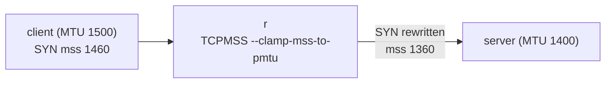

# Lab #37: TCP MSS Clamping — Fitting Segments to the Narrowest Link

Expected time: 35 to 50 minutes  
日本語: 想定時間 35〜50分

Reading guide: [`../rfc-notes/mss-clamping.md`](../rfc-notes/mss-clamping.md)

Prerequisite: [Lab 25: MTU and Path MTU Discovery](mtu-25-path-mtu-discovery.md)

## Goal

Lab 25 showed Path MTU Discovery finding a smaller link via ICMP — and how it blackholes when that ICMP is filtered. This lab is the operational fix: **MSS clamping**. A router on the path rewrites the **MSS** in passing TCP SYNs so both endpoints agree, up front, to send segments that fit the narrowest link — no reliance on PMTUD working.

The client's link is MTU 1500; the r–server link is MTU **1400**:

- **without clamping**, the client's SYN advertises **MSS 1460** (its local 1500 − 40); a full segment is too big for the 1400 link and depends on PMTUD,
- **with clamping**, r rewrites the SYN's MSS down to **1360** (1400 − 40), so both ends send segments that always fit.

日本語: Lab 25 は PMTUD が ICMP で細いリンクを見つける様子と、その ICMP がフィルタされると blackhole する様子を見ました。この Lab はその運用的な対処、**MSS clamping** です。path 上のルータが通過する TCP SYN の **MSS** を書き換え、両端が最初から最も細いリンクに収まる segment を送るよう合意させる——PMTUD が効くことに頼らずに。client のリンクは MTU 1500、r–server リンクは MTU **1400**。**clamping 無し** では client の SYN は **MSS 1460**(ローカル 1500 − 40)を広告し、1400 リンクには大きすぎて PMTUD 頼み。**clamping 有り** では r が SYN の MSS を **1360**(1400 − 40)に下げ、両端が常に収まる segment を送る。

By the end, you should be able to explain this:

| | SYN MSS seen at the server | why |
|---|---|---|
| without clamping | 1460 | client's local MTU 1500 − 40 |
| with clamping | 1360 | r clamps to the 1400-MTU link (− 40) |

## What You Will Learn

理解したいこと:

- What the TCP **MSS** option is and how endpoints derive it from local MTU.
- Why the SYN MSS is **blind** to a smaller link deeper in the path.
- How **PMTUD** can **blackhole** when ICMP is filtered (recap of Lab 25).
- How **MSS clamping** on a router rewrites the SYN's MSS to fit the path.
- Why this matters for tunnels (WireGuard/VXLAN/GRE) that shrink the effective MTU.

This lab does not cover:

- Full PMTUD internals (Lab 25 covers those).
- IPv6 MSS specifics (MSS = MTU − 60 with the larger minimum).
- Per-route MTU pinning or PLPMTUD (RFC 8899).

日本語: TCP MSS option とローカル MTU からの導出、SYN の MSS が path 奥の細いリンクに盲目な理由、ICMP フィルタ時に PMTUD が blackhole すること(Lab 25 の復習)、ルータでの MSS clamping が SYN の MSS を書き換える仕組み、実効 MTU を下げるトンネルで重要な理由を学びます。PMTUD 内部、IPv6 の MSS 詳細、PLPMTUD は扱いません。

## RFCで読む場所

| 資料 | 読むポイント |
|---|---|
| RFC 9293 §3.7.1 | MSS option と segment サイズ決定 |
| RFC 1191 | PMTUD(clamping が補う仕組み) |
| RFC 2923 | PMTUD の blackhole 問題 |
| RFC 5737 / RFC 1918 | Lab のアドレスがローカル用であること |

## 実験の全体像

client と server の間に r。r–server リンクだけ MTU 1400。

```text
 client ---- eth1/eth1 ---- r ---- eth2/eth1 ---- server
 MTU 1500                       MTU 1400 (narrow)   MTU 1400
   SYN: mss 1460  --->  r clamps --->  mss 1360 at server
```

r の FORWARD(mangle)で SYN の MSS を PMTU に clamp する。



`10.0.0.0/8` はローカル閉域。

## 必要なもの

推奨環境:

- Linux / WSL2 / Linux VM
- Docker
- containerlab

使用イメージ:

- `nicolaka/netshoot:latest`（`iptables`、`tcpdump`、`curl`、`python3` 同梱）

追加イメージは不要。

## 実行手順

```bash
./scripts/labctl.sh run mss-37
```

### 1. 作業ディレクトリへ移動する

```bash
cd protocol-lab/examples/mss-37
```

### 2. 起動して HTTP サーバを立てる

```bash
sudo containerlab deploy -t mss-37.clab.yml
docker exec -d clab-mss-37-server python3 -m http.server 80
docker exec clab-mss-37-r ip -br link show eth2   # mtu 1400
```

### 3. clamping 無しで SYN の MSS を見る

```bash
docker exec -d clab-mss-37-server sh -c 'tcpdump -i eth1 -n -c1 "tcp[tcpflags] & tcp-syn != 0 and tcp[tcpflags] & tcp-ack == 0" > /tmp/syn.txt 2>&1'
docker exec clab-mss-37-client curl -s --max-time 4 http://10.0.8.2/ >/dev/null
docker exec clab-mss-37-server grep -oE 'mss [0-9]+' /tmp/syn.txt
```

`mss 1460`(client の 1500 − 40)。

### 4. r で MSS clamping を有効化する

```bash
docker exec clab-mss-37-r iptables -t mangle -A FORWARD -p tcp --tcp-flags SYN,RST SYN -j TCPMSS --clamp-mss-to-pmtu
```

### 5. もう一度 SYN の MSS を見る

```bash
docker exec -d clab-mss-37-server sh -c 'tcpdump -i eth1 -n -c1 "tcp[tcpflags] & tcp-syn != 0 and tcp[tcpflags] & tcp-ack == 0" > /tmp/syn2.txt 2>&1'
docker exec clab-mss-37-client curl -s --max-time 4 http://10.0.8.2/ >/dev/null
docker exec clab-mss-37-server grep -oE 'mss [0-9]+' /tmp/syn2.txt
```

`mss 1360`(r が 1400 − 40 に clamp)。

## 期待出力

- r eth2: `mtu 1400`。
- clamping 無し: server が見る SYN は `mss 1460`。
- clamping 有り: server が見る SYN は `mss 1360`。
- mangle FORWARD に `TCPMSS clamp to PMTU` 規則。

## なぜそう動くのか

**MSS clamping** は「安全な segment サイズを最初に両端へ伝え、PMTUD 頼みにしない」。

- **MSS**: TCP が1 segment で受け取る最大ペイロード。**SYN でのみ** 広告し、値は **ローカル MTU − 40**(IPv4)。MTU 1500 → 1460。送信側は相手の MSS を上限に segment を切る。
- **盲点**: 各端は自分のインターフェース MTU しか知らない。path の奥に細いリンク(ここは r–server の 1400)があっても、SYN の MSS はそれを反映しない。
- **PMTUD と blackhole**(Lab 25): 大きすぎる segment が DF 付きで細いリンクに来ると、ルータは ICMP "fragmentation needed" を返し、送信側が縮める。だが ICMP がフィルタされると送信側は気づかず、大きい segment が捨てられ続けて接続がハングする(**blackhole**)。
- **clamping**: path 上のルータが、通過する **SYN の MSS option** を送出リンクの MTU − 40 に(それより大きければ)書き換える。Lab では r が 1460 → 1360 に下げる。両端は 1360 以下で送るので、1400 リンクでも常に収まり、PMTUD が効かなくても blackhole しない。SYN だけ書き換えれば十分(MSS は SYN でのみ交渉)。

要点は、**端末には見えない path の最小 MTU を、path 上のルータが SYN の MSS に反映させ、最初から収まるサイズで送らせる**こと。トンネルで実効 MTU が下がる実運用で頻用される。

## 詰まりやすい点

- **MSS と MTU の混同**。MTU は IP パケット全体、MSS は TCP ペイロード。IPv4 では MSS = MTU − 40。
- **SYN でのみ交渉**。データごとではない。だから書き換えるのは SYN の MSS option だけ。
- **PMTUD で十分と思う**。ICMP フィルタで blackhole し得る。clamping は保険。
- **端末側で MTU を下げれば良いと思う**。奥の細いリンクは端末から見えない。**path 上のルータ**が書き換える。
- **UDP にも効くと思う**。MSS は TCP 概念。UDP は別。
- **clamp 値**。`--clamp-mss-to-pmtu` は送出 MTU 由来。固定なら `--set-mss`。

## 後片付け

```bash
sudo containerlab destroy -t mss-37.clab.yml --cleanup
```

`labctl.sh run mss-37` を使った場合は、スクリプトが最後に destroy する。

## 確認問題

1. TCP MSS とは何か。MTU とどう違うか(IPv4 の関係式)。
2. MSS はいつ交渉されるか。SYN 以外でも変わるか。
3. SYN の MSS が path 奥の細いリンクを反映できないのはなぜか。
4. PMTUD が blackhole するのはどんなときか。
5. MSS clamping は何を、どこで書き換えるか。Lab で 1460 が 1360 になるのはなぜか。
6. トンネル(WireGuard/VXLAN/GRE)で clamping が重宝されるのはなぜか。

## References

- [RFC 9293: Transmission Control Protocol](https://www.rfc-editor.org/rfc/rfc9293)
- [RFC 1191: Path MTU Discovery](https://www.rfc-editor.org/rfc/rfc1191)
- [RFC 2923: TCP Problems with Path MTU Discovery](https://www.rfc-editor.org/rfc/rfc2923)
- [RFC 5737: IPv4 Address Blocks Reserved for Documentation](https://www.rfc-editor.org/rfc/rfc5737)

## 検証済み実行ログ (2026-07-07)

このLabは実機で再現性を確認済みです。

実行環境:

- Ubuntu 26.04 LTS (kernel 7.0.0-27-generic, x86_64)
- Docker 29.1.3
- containerlab 0.77.0
- client / r / server: `nicolaka/netshoot:latest`（iptables、tcpdump、curl、python3）

`PATH="/tmp/pl-shim:$PATH" ./scripts/labctl.sh run mss-37` で deploy → verify → destroy を実行し、`verification.json` は `"status": "verified"` を返した。

### clamping 無し → SYN は MSS 1460

server の eth1 で client の SYN を capture:

```text
Flags [S], seq ..., options [mss 1460, ...]
```

client のリンク MTU 1500 由来の **MSS 1460**。r–server リンク(MTU 1400)には大きすぎ、PMTUD 頼みになる。

### r で clamping → SYN は MSS 1360

```text
mangle FORWARD: TCPMSS  tcp  flags:0x06/0x02  TCPMSS clamp to PMTU
```

`iptables -t mangle -A FORWARD -p tcp --tcp-flags SYN,RST SYN -j TCPMSS --clamp-mss-to-pmtu` を入れた後、同じ client の SYN を server で capture:

```text
mss 1360
```

r が送出リンク(eth2, MTU 1400)に合わせ、SYN の MSS option を **1460 → 1360**(1400 − 40)に書き換えた。両端はこれ以降 1360 以下の segment を送るので、細いリンクでも常に収まり、ICMP がフィルタされていても blackhole しない。

| | server が見る SYN MSS |
|---|---|
| clamping 無し | 1460 |
| clamping 有り | 1360 |

### Cleanup

```bash
containerlab destroy -t mss-37.clab.yml --cleanup
```
