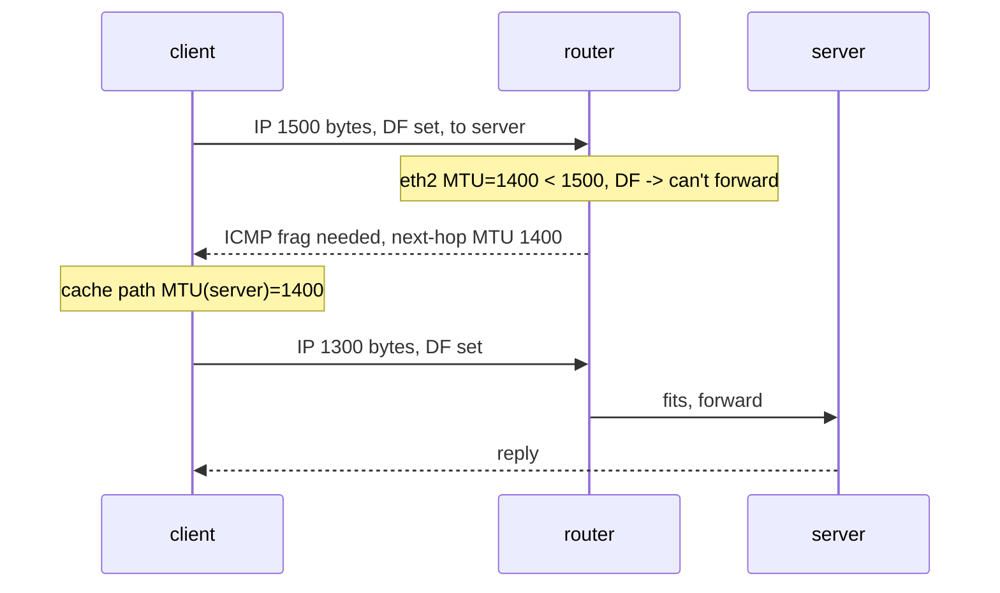

# Lab #25: MTU and Path MTU Discovery

Expected time: 45 to 60 minutes  
日本語: 想定時間 45〜60分

Reading guide: [`../rfc-notes/mtu-path-mtu-discovery.md`](../rfc-notes/mtu-path-mtu-discovery.md)

Prerequisites: [Lab 19: traceroute and TTL](trace-19-traceroute-ttl.md), [TCP Lab 08](tcp-08-retransmission-windowing-loss.md)

## Goal

Every link has a maximum frame size — its **MTU**. A packet bigger than a link's MTU cannot cross it. If the packet is marked **Don't Fragment (DF)**, a router that can't forward it must drop it and send back an **ICMP "fragmentation needed"** message carrying the MTU it *can* handle. The sender uses that to learn the **Path MTU** — the largest packet the whole path allows. This is **Path MTU Discovery (PMTUD)**.

This lab builds a path with a bottleneck link and watches it happen:

- `client — router — server`, where the router's link to the server has MTU **1400**,
- the client sends a **1500-byte DF** packet toward the server,
- the router replies **ICMP fragmentation-needed (mtu 1400)** — it cannot forward such a big packet,
- the client **caches** path MTU 1400 for the server, and a packet that fits gets through.

日本語: どのリンクにも最大フレームサイズ = **MTU** があります。リンクの MTU より大きいパケットはそこを通れません。もしパケットに **Don't Fragment(DF)** が付いていれば、転送できないルータはそれを捨て、自分が扱える MTU を載せた **ICMP「fragmentation needed」** を返します。送信側はそれを使って **Path MTU**(経路全体が許す最大パケット)を学びます。これが **Path MTU Discovery(PMTUD)**。この Lab では途中に細いリンクを持つ経路を作り、`client — router — server`(router→server の MTU は **1400**)で、client が **1500バイトの DF** パケットを送ると router が **ICMP fragmentation-needed(mtu 1400)** を返し、client が path MTU 1400 を **cache** して、収まるパケットは通る、という様子を観察します。

By the end, you should be able to explain this:

| Client sends | Router (1400 link) | Result |
|---|---|---|
| 1500 bytes, DF | too big, cannot fragment | ICMP frag-needed (mtu 1400) |
| — | — | client caches path MTU = 1400 |
| 1300 bytes, DF | fits | delivered |

## What You Will Learn

理解したいこと:

- What an **MTU** is and why a smaller-MTU link in the path is a bottleneck.
- What the **DF (Don't Fragment)** bit does, and why modern IP relies on it.
- How **ICMP fragmentation-needed** (type 3, code 4) carries the next-hop MTU.
- How the sender **discovers and caches** the Path MTU (`ip route get` shows it).
- Why a black-holed ICMP frag-needed (filtered) causes the classic "small pages load, big ones hang" bug.

This lab does not cover:

- IPv4 fragmentation without DF, or reassembly details.
- IPv6 PMTUD (routers never fragment; the mechanism is similar via ICMPv6 Packet Too Big).
- TCP MSS clamping (a common workaround).

日本語: MTU とは何か、細いリンクがボトルネックになる理由、**DF** ビットの働き、**ICMP fragmentation-needed** が next-hop MTU を運ぶこと、送信側が Path MTU を **発見して cache** すること(`ip route get` で見える)、そして ICMP frag-needed が落とされると起きる「小さいページは開くが大きいページは固まる」典型的バグを学びます。

## RFCで読む場所

| RFC | 章 | 読むポイント |
|---|---|---|
| RFC 1191 | 3-4 | Path MTU Discovery の仕組み(DF + ICMP frag-needed の MTU) |
| RFC 791 | 2.3, 3.2 | IP の fragmentation と DF フラグ |
| RFC 792 | Destination Unreachable | ICMP type 3 code 4(fragmentation needed) |
| RFC 5737 | 3 | Lab で使うアドレスが documentation 用であること |

## 実験の全体像

client、router、server の3ノード。router→server のリンクだけ MTU 1400。

```text
client ---10.0.1.0/24 (MTU 1500)--- router ---10.0.2.0/24 (MTU 1400)--- server
10.0.1.1                        10.0.1.2   10.0.2.1                  10.0.2.2
```

client から大きい DF パケットを送ると、router が細いリンク(1400)で詰まり、ICMP frag-needed を返す。



`10.0.0.0/8` のサブネットはローカル閉域。

## 必要なもの

推奨環境:

- Linux / WSL2 / Linux VM
- Docker
- containerlab

使用イメージ:

- `nicolaka/netshoot:latest`（`ping`(`-M do` 対応)、`ip`、`tcpdump` 同梱）

追加イメージは不要。細いリンクの MTU は topology の exec(`ip link set eth2 mtu 1400`)で設定する。

## 実行手順

```bash
./scripts/labctl.sh run mtu-25
```

### 1. 作業ディレクトリへ移動する

```bash
cd protocol-lab/examples/mtu-25
```

### 2. 起動して経路を設定する

```bash
sudo containerlab deploy -t mtu-25.clab.yml
docker exec clab-mtu-25-router sysctl -w net.ipv4.ip_forward=1
docker exec clab-mtu-25-client ip route add 10.0.2.0/24 via 10.0.1.2
docker exec clab-mtu-25-server ip route add 10.0.1.0/24 via 10.0.2.1
docker exec clab-mtu-25-router ip -br link show   # eth2 の MTU が 1400
```

### 3. 大きい DF パケットを送る（拒否される）

```bash
docker exec clab-mtu-25-client ping -M do -s 1500 -c1 10.0.2.2
```

期待:

```text
From 10.0.1.2 icmp_seq=1 Frag needed and DF set (mtu = 1400)
```

router(`10.0.1.2`)が「これ以上は 1400 までだ」と教えている。`-M do` は DF を立てる指定。

### 4. Path MTU が cache されたことを見る

```bash
docker exec clab-mtu-25-client ip route get 10.0.2.2
```

```text
10.0.2.2 via 10.0.1.2 dev eth1 src 10.0.1.1
    cache expires 597sec mtu 1400
```

client は「server への経路の MTU は 1400」を学び、cache した。

### 5. 収まるサイズは通る

```bash
docker exec clab-mtu-25-client ping -M do -s 1300 -c1 10.0.2.2
```

1300 + 28 = 1328 < 1400 なので通る。

## 期待出力

- `ping -s 1500 -M do`: `Frag needed and DF set (mtu = 1400)`。
- capture: `ICMP ... unreachable - need to frag (mtu 1400)`(type 3 code 4)。
- `ip route get 10.0.2.2`: `mtu 1400`(cache された path MTU)。
- `ping -s 1300 -M do`: 成功。

## なぜそう動くのか

MTU(Maximum Transmission Unit)は、あるリンクが1フレームで運べる最大バイト数。Ethernet は普通 1500。経路上に MTU の小さいリンクがあると、そこが「一番狭い門」になる。

- **DF(Don't Fragment)**: IP ヘッダのフラグ。「このパケットを分割するな」。昔は途中のルータが大きいパケットを分割(fragment)して通していたが、分割は非効率で問題も多い。だから現代は **DF を立て、分割させない** のが基本。TCP は既定で DF を使う。
- **通れないときどうするか**: DF 付きのパケットが、途中のリンク MTU より大きいと、ルータは転送できない(分割は禁止されている)。そこでルータは、パケットを捨て、**ICMP fragmentation-needed(type 3, code 4)** を送信元に返す。この ICMP には「自分が扱える MTU(next-hop MTU)」が入っている(RFC 1191)。
- **Path MTU Discovery**: 送信側はこの ICMP を受けて、「この宛先への経路は最大 1400」と学び、**cache** する(`ip route get` の `mtu`)。以後はそのサイズ以下で送るので、二度と詰まらない。経路の途中にもっと細いリンクがあれば、また ICMP が来て、さらに小さく学習していく。
- **なぜ大事か / 有名なバグ**: もし途中のファイアウォールが ICMP frag-needed を落とすと、送信側は「詰まったこと」も「正しいサイズ」も分からない。DF 付きの大きいパケットは黙って消え続ける。結果、「小さいリクエスト(ページの HTML)は通るが、大きいレスポンス(画像や TLS の大きな handshake)で固まる」という、切り分けの難しい典型的障害になる。**ICMP を無闇に全部落とすな**、の代表例。

要点は、**経路の最狭 MTU を、DF と ICMP frag-needed を使って送信側が学習し、それに合わせて送る**こと。ICMP をブロックするとこれが壊れる。

## 詰まりやすい点

- **MTU とパケットサイズを混同する**。MTU はリンクの上限。パケットはその中に収める。`ping -s N` の N はペイロード(IP/ICMP ヘッダぶん足すと実サイズ)。
- **DF を忘れる**。DF が無ければ(古い挙動では)ルータが分割して通してしまい、PMTUD は起きない。`-M do` で DF を立てる。
- **ICMP をブロックする**。frag-needed を落とすと PMTUD が壊れ、黒穴(blackhole)になる。
- **path MTU が経路ごとと思う**。宛先(経路)ごとに学習・cache される。別宛先は別。
- **最初の1発は失敗する**。PMTUD は「一度詰まって ICMP を受けて学ぶ」方式。初回の大きいパケットは落ちる(TCP は再送で小さくする)。
- **IPv6 との違い**。IPv6 はルータが分割しないので、常に PMTUD 必須(ICMPv6 Packet Too Big)。

## 後片付け

```bash
sudo containerlab destroy -t mtu-25.clab.yml --cleanup
```

`labctl.sh run mtu-25` を使った場合は、スクリプトが最後に destroy する。

## 確認問題

1. MTU とは何か。経路に小さい MTU のリンクがあると何が起きるか。
2. DF(Don't Fragment)ビットは何を指示するか。なぜ現代は DF を使うか。
3. DF 付きで通れないとき、ルータは何を返すか。その中に何が入っているか。
4. 送信側は Path MTU をどう学び、どこに保持するか。
5. ICMP frag-needed をファイアウォールが落とすと、どんな症状になるか。なぜ切り分けが難しいか。
6. IPv4 と IPv6 で PMTUD の必要性はどう違うか。

## References

- [RFC 1191: Path MTU Discovery](https://www.rfc-editor.org/rfc/rfc1191)
- [RFC 791: Internet Protocol (Fragmentation, DF)](https://www.rfc-editor.org/rfc/rfc791)
- [RFC 792: ICMP (Destination Unreachable)](https://www.rfc-editor.org/rfc/rfc792)
- [RFC 8201: Path MTU Discovery for IP version 6](https://www.rfc-editor.org/rfc/rfc8201)
- [RFC 5737: IPv4 Address Blocks Reserved for Documentation](https://www.rfc-editor.org/rfc/rfc5737)

## 検証済み実行ログ (2026-07-07)

このLabは実機で再現性を確認済みです。

実行環境:

- Ubuntu 26.04 LTS (kernel 7.0.0-27-generic, x86_64)
- Docker 29.1.3
- containerlab 0.77.0
- client / router / server: `nicolaka/netshoot:latest`（ping、tcpdump 同梱）

`PATH="/tmp/pl-shim:$PATH" ./scripts/labctl.sh run mtu-25` で deploy → verify → destroy を実行し、`verification.json` は `"status": "verified"` を返した。router の eth2(server 側)は MTU 1400。

### 大きい DF パケットが拒否される

```text
$ docker exec clab-mtu-25-client ping -M do -s 1500 -c1 10.0.2.2
From 10.0.1.2 icmp_seq=1 Frag needed and DF set (mtu = 1400)
```

capture(client 側 ICMP):

```text
10.0.1.2 > 10.0.1.1: ICMP 10.0.2.2 unreachable - need to frag (mtu 1400), length 556
```

router(`10.0.1.2`)が type 3 code 4(fragmentation needed)を、next-hop MTU **1400** 付きで返している。

### client が Path MTU を学び cache する

```text
$ docker exec clab-mtu-25-client ip route get 10.0.2.2
10.0.2.2 via 10.0.1.2 dev eth1 src 10.0.1.1
    cache expires 597sec mtu 1400
```

「server への経路の MTU は 1400」を学習・cache した。

### 収まるサイズは通る

```text
$ docker exec clab-mtu-25-client ping -M do -s 1300 -c1 10.0.2.2
1 packets transmitted, 1 received, 0% packet loss
```

1300 + 28 = 1328 < 1400 なので通る。**経路の最狭 MTU を、DF と ICMP frag-needed で送信側が学習し、それに合わせて送る**——これが Path MTU Discovery。途中で ICMP を落とすと、この学習が壊れて黒穴になる。

### Cleanup

```bash
containerlab destroy -t mtu-25.clab.yml --cleanup
```
