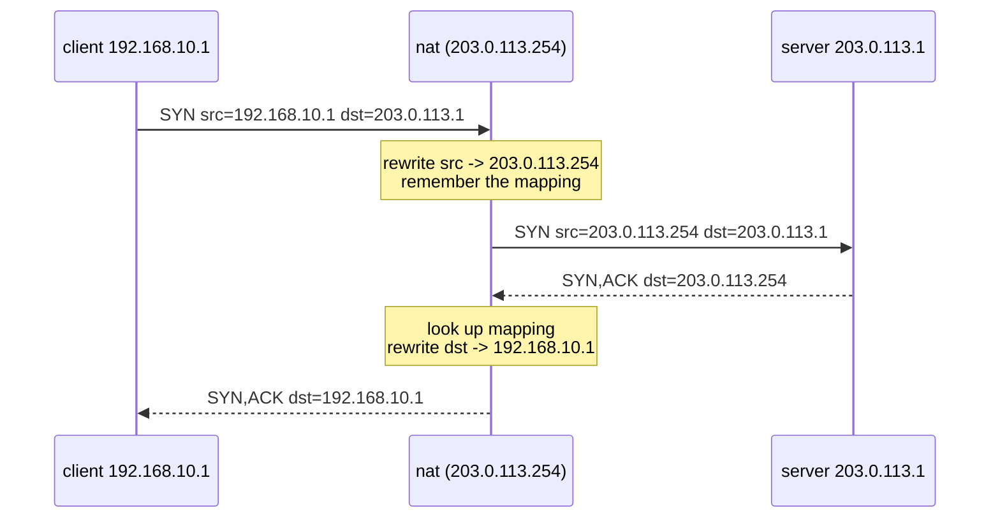

# Lab #20: NAT — One Public Address for Many

Expected time: 45 to 60 minutes  
日本語: 想定時間 45〜60分

Reading guide: [`../rfc-notes/nat-source-translation.md`](../rfc-notes/nat-source-translation.md)

Prerequisites: [TCP Lab 07](tcp-07-handshake-teardown.md), [Lab 19: traceroute and TTL](trace-19-traceroute-ttl.md)

## Goal

There are far more devices than public IPv4 addresses. **NAT** (Network Address Translation) is how a whole private network shares one public address: a router rewrites the **source address** of outbound packets to its own public address, remembers the mapping, and reverses it for the replies.

This lab shows the translation from both sides:

- a **private** client (`192.168.10.1`, RFC 1918) reaches a **public** server (`203.0.113.1`) through a masquerading NAT,
- from the **server's** point of view, the connection comes from the NAT's public address `203.0.113.254` — the client's private address is never seen,
- the NAT's **conntrack** table shows the mapping it keeps to route replies back.

日本語: デバイス数は public IPv4 アドレスよりずっと多い。**NAT**(Network Address Translation)は、private ネットワーク全体が1つの public アドレスを共有する仕組み。ルータが送出パケットの **送信元アドレス** を自分の public アドレスに書き換え、対応を覚えておき、応答で戻す。この Lab では、private な client(`192.168.10.1`, RFC 1918)が masquerade する NAT 経由で public な server(`203.0.113.1`)に到達し、**server から見ると接続元は NAT の public アドレス `203.0.113.254`**(client の private アドレスは見えない)、そして NAT の **conntrack** テーブルにその変換が記録される、という両側からの様子を見ます。

By the end, you should be able to explain this:

| Vantage point | Source address of the connection |
|---|---|
| client (itself) | `192.168.10.1` (its own private address) |
| **server / public wire** | `203.0.113.254` (the NAT — private address hidden) |
| NAT conntrack | maps `192.168.10.1:port` ⇄ `203.0.113.254:port` |

## What You Will Learn

理解したいこと:

- Why NAT exists (IPv4 address scarcity) and what "source NAT / masquerade" does.
- The difference between **private** (RFC 1918) and **public** (here, RFC 5737 doc) addresses.
- That the server never sees the private client address — only the NAT's public one.
- How the NAT keeps a **connection-tracking** table to send replies to the right inside host.
- Why inbound connections to a private host need extra config (port forwarding) — NAT is asymmetric.

This lab does not cover:

- Destination NAT / port forwarding, hairpin NAT, or NAT traversal (STUN/TURN).
- Carrier-grade NAT or NAT64/IPv6 transition.
- The security implications of NAT vs a real firewall.

日本語: NAT が存在する理由(IPv4 枯渇)、source NAT/masquerade の動き、private(RFC 1918)と public アドレスの違い、server が private アドレスを見ないこと、NAT が応答を正しい内側ホストへ返すための connection tracking、そして inbound は追加設定(port forwarding)が要る非対称性を学びます。

## RFCで読む場所

| RFC | 章 | 読むポイント |
|---|---|---|
| RFC 2663 | 2-4 | NAT の用語(NAT/NAPT、inside/outside、binding) |
| RFC 3022 | 2-3 | traditional NAT と NAPT(ポートも使う多重化) |
| RFC 1918 | 3 | private アドレス空間(10/8, 172.16/12, 192.168/16) |
| RFC 5737 | 3 | `203.0.113.0/24` が documentation(ここでは "public" 役) |

## 実験の全体像

client(private)、nat(private と public の2面)、server(public)の3ノード。

```text
client ------ 192.168.10.0/24 ------ nat ------ 203.0.113.0/24 ------ server
192.168.10.1                   192.168.10.254                     203.0.113.1
(private)                      203.0.113.254 (public)             (public)
```

client から server へ接続すると、nat が送出パケットの送信元を `203.0.113.254` に書き換える(MASQUERADE)。server は `203.0.113.254` から来たと認識する。



`192.168.10.0/24` は RFC 1918 private、`203.0.113.0/24` は RFC 5737 documentation(このLabでは "public" 役)。

## 必要なもの

推奨環境:

- Linux / WSL2 / Linux VM
- Docker
- containerlab

使用イメージ:

- `nicolaka/netshoot:latest`（`iptables`、`conntrack`、`curl`、`python3`、`tcpdump` 同梱）

追加イメージは不要。NAT は Linux の iptables MASQUERADE(run.sh が設定)。

## 実行手順

```bash
./scripts/labctl.sh run nat-20
```

### 1. 作業ディレクトリへ移動する

```bash
cd protocol-lab/examples/nat-20
```

### 2. 起動して NAT を設定する

```bash
sudo containerlab deploy -t nat-20.clab.yml
# nat: 転送 + 公開側インターフェースで送信元 NAT
docker exec clab-nat-20-nat sysctl -w net.ipv4.ip_forward=1
docker exec clab-nat-20-nat iptables -t nat -A POSTROUTING -o eth2 -j MASQUERADE
# client は public 網へ nat 経由
docker exec clab-nat-20-client ip route add 203.0.113.0/24 via 192.168.10.254
# server は private 網への route を持たない（それが NAT の狙い）
```

### 3. server で小さな HTTP サーバを起動する

```bash
docker exec -d clab-nat-20-server sh -c "cd /tmp && python3 -m http.server 8080"
```

### 4. client から接続し、server 側で送信元を見る

```bash
# server 側を capture
docker exec -d clab-nat-20-server tcpdump -i eth1 -n "tcp port 8080"
# client から取得
docker exec clab-nat-20-client curl -s -o /dev/null -w "%{http_code}\n" http://203.0.113.1:8080/
```

server 側の capture では、接続元が `203.0.113.254`(NAT の public)。client の `192.168.10.1` は**出てこない**。server 自身のログにも `203.0.113.254 - - [...]` と記録される。

### 5. NAT の変換テーブルを見る

```bash
docker exec clab-nat-20-nat conntrack -L | grep 8080
```

```text
tcp ... src=192.168.10.1 dst=203.0.113.1 sport=... dport=8080 \
        src=203.0.113.1 dst=203.0.113.254 sport=8080 dport=... [ASSURED]
```

前半が元の tuple(private client)、後半が応答で期待する tuple(宛先 = NAT public)。この対応で、返ってきた応答を正しい内側ホストへ戻す。

## 期待出力

- client: `HTTP 200`(public server に到達)。
- server 側 capture: 送信元 `203.0.113.254`。`192.168.10.1` は不在。
- server のログ: peer = `203.0.113.254`。
- NAT conntrack: `src=192.168.10.1 ... src=203.0.113.1 dst=203.0.113.254`。

## なぜそう動くのか

NAT は「IPv4 アドレスが足りない」問題への現実解。private アドレス(RFC 1918)は世界中で重複して使われるので、そのままでは public 網に出せない。NAT が出口で public アドレスに翻訳する。

- **source NAT / masquerade**: 出ていくパケットの送信元アドレス(と、NAPT では送信元ポートも)を、NAT の public アドレスに書き換える。`MASQUERADE` は出口インターフェースの IP を自動で使う版。
- **connection tracking**: 書き換えっぱなしでは応答を誰に返すか分からない。NAT は「元の (src, sport) ↔ 変換後」の対応を **conntrack** テーブルに覚える。応答が来たら、宛先を元の内側ホストへ書き戻す。ポート番号を使い分けることで、多数の内側ホストを1つの public IP に多重化できる(NAPT)。
- **server から見えないもの**: server に届くのは NAT の public アドレスだけ。内側の private アドレスやトポロジは隠れる。だから「1つの public IP の裏に何台いるか」は外から分からない。
- **非対称性**: 内→外は conntrack が自動で通す。しかし外→内(inbound)は、対応するエントリが無いので、そのままでは内側に届かない。特定サービスを公開するには **port forwarding**(destination NAT)を別途設定する必要がある。これが「NAT の内側は外から繋がりにくい」理由。

要点は、**NAT は送信元アドレスを書き換え、その対応を覚えることで、private 網を1つの public アドレスの裏に隠す**こと。

## 詰まりやすい点

- **NAT をファイアウォールと混同する**。NAT の主目的はアドレス変換。外から繋がりにくいのは副作用で、正式なフィルタリングは別(firewall)。
- **server が client の private アドレスを見ると思う**。見えるのは NAT の public アドレスだけ。
- **conntrack を忘れる**。変換の対応表が無いと応答を戻せない。NAT の心臓部。
- **inbound が自動で通ると思う**。内→外は通るが、外→内は port forwarding が要る(非対称)。
- **private アドレスの範囲**。10/8、172.16/12、192.168/16(RFC 1918)。これらは public に出せない。
- **ポート枯渇**。NAPT は送信元ポートで多重化するので、同時接続が非常に多いとポートが足りなくなることがある。

## 後片付け

```bash
sudo containerlab destroy -t nat-20.clab.yml --cleanup
```

`labctl.sh run nat-20` を使った場合は、スクリプトが最後に destroy する。

## 確認問題

1. NAT は何のために存在するか。source NAT(masquerade)は何を書き換えるか。
2. private アドレス(RFC 1918)の範囲を挙げよ。なぜそのまま public に出せないか。
3. server から見た接続元アドレスは何か。client の private アドレスはなぜ見えないか。
4. NAT が応答を正しい内側ホストへ戻せるのはなぜか。何を覚えているか。
5. 内→外は通るのに外→内は繋がりにくいのはなぜか。公開するには何が要るか。
6. 1つの public IP の裏に多数の内側ホストを収容できるのはなぜか(NAPT)。

## References

- [RFC 2663: IP Network Address Translator (NAT) Terminology and Considerations](https://www.rfc-editor.org/rfc/rfc2663)
- [RFC 3022: Traditional IP Network Address Translator (Traditional NAT)](https://www.rfc-editor.org/rfc/rfc3022)
- [RFC 1918: Address Allocation for Private Internets](https://www.rfc-editor.org/rfc/rfc1918)
- [RFC 5737: IPv4 Address Blocks Reserved for Documentation](https://www.rfc-editor.org/rfc/rfc5737)
- [iptables-extensions manual (MASQUERADE)](https://man7.org/linux/man-pages/man8/iptables-extensions.8.html)

## 検証済み実行ログ (2026-07-07)

このLabは実機で再現性を確認済みです。

実行環境:

- Ubuntu 26.04 LTS (kernel 7.0.0-27-generic, x86_64)
- Docker 29.1.3
- containerlab 0.77.0
- client / nat / server: `nicolaka/netshoot:latest`（iptables、conntrack、python3、tcpdump 同梱）

`PATH="/tmp/pl-shim:$PATH" ./scripts/labctl.sh run nat-20` で deploy → verify → destroy を実行し、`verification.json` は `"status": "verified"` を返した。

### client は public server に到達する

```text
$ docker exec clab-nat-20-client curl -s -o /dev/null -w "%{http_code}\n" http://203.0.113.1:8080/
200
```

### server から見た接続元は NAT の public アドレス（private は不在）

```text
$ docker exec clab-nat-20-server tcpdump -n -r server-side.pcap
11:15:22 IP 203.0.113.254.45508 > 203.0.113.1.8080: Flags [S], ...
11:15:22 IP 203.0.113.1.8080 > 203.0.113.254.45508: Flags [S.], ...
```

送信元は `203.0.113.254`(NAT の public)。client の private アドレス `192.168.10.1` は server 側 capture に**一度も現れない**(grep count = 0)。server 自身の HTTP ログにも `203.0.113.254` と記録された。

### NAT の conntrack が変換を保持している

```text
$ docker exec clab-nat-20-nat conntrack -L | grep 8080
tcp 6 ... src=192.168.10.1 dst=203.0.113.1 sport=45508 dport=8080 \
         src=203.0.113.1  dst=203.0.113.254 sport=8080 dport=45508 [ASSURED]
```

元の tuple(送信元 = private client `192.168.10.1`)と、応答で期待する tuple(宛先 = NAT public `203.0.113.254`)の対応。これで返ってきた応答を正しい内側ホストへ戻す。**NAT は送信元を書き換え、その対応を覚えることで、private 網を1つの public アドレスの裏に隠している。**

### Cleanup

```bash
containerlab destroy -t nat-20.clab.yml --cleanup
```
