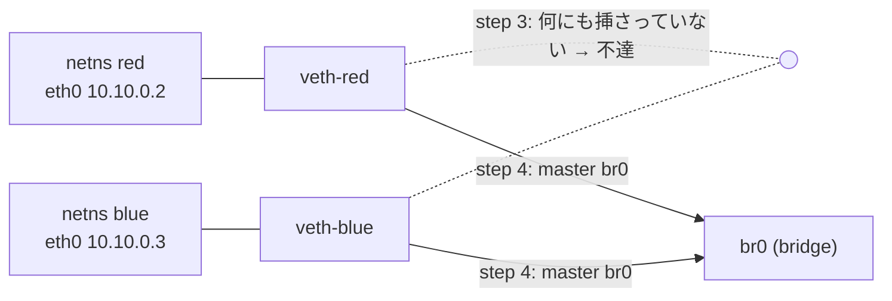

# Lab #43: Network Namespaces from Scratch — Building Container Networking by Hand

Expected time: 30 to 45 minutes  
日本語: 想定時間 30〜45分

Reading guide: [`../rfc-notes/network-namespaces.md`](../rfc-notes/network-namespaces.md)

Prerequisite: [Lab 24: ARP — IPv4 Address Resolution](arp-24-address-resolution.md)

## Goal

Every lab so far ran inside containers, and the containers just *had* networking. This lab takes that away and rebuilds it from three primitives: a **network namespace** (a private copy of the whole network stack), a **veth pair** (a cable with two ends), and a **bridge** (a software switch).

Two namespaces, `red` and `blue`, are given addresses on the same subnet and brought up — and still cannot reach each other, because the host-side ends of their cables are plugged into nothing. Adding a bridge and enslaving both ends makes the *same* ping succeed. Nothing about this is Docker-specific: it is what `docker run` does for you.

日本語: ここまでの Lab はすべてコンテナの中で動き、ネットワークは「最初からあるもの」でした。この Lab はそれを取り上げ、3つの部品——**network namespace**(ネットワークスタック丸ごとの private なコピー)、**veth pair**(両端を持つケーブル)、**bridge**(ソフトウェアの switch)——から組み直します。`red` と `blue` の2つの namespace に同じサブネットのアドレスを与えて up にしても、まだ互いに届きません。ケーブルの host 側の端がどこにも挿さっていないからです。bridge を作って両端を接続すると、*同じ* ping が通ります。これは Docker 固有の話ではなく、`docker run` が代わりにやっていることそのものです。

By the end, you should be able to explain this:

| stage | red → blue | why |
|---|---|---|
| addressed and up, no bridge | 100% loss, ARP `INCOMPLETE` | cables dangle; nothing forwards the broadcast |
| both ends enslaved to `br0` | 0% loss, ARP `REACHABLE` | the switch exists; the frame has a path |

## What You Will Learn

理解したいこと:

- What a network namespace actually contains, and why two of them can both own an `eth0`.
- How a veth pair joins two namespaces, and why one end stays on the host side.
- Why correct addressing is not connectivity.
- What a Linux bridge adds, and what it learns from the frames it forwards.
- That a container's networking is these three primitives and nothing more.

This lab does not cover: reaching the outside world (NAT/masquerade, default routes out), IPv6 SLAAC, bridge STP, or the non-network namespace types (PID, mount, user).

日本語: この Lab では外の世界への到達(NAT/masquerade、外向きデフォルトルート)、IPv6 SLAAC、bridge の STP、network 以外の namespace(PID/mount/user)は扱いません。

## RFCで読む場所

このLabは単一の RFC ではなくカーネルの仕組みなので、man page を主資料にします。

| 資料 | 読むポイント |
|---|---|
| network_namespaces(7) | namespace が何を private に持つか |
| veth(4) | 対になった2インターフェースの意味 |
| ip-netns(8) | `ip netns add` / `exec` の効果 |
| IEEE 802.1D | bridge の learning と flooding |
| RFC 1918 | Lab のアドレスが private 用であること |

## 実験の全体像

すべて1つの特権コンテナの中で組み立てます。**このLabはあなたのマシンに root を要求しません**——コンテナ自身が「解体される host」の役です。

```text
                  [ lab container = "the host" ]

   netns red                                          netns blue
  +-----------+                                      +-----------+
  |   eth0    |                                      |   eth0    |
  | 10.10.0.2 |                                      | 10.10.0.3 |
  +-----+-----+                                      +-----+-----+
        |  veth pair                        veth pair |
  +-----+-----+                                      +-----+-----+
  | veth-red  |------+                        +------| veth-blue |
  +-----------+      |                        |      +-----------+
                     +------[  br0  ]---------+
                        step 4 で初めて登場
```



アドレスは `10.10.0.0/24`(RFC 1918)。

## 必要なもの

推奨環境:

- Linux / WSL2 / Linux VM
- Docker

containerlab は不要です。手で配線することがこの Lab の主題なので、トポロジファイルもありません。

使用イメージ:

- `protocol-lab/netns-lab:alpine3.21`（run.sh が Dockerfile からビルド。`iproute2` / `iputils` / `tcpdump` / `bridge-utils`）

## 実行手順

```bash
./scripts/labctl.sh run netns-43
```

### 1. 作業ディレクトリへ移動する

```bash
cd protocol-lab/examples/netns-43
```

### 2. イメージをビルドして実行する

```bash
docker build -t protocol-lab/netns-lab:alpine3.21 .
docker run --rm --privileged protocol-lab/netns-lab:alpine3.21
```

`--privileged` が namespace と bridge の作成を許可します。作られるものはすべてこのコンテナの network namespace の中にあり、コンテナと一緒に消えます。

### 3. 手順を目で追う

`build-topology.sh` が7段階で組み立てます。特に見るべきは **step 3**(bridge 前の失敗)と **step 5**(bridge 後の成功)。同じ ping コマンドで結果が変わります。

### 4. 自分で1行ずつ叩く

```bash
docker run --rm -it --privileged protocol-lab/netns-lab:alpine3.21 sh
```

シェルに入って `build-topology.sh` の中身を上から順に打つと、どの1行で疎通が生まれるかが分かります。

## 期待出力

- step 1: `red` は `lo` を1つ持つだけで、ルーティングテーブルは空。
- step 3: `2 packets transmitted, 0 received, 100% packet loss`、ARP は `INCOMPLETE`。
- step 5: `3 packets transmitted, 3 received, 0% packet loss`、ARP は `REACHABLE`。
- step 6: FDB に2エントリ(`veth-red` と `veth-blue` に1つずつ)。
- step 7: 両 namespace に `eth0` があり、ifindex もアドレスも別。

## なぜそう動くのか

**network namespace** は「ネットワークスタック丸ごとの private なコピー」です。

- **namespace が private に持つもの**: インターフェース、ルーティングテーブル、ARP/neighbour キャッシュ、netfilter のルール、ソケットのポート空間。だから `red` と `blue` が両方 `eth0` を名乗れて衝突しません。名前は namespace の *中で* 一意ならよい。Lab の step 2 で peer を一度 `tmp-red` という名前で作り、namespace に移してから `eth0` に改名しているのはこのためです(コンテナ自身が既に `eth0` を持っているので、移す前は名前が衝突する)。
- **veth は2つで1組**: `ip link add veth-red type veth peer name tmp-red` は、背中合わせに結合した2つのインターフェースを作ります。片方に入ったフレームは必ずもう片方から出る。片端を namespace に移しても対は切れません——むしろそれが veth の使い道です。
- **設定と疎通は別**: step 3 の時点で、両 namespace はアドレスを持ち、up で、同じ `/24` にいて、on-link ルートも持っています。それでも通らない。`red` が `10.10.0.3` を解決しようと出した **ARP request(broadcast)** は `veth-red` から出て host 側に着きますが、そこには **それを他のポートへ複製する主体がいない**。だから答えが返らず、neighbour は `INCOMPLETE` のまま。**足りないのは設定ではなく switch です**。
- **bridge が switch になる**: `ip link set veth-red master br0` で host 側の端を bridge に enslave すると、bridge が受けたフレームを他のポートへ転送するようになります。宛先が未知なら全ポートへ **flood**、これで ARP が通り、`blue` が応答し、ping が成立します。
- **bridge は学習する**: 転送のたびに bridge は **送信元 MAC** と「それが入ってきたポート」を FDB に記録します。step 6 で `red` の MAC が `veth-red` に、`blue` の MAC が `veth-blue` に紐づいているのはこの学習の結果です(この表の中身は Lab 44 で解体します)。
- **これが `docker run` の中身**: Docker はコンテナごとに namespace を作り、veth を1本張り、host 側の端を `docker0` bridge に挿します。この Lab との差は、Docker がさらに **IPAM**(アドレスの払い出し)、**外向きの default route と masquerade**、**DNS の設定** を面倒みてくれる点だけです。ネットワークの骨格は同じものです。

要点は、**コンテナのネットワークは魔法ではなく、namespace + veth + bridge の3部品**だということ。そして **3つ目が無いと、他の2つがどれだけ正しくても通らない**。

## 詰まりやすい点

- **「設定したのに通らない」**。step 3 がまさにそれ。`ip addr` と `ip link set up` は疎通を作りません。`bridge link show` で「そもそも挿さっているか」を見る。
- **host 側の端を up にし忘れる**。`veth-red` が down だと、bridge に enslave しても通りません。両端とも up が必要。
- **名前の衝突**。既に `eth0` がある側で `peer name eth0` を作ろうとすると `RTNETLINK answers: File exists`。namespace に移してから改名する。
- **bridge 自体を up にし忘れる**。`ip link set br0 up` が抜けると、ポートを挿しても転送しません。
- **namespace を消し忘れる**。`ip netns del red` で消えます。veth はペアの片方を消せば両方消えます。
- **`ip netns exec` を隔離だと思う**。これはネットワークスタックを切り替えるだけで、ファイルシステムもプロセスも共有のままです。
- **`--privileged` なしで動かす**。namespace と bridge の作成には CAP_SYS_ADMIN が要ります。

## 後片付け

```bash
docker rm -f protocol-lab-netns-43
```

`labctl.sh run netns-43` を使った場合は、スクリプトが最後に削除します。コンテナが消えれば namespace・veth・bridge もすべて一緒に消えます(host 側には何も残りません)。

## 確認問題

1. network namespace が private に持つものを4つ挙げよ。
2. なぜ `red` と `blue` が両方 `eth0` を名乗れるのか。
3. step 3 で、両者が同じサブネットに正しく設定されているのに通らないのはなぜか。何が足りないのか。
4. step 3 の neighbour が `INCOMPLETE` である理由を、ARP の動きで説明せよ。
5. bridge はフレームのどのフィールドから何を学習するか。宛先が未知のときどうするか。
6. この Lab と `docker run` の差を3つ挙げよ。
7. veth の片端だけを削除するとどうなるか。

## References

- [network_namespaces(7)](https://man7.org/linux/man-pages/man7/network_namespaces.7.html)
- [ip-netns(8)](https://man7.org/linux/man-pages/man8/ip-netns.8.html)
- [veth(4)](https://man7.org/linux/man-pages/man4/veth.4.html)
- [ip-link(8)](https://man7.org/linux/man-pages/man8/ip-link.8.html)
- [bridge(8)](https://man7.org/linux/man-pages/man8/bridge.8.html)
- [RFC 1918: Address Allocation for Private Internets](https://www.rfc-editor.org/rfc/rfc1918)

## 検証済み実行ログ (2026-08-06)

このLabは実機で再現性を確認済みです。

実行環境:

- Ubuntu 26.04 LTS (kernel 7.0.0-28-generic, x86_64)
- Docker 29.1.3
- lab container: `protocol-lab/netns-lab:alpine3.21`（Alpine 3.21 + iproute2 6.11.0）
- containerlab は使用しない（手で配線するため）

`./scripts/labctl.sh run netns-43` で build → deploy → verify → destroy を実行し、`verification.json` は `"status": "verified"` を返した。

### 生まれたての namespace は空

```text
+ ip netns exec red ip link show
1: lo: <LOOPBACK> mtu 65536 qdisc noop state DOWN mode DEFAULT group default qlen 1000
    link/loopback 00:00:00:00:00:00 brd 00:00:00:00:00:00
+ ip netns exec red ip route show || true
```

`lo` が1つ、しかも DOWN。ルーティングテーブルは空(出力なし)。

### 設定は済んでいる

```text
+ ip netns exec red ip addr show eth0
3: eth0@if4: <BROADCAST,MULTICAST,UP,LOWER_UP> mtu 1500 qdisc noqueue state UP group default qlen 1000
    link/ether e6:25:f8:56:20:85 brd ff:ff:ff:ff:ff:ff link-netnsid 0
    inet 10.10.0.2/24 scope global eth0
+ ip netns exec red ip route show
10.10.0.0/24 dev eth0 proto kernel scope link src 10.10.0.2
```

アドレスも on-link ルートも入り、`UP,LOWER_UP` になっている。

### それでも通らない（bridge 以前）

```text
+ ip netns exec red ping -c 2 -W 1 10.10.0.3
PING 10.10.0.3 (10.10.0.3) 56(84) bytes of data.

--- 10.10.0.3 ping statistics ---
2 packets transmitted, 0 received, 100% packet loss, time 1006ms

+ ip netns exec red ip neigh show
10.10.0.3 dev eth0 INCOMPLETE
```

**100% loss**、neighbour は **`INCOMPLETE`**。`red` は ARP を出したが誰も答えていない——host 側で broadcast を他のポートへ運ぶ主体がいないため。

### bridge を足した直後、同じ ping が通る

```text
+ ip link add br0 type bridge
+ ip link set br0 up
+ ip link set veth-red master br0
+ ip link set veth-blue master br0

+ ip netns exec red ping -c 3 -W 1 10.10.0.3
64 bytes from 10.10.0.3: icmp_seq=1 ttl=64 time=18.0 ms
64 bytes from 10.10.0.3: icmp_seq=2 ttl=64 time=0.038 ms
64 bytes from 10.10.0.3: icmp_seq=3 ttl=64 time=0.024 ms

--- 10.10.0.3 ping statistics ---
3 packets transmitted, 3 received, 0% packet loss, time 2065ms

+ ip netns exec red ip neigh show
10.10.0.3 dev eth0 lladdr ee:17:81:8f:98:02 REACHABLE
```

`INCOMPLETE` → **`REACHABLE`**。1発目だけ 18.0ms かかり、以降 0.02〜0.04ms なのは、初回に ARP の往復(flood → 応答 → 学習)が挟まるため。

### bridge が学習した内容

```text
+ bridge fdb show br br0 | grep -v permanent
e6:25:f8:56:20:85 dev veth-red master br0
ee:17:81:8f:98:02 dev veth-blue master br0
```

`red` の MAC が `veth-red` ポートに、`blue` の MAC が `veth-blue` ポートに学習されている。以後この2アドレス宛は flood されず、該当ポートだけに転送される。

### 2つの `eth0` は別物

```text
+ ip netns exec red  ip -o addr show eth0
3: eth0    inet 10.10.0.2/24 scope global eth0
+ ip netns exec blue ip -o addr show eth0
5: eth0    inet 10.10.0.3/24 scope global eth0
```

同じ名前、違う ifindex(3 と 5)、違うアドレス。名前は namespace の中でだけ一意であればよい。

### Cleanup

```bash
docker rm -f protocol-lab-netns-43
```
