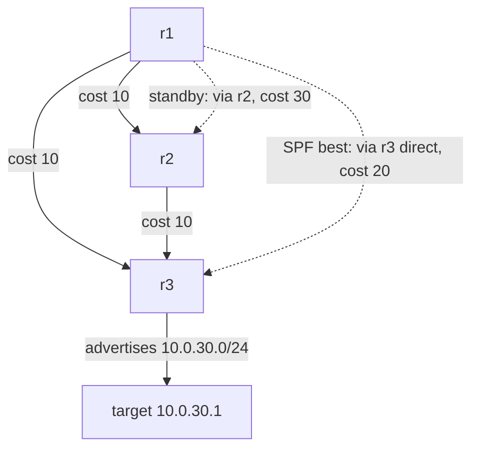

# Lab #34: OSPF — Flood the Map, Compute the Shortest Path

Expected time: 45 to 60 minutes  
日本語: 想定時間 45〜60分

Reading guide: [`../rfc-notes/ospf.md`](../rfc-notes/ospf.md)

Prerequisite: [BGP Lab 01: Announcing a Prefix over eBGP](bgp-01-ebgp-announce.md)

## Goal

Labs 01–04 used **BGP**, the path-vector protocol that carries reachability *between* autonomous systems. This lab introduces the other half of routing: an **interior gateway protocol**. **OSPF** is link-state — every router floods a description of its links, all routers build the *same map*, and each runs **Dijkstra (SPF)** to compute shortest paths by **cost**.

Three routers form a triangle in OSPF area 0, with a target network behind r3:

- r1 forms **Full** adjacencies with r2 and r3 (link-state databases synced),
- SPF picks the **direct r1-r3 link** (cost 20) over the two-hop r1-r2-r3 path (cost 30) to reach the target,
- when the direct link **fails**, OSPF floods the change, every router re-runs SPF, and r1 **reconverges** onto the path via r2 (cost 30) — the target stays reachable at the same address.

日本語: Lab 01–04 は AS *間* の到達性を運ぶ path-vector の **BGP** を使いました。この Lab はもう半分、**IGP** を導入します。**OSPF** は link-state——各ルータが自分のリンクを flood し、全ルータが *同じ地図* を作り、各自が **Dijkstra(SPF)** で **cost** 最短経路を計算します。3台のルータが area 0 で三角形を組み、r3 の裏に target 網があります。r1 は r2・r3 と **Full** 隣接(LSDB 同期)を作り、SPF は target へ **直リンク r1-r3(cost 20)** を、2ホップの r1-r2-r3(cost 30)より優先。直リンクが **落ちる** と OSPF が変化を flood し、全ルータが SPF を再計算、r1 は r2 経由(cost 30)へ **再収束**——target は同じアドレスのまま到達可能。

By the end, you should be able to explain this:

| State | r1's route to the target | cost |
|---|---|---|
| all links up | via r3 direct (10.0.13.2) | 20 |
| direct r1-r3 down | via r2 (10.0.12.2) | 30 |

## What You Will Learn

理解したいこと:

- How OSPF routers form **adjacencies** (Hello → Full) and why /30 links use **point-to-point** type.
- How each router floods **LSAs** so everyone holds the same **link-state database**.
- How **SPF (Dijkstra)** picks paths by **cost**, not hop count.
- How a link failure triggers reflooding + **reconvergence**.
- How OSPF (link-state IGP) differs from BGP (path-vector EGP).

This lab does not cover:

- Multiple OSPF areas, ABRs, and route summarization.
- DR/BDR election on broadcast segments in depth.
- OSPFv3 (IPv6), authentication, or route redistribution.

日本語: OSPF の隣接形成(Hello→Full)と /30 リンクを point-to-point 型にする理由、各ルータが LSA を flood して同一 LSDB を持つ仕組み、SPF(Dijkstra)が hop 数でなく cost で選ぶこと、リンク障害での再 flood と再収束、OSPF(link-state IGP)と BGP(path-vector EGP)の違いを学びます。複数 area/ABR/集約、DR/BDR 選挙の詳細、OSPFv3・認証・再配布は扱いません。

## RFCで読む場所

| 資料 | 読むポイント |
|---|---|
| RFC 2328 §7,§10 | Hello、隣接状態機械(→Full)、network type |
| RFC 2328 §12,§16 | LSA/LSDB と SPF(Dijkstra) |
| RFC 2328 §1.2 | area(この Lab は単一 area 0) |
| RFC 5737 / RFC 1918 | Lab のアドレスがローカル用であること |

## 実験の全体像

r1・r2・r3 が三角形。target 網(10.0.30.0/24)は r3 の裏。

```text
              r1
    (eth1)  /    \  (eth2)
   cost 10 /      \ cost 10
          r2 ------ r3 --- target 10.0.30.1
             cost 10   (r3 が 10.0.30.0/24 を OSPF に広告)
```

全リンク cost 10。r1→target は 直 r1-r3(10 + r3-target 10 = 20)が、r1-r2-r3(10+10+10 = 30)より安い。



`10.0.0.0/8` はローカル閉域。

## 必要なもの

推奨環境:

- Linux / WSL2 / Linux VM
- Docker
- containerlab

使用イメージ:

- `frrouting/frr:latest`（r1・r2・r3 の OSPF）
- `nicolaka/netshoot:latest`（target ホスト）

追加イメージは不要。

## 実行手順

```bash
./scripts/labctl.sh run ospf-34
```

### 1. 作業ディレクトリへ移動する

```bash
cd protocol-lab/examples/ospf-34
```

### 2. 起動する

```bash
sudo containerlab deploy -t ospf-34.clab.yml
```

各ルータは area 0 で OSPF を動かす。ルータ間 /30 リンクは `ip ospf network point-to-point` にしてあり、DR 選挙なしで即 Full になる。

### 3. 隣接と地図を確認する

```bash
docker exec clab-ospf-34-r1 vtysh -c "show ip ospf neighbor"   # r2, r3 が Full
docker exec clab-ospf-34-r1 vtysh -c "show ip ospf database"   # Router LSA ×3(同じ地図)
```

### 4. SPF が選んだ経路を見る（直リンク、cost 20）

```bash
docker exec clab-ospf-34-r1 vtysh -c "show ip route ospf"
docker exec clab-ospf-34-r1 ip route get 10.0.30.1   # via 10.0.13.2 (r3 direct)
docker exec clab-ospf-34-r1 ping -c2 10.0.30.1
```

`O>* 10.0.30.0/24 [110/20] via 10.0.13.2` が見える。

### 5. 直リンクを落として再収束を見る

```bash
docker exec clab-ospf-34-r1 ip link set eth2 down
sleep 5
docker exec clab-ospf-34-r1 ip route get 10.0.30.1   # 今度は via 10.0.12.2 (r2)
docker exec clab-ospf-34-r1 vtysh -c "show ip route ospf"   # [110/30]
docker exec clab-ospf-34-r1 ping -c2 10.0.30.1       # まだ届く
```

### 6. 戻す

```bash
docker exec clab-ospf-34-r1 ip link set eth2 up
```

## 期待出力

- `show ip ospf neighbor`: r2(2.2.2.2)と r3(3.3.3.3)が **Full**。
- `show ip ospf database`: Router LSA が3つ(各ルータ1つ、全員同じ)。
- 障害前: `O>* 10.0.30.0/24 [110/20] via 10.0.13.2`(直リンク)、ping 到達。
- 障害後: `[110/30] via 10.0.12.2`(r2 経由)、ping なお到達。

## なぜそう動くのか

**OSPF** は「地図を flood し、全員が同じ最短経路木を計算する」link-state の IGP。

- **隣接**: 各ルータは **Hello** で隣を見つけ、状態を Down→…→**Full** と進めて LSDB を同期する。Full が「完全に地図を共有した隣接」。ルータ間の /30 リンクは **point-to-point** 型にすると DR 選挙なしで即 Full になる(Ethernet 既定の broadcast 型だと DR/BDR 選挙があり、DROther 同士は 2-Way 止まりになりやすい)。
- **地図を配る**: 各ルータは自分のリンク(相手・cost)を **Router LSA** に書いて area 全体に flood する。全員が同一の **LSDB** を持つ。ここが link-state の核心——BGP が「宛先への道(AS_PATH)」を配るのに対し、OSPF は **地図そのもの**を配る。
- **SPF**: 各ルータは LSDB を入力に **Dijkstra** を回し、自分を根とする最短経路木を作る。距離は **cost の合計**(hop 数ではない)。r1→target は 直 20 < 経由 30 なので直リンクを選ぶ。
- **再収束**: 直リンクが落ちると、隣接が切れ、関係ルータが更新 LSA を flood。各ルータが LSDB を更新して **SPF を再計算**し、r1 は r2 経由(cost 30)へ切り替える。宛先は不変で到達性は保たれる。

要点は、**リンク状態(地図)を配って各自が Dijkstra で最短経路を計算し、変化があれば再計算する**こと。BGP(path-vector/AS 間)と対をなす、ドメイン内の IGP。

## 詰まりやすい点

- **hop 数で選ぶと思う**。OSPF は **cost** で選ぶ。低速リンクほど高 cost。
- **Ethernet で即 Full と思う**。broadcast 型は DR 選挙があり DROther 同士は 2-Way 止まり。ルータ間 /30 は point-to-point 型にする(この Lab はそうしている)。
- **OSPF が経路を配ると思う**。配るのは **リンク状態**。経路は各自が SPF で計算する。
- **cost 同点で1本と思う**。同点は ECMP(Lab 32)になりうる。
- **BGP と混同する**。BGP は path-vector/AS 間、OSPF は link-state/ドメイン内。役割が違う。
- **収束は即時と思う**。Hello/dead 間隔と SPF 再計算に時間がかかる(この環境で数秒)。

## 後片付け

```bash
sudo containerlab destroy -t ospf-34.clab.yml --cleanup
```

`labctl.sh run ospf-34` を使った場合は、スクリプトが最後に destroy する。

## 確認問題

1. OSPF の隣接(adjacency)とは何か。Full 状態は何を意味するか。
2. ルータ間 /30 リンクを point-to-point 型にするのはなぜか。broadcast 型だと何が起きるか。
3. OSPF は経路そのものを配るのか、地図を配るのか。SPF はどこで走るか。
4. r1 が target へ直リンク(cost 20)を選ぶのはなぜか。hop 数ではないと言えるのはなぜか。
5. 直リンク障害時、r1 が r2 経由に切り替えるまでに何が起きるか(flood→SPF)。
6. OSPF(IGP, link-state)と BGP(EGP, path-vector)を、配るものと経路計算の観点で対比せよ。

## References

- [RFC 2328: OSPF Version 2](https://www.rfc-editor.org/rfc/rfc2328)
- [RFC 5340: OSPF for IPv6 (OSPFv3)](https://www.rfc-editor.org/rfc/rfc5340)
- [FRRouting OSPF documentation](https://docs.frrouting.org/en/latest/ospfd.html)
- [RFC 5737: IPv4 Address Blocks Reserved for Documentation](https://www.rfc-editor.org/rfc/rfc5737)

## 検証済み実行ログ (2026-07-07)

このLabは実機で再現性を確認済みです。

実行環境:

- Ubuntu 26.04 LTS (kernel 7.0.0-27-generic, x86_64)
- Docker 29.1.3
- containerlab 0.77.0
- r1 / r2 / r3: `frrouting/frr:latest`（ospfd）
- target: `nicolaka/netshoot:latest`

`PATH="/tmp/pl-shim:$PATH" ./scripts/labctl.sh run ospf-34` で deploy → verify → destroy を実行し、`verification.json` は `"status": "verified"` を返した。

### Full 隣接と同一 LSDB

```text
Neighbor ID     Pri State           Address         Interface
2.2.2.2           1 Full/-          10.0.12.2       eth1:10.0.12.1
3.3.3.3           1 Full/-          10.0.13.2       eth2:10.0.13.1
```

r1 は r2(2.2.2.2)・r3(3.3.3.3)と **Full** 隣接。`show ip ospf database` には Router LSA が3つ(各ルータ1つ)——全員が同じ地図を持つ。

### SPF は cost 最短(直リンク)を選ぶ

```text
O>* 10.0.30.0/24 [110/20] via 10.0.13.2, eth2      # 直 r1-r3、cost 20
# kernel: 10.0.30.1 via 10.0.13.2 dev eth2
```

target への OSPF 経路は cost **20**(直リンク r1-r3)。2ホップの r1-r2-r3(cost 30)より安いので直リンクが選ばれた。ping 到達。

### 直リンク障害 → 再収束（cost 30, via r2）

`r1 の eth2(直リンク)を down` にすると、約1秒で:

```text
O>* 10.0.30.0/24 [110/30] via 10.0.12.2, eth1      # r2 経由、cost 30
# kernel: 10.0.30.1 via 10.0.12.2 dev eth1
```

OSPF が変化を flood → 各ルータが SPF 再計算 → r1 は r2 経由(cost 30)へ **再収束**。target は同じ 10.0.30.1 のまま到達可能だった。hop 数ではなく **cost** で選び、障害時は地図を更新して SPF をやり直す——link-state の動作そのもの。

### Cleanup

```bash
containerlab destroy -t ospf-34.clab.yml --cleanup
```
