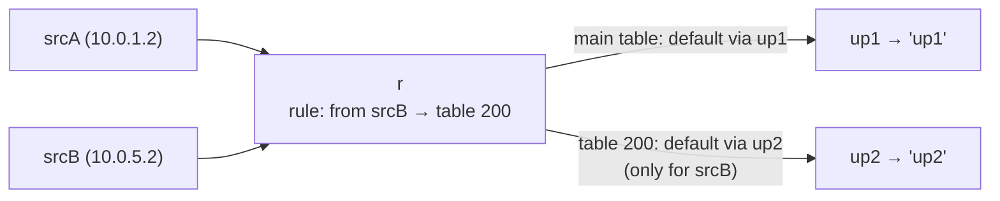

# Lab #38: Policy Routing — Choosing the Path by Source, Not Just Destination

Expected time: 40 to 55 minutes  
日本語: 想定時間 40〜55分

Reading guide: [`../rfc-notes/policy-routing.md`](../rfc-notes/policy-routing.md)

Prerequisite: [Lab 34: OSPF — Flood the Map, Compute the Shortest Path](ospf-34-link-state.md)

## Goal

Every routing lab so far has picked the path by **destination**. Policy routing breaks that assumption: the forwarding decision can depend on the **source** (or the incoming interface, a firewall mark, ToS…). A router puts a **rule database** in front of its routing tables, and a rule chooses *which table* to consult per packet.

Two source hosts sit behind a router with two uplinks; both uplinks host the **same** service address (`10.0.100.1`):

- **baseline** (destination-based): the router's main table sends `10.0.100.1` via up1, so **both** srcA and srcB reach **up1**,
- add one **`ip rule from srcB lookup 200`** (table 200's default goes via up2),
- now srcA still reaches **up1** but srcB reaches **up2** — the *same destination* routed over different uplinks by **source**.

日本語: これまでの経路 Lab はすべて **宛先** で経路を選びました。ポリシールーティングはその前提を崩し、転送判断を **送信元**(や入力インターフェース、firewall mark、ToS…)に依らせられます。ルータはルーティングテーブルの前に **規則データベース** を置き、規則がパケットごとに *どのテーブルを引くか* を選ぶ。2つの送信元ホストがルータの後ろにあり、2つのアップリンクが **同じ** サービスアドレス(`10.0.100.1`)を持ちます。**ベースライン**(宛先ベース)では main table が `10.0.100.1` を up1 経由にするので **両方** up1 に届く。**`ip rule from srcB lookup 200`**(table 200 の default は up2 経由)を1つ足すと、srcA は **up1** のまま、srcB は **up2** に——*同じ宛先* が **送信元** で別アップリンクに。

By the end, you should be able to explain this:

| | srcA → 10.0.100.1 | srcB → 10.0.100.1 |
|---|---|---|
| baseline (destination-based) | up1 | up1 |
| with `ip rule from srcB` | up1 | up2 |

## What You Will Learn

理解したいこと:

- That Linux has **multiple routing tables** and a **rule database** in front of them.
- How `ip rule` selects a table by **source** (or iif, fwmark, ToS).
- Why ordinary routing sends the same destination one way regardless of source.
- How policy routing implements **multi-homing** ("this LAN uses ISP-A, that one ISP-B").
- Rule priority order and how unmatched packets fall through to `main`.

This lab does not cover:

- fwmark-based rules (iptables mark → `ip rule fwmark`) in depth.
- Return-path asymmetry / RPF interplay beyond a mention.
- Dynamic multipath (ECMP, Lab 32) — that hashes, this selects by rule.

日本語: Linux の複数ルーティングテーブルと前段の rule データベース、`ip rule` が source(や iif/fwmark/ToS)でテーブルを選ぶ仕組み、通常の経路が source によらず同じ宛先を1経路にする理由、policy routing によるマルチホーミング、規則の優先度と main への fall-through を学びます。fwmark 規則の詳細、RPF 非対称の深掘り、ECMP(hash)は扱いません。

## RFCで読む場所

| 資料 | 読むポイント |
|---|---|
| ip-rule(8) | rule データベース、優先度、from/iif/fwmark |
| ip-route(8) `table` | 複数テーブルの作成・参照 |
| RFC 3704 | マルチホーミングで source が効く理由 |
| RFC 5737 / RFC 1918 | Lab のアドレスがローカル用であること |

## 実験の全体像

srcA・srcB がルータ r の後ろ。r は up1・up2 の2アップリンク。up1/up2 は同じ `10.0.100.1` を lo に持ち、それぞれ自分の名前を返す HTTP responder を動かす。

```text
 srcA (10.0.1.2) --- r --- up1 (lo 10.0.100.1)  → "up1"
 srcB (10.0.5.2) --/ \--- up2 (lo 10.0.100.1)  → "up2"
```



`10.0.0.0/8` はローカル閉域。

## 必要なもの

推奨環境:

- Linux / WSL2 / Linux VM
- Docker
- containerlab

使用イメージ:

- `nicolaka/netshoot:latest`（`ip`、`curl`、`python3` 同梱）

追加イメージは不要。

## 実行手順

```bash
./scripts/labctl.sh run pbr-38
```

### 1. 作業ディレクトリへ移動する

```bash
cd protocol-lab/examples/pbr-38
```

### 2. 起動して responder を立てる

```bash
sudo containerlab deploy -t pbr-38.clab.yml
docker exec -d clab-pbr-38-up1 python3 /responder.py up1
docker exec -d clab-pbr-38-up2 python3 /responder.py up2
```

r の main table は `default via 10.0.2.2`(up1)。両 uplink は `10.0.100.1` を持つ。

### 3. ベースライン（宛先ベース）を見る

```bash
docker exec clab-pbr-38-srcA curl -s http://10.0.100.1/   # up1
docker exec clab-pbr-38-srcB curl -s http://10.0.100.1/   # up1
```

送信元が違っても、同じ宛先なので両方 up1。

### 4. ポリシールートを足す（srcB を table 200 → up2 へ）

```bash
docker exec clab-pbr-38-r sh -c '
  ip route replace default via 10.0.3.2 table 200
  ip rule add from 10.0.5.2 lookup 200
'
docker exec clab-pbr-38-r ip rule
docker exec clab-pbr-38-r ip route show table 200
```

### 5. もう一度見る

```bash
docker exec clab-pbr-38-srcA curl -s http://10.0.100.1/   # up1（不変）
docker exec clab-pbr-38-srcB curl -s http://10.0.100.1/   # up2（source で変わった）
```

## 期待出力

- ベースライン: srcA=up1、srcB=up1。
- `ip rule`: `from 10.0.5.2 lookup 200` が main より前(prio 32765)。
- `ip route show table 200`: `default via 10.0.3.2`(up2)。
- ポリシー後: srcA=up1、srcB=up2(同じ宛先 `10.0.100.1`)。

## なぜそう動くのか

**ポリシールーティング**は「経路判断を宛先以外にも依らせる」。

- **通常の転送**: 宛先アドレスを1つのテーブル(`main`)で引き、最長一致を使う。送信元が誰でも同じ宛先なら同じ経路。ベースラインで srcA も srcB も `10.0.100.1` を main の `default via up1` で引くので、両方 up1。
- **複数テーブル + rule データベース**: Linux は複数の routing table を持てる(`ip route ... table 200`)。その前段に **rule データベース**(`ip rule`)があり、「どのパケットがどのテーブルを引くか」を **優先度順** に決める。最初に一致した規則のテーブルで経路解決する。
- **source で振る**: `ip rule add from 10.0.5.2 lookup 200` は「送信元が srcB なら table 200 を引け」。table 200 は `default via up2`。だから srcB のパケットは up2 へ。srcA はこの規則に一致せず、`main`(via up1)に落ちる。**同じ宛先 `10.0.100.1` が、送信元によって別アップリンクに** なる。
- **セレクタ**: source の他に、入力インターフェース(iif)、firewall mark(fwmark、iptables と連携)、ToS/DSCP でも振れる。宛先以外の情報を経路に持ち込める。
- **どこで使うか**: マルチホーミング(「この LAN は ISP-A、あの LAN は ISP-B」)、VPN スプリット、帯域分離。戻りも source に合った出口から出して非対称を避ける(RFC 3704)。

要点は、**ルーティングテーブルの前に規則を置き、source 等でテーブルを選ぶことで、同じ宛先でも経路を変えられる**こと。宛先一択だった経路判断の拡張。

## 詰まりやすい点

- **経路は宛先だけで決まると思う**。policy routing は source/iif/mark でも決める。
- **rule と route を混同する**。**rule** はどのテーブルを引くか、**route** はテーブル内の経路。2段構え。
- **規則の優先度**。小さい順に評価し最初の一致が勝つ。`main`(32766)より前に置かないと効かない。
- **戻り経路の非対称**。source で送っても戻りが別経路だと、RPF やステートフル機器で落ちうる(Lab 36)。実運用では戻りも設計する。
- **fwmark 連携**。L4/アプリ単位で振るには iptables で mark → `ip rule fwmark`。
- **テーブルの掃除**。`ip rule del` / `ip route flush table N` を忘れると規則が残る。

## 後片付け

```bash
sudo containerlab destroy -t pbr-38.clab.yml --cleanup
```

`labctl.sh run pbr-38` を使った場合は、スクリプトが最後に destroy する。

## 確認問題

1. 通常の転送は何で経路を決めるか。policy routing は何を足せるか。
2. `ip rule` と `ip route ... table N` はそれぞれ何を定義するか。
3. Lab で srcB だけ up2 に行くのはなぜか。srcA はなぜ up1 のままか。
4. 規則の優先度はどう効くか。main より後ろに置くとどうなるか。
5. source 以外に、どんなセレクタで振り分けられるか(2つ挙げよ)。
6. マルチホーミングで戻り経路も設計しないと何が問題になるか。

## References

- [ip-rule(8) manual page](https://man7.org/linux/man-pages/man8/ip-rule.8.html)
- [ip-route(8) manual page](https://man7.org/linux/man-pages/man8/ip-route.8.html)
- [RFC 3704: Ingress Filtering for Multihomed Networks](https://www.rfc-editor.org/rfc/rfc3704)
- [RFC 5737: IPv4 Address Blocks Reserved for Documentation](https://www.rfc-editor.org/rfc/rfc5737)

## 検証済み実行ログ (2026-07-08)

このLabは実機で再現性を確認済みです。

実行環境:

- Ubuntu 26.04 LTS (kernel 7.0.0-27-generic, x86_64)
- Docker 29.1.3
- containerlab 0.77.0
- srcA / srcB / r / up1 / up2: `nicolaka/netshoot:latest`（ip、curl、python3）

`PATH="/tmp/pl-shim:$PATH" ./scripts/labctl.sh run pbr-38` で deploy → verify → destroy を実行し、`verification.json` は `"status": "verified"` を返した。

### ベースライン（宛先ベース）— 両者 up1

```text
baseline: srcA=up1 srcB=up1
```

r の main table は `default via up1`。送信元が違っても、同じ宛先 `10.0.100.1` なので両方 up1 に届く(宛先だけで経路が決まる)。

### ポリシー適用後 — source で分岐

`ip rule add from 10.0.5.2 lookup 200` と table 200 の `default via up2` を追加:

```text
# ip rule
0:     from all lookup local
32765: from 10.0.5.2 lookup 200
32766: from all lookup main
32767: from all lookup default

# ip route show table 200
default via 10.0.3.2 dev eth4

after: srcA=up1 srcB=up2
```

srcB(10.0.5.2)の送信元が prio 32765 の規則で table 200 に振られ、up2 経由に。srcA は規則に一致せず main(up1)のまま。**同じ宛先 `10.0.100.1` が、送信元によって別アップリンク**(srcA→up1, srcB→up2)になった——宛先だけでは起こせない振り分け。

### Cleanup

```bash
containerlab destroy -t pbr-38.clab.yml --cleanup
```
