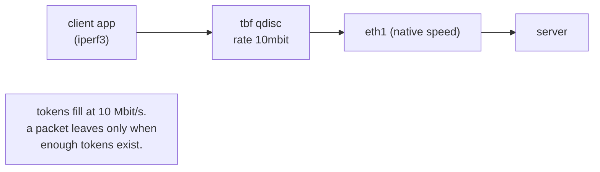

# Lab #28: QoS — Shaping a Link with a Token Bucket

Expected time: 40 to 55 minutes  
日本語: 想定時間 40〜55分

Reading guide: [`../rfc-notes/qos-traffic-shaping.md`](../rfc-notes/qos-traffic-shaping.md)

Prerequisite: [TCP Lab 08: Loss, Retransmission, and the Window](tcp-08-retransmission-windowing-loss.md)

## Goal

Lab 08 used `tc netem` to add delay and loss. This lab uses `tc` for the other classic job: **traffic shaping** — deliberately capping how fast a link may send. You attach a **token-bucket** queueing discipline (`tbf`) to the sender and measure the effect with `iperf3`.

- First, `iperf3` runs at the veth's native speed (tens of Gbit/s in a container),
- then a `tc tbf` shaper caps the client's egress at **10 Mbit/s**,
- `iperf3` now measures **~10 Mbit/s** — the token bucket meters the traffic to the configured rate.

日本語: Lab 08 は `tc netem` で遅延とロスを足しました。この Lab は `tc` のもう1つの定番の仕事、**traffic shaping**(リンクの送信速度をわざと絞る)を扱います。送信側に **token bucket** の queueing discipline(`tbf`)を付け、`iperf3` で効果を測ります。最初は veth の生の速度(コンテナ内では数十 Gbit/s)、次に `tc tbf` で client の egress を **10 Mbit/s** に絞ると、`iperf3` は **約 10 Mbit/s** を測る——token bucket が設定 rate にトラフィックを整える。

By the end, you should be able to explain this:

| State | iperf3 throughput |
|---|---|
| no shaping | tens of Gbit/s (native veth) |
| `tbf rate 10mbit` | ~10 Mbit/s (metered to the rate) |

## What You Will Learn

理解したいこと:

- What traffic **shaping** is, and how it differs from netem's delay/loss (Lab 08).
- What a **queueing discipline (qdisc)** is in Linux `tc`.
- How a **token bucket (`tbf`)** meters traffic: tokens accumulate at the rate, a packet needs tokens to leave.
- Why `burst` and `latency` matter (and why a too-small burst throttles almost to zero).
- Where shaping is used (rate plans, fair-sharing, protecting a slow uplink).

This lab does not cover:

- Classful shaping (HTB) with multiple classes and priorities.
- Marking/policing (DiffServ DSCP) or ingress shaping.
- Fair queueing (fq, fq_codel) and bufferbloat in depth.

日本語: traffic shaping とは何か(Lab 08 の delay/loss との違い)、Linux `tc` の queueing discipline(qdisc)、token bucket(`tbf`)がトークンでトラフィックを整える仕組み、`burst` と `latency` の意味(小さすぎる burst がほぼ0に絞る理由)、shaping の用途(料金プラン、公平分配、遅い上流の保護)を学びます。

## RFCで読む場所

traffic shaping は Linux 実装(`tc`)の話で、単一の RFC ではない。関連する概念の RFC を挙げる。

| 資料 | 読むポイント |
|---|---|
| `tc-tbf(8)` man page | token bucket filter のパラメータ(rate, burst, latency) |
| RFC 2475 | DiffServ アーキテクチャ(shaping/policing の位置づけ) |
| RFC 2697 | Single Rate Three Color Marker(token bucket の一般形) |
| RFC 5737 | Lab で使うアドレスが documentation 用であること |

## 実験の全体像

client と server の2ノード。server は iperf3 サーバ。

```text
client (10.0.0.1) ------ eth1/eth1 ------ server (10.0.0.2, iperf3 -s)
  tc tbf on egress                        measure throughput with iperf3
```

client の egress(eth1)に token bucket を付けると、そこを出る速度が rate に絞られる。



`10.0.0.0/24` はローカル閉域。

## 必要なもの

推奨環境:

- Linux / WSL2 / Linux VM
- Docker
- containerlab

使用イメージ:

- `nicolaka/netshoot:latest`（`tc`、`iperf3` 同梱）

追加イメージは不要。

## 実行手順

```bash
./scripts/labctl.sh run qos-28
```

### 1. 作業ディレクトリへ移動する

```bash
cd protocol-lab/examples/qos-28
```

### 2. 起動して iperf3 サーバを立てる

```bash
sudo containerlab deploy -t qos-28.clab.yml
docker exec -d clab-qos-28-server iperf3 -s
```

### 3. 素の速度を測る

```bash
docker exec clab-qos-28-client iperf3 -c 10.0.0.2 -t 4
```

veth なので数十 Gbit/s 出る(環境依存)。

### 4. token bucket で 10 Mbit/s に絞る

```bash
docker exec clab-qos-28-client tc qdisc add dev eth1 root tbf rate 10mbit burst 32kb latency 100ms
docker exec clab-qos-28-client tc -s qdisc show dev eth1
docker exec clab-qos-28-client iperf3 -c 10.0.0.2 -t 4
```

throughput が約 10 Mbit/s に落ちる。

（`burst` はバイト。`32kb` = 32キロバイト。ここを `32kbit`(=4KB)のようにビットで小さく指定すると、ほぼ 0 まで絞られてしまう。）

### 5. 外して戻す

```bash
docker exec clab-qos-28-client tc qdisc del dev eth1 root
docker exec clab-qos-28-client iperf3 -c 10.0.0.2 -t 4   # また高速
```

## 期待出力

- 素の iperf3: 数十 Gbit/s(環境依存の高速)。
- `tbf rate 10mbit` 適用後: 約 10 Mbit/s。
- qdisc 削除後: また高速。

## なぜそう動くのか

QoS(Quality of Service)には「遅延・損失を足す(Lab 08 の netem)」と「速度を絞る(shaping)」がある。この Lab は後者。**shaping** は、リンクが出せる速度に人為的な上限を設けること。

- **qdisc(queueing discipline)**: Linux は各インターフェースの出口に qdisc を持ち、パケットをどう送出するか(順序・タイミング・破棄)を決める。`tc` でこれを設定する。既定は簡単な FIFO 系。
- **token bucket(tbf)**: 「トークン」が **rate**(例 10 Mbit/s)の速さでバケツに溜まる。パケットを送るにはトークンが要る。トークンがあれば即送出、無ければ待つ。長期的には rate に、瞬間的には貯めたトークンぶんまで許す。これで平均速度を rate に整える。
  - **burst**: バケツの大きさ(溜められるトークン量)。瞬間的にどれだけまとめて出せるか。小さすぎると、各時刻に少ししか送れず、実効速度が rate より大きく下がる(このLabで `32kbit`=4KB にすると 0.5 Mbit まで落ちた)。だから rate に見合った burst(バイト単位)が要る。
  - **latency**: パケットがキューで待てる最大時間。超えると捨てる(=キューの深さの上限)。
- **shaping と policing の違い**: shaping は「遅らせて整える」(キューに貯めて rate に合わせる)。policing は「超えた分を即捨てる/マークする」。tbf は shaping。
- **どこで使うか**: 契約帯域の実現(ISP の rate プラン)、1ユーザが回線を占有しないための公平分配、遅い上流リンクを守るための送信抑制(bufferbloat 対策)など。

要点は、**qdisc で出口を制御し、token bucket で平均速度を設定 rate に整える**こと。netem(遅延・損失)と並ぶ、tc のもう一つの主要機能。

## 詰まりやすい点

- **shaping と netem を混同する**。netem は遅延・損失を「足す」。shaping は速度を「絞る」。どちらも tc だが目的が別。
- **burst の単位**。`tc` の burst はバイト。`32kb`=32KB。`32kbit`=4KB(小さすぎ)。rate に見合った大きさが要る。
- **egress にしか効かない**。tbf は送信(egress)を絞る。受信(ingress)を絞るのは別の仕組み(ifb など)。
- **veth は非常に速い**。コンテナの veth は数十 Gbit/s。素の速度は環境で大きく変わる。
- **shaping と policing**。貯めて整える(shaping)か、超過を捨てる(policing)か。tbf は前者。
- **測定のばらつき**。iperf3 の結果は多少ばらつく。rate 付近に収まるかで判断する。

## 後片付け

```bash
sudo containerlab destroy -t qos-28.clab.yml --cleanup
```

`labctl.sh run qos-28` を使った場合は、スクリプトが最後に destroy する。

## 確認問題

1. traffic shaping とは何か。Lab 08 の netem(遅延・損失)と何が違うか。
2. Linux の qdisc とは何か。tc は何を設定するか。
3. token bucket(tbf)はどうやって平均速度を rate に整えるか。
4. `burst` は何を表すか。小さすぎると何が起きるか。単位は何か。
5. shaping と policing の違いは何か。tbf はどちらか。
6. shaping はどんな場面で使われるか(2つ挙げよ)。

## References

- [tc-tbf(8) manual page](https://man7.org/linux/man-pages/man8/tc-tbf.8.html)
- [RFC 2475: An Architecture for Differentiated Services](https://www.rfc-editor.org/rfc/rfc2475)
- [RFC 2697: A Single Rate Three Color Marker](https://www.rfc-editor.org/rfc/rfc2697)
- [RFC 5737: IPv4 Address Blocks Reserved for Documentation](https://www.rfc-editor.org/rfc/rfc5737)

## 検証済み実行ログ (2026-07-07)

このLabは実機で再現性を確認済みです。

実行環境:

- Ubuntu 26.04 LTS (kernel 7.0.0-27-generic, x86_64)
- Docker 29.1.3
- containerlab 0.77.0
- client / server: `nicolaka/netshoot:latest`（tc、iperf3 同梱）

`PATH="/tmp/pl-shim:$PATH" ./scripts/labctl.sh run qos-28` で deploy → verify → destroy を実行し、`verification.json` は `"status": "verified"` を返した。

### 素の速度 → token bucket で 10 Mbit/s に

```text
[protocol-lab][qos-28] baseline: 56551 Mbit/s
[protocol-lab][qos-28] + tc qdisc add dev eth1 root tbf rate 10mbit burst 32kb latency 100ms
[protocol-lab][qos-28] shaped: 9 Mbit/s
```

shaping 前は veth の生の速度で **56551 Mbit/s(約 56 Gbit/s)**。client の egress に `tbf rate 10mbit` を付けると、iperf3 の throughput は **9 Mbit/s**(設定 rate 付近)に落ちた。token bucket が平均速度を設定 rate に整えている。

（`burst` はバイト指定が肝。`32kb`=32KB なら約 10 Mbit/s に整うが、`32kbit`=4KB のように小さすぎると 0.5 Mbit 程度まで過剰に絞られる。)

### Cleanup

```bash
containerlab destroy -t qos-28.clab.yml --cleanup
```
