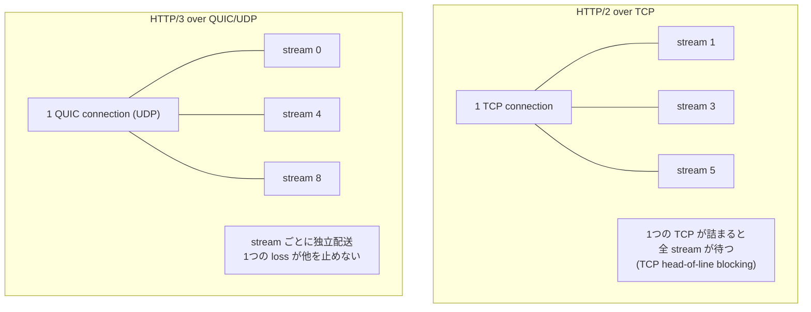

# Lab #11: HTTP/2 Streams and the Jump to QUIC

Expected time: 55 to 70 minutes  
日本語: 想定時間 55〜70分

Reading guide: [`../rfc-notes/http2-quic-streams.md`](../rfc-notes/http2-quic-streams.md)

Prerequisite: [HTTP Lab 10: One Exchange, Read in the Clear](http-10-requests-responses-caching.md), [TLS Lab 09: What Is Visible Before Encryption](tls-09-handshake-certificates.md)

## Goal

HTTP/1.1 (Lab 10) does one request at a time per connection. HTTP/2 multiplexes many requests as **streams** over one TCP connection. HTTP/3 moves those streams onto **QUIC**, which runs over UDP. This lab shows the difference at a high level.

You will:

- fetch over **HTTP/2** and confirm ALPN negotiated `h2`,
- send several requests at once and see them **multiplexed over one TCP connection**,
- read the **`Alt-Svc: h3`** header the server uses to advertise HTTP/3,
- see that HTTP/3 / QUIC lives on **UDP**, not TCP.

日本語: HTTP/1.1(Lab 10)は1接続で1リクエストずつ。HTTP/2 は多数のリクエストを **stream** として1本の TCP 接続に多重化します。HTTP/3 はその stream を **QUIC**(UDP の上)に移します。この Lab では、その違いを大まかに観察します。HTTP/2 で fetch して ALPN が `h2` になること、複数リクエストが1本の TCP 接続に多重化されること、server が `Alt-Svc: h3` で HTTP/3 を広告すること、そして QUIC が TCP ではなく UDP に乗ることを見ます。

By the end, you should be able to explain this comparison:

| | HTTP/1.1 | HTTP/2 | HTTP/3 |
|---|---|---|---|
| Transport | TCP | TCP | QUIC over UDP |
| Concurrency | 1 request / connection | many streams / 1 connection | many streams / 1 connection |
| Head-of-line blocking | at HTTP layer | at TCP layer | avoided per-stream |
| Advertised by | — | ALPN `h2` | `Alt-Svc: h3` + ALPN `h3` |

## What You Will Learn

理解したいこと:

- What a stream is, and how HTTP/2 multiplexes streams over one connection.
- Why one TCP connection can still stall all streams (TCP head-of-line blocking).
- How QUIC puts streams directly on UDP and avoids that cross-stream stall.
- How ALPN and `Alt-Svc` let a client discover and pick a version.

This lab does not cover:

- HTTP/2 flow control, priorities, or HPACK header compression internals.
- QUIC's congestion control or loss recovery details.
- 0-RTT / connection migration.
- Tuning for performance.

## RFCで読む場所

| RFC | 章 | 読むポイント |
|---|---|---|
| RFC 9113 | 5 | HTTP/2 の stream(状態、多重化) |
| RFC 9113 | 4 | frame(stream に分割して運ぶ単位) |
| RFC 9114 | 2 | HTTP/3 の stream mapping(QUIC stream への対応) |
| RFC 9000 | 2 | QUIC の stream(独立配送) |
| RFC 7301 | 3 | ALPN(h2 / h3 の選択) |
| RFC 9110 | 3.9 | `Alt-Svc` の考え方(alternative service の広告) |

## 実験の全体像

Lab 07 以来の2ノード。server は Caddy(HTTP/1.1・HTTP/2・HTTP/3 を1つの binary で提供)。client は netshoot の curl。

```text
client (10.0.0.1) ------ eth1/eth1 ------ server (10.0.0.2:443 tcp+udp)
                                          Caddy
                                          h1 / h2 (TCP) / h3 (QUIC/UDP)
```

server の応答本文は、その時使われた protocol を書き返す(`Hello over HTTP/2.0 ...`)。だから、どの transport で届いたかが本文で分かる。



server イメージは `./Dockerfile`(`caddy:2` に `iproute2` を足したもの)から `run.sh` がビルドする。client は `nicolaka/netshoot`。

## 必要なもの

推奨環境:

- Linux / WSL2 / Linux VM
- Docker
- containerlab

使用イメージ:

- `protocol-lab/caddy:2`(`examples/quic-11/Dockerfile` からローカルビルド)
- `nicolaka/netshoot:latest`

HTTP/3 の観察には、client の curl が HTTP/3 対応でビルドされている必要がある。未対応でも、`Alt-Svc` 広告と UDP リスナーで QUIC の存在は確認できる。

## 実行手順

```bash
./scripts/labctl.sh run quic-11
```

`labctl.sh run quic-11` は、caddy イメージのビルド、deploy、HTTP/2 fetch と多重化の capture、`Alt-Svc` の確認、後片付けまで行う。

### 1. 作業ディレクトリへ移動する

```bash
cd protocol-lab/examples/quic-11
```

### 2. ビルドして起動する

```bash
docker build -t protocol-lab/caddy:2 .
sudo containerlab deploy -t quic-11.clab.yml
```

### 3. HTTP/2 で1回 fetch する

```bash
docker exec clab-quic-11-client curl -k --http2 -sv https://10.0.0.2/one
```

見るポイント:

```text
* ALPN: server accepted h2
* using HTTP/2
< HTTP/2 200
Hello over HTTP/2.0 for /one
```

`-k` は自己署名(Caddy internal CA)を許すため。本文が `HTTP/2.0` と書き返す。

### 4. 複数リクエストを同時に投げて多重化を見る

```bash
docker exec clab-quic-11-client sh -c \
  "curl -k --http2 -sv --parallel --parallel-immediate \
     https://10.0.0.2/a https://10.0.0.2/b https://10.0.0.2/c 2>&1 | grep -Ei 'stream|reused|Connected|HTTP/2'"
```

見るポイント:

- 3つのリクエストが別々の **stream**(stream 1, 3, 5 …)。
- 接続は1本(`Re-using existing connection` / 同じ `Connected to`)。

capture で TCP 接続数を数えると、3リクエストでも SYN は1つ(=1接続に多重化)。

```bash
docker exec clab-quic-11-client sh -c \
  "tcpdump -n -r /tmp/quic-11.pcap 'tcp[tcpflags] & tcp-syn != 0 and tcp[tcpflags] & tcp-ack == 0' | wc -l"
```

### 5. HTTP/3 の広告を読む

```bash
docker exec clab-quic-11-client sh -c "curl -k --http2 -sD - -o /dev/null https://10.0.0.2/"
```

レスポンスヘッダに:

```text
alt-svc: h3=":443"; ma=2592000
```

これは「同じサービスは h3(HTTP/3)でも `:443`(UDP)で受けられる」という広告。client は次回から QUIC を試せる。

### 6. HTTP/3 を試す(curl が対応していれば)

```bash
docker exec clab-quic-11-client sh -c "curl -V | grep -i HTTP3"
docker exec clab-quic-11-client curl -k --http3 -sv https://10.0.0.2/three
```

対応していれば本文は `Hello over HTTP/3.0 ...`。capture では TCP ではなく **UDP/443** のパケット(QUIC)になる。未対応なら、server 側の UDP リスナーで QUIC の待ち受けを確認する。

```bash
docker exec clab-quic-11-server sh -c "ss -uln"
```

## 期待出力

- HTTP/2 fetch: `using HTTP/2`、本文 `HTTP/2.0`。
- 多重化: 3リクエストで SYN 1つ(1 TCP 接続)。stream ID が複数。
- `alt-svc: h3=":443"`。
- (対応時)HTTP/3 fetch: 本文 `HTTP/3.0`、capture は UDP。

## なぜそう動くのか

HTTP/2 と HTTP/3 の狙いは同じ「1接続で多数のやり取りを同時に流す」。違いは、その stream を何の上に乗せるか。

- **HTTP/2 = streams over TCP**: 1本の TCP 接続の中を、frame 単位で分割し、stream 番号で束ねる。多重化で HTTP/1.1 の「1接続1リクエスト」の制約を外す。ただし下は1本の TCP。あるパケットが失われて再送待ちになると、その後ろの**全 stream** が TCP レベルで止まる(TCP head-of-line blocking)。
- **HTTP/3 = streams over QUIC(UDP)**: QUIC は UDP の上に、暗号化・信頼性・stream を自分で実装する。stream ごとに独立して届けられるので、ある stream の loss が他の stream を止めない。だから loss のある経路で有利。
- **discovery**: client は最初 TCP で来て、ALPN で `h2` を選ぶ。server は `Alt-Svc: h3` で「UDP の h3 もあるよ」と教える。client は次回 QUIC を試す。

要点は、**HTTP の意味(method/status/header、Lab 10)は同じまま、運び方(transport と多重化)が変わっている**こと。

## 詰まりやすい点

- **HTTP/2 に TLS は必須(実運用上)**。ブラウザや curl の `h2` は TLS + ALPN 前提。だから Lab 09 の TLS が土台。
- **多重化と並列接続を混同する**。HTTP/1.1 は複数 TCP 接続で並列化した。HTTP/2 は1接続の中の stream で多重化する。
- **TCP head-of-line blocking**。HTTP/2 は HTTP 層の HoL を消したが、TCP 層の HoL は残る。QUIC がそこを解く。
- **QUIC は UDP の上の独自 transport**。ただの UDP 送信ではなく、暗号化・順序・再送・stream を自前で持つ。
- **`-k` が要る理由**。Caddy の internal CA は client の trust store に無いから。実運用は公開 CA。
- **HTTP/3 の観察は client 依存**。curl が HTTP/3 対応でないと `--http3` は使えない。その場合は `Alt-Svc` と UDP リスナーで存在だけ確認する。

## 後片付け

```bash
sudo containerlab destroy -t quic-11.clab.yml --cleanup
```

`labctl.sh run quic-11` を使った場合は、スクリプトが最後に destroy する。

## 確認問題

1. HTTP/2 の stream とは何か。HTTP/1.1 の「1接続1リクエスト」とどう違うか。
2. HTTP/2 で多重化しても残る head-of-line blocking はどの層のものか。QUIC はそれをどう解くか。
3. QUIC はどの transport(TCP / UDP)の上に乗るか。なぜ UDP なのか。
4. `Alt-Svc: h3` は何を伝えるヘッダか。client はそれをどう使うか。
5. HTTP/2 と HTTP/3 で、HTTP の semantics(method/status/header)は変わるか。
6. capture で、HTTP/2 と HTTP/3 のパケットはどう見分けられるか。

## References

- [RFC 9113: HTTP/2](https://www.rfc-editor.org/rfc/rfc9113)
- [RFC 9114: HTTP/3](https://www.rfc-editor.org/rfc/rfc9114)
- [RFC 9000: QUIC: A UDP-Based Multiplexed and Secure Transport](https://www.rfc-editor.org/rfc/rfc9000)
- [RFC 7301: TLS Application-Layer Protocol Negotiation (ALPN)](https://www.rfc-editor.org/rfc/rfc7301)
- [RFC 9110: HTTP Semantics (Alt-Svc)](https://www.rfc-editor.org/rfc/rfc9110)
- [Caddy web server](https://caddyserver.com/docs/)
