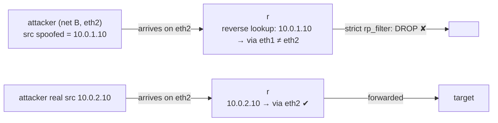

# Lab #39: Reverse Path Filtering — Dropping Spoofed Sources at Ingress

Expected time: 40 to 55 minutes  
日本語: 想定時間 40〜55分

Reading guide: [`../rfc-notes/reverse-path-filtering.md`](../rfc-notes/reverse-path-filtering.md)

Prerequisite: [Lab 38: Policy Routing — Choosing the Path by Source](pbr-38-policy-routing.md)

## Goal

Policy routing (Lab 38) *chose a path* by source. This lab *validates* the source: **reverse path filtering** drops a packet whose source address could not legitimately have arrived on the interface it came in on — the Linux implementation of ingress filtering (BCP 38), the standard anti-spoofing defense.

An attacker on net B forges a net-A source address and aims it at a target:

- with **strict `rp_filter`**, the router does a reverse route lookup on the source; the route back to the spoofed address is via eth1, but the packet arrived on eth2, so it is **dropped at ingress** (0 reach the target),
- meanwhile the attacker's **real** source (on the correct interface) still passes — rp_filter blocks only the spoof,
- with **`rp_filter=0`**, the same spoofed packets are forwarded.

日本語: policy routing(Lab 38)は source で *経路を選び* ました。この Lab は source を *検査* します。**reverse path filtering** は、来たインターフェースから正当には到達し得ない送信元のパケットを落とす——ingress filtering(BCP 38)の Linux 実装で、標準的な anti-spoofing 防御です。net B の攻撃者が net A の送信元を偽装して target を狙うと、**strict `rp_filter`** ではルータが送信元を逆引きし、偽装先 `10.0.1.10` への route は eth1 なのにパケットは eth2 から来た → **入口で drop**(target に 0 到達)。一方、攻撃者の **本物** の送信元(正しいインターフェース)は通る——rp_filter は詐称だけを止める。**`rp_filter=0`** なら同じ偽装パケットが転送される。

By the end, you should be able to explain this:

| source sent by attacker (from net B / eth2) | rp_filter | reaches target |
|---|---|---|
| spoofed net-A source (10.0.1.10) | strict (1) | no (0) |
| real net-B source (10.0.2.10) | strict (1) | yes (3) |
| spoofed net-A source (10.0.1.10) | off (0) | yes (3) |

## What You Will Learn

理解したいこと:

- What IP **spoofing** is and why it enables DDoS reflection and origin hiding.
- What **ingress filtering** (BCP 38) is and how **reverse path filtering** implements it.
- How the kernel does a **reverse route lookup** on the source address.
- The **strict (1)** vs **loose (2)** vs **off (0)** `rp_filter` modes.
- Why strict rp_filter can misfire with **asymmetric routing** (and how it relates to Lab 38).

This lab does not cover:

- uRPF on hardware routers (the same idea in vendor gear).
- Full BCP 38 deployment at network edges.
- IPv6 rp_filter specifics.

日本語: IP spoofing とは何か(DDoS reflection・発信元隠蔽)、ingress filtering(BCP 38)と reverse path filtering、カーネルの送信元逆引き、strict(1)/loose(2)/off(0)、非対称ルーティングで strict が誤爆する理由(Lab 38 との関係)を学びます。ハードウェアルータの uRPF、BCP 38 の網境界展開、IPv6 の詳細は扱いません。

## RFCで読む場所

| 資料 | 読むポイント |
|---|---|
| RFC 2827 (BCP 38) | ingress filtering の原則 |
| RFC 3704 (BCP 84) | strict / loose とマルチホーミング |
| Linux ip-sysctl | `rp_filter` の 0/1/2、all と interface の max |
| RFC 5737 / RFC 1918 | Lab のアドレスがローカル用であること |

## 実験の全体像

target(net A)と attacker(net B)が r を挟む。attacker が net A の送信元を偽装して target を狙う。

```text
 target (10.0.1.20) --- eth1 [ r ] eth2 --- attacker (10.0.2.10)
   net A: 10.0.1.0/24                        net B: 10.0.2.0/24
                        r's route to 10.0.1.0/24 is via eth1
```



`10.0.0.0/8` はローカル閉域。

## 必要なもの

推奨環境:

- Linux / WSL2 / Linux VM
- Docker
- containerlab

使用イメージ:

- `nicolaka/netshoot:latest`（`nping`、`tcpdump`、`sysctl` 同梱）

追加イメージは不要。

## 実行手順

```bash
./scripts/labctl.sh run rpf-39
```

### 1. 作業ディレクトリへ移動する

```bash
cd protocol-lab/examples/rpf-39
```

### 2. 起動する

```bash
sudo containerlab deploy -t rpf-39.clab.yml
```

### 3. strict rp_filter を有効にする

```bash
docker exec clab-rpf-39-r sh -c 'sysctl -w net.ipv4.conf.all.rp_filter=1; sysctl -w net.ipv4.conf.eth2.rp_filter=1'
```

### 4. 偽装パケットを送り、target で数える

```bash
# target で capture
docker exec -d clab-rpf-39-target sh -c "tcpdump -i eth1 -n 'icmp and src 10.0.1.10' -w /tmp/c.pcap"
# attacker が net-A 送信元を偽装
docker exec clab-rpf-39-attacker nping --icmp -c 3 --source-ip 10.0.1.10 10.0.1.20
# 数える（strict なら 0）
docker exec clab-rpf-39-target sh -c 'tcpdump -n -r /tmp/c.pcap | wc -l'
```

### 5. 本物の送信元は通ることを確認する

```bash
docker exec -d clab-rpf-39-target sh -c "tcpdump -i eth1 -n 'icmp and src 10.0.2.10' -w /tmp/l.pcap"
docker exec clab-rpf-39-attacker nping --icmp -c 3 --source-ip 10.0.2.10 10.0.1.20
docker exec clab-rpf-39-target sh -c 'tcpdump -n -r /tmp/l.pcap | wc -l'   # 3（通る）
```

### 6. rp_filter を切って再現する

```bash
docker exec clab-rpf-39-r sh -c 'sysctl -w net.ipv4.conf.all.rp_filter=0; sysctl -w net.ipv4.conf.eth2.rp_filter=0'
# 偽装パケットが今度は転送される（3 届く）
```

## 期待出力

- strict(1): 偽装 `10.0.1.10` は target に **0** 到達(入口で drop)。
- strict(1): 本物 `10.0.2.10` は **3** 到達(詐称だけブロック)。
- off(0): 偽装 `10.0.1.10` が **3** 到達(転送される)。

## なぜそう動くのか

**reverse path filtering** は「この送信元への返信は、来たインターフェースから出て行くか?」を確かめる。

- **spoofing**: 攻撃者は送信元アドレスを偽装できる(IP はそれを検証しない)。DDoS reflection(偽装元=被害者にして応答を集中)、発信元隠蔽、信頼 IP 詐称に使われる。
- **逆引き**: 通常の転送は宛先を引く。rp_filter は追加で **送信元** を route lookup する。送信元への best route が到着インターフェースと一致するか見る。一致しなければ「その送信元はそこから来ないはず」= 詐称 → drop。
- **Lab の判定**: 攻撃者(net B, eth2)が `10.0.1.10`(net A)を偽装。r の `10.0.1.0/24` への route は eth1。パケットは eth2 から来た → 不一致 → strict で drop。一方、攻撃者の本物 `10.0.2.10` は eth2 経由が正しい → 通る。だから **詐称だけ** を落とし、正当な通信は妨げない。
- **モード**: `0` off、`1` strict(到着 IF が best return path と一致必須)、`2` loose(いずれかの IF から到達可能ならOK)。実効値は `conf.all` と `conf.<if>` の **max**。
- **非対称ルーティング注意**: 行きと戻りで別 IF を使う設計(policy routing の一部、マルチホーミング)では strict が正当なパケットも落としうる。その場合は loose(2)か、経路を対称に設計する。

要点は、**入口で送信元を逆引きし、そこから来るはずのない送信元(=詐称)を落とす**こと。BCP 38 の anti-spoofing を Linux で実現する。

## 詰まりやすい点

- **rp_filter が宛先を見ると思う**。見るのは **送信元**(逆引き)。
- **正当な通信も落ちると思う**。落ちるのは「その入口から来ないはずの送信元」だけ。本物は通る。
- **strict が常に正しいと思う**。非対称ルーティングでは誤爆する。マルチホーミングは loose か対称設計。
- **`conf.all` だけ設定すればよいと思う**。実効値は all と interface の **max**。両方見る。
- **ファイアウォールと同一視する**。rp_filter は送信元到達性、stateful firewall(Lab 36)は接続状態。層が別。
- **偽装の応答が返ると思う**。偽装元宛の応答は本物の所有者に飛ぶ。攻撃者には返らない(だから reflection に悪用される)。

## 後片付け

```bash
sudo containerlab destroy -t rpf-39.clab.yml --cleanup
```

`labctl.sh run rpf-39` を使った場合は、スクリプトが最後に destroy する。

## 確認問題

1. IP spoofing とは何か。なぜ危険か(用途を1つ)。
2. reverse path filtering は、パケットの何をどう検査するか。
3. Lab で偽装 `10.0.1.10` が落ち、本物 `10.0.2.10` が通るのはなぜか。
4. rp_filter の strict(1)と loose(2)の違いは何か。
5. 非対称ルーティングで strict が問題になるのはなぜか。policy routing(Lab 38)とどう関わるか。
6. `conf.all` と `conf.<if>` の rp_filter はどう合成されるか。

## References

- [RFC 2827 (BCP 38): Network Ingress Filtering](https://www.rfc-editor.org/rfc/rfc2827)
- [RFC 3704 (BCP 84): Ingress Filtering for Multihomed Networks](https://www.rfc-editor.org/rfc/rfc3704)
- [Linux ip-sysctl documentation (rp_filter)](https://www.kernel.org/doc/Documentation/networking/ip-sysctl.txt)
- [RFC 5737: IPv4 Address Blocks Reserved for Documentation](https://www.rfc-editor.org/rfc/rfc5737)

## 検証済み実行ログ (2026-07-08)

このLabは実機で再現性を確認済みです。

実行環境:

- Ubuntu 26.04 LTS (kernel 7.0.0-27-generic, x86_64)
- Docker 29.1.3
- containerlab 0.77.0
- target / r / attacker: `nicolaka/netshoot:latest`（nping、tcpdump、sysctl）

`PATH="/tmp/pl-shim:$PATH" ./scripts/labctl.sh run rpf-39` で deploy → verify → destroy を実行し、`verification.json` は `"status": "verified"` を返した。

### strict rp_filter は詐称だけを落とす

```text
net.ipv4.conf.all.rp_filter = 1
net.ipv4.conf.eth2.rp_filter = 1

spoofed_strict: 0     # 偽装 10.0.1.10 → target に 0 到達(入口で drop)
legit_strict:   3     # 本物 10.0.2.10 → target に 3 到達(通る)
spoofed_off:    3     # rp_filter=0 → 偽装 10.0.1.10 が 3 到達(転送される)
```

- attacker(net B, eth2)が net A の `10.0.1.10` を偽装(`nping --source-ip`)。strict では r が送信元を逆引きし、`10.0.1.0/24` への route は eth1 なのに eth2 から来たので **入口で drop** → target に **0** 到達。
- 同じ attacker が **本物** の `10.0.2.10`(eth2 経由が正しい)で送ると **3** 到達——rp_filter は詐称だけを止め、正当な通信は妨げない。
- rp_filter を **0** にすると、同じ偽装パケットが **3** 転送された。ingress filtering(BCP 38)が spoofing を入口で遮断していることが確認できる。

### Cleanup

```bash
containerlab destroy -t rpf-39.clab.yml --cleanup
```
