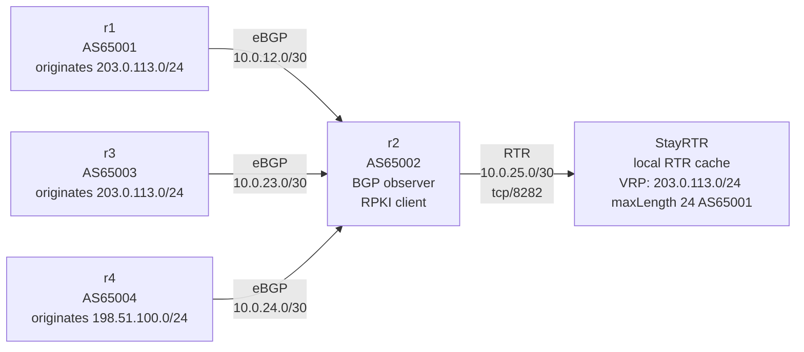
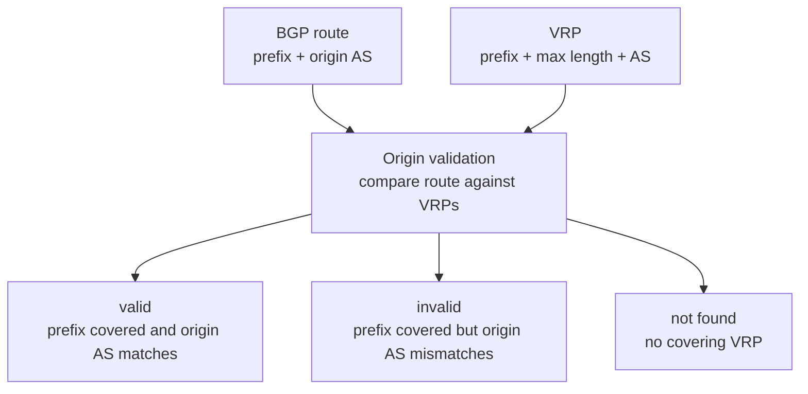

# RPKI Lab #4: ROAs and Origin Validation

Expected time: 60 to 75 minutes  
日本語: 想定時間 60〜75分

Reading guide: [`../rfc-notes/rpki-origin-validation.md`](../rfc-notes/rpki-origin-validation.md)

## Goal

In this lab, you will connect FRRouting to a local RPKI-to-Router cache and observe three origin validation states:

- `valid`: the route origin matches a VRP.
- `invalid`: the prefix is covered by a VRP, but the origin AS is not authorized.
- `not found`: no VRP covers the route.

The theme is simple: BGP can show who originated a route, but RPKI origin validation helps answer whether that origin is authorized.

日本語: このLabでは、FRRouting を local RTR cache に接続し、`valid`、`invalid`、`not found` の3状態を観察します。BGPで見える origin AS と、RPKIから得られる許可情報を照合する入口です。

By the end, you should be able to explain this table:

| Route observed on r2 | Origin AS | Local VRP says | State |
|---|---:|---|---|
| `203.0.113.0/24` via `10.0.12.1` | `65001` | `203.0.113.0/24`, max length `24`, AS `65001` | `valid` |
| `203.0.113.0/24` via `10.0.23.2` | `65003` | same prefix, but AS `65001` only | `invalid` |
| `198.51.100.0/24` via `10.0.24.2` | `65004` | no covering VRP | `not found` |

## What You Will Learn

理解したいこと:

- A ROA authorizes an AS to originate an IP prefix up to a maximum prefix length.
- A router usually receives validated prefix data as VRPs from an RTR cache.
- Origin validation compares a BGP route's prefix and origin AS against VRPs.
- `valid`, `invalid`, and `not found` are different states.
- RPKI origin validation checks the origin AS, not the entire AS_PATH.
- A router does not necessarily reject `invalid` routes unless policy tells it to do so.

This lab does not cover:

- real RPKI repository synchronization
- public RTR cache operation
- route filtering policy
- ASPA or full AS_PATH validation
- production RPKI operations

## RFCで読む場所

今回の必読は以下。

| RFC | 章 | 読むポイント |
|---|---|---|
| RFC 6482 | 3 | ROA が AS と IP prefix を結びつけること |
| RFC 6811 | 2 | route、origin AS、VRP、covering prefix の用語 |
| RFC 6811 | 2.1 | valid / invalid / not found の判定 |
| RFC 8210 | 1-2 | validated cache と router が RTR protocol で情報をやり取りすること |
| RFC 5737 | 3 | `203.0.113.0/24` と `198.51.100.0/24` が documentation prefix であること |

## 実験の全体像

4台の FRRouting router と、1台の local StayRTR cache を作る。

```text
AS65001 / r1 ----\
                  \
                   AS65002 / r2 ---- StayRTR local RTR cache
                  /
AS65003 / r3 ----/

AS65004 / r4 ----/

r1 advertises:
  203.0.113.0/24  -> expected valid

r3 advertises:
  203.0.113.0/24  -> expected invalid

r4 advertises:
  198.51.100.0/24 -> expected not found

local VRP data:
  203.0.113.0/24, maxLength 24, AS65001
```

`203.0.113.0/24` と `198.51.100.0/24` は RFC 5737 の documentation prefix。外部へ広告せず、Lab 内だけで使う。





## 必要なもの

推奨環境:

- Linux / WSL2 / Linux VM
- Docker
- containerlab
- FRRouting container image
- StayRTR container image

使用イメージ:

- `frrouting/frr:latest`
- `rpki/stayrtr:latest`

macOS の場合は、Linux VM、WSL 相当の環境、または OrbStack/Colima 上の Linux VM で実行する想定にする。

## 実行手順

この手順は、containerlab を実行する Linux 環境の中で行う。

このリポジトリを持っている場合は、Linux 環境で検証スクリプトを実行できる。

```bash
./scripts/labctl.sh run rpki-04
```

`labctl.sh run rpki-04` は、topology deploy、FRRouting 出力確認、RPKI validation state の検査、destroy まで行う。

### 1. 作業ディレクトリへ移動する

```bash
cd protocol-lab/examples/rpki-04
```

### 2. Local VRP data を読む

このLabでは、実RPKI repository ではなく local JSON から StayRTR に VRP を渡す。

```bash
cat stayrtr/roas.json
```

期待する内容:

```json
{
  "roas": [
    {
      "prefix": "203.0.113.0/24",
      "maxLength": 24,
      "asn": 65001
    }
  ]
}
```

読み方:

- `203.0.113.0/24` は AS65001 が originate してよい。
- `maxLength 24` なので、より細かい prefix は許可されない。
- AS65003 はこの prefix の許可された origin ではない。
- `198.51.100.0/24` に対する VRP はない。

### 3. 起動する

```bash
sudo containerlab deploy -t rpki-04.clab.yml
```

起動後、コンテナが作られていることを確認する。

```bash
docker ps --format "table {{.Names}}\t{{.Status}}"
```

期待する確認ポイント:

- `clab-rpki-04-r1` が起動している。
- `clab-rpki-04-r2` が起動している。
- `clab-rpki-04-r3` が起動している。
- `clab-rpki-04-r4` が起動している。
- `clab-rpki-04-stayrtr` が起動している。

### 4. r2 が RTR cache に接続したことを見る

```bash
docker exec -it clab-rpki-04-r2 vtysh -c "show rpki cache-connection"
```

期待する確認ポイント:

```text
Connected to group 1
rpki tcp cache 10.0.25.2 8282 pref 1 (connected)
```

次に、r2 が受け取った VRP を見る。

```bash
docker exec -it clab-rpki-04-r2 vtysh -c "show rpki prefix-table"
```

期待する確認ポイント:

```text
RPKI/RTR prefix table
Prefix                                   Prefix Length  Origin-AS
203.0.113.0                                 24 -  24        65001
```

### 5. BGP table で validation state を見る

```bash
docker exec -it clab-rpki-04-r2 vtysh -c "show bgp ipv4 unicast"
```

期待する確認ポイント:

```text
RPKI validation codes: V valid, I invalid, N Not found

   Network          Next Hop            Metric LocPrf Weight Path
N*> 198.51.100.0/24  10.0.24.2                0             0 65004 i
I*  203.0.113.0/24   10.0.23.2                0             0 65003 i
V*>                  10.0.12.1                0             0 65001 i
```

FRRouting は同じ prefix の複数 path を表示するとき、2行目以降の `Network` 欄を省略することがある。上の例では、`V*>` の行も `203.0.113.0/24` に対する path。

読み方:

- `V` は `valid`。`203.0.113.0/24` を AS65001 が originate しており、VRP と一致する。
- `I` は `invalid`。`203.0.113.0/24` を AS65003 が originate しているが、VRP は AS65001 だけを許可している。
- `N` は `not found`。`198.51.100.0/24` に対応する VRP がない。

状態ごとに絞って見ることもできる。

```bash
docker exec -it clab-rpki-04-r2 vtysh -c "show bgp ipv4 unicast rpki valid"
docker exec -it clab-rpki-04-r2 vtysh -c "show bgp ipv4 unicast rpki invalid"
```

## 期待出力

完全一致よりも以下のフィールドが取れることを重視する。

### `show rpki cache-connection`

```text
rpki tcp cache 10.0.25.2 8282 pref 1 (connected)
```

見るポイント:

- `r2` が local StayRTR cache に接続している。
- RTR cache は `10.0.25.2:8282`。

### `show rpki prefix-table`

```text
203.0.113.0                                 24 -  24        65001
```

見るポイント:

- VRP は `203.0.113.0/24` を含む。
- max length は `24`。
- authorized origin AS は `65001`。

### `show bgp ipv4 unicast`

見るポイント:

- `203.0.113.0/24` from AS65001 は `V`。
- `203.0.113.0/24` from AS65003 は `I`。
- `198.51.100.0/24` from AS65004 は `N`。

## なぜそう動くのか

RPKI origin validation は、BGP route の prefix と origin AS を、validated cache から得た VRP と照合する。

このLabの local VRP は1つだけ。

```text
203.0.113.0/24, maxLength 24, AS65001
```

`r1` の route は、prefix も origin AS も VRP と一致するので `valid`。

`r3` の route は、prefix は VRP に covered されているが、origin AS が `65003` なので `invalid`。

`r4` の route は、`198.51.100.0/24` に対応する VRP がないので `not found`。

注意したいのは、`invalid` と表示されることと、route が自動的に拒否されることは別だという点。FRRouting では、policy を書かなければ `invalid` route が best path になることもある。このLabでは validation state を観察するところまでを扱い、filter policy は扱わない。

## 詰まりやすい点

- `show bgp ipv4 unicast` で `Network` 欄が空に見える行がある。これは同じ prefix の複数 path 表示で prefix が省略されているだけ。
- `not found` は `invalid` ではない。対応する VRP がない状態。
- `invalid` は「AS_PATH 全体が偽物」という意味ではない。origin AS と VRP の不一致を示す。
- RPKI origin validation は route filtering policy そのものではない。reject するには別途 policy が必要。
- このLabの JSON は local 実験用の VRP data。実際のRPKIでは、ROAは署名された object として repository から検証される。

## 後片付け

手動で起動した場合は topology を削除する。

```bash
sudo containerlab destroy -t rpki-04.clab.yml --cleanup
```

`labctl.sh run rpki-04` を使った場合は、スクリプトが最後に destroy する。

## 確認問題

1. `203.0.113.0/24` from AS65001 はなぜ `valid` になるか。
2. `203.0.113.0/24` from AS65003 はなぜ `invalid` になるか。
3. `198.51.100.0/24` from AS65004 はなぜ `not found` になるか。
4. `invalid` route は必ず自動的に reject されるか。
5. RPKI origin validation は AS_PATH 全体を検証しているか。

## References

- [RFC 6482: A Profile for Route Origin Authorizations (ROAs)](https://www.rfc-editor.org/rfc/rfc6482)
- [RFC 6811: BGP Prefix Origin Validation](https://www.rfc-editor.org/rfc/rfc6811)
- [RFC 8210: The Resource Public Key Infrastructure (RPKI) to Router Protocol, Version 1](https://www.rfc-editor.org/rfc/rfc8210)
- [RFC 5737: IPv4 Address Blocks Reserved for Documentation](https://www.rfc-editor.org/rfc/rfc5737)
- [FRRouting BGP documentation](https://docs.frrouting.org/en/latest/bgp.html)
- [StayRTR](https://github.com/bgp/stayrtr)

