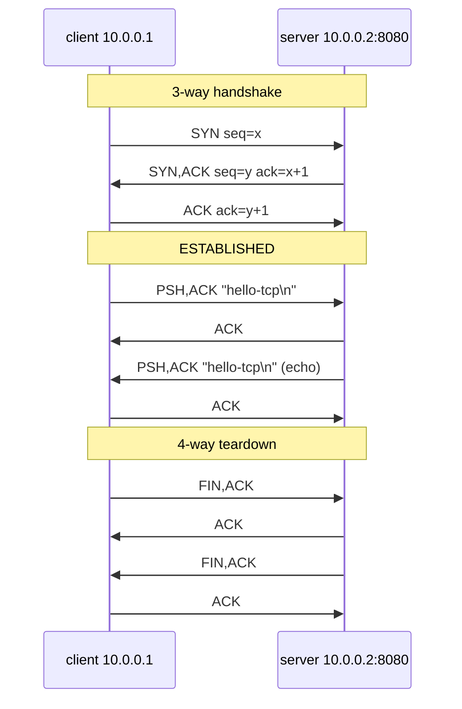

# TCP Lab #7: One Connection, From SYN to FIN

Expected time: 50 to 65 minutes  
日本語: 想定時間 50〜65分

Reading guide: [`../rfc-notes/tcp-handshake-teardown.md`](../rfc-notes/tcp-handshake-teardown.md)

## Goal

The DNS track ended with a name resolved to an address. This lab takes the next step: open one TCP connection to that kind of address and watch its **entire lifecycle** in a packet capture.

You will capture and annotate:

- the **three-way handshake**: `SYN`, `SYN-ACK`, `ACK`,
- one small **data exchange** with sequence and acknowledgment numbers,
- the **four-way teardown**: `FIN`, `ACK`, `FIN`, `ACK`.

日本語: DNS トラックは「名前 → アドレス」で終わりました。この Lab はその次、実際に1本の TCP 接続を張り、その一生をパケットで観察します。3-way handshake(`SYN` / `SYN-ACK` / `ACK`)、小さなデータのやり取り、そして 4-way teardown(`FIN` / `ACK` / `FIN` / `ACK`)を捕まえて注釈します。

By the end, you should be able to label each packet in this sketch:

```text
client                          server
  | ---- SYN  seq=x ----------->  |   connection requested
  | <--- SYN,ACK seq=y ack=x+1 -  |   accepted, server ISN
  | ---- ACK  ack=y+1 --------->  |   handshake complete (ESTABLISHED)
  | ==== data / echo =========>   |   one small exchange
  | ---- FIN ----------------->   |   client done sending
  | <--- ACK ------------------   |
  | <--- FIN ------------------   |   server done sending
  | ---- ACK ----------------->   |   both sides closed
```

## What You Will Learn

理解したいこと:

- Why opening a TCP connection takes three packets, not one.
- What SYN, ACK, FIN, and RST flags mean in a capture.
- How the initial sequence number (ISN) and `ack = seq + 1` tie the handshake together.
- Why closing is a four-way exchange (each direction closes independently).
- How to read `tcpdump` flag notation: `[S]`, `[S.]`, `[.]`, `[P.]`, `[F.]`, `[R]`.

This lab does not cover:

- Retransmission, windowing, and loss recovery (that is Lab 08).
- Congestion control algorithms.
- TLS or any application-layer protocol on top of TCP.
- TCP options in depth (MSS, window scaling, SACK, timestamps).

## RFCで読む場所

今回の必読は以下。RFC 9293 は RFC 793 を置き換えた現行の TCP 仕様。

| RFC | 章 | 読むポイント |
|---|---|---|
| RFC 9293 | 3.1 | header format、control bits(SYN/ACK/FIN/RST) |
| RFC 9293 | 3.4 | sequence number と ISN、`ack = seq + 1` の考え方 |
| RFC 9293 | 3.5 | connection establishment(3-way handshake) |
| RFC 9293 | 3.6 | connection termination(FIN による 4-way close) |
| RFC 9293 | 3.3.2 | 状態遷移(LISTEN / SYN-SENT / ESTABLISHED / FIN-WAIT / TIME-WAIT) |
| RFC 5737 | 3 | Lab で使うアドレスが documentation 用であること |

## 実験の全体像

2ノードを1本のリンクで繋ぐだけ。client が server の TCP ポートに1回接続する。

```text
client (10.0.0.1) ------ eth1/eth1 ------ server (10.0.0.2:8080)
```

server は echo リスナー(受け取ったバイトをそのまま返す)。client は1行送り、echo を受け取り、接続を閉じる。その間ずっと client 側で `tcpdump` を回して、handshake から teardown までを1つの pcap に収める。



両ノードとも `nicolaka/netshoot` を使う。netshoot には `ip`、`tcpdump`、`nc`(OpenBSD netcat)、`socat` が入っているので追加イメージは不要。echo サーバは `--exec` を持つ `ncat` の代わりに `socat` で立てる。

## 必要なもの

推奨環境:

- Linux / WSL2 / Linux VM
- Docker
- containerlab
- tcpdump(ホスト側。コンテナ内の netshoot にも同梱)

使用イメージ:

- `nicolaka/netshoot:latest`

## 実行手順

この手順は、containerlab を実行する Linux 環境の中で行う。

このリポジトリを持っている場合は、Linux 環境で検証スクリプトを実行できる。

```bash
./scripts/labctl.sh run tcp-07
```

`labctl.sh run tcp-07` は、topology deploy、echo リスナー起動、`tcpdump` 収集、1接続の実行、handshake/teardown の確認、destroy まで行う。

### 1. 作業ディレクトリへ移動する

```bash
cd protocol-lab/examples/tcp-07
```

### 2. 起動する

```bash
sudo containerlab deploy -t tcp-07.clab.yml
docker ps --format "table {{.Names}}\t{{.Status}}"
```

`clab-tcp-07-client` と `clab-tcp-07-server` が起動していることを確認する。

### 3. server で echo リスナーを起動する

受け取ったバイトをそのまま返す小さな TCP サーバを、バックグラウンドで起動する。

```bash
docker exec -d clab-tcp-07-server socat TCP-LISTEN:8080,reuseaddr,fork EXEC:/bin/cat
```

### 4. client で capture を仕込む

別のシェルで、client 側リンクの `tcpdump` を回す(手元で見るならフォアグラウンドでよい)。

```bash
docker exec -it clab-tcp-07-client tcpdump -i eth1 -n "tcp port 8080"
```

`-n` で名前解決を切ると、アドレスとフラグがそのまま読める。

### 5. 1回だけ接続する

さらに別のシェルで、client から1行送って echo を受け取り、閉じる。

```bash
docker exec -it clab-tcp-07-client sh -c "printf 'hello-tcp\n' | nc -w2 10.0.0.2 8080"
```

`hello-tcp` が echo で返ってくれば、接続が確立し、データが往復し、閉じられたということ。

### 6. capture を読む

`tcpdump` 側にこんな並びが出る(値は毎回変わる)。

```text
10.0.0.1.44002 > 10.0.0.2.8080: Flags [S],  seq 1000000000, ...          <- SYN
10.0.0.2.8080 > 10.0.0.1.44002: Flags [S.], seq 2000000000, ack 1000000001 <- SYN-ACK
10.0.0.1.44002 > 10.0.0.2.8080: Flags [.],  ack 1                          <- ACK (handshake 完了)
10.0.0.1.44002 > 10.0.0.2.8080: Flags [P.], seq 1:11, ack 1, length 10     <- data "hello-tcp\n"
10.0.0.2.8080 > 10.0.0.1.44002: Flags [P.], seq 1:11, ack 11, length 10    <- echo
10.0.0.1.44002 > 10.0.0.2.8080: Flags [F.], seq 11, ack 11                 <- FIN (client 送信終了)
10.0.0.2.8080 > 10.0.0.1.44002: Flags [F.], seq 11, ack 12                 <- FIN (server 送信終了)
10.0.0.1.44002 > 10.0.0.2.8080: Flags [.],  ack 12                         <- 最後の ACK
```

`tcpdump` のフラグ表記:

| 表記 | 意味 |
|---|---|
| `[S]` | SYN |
| `[S.]` | SYN + ACK |
| `[.]` | ACK のみ |
| `[P.]` | PSH + ACK(データ付き) |
| `[F.]` | FIN + ACK |
| `[R]` | RST |

## 期待出力

完全一致よりも以下が取れることを重視する。

- `[S]`(SYN)と `[S.]`(SYN-ACK)が最初に1つずつ。
- SYN-ACK の `ack` が SYN の `seq + 1` になっている。
- データ行(`length` > 0)が両方向に見える。
- `[F.]`(FIN)が両側から出て、最後に `[.]`(ACK)で閉じる。

## なぜそう動くのか

TCP は信頼できるバイトストリームを、信頼できない IP の上で作る。そのために、両端が「相手がどこから数え始めるか(ISN)」を合意してからデータを送る。

- **なぜ3パケットか**: client の SYN は「これから seq=x から送る」を宣言する。server はそれを ACK(`ack=x+1`)しつつ、自分の SYN(seq=y)を返す。client が server の SYN を ACK(`ack=y+1`)して、双方向の初期 seq が確定する。1往復では片方向しか同期できないので、最低3パケット必要。
- **なぜ `ack = seq + 1` か**: SYN は1バイト分の seq を消費する(データはないが)。だから相手は次に期待する番号として `seq + 1` を返す。FIN も同じく1つ消費する。
- **なぜ4パケットで閉じるか**: TCP の各方向は独立に閉じられる(half-close)。client が FIN を送っても、server はまだ送りたいデータがあるかもしれない。だから「client の FIN → server の ACK」「server の FIN → client の ACK」と、方向ごとに閉じる。このLabの echo サーバはすぐ閉じるので、server 側の ACK と FIN がまとまって見えることもある。

観察している状態遷移(client 視点):`SYN-SENT → ESTABLISHED → FIN-WAIT-1 → FIN-WAIT-2 → TIME-WAIT`。

## 詰まりやすい点

- **handshake を「1回の握手」と思う**。実際は3パケット。SYN、SYN-ACK、ACK を別々に数える。
- **seq/ack の絶対値を暗記しようとする**。ISN はランダム。大事なのは関係(`ack = 相手の seq + 1`)。`tcpdump` は既定で相対 seq(1 から)を表示するので読みやすい。
- **`[.]` を「何もない」と読む**。`[.]` は ACK のみのパケット。handshake の3つ目や、データの確認応答に出る。
- **FIN と RST を混同する**。FIN は行儀のよい終了。RST は打ち切り(相手がいない、拒否など)。閉じ方でどちらが出るか変わる。
- **capture のタイミング**。`tcpdump` を先に起動してから接続する。順番が逆だと SYN を取り逃す。
- **half-close**。閉じるのは方向ごと。片方が FIN を送っても、もう片方はまだ送れる。

## 後片付け

```bash
sudo containerlab destroy -t tcp-07.clab.yml --cleanup
```

`labctl.sh run tcp-07` を使った場合は、スクリプトが最後に destroy する。

## 確認問題

1. TCP の接続確立にパケットが3つ必要なのはなぜか。1つでは何が足りないか。
2. SYN-ACK の `ack` は、client の SYN の `seq` とどんな関係にあるか。なぜ `+1` か。
3. `tcpdump` の `[S]`、`[S.]`、`[.]`、`[F.]`、`[R]` はそれぞれ何を表すか。
4. 接続を閉じるのにパケットが4つ(またはそれに近い数)必要なのはなぜか。half-close とは何か。
5. FIN による終了と RST による終了は何が違うか。
6. capture の中で、client が `ESTABLISHED` に入るのはどのパケットの後か。

## References

- [RFC 9293: Transmission Control Protocol (TCP)](https://www.rfc-editor.org/rfc/rfc9293)
- [RFC 5737: IPv4 Address Blocks Reserved for Documentation](https://www.rfc-editor.org/rfc/rfc5737)
- [tcpdump manual page](https://www.tcpdump.org/manpages/tcpdump.1.html)
- [netshoot: a Docker + Kubernetes network troubleshooting swiss-army container](https://github.com/nicolaka/netshoot)

## 検証済み実行ログ (2026-07-05)

このLabは実機で再現性を確認済みです。

実行環境:

- Ubuntu 26.04 LTS (kernel 7.0.0-27-generic, x86_64)
- Docker 29.1.3
- containerlab 0.77.0
- client / server: `nicolaka/netshoot:latest`

`PATH="/tmp/pl-shim:$PATH" ./scripts/labctl.sh run tcp-07` で deploy → verify → destroy を実行し、`verification.json` は `"status": "verified"` を返した。

### 環境ドリフトへの追随（この検証で必要になった修正）

- **netshoot の netcat が入れ替わっていた**。現在の `nicolaka/netshoot` は nmap の `ncat`（`--exec` 付き）を積んでおらず、OpenBSD netcat (`nc`) と `socat` を積む。OpenBSD `nc` には `--exec/-e` が無いため、echo サーバは `socat TCP-LISTEN:8080,reuseaddr,fork EXEC:/bin/cat` で立て、client 送信は `nc -w2` に変更した（`examples/tcp-07/run.sh` と本文の手順を更新）。

### 1接続のライフサイクル全体（tcpdump）

`client (10.0.0.1)` から `server (10.0.0.2:8080)` へ1行送って echo を受け取り、閉じる。その間の全パケット:

```text
$ docker exec clab-tcp-07-client tcpdump -tttt -n -r /tmp/tcp-07.pcap

12:57:10.386664 IP 10.0.0.1.59614 > 10.0.0.2.8080: Flags [S],  seq 65907414, win 56760, options [mss 9460,sackOK,TS ...,nop,wscale 10], length 0
12:57:10.386683 IP 10.0.0.2.8080 > 10.0.0.1.59614: Flags [S.], seq 2744956622, ack 65907415, win 56688, options [mss 9460,sackOK,...], length 0
12:57:10.386691 IP 10.0.0.1.59614 > 10.0.0.2.8080: Flags [.],  ack 1, win 56, length 0
12:57:10.386714 IP 10.0.0.1.59614 > 10.0.0.2.8080: Flags [P.], seq 1:11, ack 1, win 56, length 10   # "hello-tcp\n" 送信
12:57:10.386716 IP 10.0.0.2.8080 > 10.0.0.1.59614: Flags [.],  ack 11, win 56, length 0
12:57:10.387210 IP 10.0.0.2.8080 > 10.0.0.1.59614: Flags [P.], seq 1:11, ack 11, win 56, length 10  # echo 返送
12:57:10.387214 IP 10.0.0.1.59614 > 10.0.0.2.8080: Flags [.],  ack 11, win 56, length 0
12:57:12.388376 IP 10.0.0.1.59614 > 10.0.0.2.8080: Flags [F.], seq 11, ack 11, win 56, length 0     # client FIN
12:57:12.388472 IP 10.0.0.2.8080 > 10.0.0.1.59614: Flags [F.], seq 11, ack 12, win 56, length 0     # server FIN
12:57:12.388477 IP 10.0.0.1.59614 > 10.0.0.2.8080: Flags [.],  ack 12, win 56, length 0             # 最後の ACK
```

読み方:

- **3-way handshake**: `[S]`（SYN）→ `[S.]`（SYN-ACK）→ `[.]`（ACK）。冒頭3行。相対 seq/ack でいうと SYN の seq が `ack 1` として返り、以後 `ack 1` は「SYN 1バイト分を確認した」という意味。
- **データ往復**: client の `[P.] length 10` が `hello-tcp\n`、server の `[P.] length 10` がその echo。互いに ACK している。
- **4-way teardown**: `[F.]`（FIN,ACK）を client → server の順で送り合い、最後に client が `[.]`（ACK）で締める。ここでは両者ほぼ同時に FIN するので3パケットに畳まれている。`nc -w2` の idle タイムアウト（送信の約2秒後）で close が起きているのが、7行目と8行目の時刻差（`...10.387` → `...12.388`）に表れている。

client 側で受け取った echo:

```text
$ printf 'hello-tcp\n' | nc -w2 10.0.0.2 8080
hello-tcp
```

（`length 10` のパケットに tcpdump が `HTTP` と付けることがあるが、これはポート 8080 からの推測ラベルで、実際のペイロードは `hello-tcp` の平文。）

### Cleanup

```bash
containerlab destroy -t tcp-07.clab.yml --cleanup
```
