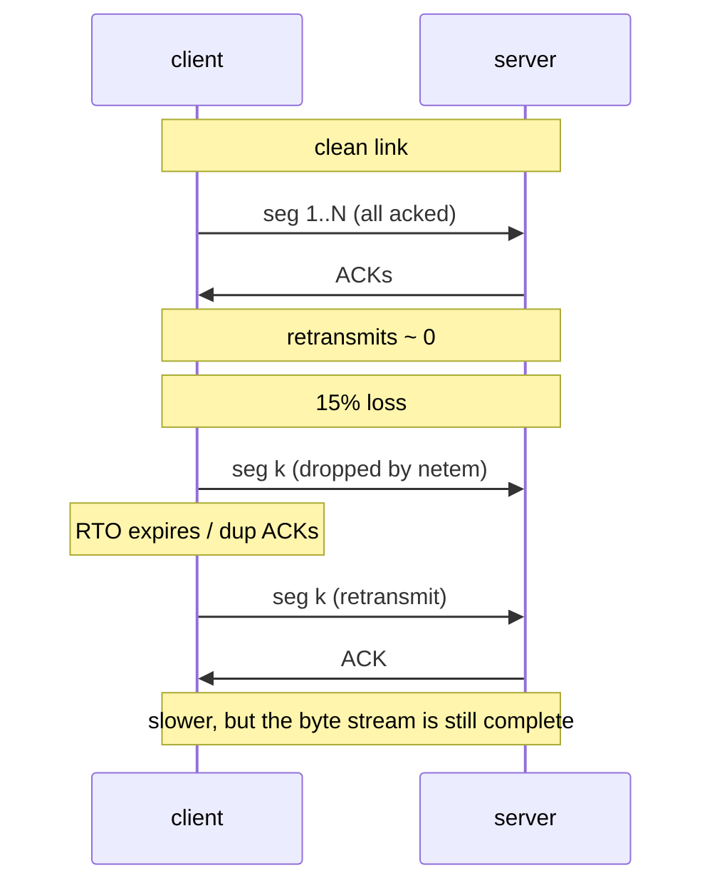

# TCP Lab #8: Loss, Retransmission, and the Window

Expected time: 55 to 70 minutes  
日本語: 想定時間 55〜70分

Reading guide: [`../rfc-notes/tcp-retransmission-windowing.md`](../rfc-notes/tcp-retransmission-windowing.md)

Prerequisite: [TCP Lab 07: One Connection, From SYN to FIN](tcp-07-handshake-teardown.md)

## Goal

Lab 07 watched a connection open and close on a perfect link. Real links drop packets. This lab makes the link lossy on purpose and watches TCP notice the loss and recover.

You will:

- add latency and packet loss to the link with `tc netem`,
- push a few megabytes and count the **retransmitted** segments,
- read `ss -ti` to see **RTT**, **cwnd**, and the **retransmit** counters move,
- see the **receive window** (`win`) and window scaling in the capture.

日本語: Lab 07 は完璧なリンク上で接続の開閉を見ました。実際のリンクはパケットを落とします。この Lab では、わざとリンクを lossy にして、TCP が loss に気づき回復する様子を観察します。`tc netem` で遅延とパケットロスを足し、数 MB を送って再送(retransmission)の数を数え、`ss -ti` で RTT・cwnd・retransmit カウンタが動くのを読み、capture で receive window(`win`)と window scaling を見ます。

By the end, you should be able to explain this contrast:

| Link | Retransmitted segments | Transfer time |
|---|---|---|
| clean | ~0 | short |
| 15% loss + 25ms delay | many | longer, but still completes |

## What You Will Learn

理解したいこと:

- Why TCP retransmits: an unacknowledged segment is assumed lost after a timeout (RTO) or duplicate ACKs.
- How RTT drives the retransmission timeout.
- What the receive window advertises and how window scaling extends it.
- How loss slows a transfer without breaking it (reliability on top of an unreliable network).
- How to read retransmit/cwnd/rtt from `ss -ti` and duplicate segments in a capture.

This lab does not cover:

- Specific congestion-control algorithms (CUBIC, BBR) in depth.
- SACK, ECN, or pacing internals.
- Application-layer behavior on top of TCP.
- Tuning `sysctl` buffers for throughput.

## RFCで読む場所

| RFC | 章 | 読むポイント |
|---|---|---|
| RFC 9293 | 3.7 | data communication、retransmission timeout、window の使い方 |
| RFC 9293 | 3.8.6 | flow control と receive window(SWS 回避など) |
| RFC 6298 | 2, 5 | RTT 測定と RTO(retransmission timeout)の計算 |
| RFC 7323 | 2 | window scale option(大きな window を可能にする) |
| RFC 5681 | 2-3 | slow start、congestion avoidance、loss への反応(参考) |
| RFC 5737 | 3 | Lab で使うアドレスが documentation 用であること |

## 実験の全体像

Lab 07 と同じ2ノード。今回は client 側リンクに `tc netem` で遅延とロスを入れる。

```text
client (10.0.0.1) --[ netem: delay 25ms, loss 15% ]-- server (10.0.0.2:8080)
```

client から server へ約 3 MB を送る。まずクリーンなリンクで、次に netem を足したリンクで。再送の数と所要時間を比べる。



両ノードとも `nicolaka/netshoot`(`ip`、`tc`、`tcpdump`、`ss`、`nc`(OpenBSD)、`socat` 同梱)。追加イメージは不要。sink は `--exec`/`--keep-open` を持たない OpenBSD `nc` の代わりに `socat` で立てる。

## 必要なもの

推奨環境:

- Linux / WSL2 / Linux VM
- Docker
- containerlab
- tcpdump

使用イメージ:

- `nicolaka/netshoot:latest`

## 実行手順

```bash
./scripts/labctl.sh run tcp-08
```

`labctl.sh run tcp-08` は、deploy、クリーン転送、netem 適用、lossy 転送の capture と retransmit 計測、後片付けまで行う。

### 1. 作業ディレクトリへ移動する

```bash
cd protocol-lab/examples/tcp-08
```

### 2. 起動して sink を用意する

```bash
sudo containerlab deploy -t tcp-08.clab.yml
docker exec -d clab-tcp-08-server sh -c "socat -u TCP-LISTEN:8080,reuseaddr,fork OPEN:/dev/null"
```

server は受け取ったバイトを捨てる sink。

### 3. クリーンなリンクで送る(基準)

client の TCP 統計を控えてから、3 MB 送る。

```bash
docker exec clab-tcp-08-client sh -c "cat /proc/net/snmp | grep '^Tcp:'"
time docker exec clab-tcp-08-client sh -c "head -c 3000000 /dev/zero | nc -N -w15 10.0.0.2 8080"
docker exec clab-tcp-08-client sh -c "cat /proc/net/snmp | grep '^Tcp:'"
```

2行目の `Tcp:` は列名、3行目が値。`RetransSegs` 列の増分がクリーン時の再送数(ふつうほぼ0)。

### 4. リンクを lossy にする

client の eth1 に遅延とロスを入れる。

```bash
docker exec clab-tcp-08-client tc qdisc add dev eth1 root netem delay 25ms loss 15%
docker exec clab-tcp-08-client tc qdisc show dev eth1
```

### 5. capture しながら、もう一度送る

別シェルで capture を回す。

```bash
docker exec -it clab-tcp-08-client tcpdump -i eth1 -n "tcp port 8080"
```

さらに別シェルで、転送中の socket 統計をのぞく。

```bash
docker exec -it clab-tcp-08-client sh -c "while true; do ss -tino dst 10.0.0.2; sleep 0.5; done"
```

そして転送。

```bash
docker exec clab-tcp-08-client sh -c "cat /proc/net/snmp | grep '^Tcp:'"
time docker exec clab-tcp-08-client sh -c "head -c 3000000 /dev/zero | nc -N -w15 10.0.0.2 8080"
docker exec clab-tcp-08-client sh -c "cat /proc/net/snmp | grep '^Tcp:'"
```

見るポイント:

- `RetransSegs` の増分がクリーン時よりずっと大きい。
- `time` の実時間が長い(でも転送は完了する)。
- `ss -tino` に `rtt:`、`cwnd:`、`retrans:`、`rto:` が並ぶ。loss のたびに cwnd が縮み、rto が伸びる。

### 6. netem を外す

```bash
docker exec clab-tcp-08-client tc qdisc del dev eth1 root
```

## 期待出力

### `ss -tino dst 10.0.0.2`(転送中)

```text
ESTAB 0 197120 10.0.0.1:44210 10.0.0.2:8080
     ... rtt:51.3/12.1 ... cwnd:10 ... retrans:0/23 rto:312 ...
```

見るポイント:

- `rtt:` は netem の 25ms×往復 ≒ 50ms 付近。
- `retrans:X/Y` の `Y` が累計再送数。
- `cwnd:` が loss で小さくなる。

### `/proc/net/snmp` の `RetransSegs`

- lossy 転送の増分 > クリーン転送の増分。

### capture

- SYN の options に `wscale`(window scale)。
- 確立後の各パケットに `win NNNN`(advertised receive window)。
- 同じ `seq` が2回現れる行(= 再送)。

## なぜそう動くのか

TCP は信頼できないネットワークの上で、信頼できるバイトストリームを約束する。だから「送ったのに ACK が返らない」を loss とみなして送り直す。

- **retransmission の引き金は2つ**: (1) 一定時間 ACK が来ない → RTO タイムアウトで再送。(2) 同じ ACK が重複して届く(dup ACK)→ 受信側が「その先が抜けている」と言っている → fast retransmit。
- **RTO は RTT から作る**(RFC 6298)。RTT を測り、そのばらつきも見て、余裕をもったタイムアウトを決める。RTT が伸びれば RTO も伸びる。
- **receive window** は受信側が「今これだけ受け取れる」と広告する量。送信側はそれを超えて未確認データを積めない(flow control)。窓が16bitで足りないので、**window scale option**(SYN で交換)で実効窓を広げる(RFC 7323)。
- **loss は速度を落とすが壊さない**: 再送で抜けを埋め、輻輳制御(RFC 5681)で送信ペースを落とす。だから 15% 落としても、時間はかかるが 3 MB は最後まで届く。

観察の要点は「TCP は loss を検出し、再送し、ペースを調整して、それでもストリームを完成させる」こと。

## 詰まりやすい点

- **再送を「エラー」と読む**。再送は TCP の正常な回復動作。ゼロにはならない。
- **RetransSegs の絶対値を見る**。大事なのはクリーン時との差(増分)。
- **cwnd と receive window を混同する**。cwnd は送信側が輻輳を見て決める内部の窓。receive window は受信側が広告する窓。実際に送れる量は両者の小さい方。
- **netem を外し忘れる**。次の実験に遅延・ロスが残る。`tc qdisc del dev eth1 root` で戻す。
- **loss を大きくしすぎる**。50% などにすると転送が実質止まる。15% 程度が観察に向く。
- **tcpdump は再送に明示ラベルを付けない**。同じ `seq` の再出現や、`ss` の `retrans` カウンタで判断する。

## 後片付け

```bash
sudo containerlab destroy -t tcp-08.clab.yml --cleanup
```

`labctl.sh run tcp-08` を使った場合は、スクリプトが最後に destroy する。

## 確認問題

1. TCP が「パケットが失われた」と判断する2つのきっかけは何か。
2. RTO(retransmission timeout)は何を元に決まるか。RTT が伸びると RTO はどうなるか。
3. receive window と congestion window(cwnd)の違いは何か。実際に送れる量はどちらで決まるか。
4. window scale option は何のためにあるか。どのパケットで交換されるか。
5. 15% のロスがあっても 3 MB の転送が完了するのはなぜか。
6. `ss -tino` の `retrans:X/Y` の X と Y はそれぞれ何を表すか。

## References

- [RFC 9293: Transmission Control Protocol (TCP)](https://www.rfc-editor.org/rfc/rfc9293)
- [RFC 6298: Computing TCP's Retransmission Timer](https://www.rfc-editor.org/rfc/rfc6298)
- [RFC 7323: TCP Extensions for High Performance](https://www.rfc-editor.org/rfc/rfc7323)
- [RFC 5681: TCP Congestion Control](https://www.rfc-editor.org/rfc/rfc5681)
- [RFC 5737: IPv4 Address Blocks Reserved for Documentation](https://www.rfc-editor.org/rfc/rfc5737)
- [tc-netem manual page](https://man7.org/linux/man-pages/man8/tc-netem.8.html)

## 検証済み実行ログ (2026-07-05)

このLabは実機で再現性を確認済みです。

実行環境:

- Ubuntu 26.04 LTS (kernel 7.0.0-27-generic, x86_64)
- Docker 29.1.3
- containerlab 0.77.0
- client / server: `nicolaka/netshoot:latest`
- ホスト kernel の `sch_netem` は `tc qdisc add ... netem` 実行時に自動ロードされた（手動 `modprobe` は不要だった）

`PATH="/tmp/pl-shim:$PATH" ./scripts/labctl.sh run tcp-08` で deploy → verify → destroy を実行し、`verification.json` は `"status": "verified"` を返した。

### 環境ドリフトへの追随（この検証で必要になった修正）

- **netshoot の netcat 入れ替わり**（Lab 07 と同じ）。sink を `socat -u TCP-LISTEN:8080,reuseaddr,fork OPEN:/dev/null` に、送信側を `nc -N -w15`（EOF で送信方向を shutdown）に変更した（`examples/tcp-08/run.sh` と本文の手順を更新）。

### netem を適用した lossy リンク

```text
$ docker exec clab-tcp-08-client tc qdisc show dev eth1
qdisc netem 8002: root refcnt 25 limit 1000 delay 25ms loss 15%
```

### クリーン vs lossy の再送数（/proc/net/snmp の TcpRetransSegs 増分）

```text
[protocol-lab][tcp-08] clean transfer: 0s, client retransmits=0
[protocol-lab][tcp-08] lossy transfer: 5s, client retransmits=59
[protocol-lab][tcp-08] summary: clean 0s/0 retrans vs lossy 5s/59 retrans
```

同じ 3 MB 転送が、クリーンなリンクでは再送 0・ほぼ一瞬。25ms 遅延 + 15% ロスを入れると 59 回再送し、所要も 5 秒に伸びた。それでも転送は最後まで完了している（TCP の信頼性）。

### 転送中の socket 統計（`ss -tino`）— 輻輳制御が効いている様子

```text
# 立ち上がり（クリーン相当、cwnd が育つ）
cubic rtt:25.244/0.431 mss:9448 cwnd:8  ssthresh:10 bytes_sent:404176  bytes_retrans:47240  ... retrans:1/6  lost:1 sacked:5

# ロスで cwnd と ssthresh が落ちる
cubic rtt:25.823/1.219 mss:9448 cwnd:2  ssthresh:2  bytes_sent:3210232 bytes_retrans:510192 ... retrans:2/55 lost:2 sacked:4
cubic rtt:32.396/13.235 mss:9448 cwnd:1 ssthresh:2  bytes_sent:3295264 bytes_retrans:529088 ... retrans:1/57 lost:1
```

読み方:

- `rtt:25.xxx` は netem の `delay 25ms` を反映した実測 RTT（`minrtt:25`）。
- `cwnd`（輻輳ウィンドウ）が立ち上がりの `10 → 8` から、ロスを検知するたびに `3 → 2 → 1` へと絞られている。`ssthresh`（slow-start 閾値）も `10 → 2` へ低下。これが RFC 5681 の congestion avoidance / loss recovery。
- `bytes_retrans` と `retrans:X/Y`、`lost`、`sacked` が、ロスした segment を SACK ベースで再送している証跡。
- `cubic` は使用中の輻輳制御アルゴリズム。

### Cleanup

```bash
docker exec clab-tcp-08-client tc qdisc del dev eth1 root
containerlab destroy -t tcp-08.clab.yml --cleanup
```
