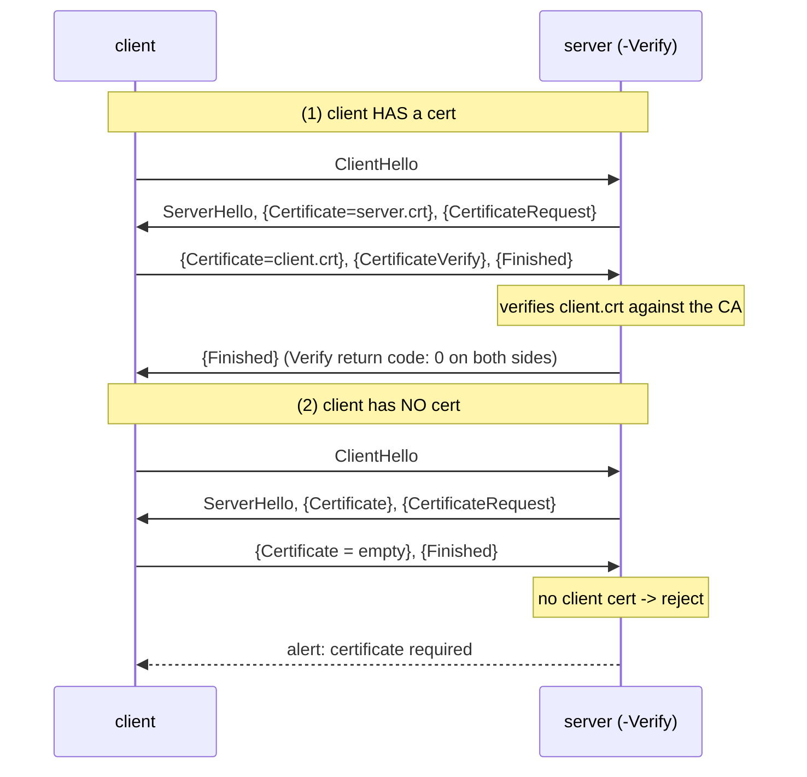

# TLS Lab #15: Mutual TLS — Proving the Client Too

Expected time: 45 to 60 minutes  
日本語: 想定時間 45〜60分

Reading guide: [`../rfc-notes/tls-mutual-tls.md`](../rfc-notes/tls-mutual-tls.md)

Prerequisite: [TLS Lab 09: What Is Visible Before Encryption](tls-09-handshake-certificates.md)

## Goal

In Lab 09 only the **server** proved who it was. In many real systems (service meshes, VPNs, API gateways, database clients) the **client** must prove its identity too. That is **mutual TLS (mTLS)**.

You will run one small lab **CA** that signs both a server cert and a client cert, then watch two outcomes against a server started with `-Verify` (client certificate required):

- A client that **presents its certificate** completes the handshake — both ends report `Verify return code: 0 (ok)`.
- A client with **no certificate** is rejected during the handshake with a TLS alert: `certificate required`.

日本語: Lab 09 では **server** だけが身元を証明しました。実運用(service mesh、VPN、API gateway、DB クライアントなど)では **client** も身元を証明する必要があります。これが **mutual TLS(mTLS)**。専用の小さな **CA** で server 証明書と client 証明書の両方を発行し、`-Verify`(client 証明書必須)で起動した server に対して、証明書を出す client は handshake が成立(両端が `Verify return code: 0`)、証明書を出さない client は handshake 中に `certificate required` の TLS alert で拒否される、という2つの結末を観察します。

By the end, you should be able to fill in this table:

| Client | Server (`-Verify`) sends | Outcome |
|---|---|---|
| presents a CA-signed cert | CertificateRequest → verifies the client | handshake OK, both sides `Verify return code: 0` |
| presents no cert | CertificateRequest → gets nothing back | `tlsv13 alert certificate required` |

## What You Will Learn

理解したいこと:

- The difference between server-only TLS (Lab 09) and mutual TLS.
- What a **CertificateRequest** is, and how the server advertises which CAs it trusts.
- Why both a server cert and a client cert must chain to a CA the other side trusts.
- What `openssl s_server -Verify` (mandatory) vs `-verify` (optional) means.
- Why, in TLS 1.3, the CertificateRequest and the client's certificate are **encrypted** (you read them at the endpoint, not from the wire).

This lab does not cover:

- A real public PKI or certificate lifecycle (issuance, revocation, OCSP).
- SPIFFE/SVID, service-mesh identity, or automatic cert rotation.
- Client-cert authorization logic beyond "is it signed by our CA".

日本語: server のみの TLS(Lab 09)と mTLS の違い、CertificateRequest と「server が信頼する CA 名の広告」、両者の証明書が相手の信頼する CA につながる必要があること、`-Verify`(必須)と `-verify`(任意)の違い、そして TLS 1.3 では CertificateRequest と client 証明書が**暗号化**される(経路からではなく端点で読む)ことを学びます。

## RFCで読む場所

| RFC | 章 | 読むポイント |
|---|---|---|
| RFC 8446 | 4.3.2 | CertificateRequest(server が client 証明書を要求) |
| RFC 8446 | 4.4.2 | Certificate message(1.3 では暗号化して送る) |
| RFC 8446 | 4.4.3 | CertificateVerify(秘密鍵を持つ証明) |
| RFC 8446 | 2 | 1-RTT handshake の全体像(Lab 09 の復習) |
| RFC 5280 | 3, 4 | X.509 証明書と CA による署名、chain |
| RFC 5737 | 3 | Lab で使う名前が documentation 用であること |

## 実験の全体像

client 1台、server 1台。専用 CA が server / client 両方の証明書に署名する。server は client 証明書を必須にして待つ。

```text
                 Protocol Lab CA
                 /            \
        signs server.crt    signs client.crt
             |                    |
client (10.0.0.1) ------ eth1 ------ server (10.0.0.2:4433)
  openssl s_client                    openssl s_server -Verify 1
  (1) with client.crt/key  -> OK
  (2) without a cert       -> rejected
```

server は `-Verify`(必須)なので、handshake の途中で **CertificateRequest** を送り、client の証明書を CA で検証する。client が証明書を出さなければ、`certificate required` で打ち切る。



## 必要なもの

推奨環境:

- Linux / WSL2 / Linux VM
- Docker
- containerlab

使用イメージ:

- `nicolaka/netshoot:latest`(openssl、tcpdump、tshark 同梱)

追加イメージは不要。証明書は `run.sh` が server コンテナ内で生成する(CA・server・client)。何もコミットしない。

## 実行手順

```bash
./scripts/labctl.sh run tls-15
```

`labctl.sh run tls-15` は、deploy、CA と両証明書の生成、mTLS server 起動、証明書ありクライアント(成功)と証明書なしクライアント(拒否)の実行、確認、後片付けまで行う。

### 1. 作業ディレクトリへ移動する

```bash
cd protocol-lab/examples/tls-15
```

### 2. 起動して証明書を作る

```bash
sudo containerlab deploy -t tls-15.clab.yml
# 専用 CA -> server 証明書 / client 証明書
docker exec clab-tls-15-server sh -c '
  cd /tmp
  openssl req -x509 -newkey rsa:2048 -nodes -keyout ca.key -out ca.crt -subj "/CN=Protocol Lab CA" -days 3650
  for who in server client; do
    openssl req -newkey rsa:2048 -nodes -keyout $who.key -out $who.csr -subj "/CN=$who.example.lab"
    openssl x509 -req -in $who.csr -CA ca.crt -CAkey ca.key -CAcreateserial -out $who.crt -days 3650 \
      -extfile <(printf "subjectAltName=DNS:%s.example.lab" "$who")
  done'
# client に ca.crt / client.crt / client.key を渡す（run.sh は docker cp で配る）
```

### 3. mTLS サーバを起動する

```bash
docker exec -d clab-tls-15-server sh -c \
  "openssl s_server -accept 4433 -cert /tmp/server.crt -key /tmp/server.key \
     -CAfile /tmp/ca.crt -Verify 1 -tls1_3 -www"
```

`-Verify 1` が肝。client 証明書を **必須**にする(小文字 `-verify` は要求するが任意)。

### 4. 証明書ありで接続する（成功）

```bash
docker exec clab-tls-15-client sh -c \
  "echo Q | openssl s_client -connect 10.0.0.2:4433 \
     -cert /tmp/client.crt -key /tmp/client.key -CAfile /tmp/ca.crt -tls1_3"
```

見るポイント:

```text
Acceptable client certificate CA names
CN=Protocol Lab CA
New, TLSv1.3, Cipher is TLS_AES_256_GCM_SHA384
Verify return code: 0 (ok)
```

- `Acceptable client certificate CA names`: server が **CertificateRequest** を送り、「この CA が署名した client 証明書を出せ」と要求した証拠。
- `Verify return code: 0 (ok)`: client 側で server 証明書の検証が通った。server 側も client 証明書を検証して受理している。

### 5. 証明書なしで接続する（拒否）

```bash
docker exec clab-tls-15-client sh -c \
  "echo Q | openssl s_client -connect 10.0.0.2:4433 -CAfile /tmp/ca.crt -tls1_3"
```

見るポイント:

```text
... tlsv13 alert certificate required ... SSL alert number 116
```

client が証明書を出せないので、server が handshake を打ち切る。**身元を証明できない client は入れない**。

## 期待出力

- 証明書あり: `Acceptable client certificate CA names`、`TLSv1.3`、`Verify return code: 0 (ok)`。
- 証明書なし: `tlsv13 alert certificate required`(alert 116)で handshake 失敗。

## なぜそう動くのか

通常の TLS(Lab 09)は「client が server を信じてよいか」だけを確かめる。mTLS はそこに「server が client を信じてよいか」を足す、対称的な認証。

- **CertificateRequest**: server が handshake 中に「client 証明書をよこせ。信頼する CA はこれこれだ」と要求するメッセージ。`-Verify`(必須)だと、応じない client を拒否する。
- **双方向の chain 検証**: client は server 証明書が「自分の信頼する CA」につながるか確認する。server は client 証明書が「自分の信頼する CA」につながるか確認する。このLabでは同じ1つの CA が両方に署名しているので、両端が同じ CA を信頼すれば成立する。
- **CertificateVerify**: 証明書を出すだけでは不十分(証明書は公開情報)。対応する**秘密鍵を持っている**ことを、handshake の内容への署名で示す。これがないと証明書のなりすましができてしまう。
- **TLS 1.3 では暗号化される**: ServerHello の後に鍵が導出されるので、CertificateRequest も client の Certificate も暗号化されて送られる。だから経路上の capture からは中身が読めない。読めるのは接続の**端点**(この openssl のような当事者)だけ。

要点は、**mTLS は「相手も証明書で身元を証明する」対称的な TLS** であり、証明できない相手は接続の段階で弾かれる、ということ。

## 詰まりやすい点

- **server 認証と client 認証を混同する**。Lab 09 は server のみ。mTLS は両方。
- **`-Verify` と `-verify` を取り違える**。大文字は必須(なければ拒否)、小文字は任意(要求はするが無くても通す)。
- **同じ CA を両端が信頼していないと成立しない**。client 証明書を server の知らない CA で署名すると拒否される。
- **証明書だけで通ると思う**。CertificateVerify(秘密鍵の証明)まで要る。
- **TLS 1.3 では client 証明書が capture で見えない**。暗号化されているため。端点の出力で確認する。
- **`echo Q`**。openssl s_client を handshake 後すぐ閉じるための入力。無いと接続が開いたまま待つ。

## 後片付け

```bash
sudo containerlab destroy -t tls-15.clab.yml --cleanup
```

`labctl.sh run tls-15` を使った場合は、スクリプトが最後に destroy する。

## 確認問題

1. 通常の TLS(Lab 09)と mTLS の違いは何か。何が増えるか。
2. CertificateRequest は誰が送るメッセージか。何を要求するか。
3. `openssl s_server` の `-Verify` と `-verify` の違いは何か。
4. client 証明書が「別の CA」で署名されていたら、この server はどうするか。なぜか。
5. 証明書を持っているだけでは不十分で、CertificateVerify が要るのはなぜか。
6. TLS 1.3 では、なぜ client 証明書を passive capture から読めないのか。

## References

- [RFC 8446: The Transport Layer Security (TLS) Protocol Version 1.3](https://www.rfc-editor.org/rfc/rfc8446)
- [RFC 5280: Internet X.509 Public Key Infrastructure Certificate and CRL Profile](https://www.rfc-editor.org/rfc/rfc5280)
- [RFC 5737: IPv4 Address Blocks Reserved for Documentation](https://www.rfc-editor.org/rfc/rfc5737)
- [openssl s_server manual page](https://docs.openssl.org/master/man1/openssl-s_server/)
- [openssl s_client manual page](https://docs.openssl.org/master/man1/openssl-s_client/)

## 検証済み実行ログ (2026-07-07)

このLabは実機で再現性を確認済みです。

実行環境:

- Ubuntu 26.04 LTS (kernel 7.0.0-27-generic, x86_64)
- Docker 29.1.3
- containerlab 0.77.0
- client / server: `nicolaka/netshoot:latest`（openssl 3.x）

`PATH="/tmp/pl-shim:$PATH" ./scripts/labctl.sh run tls-15` で deploy → verify → destroy を実行し、`verification.json` は `"status": "verified"` を返した。専用 CA(`CN=Protocol Lab CA`)が server / client 両方の証明書に署名している。

### 証明書ありの client（成功、相互認証）

```text
$ echo Q | openssl s_client -connect 10.0.0.2:4433 \
    -cert /tmp/client.crt -key /tmp/client.key -CAfile /tmp/ca.crt -tls1_3

depth=1 CN=Protocol Lab CA
 1 s:CN=Protocol Lab CA
   i:CN=Protocol Lab CA
Acceptable client certificate CA names
CN=Protocol Lab CA
New, TLSv1.3, Cipher is TLS_AES_256_GCM_SHA384
Verify return code: 0 (ok)
```

`Acceptable client certificate CA names` は server が CertificateRequest を送った証拠。`Verify return code: 0 (ok)` で双方向の検証が通っている。

### 証明書なしの client（拒否）

```text
$ echo Q | openssl s_client -connect 10.0.0.2:4433 -CAfile /tmp/ca.crt -tls1_3

...:error:0A00045C:SSL routines:ssl3_read_bytes:tlsv13 alert certificate required:...:SSL alert number 116
```

client が証明書を出せないため、server は `tlsv13 alert certificate required`(alert 116)で handshake を打ち切る。Lab 09(server のみ認証)との違いがここに出る：mTLS では **身元を証明できない client は接続できない**。

### Cleanup

```bash
containerlab destroy -t tls-15.clab.yml --cleanup
```
