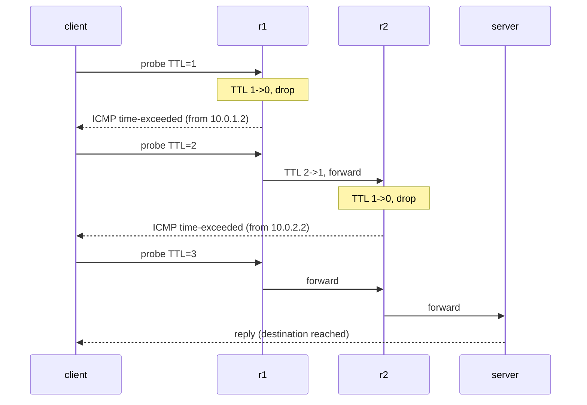

# Lab #19: traceroute and TTL — Mapping a Path Hop by Hop

Expected time: 40 to 55 minutes  
日本語: 想定時間 40〜55分

Reading guide: [`../rfc-notes/traceroute-ttl.md`](../rfc-notes/traceroute-ttl.md)

Prerequisite: [TCP Lab 07](tcp-07-handshake-teardown.md) (reading captures)

## Goal

Every IP packet carries a **TTL** (time to live) that each router decrements by one. When it reaches zero, the router drops the packet and sends back an **ICMP time-exceeded** message. `traceroute` turns this rule into a map: send probes with TTL 1, 2, 3, … and each dying probe reveals the router at that distance.

This lab builds a real multi-hop path and shows the mechanism:

- `client → r1 → r2 → server`, two Linux routers in the middle,
- `traceroute` from the client lists each hop: `10.0.1.2` (r1), `10.0.2.2` (r2), `10.0.3.2` (server),
- a capture shows the **ICMP time-exceeded** replies (from r1 for TTL 1, r2 for TTL 2) that traceroute is built on.

日本語: すべての IP パケットは **TTL**(time to live)を持ち、ルータを通るたびに1減ります。0 になるとルータはパケットを捨て、**ICMP time-exceeded** を返します。`traceroute` はこの規則を地図に変えます。TTL 1, 2, 3… の探査パケットを送り、途中で死んだ各探査が「その距離にいるルータ」を明かす。この Lab では実際の多段経路(`client → r1 → r2 → server`)を作り、traceroute が各 hop(`10.0.1.2`, `10.0.2.2`, `10.0.3.2`)を挙げること、そしてその土台になる **ICMP time-exceeded**(TTL 1 で r1、TTL 2 で r2 から)を capture で確認します。

By the end, you should be able to explain this table:

| Probe TTL | Dies at | Reply |
|---|---|---|
| 1 | r1 (`10.0.1.2`) | ICMP time-exceeded from r1 |
| 2 | r2 (`10.0.2.2`) | ICMP time-exceeded from r2 |
| 3 | server (`10.0.3.2`) | reaches the destination |

## What You Will Learn

理解したいこと:

- What the IP **TTL** field is for (loop protection) and how routers decrement it.
- What an **ICMP time-exceeded** message is and who sends it.
- How `traceroute` uses increasing TTLs to discover each hop.
- Why the hops appear in order, and why the last hop is the destination itself.
- The difference between forwarding (routers) and being an endpoint.

This lab does not cover:

- UDP vs ICMP vs TCP traceroute probe types in depth (we use ICMP mode).
- Load-balanced paths (ECMP) where hops can vary between probes.
- Why some hops show `* * *` (rate limiting or filtered ICMP) in the real Internet.

日本語: IP の **TTL**(ループ防止)、ルータが1ずつ減らすこと、**ICMP time-exceeded** を誰が送るか、traceroute が増加する TTL で各 hop を発見する仕組み、hop が順に現れる理由と最後が宛先自身である理由、forwarding(ルータ)と endpoint の違いを学びます。

## RFCで読む場所

| RFC | 章 | 読むポイント |
|---|---|---|
| RFC 791 | 3.2 (Time to Live) | IP ヘッダの TTL フィールドと、ホップごとの減算 |
| RFC 792 | Time Exceeded Message | TTL が 0 になったとき返す ICMP メッセージ |
| RFC 1812 | 5.3.1 | ルータの TTL 処理(減算と time-exceeded 生成) |
| RFC 5737 | 3 | Lab で使うアドレスが documentation 用であること |

## 実験の全体像

client、ルータ2台(r1, r2)、server の4ノードを直列に繋ぐ。

```text
client ---10.0.1.0/24--- r1 ---10.0.2.0/24--- r2 ---10.0.3.0/24--- server
10.0.1.1             10.0.1.2            10.0.2.2                10.0.3.2
                     10.0.2.1            10.0.3.1
```

client から server へ traceroute すると、r1 → r2 → server の順に hop が現れる。r1/r2 は Linux ルータ(ip_forward + 静的経路)。



`10.0.0.0/8` のサブネットはローカル閉域用。

## 必要なもの

推奨環境:

- Linux / WSL2 / Linux VM
- Docker
- containerlab

使用イメージ:

- `nicolaka/netshoot:latest`（`traceroute`、`ping`、`tcpdump` 同梱）

追加イメージは不要。ルータは Linux の ip_forward + 静的経路(run.sh が設定)。

## 実行手順

```bash
./scripts/labctl.sh run trace-19
```

### 1. 作業ディレクトリへ移動する

```bash
cd protocol-lab/examples/trace-19
```

### 2. 起動して経路を設定する

```bash
sudo containerlab deploy -t trace-19.clab.yml
# r1/r2 で転送を有効化し、各ノードに静的経路（run.sh が実施）
docker exec clab-trace-19-r1 sysctl -w net.ipv4.ip_forward=1
docker exec clab-trace-19-r2 sysctl -w net.ipv4.ip_forward=1
docker exec clab-trace-19-client sh -c "ip route add 10.0.2.0/24 via 10.0.1.2; ip route add 10.0.3.0/24 via 10.0.1.2"
docker exec clab-trace-19-r1 ip route add 10.0.3.0/24 via 10.0.2.2
docker exec clab-trace-19-r2 ip route add 10.0.1.0/24 via 10.0.2.1
docker exec clab-trace-19-server sh -c "ip route add 10.0.2.0/24 via 10.0.3.1; ip route add 10.0.1.0/24 via 10.0.3.1"
```

### 3. traceroute で経路を見る

```bash
docker exec clab-trace-19-client traceroute -I -n 10.0.3.2
```

期待する確認ポイント:

```text
 1  10.0.1.2   ...   <- r1
 2  10.0.2.2   ...   <- r2
 3  10.0.3.2   ...   <- server (destination)
```

各行が1つの hop。TTL を1ずつ増やして、順に遠いルータを引き出している。

### 4. TTL の仕組みを capture で確かめる

```bash
docker exec -d clab-trace-19-client tcpdump -i eth1 -n -w /tmp/te.pcap "icmp"
docker exec clab-trace-19-client ping -c1 -t1 10.0.3.2   # TTL 1: r1 で死ぬ
docker exec clab-trace-19-client ping -c1 -t2 10.0.3.2   # TTL 2: r2 で死ぬ
docker exec clab-trace-19-client pkill -INT tcpdump
docker exec clab-trace-19-client tcpdump -n -vv -r /tmp/te.pcap
```

`10.0.1.2 > 10.0.1.1: ICMP time exceeded in-transit`(r1 から)、`10.0.2.2 > 10.0.1.1: ICMP time exceeded`(r2 から)が見える。これがまさに traceroute の各 hop を作っている。

## 期待出力

- `traceroute`: hop 1 = `10.0.1.2`(r1)、hop 2 = `10.0.2.2`(r2)、hop 3 = `10.0.3.2`(server)。
- capture: `ICMP time exceeded` が r1(`10.0.1.2`)と r2(`10.0.2.2`)から。

## なぜそう動くのか

TTL(time to live)は本来「パケットが永遠にループしないための保険」。各ルータが転送のたびに1減らし、0 になったら捨てる。traceroute はこの副作用を巧みに使う。

- **TTL の減算**: ルータはパケットを転送する前に TTL を1減らす。減らした結果が 0 なら、転送せずに捨て、送り主へ **ICMP time-exceeded**(RFC 792)を返す。この ICMP の送信元アドレスが「そのルータ」を明かす。
- **traceroute のトリック**: 宛先へ TTL=1 の探査を送ると、最初のルータ(r1)で 0 になり、r1 が time-exceeded を返す → hop 1 が判明。次に TTL=2 → r2 で死ぬ → hop 2。TTL=3 → server に届く → 経路の終わり。こうして「距離ごとに1台ずつ」ルータを引き出す。
- **順序と終点**: TTL を増やすほど遠くのルータが答えるので、hop は必ず近い順に並ぶ。最後の hop は宛先自身(time-exceeded ではなく、通常の応答が返る)。
- **forwarding と endpoint**: r1/r2 は「通す」役(ip_forward)。client/server は「端点」。TTL を減らして time-exceeded を出すのは、通す側=ルータの仕事。

要点は、**TTL という単純なループ防止フィールドが、経路を1 hop ずつ可視化する道具になる**こと。

## 詰まりやすい点

- **TTL と hop 数を混同する**。TTL は残りホップ数の上限。traceroute は TTL を1,2,3…と増やして各 hop を引き出す。
- **time-exceeded を誰が出すか**。TTL を 0 にしたルータ。宛先ではない(宛先は普通に応答)。
- **`* * *` の行**。実インターネットでは ICMP を絞る/落とすルータがあり、hop が見えないことがある。このLabは閉域なので全部見える。
- **traceroute の probe 種別**。UDP/ICMP/TCP がある。このLabは `-I`(ICMP)。環境によって見え方が変わる。
- **経路の非対称**。行きと帰りで経路が違うこともある。traceroute が見せるのは行きの経路。
- **静的経路の設定漏れ**。多段では各ノードに戻り経路も要る。1つ抜けると途中で止まる。

## 後片付け

```bash
sudo containerlab destroy -t trace-19.clab.yml --cleanup
```

`labctl.sh run trace-19` を使った場合は、スクリプトが最後に destroy する。

## 確認問題

1. IP の TTL フィールドは本来何のためにあるか。ルータは TTL をどう扱うか。
2. TTL が 0 になったとき、ルータは何を返すか。その送信元アドレスは何を意味するか。
3. traceroute はどうやって各 hop を1台ずつ引き出すか。
4. traceroute の最後の hop が time-exceeded ではないのはなぜか。
5. 実インターネットで hop が `* * *` になることがあるのはなぜか。
6. forwarding するノードと endpoint のノードの違いは何か。このLabではどれがどれか。

## References

- [RFC 791: Internet Protocol (Time to Live)](https://www.rfc-editor.org/rfc/rfc791)
- [RFC 792: Internet Control Message Protocol (Time Exceeded)](https://www.rfc-editor.org/rfc/rfc792)
- [RFC 1812: Requirements for IP Version 4 Routers](https://www.rfc-editor.org/rfc/rfc1812)
- [RFC 5737: IPv4 Address Blocks Reserved for Documentation](https://www.rfc-editor.org/rfc/rfc5737)
- [traceroute manual page](https://man7.org/linux/man-pages/man8/traceroute.8.html)

## 検証済み実行ログ (2026-07-07)

このLabは実機で再現性を確認済みです。

実行環境:

- Ubuntu 26.04 LTS (kernel 7.0.0-27-generic, x86_64)
- Docker 29.1.3
- containerlab 0.77.0
- client / r1 / r2 / server: `nicolaka/netshoot:latest`（traceroute、tcpdump 同梱）

`PATH="/tmp/pl-shim:$PATH" ./scripts/labctl.sh run trace-19` で deploy → verify → destroy を実行し、`verification.json` は `"status": "verified"` を返した。

### traceroute が経路を hop ごとに映す

```text
$ docker exec clab-trace-19-client traceroute -I -n 10.0.3.2
traceroute to 10.0.3.2 (10.0.3.2), 30 hops max, 46 byte packets
 1  10.0.1.2  0.003 ms     <- r1
 2  10.0.2.2  0.001 ms     <- r2
 3  10.0.3.2  0.000 ms     <- server (destination)
```

### TTL の仕組み: ICMP time-exceeded が各ルータから返る

```text
$ docker exec clab-trace-19-client tcpdump -n -vv -r icmp.pcap
10.0.1.2 > 10.0.1.1: ICMP time exceeded in-transit, length 92   <- TTL 1 が r1 で死ぬ
10.0.2.2 > 10.0.1.1: ICMP time exceeded in-transit, length 92   <- TTL 2 が r2 で死ぬ
```

TTL=1 の探査は最初のルータ r1(`10.0.1.2`)で 0 になり、r1 が time-exceeded を返す。TTL=2 は r2(`10.0.2.2`)で死ぬ。この「距離ごとに1台ずつルータが答える」性質を使って、traceroute は経路を地図化している。単純なループ防止フィールド(TTL)が、経路可視化の道具になっている。

### Cleanup

```bash
containerlab destroy -t trace-19.clab.yml --cleanup
```
