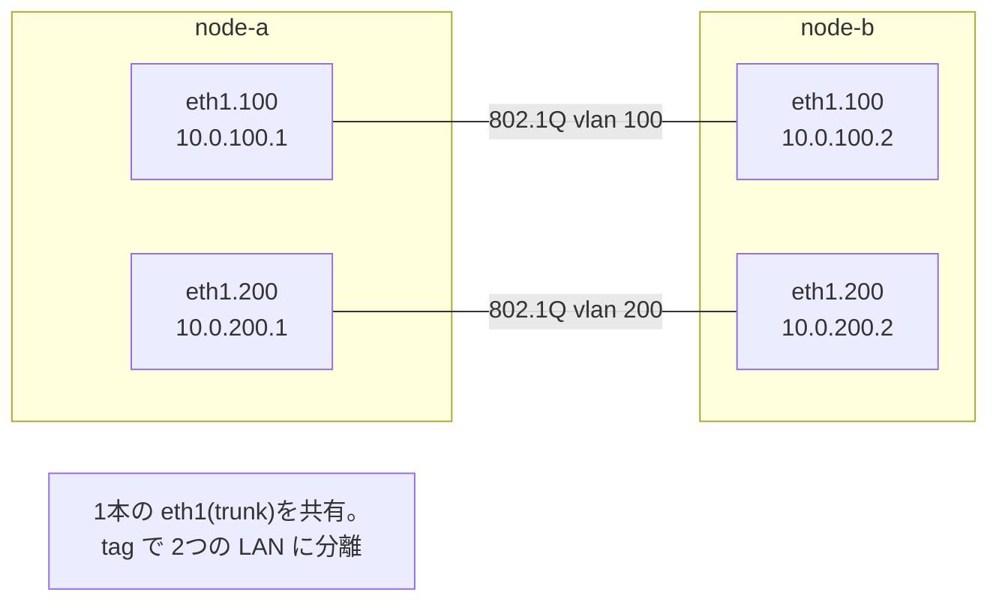

# Lab #26: VLANs — Two Networks on One Wire

Expected time: 40 to 55 minutes  
日本語: 想定時間 40〜55分

Reading guide: [`../rfc-notes/vlan-8021q.md`](../rfc-notes/vlan-8021q.md)

Prerequisites: [Lab 24: ARP](arp-24-address-resolution.md), [Lab 18: VXLAN](vxlan-18-l2-overlay.md)

## Goal

One physical link normally carries one Layer-2 network — one broadcast domain. **802.1Q VLANs** let a single link carry **many** separate LANs at once. Each frame gets a small **tag** with a **VLAN ID (VID)**; the tag says which virtual LAN it belongs to, and devices only see frames for their own VLAN.

This lab puts two VLANs on one link and watches the tags do their job:

- `node-a` and `node-b` share one link, and each has a subinterface on **VLAN 100** (`10.0.100.x`) and **VLAN 200** (`10.0.200.x`),
- a ping over VLAN 100 travels the link as an **802.1Q-tagged frame with `vlan 100`**,
- a ping over VLAN 200 is tagged `vlan 200`,
- during a VLAN-100 ping, the wire shows **only** `vlan 100` frames — VLAN 200 never sees them.

日本語: 1本の物理リンクは普通、1つの L2 ネットワーク(1つの broadcast domain)を運びます。**802.1Q VLAN** は、1本のリンクに **複数** の別々の LAN を同時に載せる仕組み。各フレームに **VLAN ID(VID)** を持つ小さな **tag** を付け、どの仮想 LAN のものかを示し、機器は自分の VLAN のフレームだけを見ます。この Lab では、1本のリンクに2つの VLAN を載せ、VLAN 100 越しの ping が `vlan 100` tag 付きで運ばれ、VLAN 200 越しは `vlan 200` tag、そして VLAN 100 の ping 中はワイヤに `vlan 100` のフレームだけが見える(VLAN 200 は見えない)様子を観察します。

By the end, you should be able to explain this:

| Ping | Tag on the wire | Seen by |
|---|---|---|
| over VLAN 100 (`10.0.100.2`) | 802.1Q, `vlan 100` | only VLAN 100 subinterfaces |
| over VLAN 200 (`10.0.200.2`) | 802.1Q, `vlan 200` | only VLAN 200 subinterfaces |

## What You Will Learn

理解したいこと:

- What a VLAN is: a way to slice one physical LAN into several isolated virtual LANs.
- What an **802.1Q tag** contains (a VLAN ID) and where it sits in the frame.
- What a **trunk** link is (a link carrying tagged frames for multiple VLANs).
- Why two VLANs on the same wire cannot reach each other (separate broadcast domains).
- How this compares to VXLAN (Lab 18): both isolate L2, but VLAN tags a local link (12-bit VID), VXLAN tunnels across L3 (24-bit VNI).

This lab does not cover:

- VLAN trunking protocols (VTP), spanning tree, or switch configuration.
- Access ports vs trunk ports on real switches (here both ends are "trunks").
- Private VLANs, QinQ (stacked tags), or inter-VLAN routing.

日本語: VLAN(1つの物理 LAN を複数の分離した仮想 LAN に切る)、**802.1Q tag**(VLAN ID)とフレーム内の位置、**trunk**(複数 VLAN の tagged frame を運ぶリンク)、同じワイヤの2 VLAN が互いに届かない理由(別 broadcast domain)、VXLAN(Lab 18)との違い(VLAN は 12bit VID でローカルリンク、VXLAN は 24bit VNI で L3 越え)を学びます。

## RFCで読む場所

VLAN は IETF の RFC ではなく **IEEE 802.1Q** で定義される。ここでは標準文書と関連 RFC を挙げる。

| 資料 | 読むポイント |
|---|---|
| IEEE 802.1Q | VLAN tag のフォーマット(TPID 0x8100、PCP、VID 12bit)、trunk の考え方 |
| RFC 5517 | Private VLAN(参考、分離の発展) |
| RFC 826 | ARP(VLAN 内の L2 解決。各 VLAN は別 broadcast domain) |
| RFC 5737 | Lab で使うアドレスが documentation 用であること |

## 実験の全体像

node-a と node-b を1本のリンクで繋ぎ、各ノードに VLAN 100 と VLAN 200 の subinterface を作る。

```text
node-a ==== eth1/eth1 (trunk) ==== node-b
  eth1.100 10.0.100.1                 eth1.100 10.0.100.2   (VLAN 100)
  eth1.200 10.0.200.1                 eth1.200 10.0.200.2   (VLAN 200)
```

VLAN 100 で ping すると `vlan 100` tag 付きのフレームが流れ、VLAN 200 とは混ざらない。



`10.0.0.0/8` のサブネットはローカル閉域。

## 必要なもの

推奨環境:

- Linux / WSL2 / Linux VM
- Docker
- containerlab

使用イメージ:

- `nicolaka/netshoot:latest`（`ip`(VLAN 対応)、`ping`、`tcpdump`(802.1Q デコード) 同梱）

追加イメージは不要。VLAN subinterface は run.sh が作る。

## 実行手順

```bash
./scripts/labctl.sh run vlan-26
```

### 1. 作業ディレクトリへ移動する

```bash
cd protocol-lab/examples/vlan-26
```

### 2. 起動して VLAN を作る

```bash
sudo containerlab deploy -t vlan-26.clab.yml
# 各ノードで VLAN 100 / 200 の subinterface
docker exec clab-vlan-26-node-a sh -c '
  ip link add link eth1 name eth1.100 type vlan id 100
  ip link add link eth1 name eth1.200 type vlan id 200
  ip addr add 10.0.100.1/24 dev eth1.100; ip link set eth1.100 up
  ip addr add 10.0.200.1/24 dev eth1.200; ip link set eth1.200 up'
# node-b も対称に（.2 で）
```

### 3. 各 VLAN で ping し、tag を見る

```bash
docker exec -d clab-vlan-26-node-a tcpdump -i eth1 -n -e "icmp"
docker exec clab-vlan-26-node-a ping -c2 10.0.100.2   # VLAN 100
docker exec clab-vlan-26-node-a ping -c2 10.0.200.2   # VLAN 200
```

見るポイント:

```text
... ethertype 802.1Q (0x8100) ... vlan 100, ... 10.0.100.1 > 10.0.100.2: ICMP echo request
... ethertype 802.1Q (0x8100) ... vlan 200, ... 10.0.200.1 > 10.0.200.2: ICMP echo request
```

同じ eth1 を流れているのに、tag(`vlan 100` / `vlan 200`)で区別されている。

### 4. 分離を確かめる

```bash
# VLAN 100 の ping 中に、vlan 100 だけを capture
docker exec -d clab-vlan-26-node-a tcpdump -i eth1 -n -e "vlan 100 and icmp"
docker exec clab-vlan-26-node-a ping -c2 10.0.100.2
```

VLAN 100 の capture に `vlan 200` は出てこない。各 VLAN は別の broadcast domain。

## 期待出力

- VLAN 100 / 200 とも ping 成功。
- trunk(eth1)の capture: `802.1Q ... vlan 100` と `vlan 200` の両方。
- VLAN 100 だけの capture: `vlan 100` のみ(`vlan 200` は不在)。

## なぜそう動くのか

VLAN(Virtual LAN)は、1つの物理的な L2 ネットワークを、論理的に複数の独立した LAN に分ける仕組み。オフィスで「営業部の LAN」「開発部の LAN」を、同じ配線・同じスイッチの上で分離する、といった用途。

- **802.1Q tag**: 各 Ethernet フレームの送信元 MAC の後ろに、4バイトの tag を挿入する。中に **VLAN ID(VID、12bit = 最大 4094)** が入り、「このフレームはどの VLAN のものか」を示す。tag 付きフレームは `ethertype 0x8100`(802.1Q)で識別される。
- **trunk**: 複数 VLAN の tagged frame を運ぶリンクを trunk と呼ぶ。このLabの eth1 は、VLAN 100 と 200 の両方を tag 付きで運ぶ trunk。受け手は tag を見て、対応する subinterface(`eth1.100` / `eth1.200`)に振り分ける。
- **分離(broadcast domain)**: VLAN 100 のフレームは VLAN 100 の口だけに届き、VLAN 200 の口には届かない。だから VLAN 100 と VLAN 200 は、同じワイヤを共有していても **別の broadcast domain**。ARP(Lab 24)の broadcast も VLAN 内で閉じる。VLAN 間で通信したければ、L3 のルータ(inter-VLAN routing)を挟む必要がある。
- **VXLAN(Lab 18)との違い**: どちらも L2 を分離・多重化するが、VLAN は **1本のリンク/ローカルな L2** を 12bit VID で分ける。VXLAN は **L3 網を越えて** L2 を運び、24bit VNI で(約1600万個)分ける。データセンターで VLAN の 4094 個では足りず、L3 越えも必要になったのが VXLAN 登場の背景。

要点は、**tag 1つで、1本のワイヤを複数の分離した LAN に見せる**こと。物理を増やさずにネットワークを分けられる。

## 詰まりやすい点

- **VLAN 間が自動で通ると思う**。別 broadcast domain。通すには L3 ルーティングが要る。
- **tag の位置**。Ethernet ヘッダの中(送信元 MAC の後)。IP より下。
- **trunk と access**。trunk は tag 付きで複数 VLAN を運ぶ。access port は1 VLAN で tag 無し(このLabは両端 trunk 相当)。
- **VID の範囲**。12bit = 1〜4094。足りないと VXLAN(24bit)へ。
- **同じサブネットを別 VLAN に**。IP サブネットと VLAN は別概念だが、普通は1 VLAN=1サブネットで揃える。
- **capture のフィルタ**。tcpdump は `vlan 100` でフィルタできる。`-e` で L2 ヘッダ(tag)を表示。

## 後片付け

```bash
sudo containerlab destroy -t vlan-26.clab.yml --cleanup
```

`labctl.sh run vlan-26` を使った場合は、スクリプトが最後に destroy する。

## 確認問題

1. VLAN は何を分けるか。802.1Q tag には何が入るか。
2. trunk リンクとは何か。このLabのどのリンクが trunk か。
3. VLAN 100 と VLAN 200 が同じワイヤ上で互いに届かないのはなぜか。
4. VLAN 間で通信するには何が要るか。
5. VLAN(802.1Q)と VXLAN(Lab 18)の違いを、分離の範囲と ID のビット数で説明せよ。
6. tag は Ethernet ヘッダと IP ヘッダのどちらに入るか。

## References

- [IEEE 802.1Q: Bridges and Bridged Networks (VLANs)](https://standards.ieee.org/standard/802_1Q-2018.html)
- [RFC 5517: Cisco Systems' Private VLANs](https://www.rfc-editor.org/rfc/rfc5517)
- [RFC 826: An Ethernet Address Resolution Protocol](https://www.rfc-editor.org/rfc/rfc826)
- [RFC 5737: IPv4 Address Blocks Reserved for Documentation](https://www.rfc-editor.org/rfc/rfc5737)

## 検証済み実行ログ (2026-07-07)

このLabは実機で再現性を確認済みです。

実行環境:

- Ubuntu 26.04 LTS (kernel 7.0.0-27-generic, x86_64)
- Docker 29.1.3
- containerlab 0.77.0
- node-a / node-b: `nicolaka/netshoot:latest`（tcpdump 4.99.6、802.1Q デコード対応）

`PATH="/tmp/pl-shim:$PATH" ./scripts/labctl.sh run vlan-26` で deploy → verify → destroy を実行し、`verification.json` は `"status": "verified"` を返した。

### 同じ eth1 に、tag で分かれた2つの VLAN

```text
$ docker exec clab-vlan-26-node-a tcpdump -n -e -r vlan.pcap
aa:c1:ab:d5:69:7c > aa:c1:ab:cc:4a:85, ethertype 802.1Q (0x8100), length 102:
    vlan 100, p 0, ethertype IPv4, 10.0.100.1 > 10.0.100.2: ICMP echo request
... ethertype 802.1Q (0x8100) ... vlan 200, ... 10.0.200.1 > 10.0.200.2: ICMP echo request
```

trunk(1本の eth1)に `vlan 100` と `vlan 200` の tagged frame が両方流れている(`ethertype 802.1Q 0x8100`)。同じ物理リンクを共有しつつ、tag で2つの LAN に分かれている。

### VLAN 100 の通信に VLAN 200 は混ざらない(分離)

```text
$ docker exec clab-vlan-26-node-a tcpdump -n -e -r v100-only.pcap   # "vlan 100" フィルタ
... vlan 100, ... 10.0.100.1 > 10.0.100.2: ICMP echo request/reply
（vlan 200 のフレームは0件）
```

VLAN 100 の ping 中、ワイヤには `vlan 100` のフレームだけ。各 VLAN は別の broadcast domain として分離されている。VLAN 間を繋ぐには L3 ルーティングが要る。VXLAN(Lab 18)が L3 越え・24bit VNI なのに対し、VLAN は 1本のリンク・12bit VID という違いが見える。

### Cleanup

```bash
containerlab destroy -t vlan-26.clab.yml --cleanup
```
