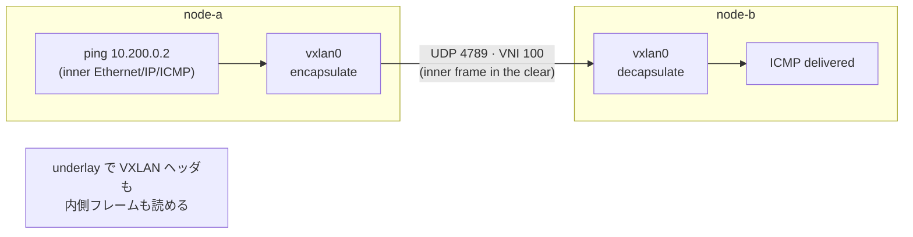

# Lab #18: VXLAN — an Overlay You Can Read on the Wire

Expected time: 45 to 60 minutes  
日本語: 想定時間 45〜60分

Reading guide: [`../rfc-notes/vxlan-overlay.md`](../rfc-notes/vxlan-overlay.md)

Prerequisites: [Lab 16: WireGuard](wg-16-wireguard-tunnel.md), [TCP Lab 07](tcp-07-handshake-teardown.md) (reading captures)

## Goal

Lab 16 built an **encrypted** tunnel (WireGuard): the underlay showed only ciphertext. This lab builds a **VXLAN** overlay, which encapsulates the same way — inner packets inside outer UDP — but does **not** encrypt. So the underlay reveals both the VXLAN header *and* the inner frame in the clear.

VXLAN also differs in *what* it carries: it is a **Layer-2** overlay (it tunnels Ethernet frames), the technology data centers use to stretch one virtual L2 network across many physical hosts.

You will:

- build a point-to-point VXLAN overlay (VNI 100) between two nodes,
- ping across the overlay (10.200.0.0/24),
- capture the **underlay** and see `VXLAN, vni 100` over **UDP 4789** — with the inner `ICMP echo` visible.

日本語: Lab 16 は **暗号化** トンネル(WireGuard)で、underlay には暗号文だけが見えました。この Lab は **VXLAN** overlay を作ります。同じように「内側パケットを外側 UDP に包む」encapsulation ですが、**暗号化しません**。だから underlay には VXLAN ヘッダ *と* 内側フレームの両方が平文で見えます。VXLAN は運ぶ対象も違い、**L2**(Ethernet フレーム)を運ぶ overlay で、データセンターが1つの仮想 L2 を多数の物理ホストに広げるのに使います。VNI 100 の VXLAN overlay を2ノード間に作り、overlay(10.200.0.0/24)越しに ping し、underlay を capture して `VXLAN, vni 100`(UDP 4789)と、その中の `ICMP echo` が見えることを確認します。

By the end, you should be able to compare Lab 16 and Lab 18:

| | WireGuard (Lab 16) | VXLAN (Lab 18) |
|---|---|---|
| Carries | any IP packet (L3) | Ethernet frames (L2) |
| Encrypted? | yes | **no** |
| Underlay shows | ciphertext only (UDP 51820) | VXLAN header + inner frame (UDP 4789) |

## What You Will Learn

理解したいこと:

- What VXLAN is: an L2-over-L3 overlay, identified by a 24-bit **VNI**, carried in **UDP 4789**.
- The difference between an **overlay** address (10.200.0.x) and the **underlay** address (10.0.0.x).
- That encapsulation and encryption are **separate**: VXLAN encapsulates but does not encrypt.
- Why you can read the inner packet on the underlay here, but not in Lab 16.
- Where VXLAN is used (data-center network virtualization, EVPN).

This lab does not cover:

- Multicast VXLAN, VTEP learning, or EVPN control planes (we use a static point-to-point remote).
- VXLAN security (it usually rides on a trusted or separately encrypted underlay).
- Bridging real Ethernet segments; we just put IP on the VXLAN interface.

日本語: VXLAN(24bit VNI、UDP 4789 の L2-over-L3 overlay)、overlay と underlay のアドレスの違い、encapsulation と encryption が別物であること(VXLAN は包むが暗号化しない)、Lab 16 と違って内側が読める理由、VXLAN の用途(DC の network virtualization、EVPN)を学びます。

## RFCで読む場所

| RFC | 章 | 読むポイント |
|---|---|---|
| RFC 7348 | 4 | VXLAN フレームフォーマット(外側 UDP + VXLAN ヘッダ + 内側 Ethernet) |
| RFC 7348 | 5 | VTEP(VXLAN Tunnel Endpoint)の役割 |
| RFC 7348 | 3 | VNI(24bit)による分離、UDP 4789 |
| RFC 5737 | 3 | Lab で使うアドレスが documentation 用であること |

## 実験の全体像

2ノード。underlay(eth1, 10.0.0.0/24)の上に、VXLAN overlay(vxlan0, 10.200.0.0/24)を張る。

```text
             overlay:  10.200.0.1  <== vxlan0 (VNI 100) ==>  10.200.0.2
                            |                                     |
node-a --------------- eth1 (underlay 10.0.0.0/24) --------------- node-b
       10.0.0.1                                              10.0.0.2
```

overlay 側 `10.200.0.2` へ ping すると、VXLAN が内側フレームを **UDP 4789** に包んで underlay の相手へ送る。VXLAN は暗号化しないので、underlay を覗くと VXLAN ヘッダと内側 ICMP が両方見える。



## 必要なもの

推奨環境:

- Linux / WSL2 / Linux VM（**ホストに vxlan カーネルモジュールが必要**。最近の Linux は標準。最初の vxlan 作成時に自動ロード)
- Docker
- containerlab

使用イメージ:

- `nicolaka/netshoot:latest`（`ip`、`tcpdump`(VXLAN デコード対応) 同梱）

追加イメージは不要。VXLAN の data path はホストカーネル。

## 実行手順

```bash
./scripts/labctl.sh run vxlan-18
```

### 1. 作業ディレクトリへ移動する

```bash
cd protocol-lab/examples/vxlan-18
```

### 2. 起動する

```bash
sudo containerlab deploy -t vxlan-18.clab.yml
```

### 3. VXLAN overlay を張る

```bash
# node-a: 相手 (10.0.0.2) を remote に、VNI 100、UDP 4789
docker exec clab-vxlan-18-node-a sh -c \
  "ip link add vxlan0 type vxlan id 100 remote 10.0.0.2 dstport 4789 dev eth1; \
   ip addr add 10.200.0.1/24 dev vxlan0; ip link set vxlan0 up"
# node-b: 対称に
docker exec clab-vxlan-18-node-b sh -c \
  "ip link add vxlan0 type vxlan id 100 remote 10.0.0.1 dstport 4789 dev eth1; \
   ip addr add 10.200.0.2/24 dev vxlan0; ip link set vxlan0 up"
```

### 4. overlay 越しに ping する

```bash
docker exec clab-vxlan-18-node-a ping -c3 10.200.0.2
docker exec clab-vxlan-18-node-a ip -d link show vxlan0
```

### 5. underlay を capture して中身が見えることを確認する

```bash
docker exec -d clab-vxlan-18-node-a tcpdump -i eth1 -n -w /tmp/vx.pcap "udp port 4789"
docker exec clab-vxlan-18-node-a ping -c3 10.200.0.2
docker exec clab-vxlan-18-node-a pkill -INT tcpdump
docker exec clab-vxlan-18-node-a tcpdump -n -e -vv -r /tmp/vx.pcap
```

`VXLAN, ... vni 100` の行に続いて、内側の `10.200.0.1 > 10.200.0.2: ICMP echo request` が **そのまま** 見える。

## 期待出力

- `ping 10.200.0.2` が成功。
- `ip -d link show vxlan0` に `vxlan id 100 ... dstport 4789`。
- underlay の capture: `VXLAN, ... vni 100`(UDP 4789)と、その内側の `ICMP echo`(平文)。

## なぜそう動くのか

VXLAN(Virtual eXtensible LAN)は、L2 の Ethernet フレームを L3 の UDP パケットに包んで運ぶ overlay。「1つの仮想 LAN を、物理的に離れたホスト間で共有する」ために使う。

- **encapsulation**: 内側の Ethernet フレーム(その中に IP、さらに ICMP)を、`UDP 4789 + VXLAN ヘッダ` で包む。VXLAN ヘッダには **VNI**(24bit の識別子)が入り、どの overlay に属するかを区別する(最大 1600 万個)。
- **VTEP**: encapsulate/decapsulate する端点を VTEP と呼ぶ。このLabでは各ノードの vxlan0 が VTEP。`remote` で相手 VTEP の underlay アドレスを指定した point-to-point 構成。
- **暗号化しない**: VXLAN の仕事は「包んで運ぶ」だけ。暗号化はしない。だから underlay を capture すると、VXLAN ヘッダも内側フレームも平文で読める。tcpdump は VXLAN をデコードして中の ICMP まで見せてくれる。
- **Lab 16 との対比**: WireGuard も「UDP に包んで運ぶ」が、中身を **暗号化** する。だから underlay には暗号文しか見えなかった。**encapsulation(包む)と encryption(暗号化)は別の機能**。VXLAN は前者だけ、WireGuard は両方。VXLAN を安全に使うには、信頼できる underlay の上で使うか、別途 IPsec 等で underlay を暗号化する。

要点は、**「包む」ことと「暗号化する」ことは独立している**。overlay = 秘匿、ではない。

## 詰まりやすい点

- **overlay を「暗号化されている」と思い込む**。VXLAN は暗号化しない。中身は underlay で読める。
- **overlay と underlay のアドレスを混同する**。underlay=10.0.0.0/24(eth1)、overlay=10.200.0.0/24(vxlan0)。ping するのは overlay。
- **VNI を忘れる**。両端で同じ VNI(ここでは 100)を使わないと通らない。
- **L2 overlay であること**。VXLAN は Ethernet フレームを運ぶ。このLabは vxlan0 に IP を載せているが、本来は bridge に繋いで L2 セグメントを延伸する用途。
- **カーネルモジュール**。VXLAN の data path はホストカーネル。無い環境では動かない(最近の Linux は標準)。
- **MTU**。VXLAN ヘッダのぶん overlay の実効 MTU は小さくなる(50 バイト程度減る)。大きいパケットで断片化に注意。

## 後片付け

```bash
sudo containerlab destroy -t vxlan-18.clab.yml --cleanup
```

`labctl.sh run vxlan-18` を使った場合は、スクリプトが最後に destroy する。

## 確認問題

1. VXLAN は何を何に包むか(内側と外側)。どのポートを使うか。
2. VNI とは何か。何ビットで、何を区別するか。
3. overlay と underlay のアドレスは、このLabではそれぞれどれか。
4. underlay を capture すると内側の ICMP が見えるのはなぜか。Lab 16(WireGuard)との違いは何か。
5. encapsulation と encryption はどう違うか。VXLAN・WireGuard はそれぞれどちらを行うか。
6. VXLAN を安全に使いたい場合、何と組み合わせるか。

## References

- [RFC 7348: Virtual eXtensible Local Area Network (VXLAN)](https://www.rfc-editor.org/rfc/rfc7348)
- [RFC 5737: IPv4 Address Blocks Reserved for Documentation](https://www.rfc-editor.org/rfc/rfc5737)
- [ip-link(8) manual page (vxlan)](https://man7.org/linux/man-pages/man8/ip-link.8.html)

## 検証済み実行ログ (2026-07-07)

このLabは実機で再現性を確認済みです。

実行環境:

- Ubuntu 26.04 LTS (kernel 7.0.0-27-generic, x86_64)。vxlan カーネルモジュールは最初の vxlan0 作成時に自動ロードされた。
- Docker 29.1.3
- containerlab 0.77.0
- node-a / node-b: `nicolaka/netshoot:latest`（tcpdump 4.99.6、VXLAN デコード対応）

`PATH="/tmp/pl-shim:$PATH" ./scripts/labctl.sh run vxlan-18` で deploy → verify → destroy を実行し、`verification.json` は `"status": "verified"` を返した。

### overlay 越しの ping と VXLAN インターフェース

```text
$ docker exec clab-vxlan-18-node-a ping -c3 10.200.0.2
3 packets transmitted, 3 received, 0% packet loss

$ docker exec clab-vxlan-18-node-a ip -d link show vxlan0
... vxlan id 100 remote 10.0.0.2 dev eth1 srcport 0 0 dstport 4789 ...
```

### underlay に VXLAN ヘッダと内側フレームが両方見える

```text
$ docker exec clab-vxlan-18-node-a tcpdump -n -e -vv -r underlay.pcap
10.0.0.1.46777 > 10.0.0.2.4789: [udp sum ok] VXLAN, flags [I] (0x08), vni 100
10.200.0.1 > 10.200.0.2: ICMP echo request, id ..., seq 1, length 64
10.0.0.2.33408 > 10.0.0.1.4789: [udp sum ok] VXLAN, flags [I] (0x08), vni 100
10.200.0.2 > 10.200.0.1: ICMP echo reply, id ..., seq 1, length 64
```

外側は `VXLAN ... vni 100`(UDP 4789)、その内側の `ICMP echo request/reply` が**平文でそのまま**見える。VXLAN は encapsulation はするが encryption はしない——Lab 16 の WireGuard(underlay は暗号文のみ)との決定的な違い。「包む」ことと「暗号化する」ことは別の機能だと分かる。

### Cleanup

```bash
containerlab destroy -t vxlan-18.clab.yml --cleanup
```
