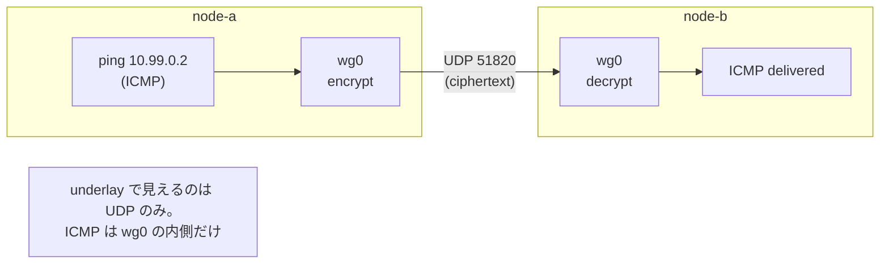

# Lab #16: WireGuard — an Encrypted Tunnel You Can See Into

Expected time: 50 to 65 minutes  
日本語: 想定時間 50〜65分

Reading guide: [`../rfc-notes/wg-wireguard-tunnel.md`](../rfc-notes/wg-wireguard-tunnel.md)

Prerequisite: [TCP Lab 07: One Connection, From SYN to FIN](tcp-07-handshake-teardown.md) (for reading packet captures)

## Goal

The encryption labs so far wrapped one thing at a time: TLS wraps a TCP stream (Lab 09), DoT/DoH wrap DNS (Lab 14). A **VPN tunnel** wraps *everything* — any IP packet — and sends it across an untrusted network. This lab builds a **WireGuard** tunnel between two nodes and shows the two views of the same ping:

- On the **underlay** (the real link, `eth1`) you see only **encrypted UDP** to port 51820. The inner packet is hidden.
- Inside the **tunnel interface** (`wg0`) you see the **cleartext ICMP** — because that is where WireGuard hands you the decrypted packet.

日本語: ここまでの暗号化は「1つのものを包む」ものでした。TLS は TCP ストリーム(Lab 09)、DoT/DoH は DNS(Lab 14)。**VPN トンネル**は**すべて**(任意の IP パケット)を包み、信頼できない網の上を運びます。この Lab では2ノード間に **WireGuard** トンネルを張り、同じ ping の2つの見え方を観察します。**underlay**(実リンク eth1)には **暗号化 UDP(51820番)**だけが見え、中身は隠れる。**tunnel インターフェース**(`wg0`)には **平文の ICMP** が見える(そこが復号後のパケットを受け取る場所だから)。

By the end, you should be able to fill in this table for one ping across the tunnel:

| Where you capture | What you see |
|---|---|
| underlay `eth1` | `10.0.0.1.51820 > 10.0.0.2.51820: UDP` (encrypted, no ICMP) |
| tunnel `wg0` | `10.99.0.1 > 10.99.0.2: ICMP echo request` (cleartext) |

## What You Will Learn

理解したいこと:

- What a tunnel is: an **overlay** (10.99.0.0/24) carried inside packets on an **underlay** (10.0.0.0/24).
- How WireGuard identifies peers by **public keys** (not usernames/passwords) and pins each to an endpoint + allowed IPs.
- Why the underlay shows only UDP/51820 and the inner protocol is invisible there.
- Where you *can* still read the inner traffic (on `wg0`, at the tunnel endpoint).
- How this compares to TLS/DoT/DoH: same idea (encrypt + authenticate), but at the **packet** layer, for **any** protocol.

This lab does not cover:

- WireGuard's cryptographic internals (Noise handshake, key rotation) beyond naming them.
- Roaming, NAT traversal, or `wg-quick`/config-file workflows.
- Routing whole subnets or building a full site-to-site VPN.

日本語: tunnel = overlay を underlay のパケットで運ぶこと、WireGuard が公開鍵で peer を識別すること、underlay に UDP/51820 しか見えない理由、内側を読める場所(`wg0`)、そして TLS/DoT/DoH との比較(同じ「暗号化+認証」を**パケット**層で**任意**のプロトコルに対して行う)を学びます。

## RFCで読む場所

WireGuard は単一の RFC ではなく、Jason A. Donenfeld の論文と、それが使う暗号の RFC 群で定義される。

| 資料 | 読むポイント |
|---|---|
| WireGuard whitepaper | 概要、peer = 公開鍵、endpoint、allowed-ips、UDP での運搬 |
| RFC 7748 | Curve25519 / X25519(鍵合意に使う楕円曲線) |
| RFC 8439 | ChaCha20-Poly1305(データの暗号化と認証) |
| Noise Protocol Framework | WireGuard の handshake の土台(参考) |
| RFC 5737 | Lab で使うアドレスが documentation 用であること |

## 実験の全体像

2ノード。実リンク(underlay, eth1)の上に、WireGuard の overlay(wg0)を張る。

```text
             overlay (tunnel):  10.99.0.1  <== wg0 ==>  10.99.0.2
                                    |                       |
node-a ------------- eth1 (underlay 10.0.0.0/24) ------------- node-b
       10.0.0.1                                          10.0.0.2
```

`node-a` から overlay 側の `10.99.0.2` へ ping すると、WireGuard がそのパケットを暗号化して underlay の `10.0.0.2:51820` へ UDP で送る。`node-b` が復号して `wg0` に出す。だから:

- underlay(eth1)を capture すると **UDP/51820 の暗号文**だけ。中の ICMP は見えない。
- `wg0` を capture すると **平文の ICMP**。



`203.0.113.0/24` は使わないが、`10.0.0.0/24`(underlay)と `10.99.0.0/24`(overlay)はローカル閉域用。

## 必要なもの

推奨環境:

- Linux / WSL2 / Linux VM（**ホストに WireGuard カーネルモジュールが必要**。最近の Linux は標準。最初の `wg0` 作成時に自動ロードされる)
- Docker
- containerlab

使用イメージ:

- `protocol-lab/wireguard:latest`(`examples/wg-16/Dockerfile` からローカルビルド。`nicolaka/netshoot` に `wireguard-tools` を足しただけ)

WireGuard の**データ経路はホストカーネル**が担うので、コンテナ側には `wg`(userspace ツール)だけあればよい。`run.sh` は deploy 前にイメージをビルドする。

## 実行手順

```bash
./scripts/labctl.sh run wg-16
```

`labctl.sh run wg-16` は、イメージビルド、deploy、鍵生成と peer 設定、トンネル越しの ping、underlay と wg0 の同時 capture、比較、後片付けまで行う。

### 1. 作業ディレクトリへ移動する

```bash
cd protocol-lab/examples/wg-16
```

### 2. 起動する

```bash
docker build -t protocol-lab/wireguard:latest .
sudo containerlab deploy -t wg-16.clab.yml
```

### 3. 鍵を作り、トンネルを張る

各ノードで秘密鍵を作り、相手の公開鍵を教え合う。

```bash
# 鍵ペア
A_PRIV=$(docker exec clab-wg-16-node-a wg genkey)
A_PUB=$(printf '%s' "$A_PRIV" | docker exec -i clab-wg-16-node-a wg pubkey)
B_PRIV=$(docker exec clab-wg-16-node-b wg genkey)
B_PUB=$(printf '%s' "$B_PRIV" | docker exec -i clab-wg-16-node-b wg pubkey)

# node-a: wg0 を作り、B を peer に
docker exec clab-wg-16-node-a ip link add wg0 type wireguard
printf '%s' "$A_PRIV" | docker exec -i clab-wg-16-node-a sh -c \
  "wg set wg0 private-key /dev/stdin listen-port 51820 \
     peer $B_PUB endpoint 10.0.0.2:51820 allowed-ips 10.99.0.0/24"
docker exec clab-wg-16-node-a sh -c "ip addr add 10.99.0.1/24 dev wg0; ip link set wg0 up"

# node-b: 対称に
docker exec clab-wg-16-node-b ip link add wg0 type wireguard
printf '%s' "$B_PRIV" | docker exec -i clab-wg-16-node-b sh -c \
  "wg set wg0 private-key /dev/stdin listen-port 51820 \
     peer $A_PUB endpoint 10.0.0.1:51820 allowed-ips 10.99.0.0/24"
docker exec clab-wg-16-node-b sh -c "ip addr add 10.99.0.2/24 dev wg0; ip link set wg0 up"
```

（秘密鍵は `/dev/stdin` で渡す。ファイルに書かない。)

### 4. トンネル越しに ping する

```bash
docker exec clab-wg-16-node-a ping -c3 10.99.0.2
docker exec clab-wg-16-node-a wg show wg0
```

`ping` が通り、`wg show` に `latest handshake` と `transfer` が出れば、トンネルは機能している。

### 5. 2か所で同時に capture して比べる

```bash
# underlay（実リンク）: UDP 51820 と（もし見えるなら）ICMP
docker exec -d clab-wg-16-node-a tcpdump -i eth1 -n -w /tmp/under.pcap "udp port 51820 or icmp"
# tunnel の内側
docker exec -d clab-wg-16-node-a tcpdump -i wg0 -n -w /tmp/inner.pcap "icmp"
docker exec clab-wg-16-node-a ping -c3 10.99.0.2
docker exec clab-wg-16-node-a pkill -INT tcpdump
docker exec clab-wg-16-node-a tcpdump -n -r /tmp/under.pcap   # -> UDP 51820 のみ
docker exec clab-wg-16-node-a tcpdump -n -r /tmp/inner.pcap   # -> ICMP echo
```

## 期待出力

- `ping 10.99.0.2` が成功。`wg show wg0` に peer / latest handshake / transfer。
- underlay の capture: `10.0.0.1.51820 > 10.0.0.2.51820: UDP`(暗号文)。**ICMP は出ない**。
- wg0 の capture: `10.99.0.1 > 10.99.0.2: ICMP echo request`(平文)。

## なぜそう動くのか

トンネルは「overlay のパケットを、underlay のパケットの中に入れて運ぶ(encapsulation)」仕組み。WireGuard はそれを暗号付きでやる、非常に小さな VPN。

- **peer = 公開鍵**: WireGuard に「ユーザ名/パスワード」は無い。各 peer は公開鍵で識別され、`allowed-ips` でその peer が名乗ってよい overlay アドレスを固定する(cryptokey routing)。これが認証を兼ねる。
- **UDP で運ぶ**: 暗号化したパケットを相手の `endpoint`(IP:51820)へ UDP で送る。だから underlay には UDP/51820 しか見えない。中の IP パケット(ここでは ICMP)は暗号文の中。
- **`wg0` は復号の出入口**: 送信側は「wg0 に入れた=暗号化して送る」、受信側は「復号して wg0 から出す」。だから `wg0` を capture すると平文が見える。これは「盗聴できる」のではなく、**自分がトンネルの端点だから**中身を扱えるだけ。
- **TLS/DoT/DoH との違い**: あれらは特定のプロトコル(TCP ストリーム、DNS)を包む。WireGuard は **IP パケットそのもの**を包むので、上で何が走っていても(TCP でも UDP でも ICMP でも)まとめて暗号化される。層が違う。

要点は、**暗号化は underlay に対して効いていて、内側は端点でだけ読める**ということ。「wg0 で平文が見えた=暗号化されていない」ではない。

## 詰まりやすい点

- **wg0 で平文が見えるのを「暗号化されていない」と誤解する**。wg0 は復号後の出入口。経路(underlay)では暗号化されている。
- **underlay と overlay のアドレスを混同する**。underlay=10.0.0.0/24(実リンク)、overlay=10.99.0.0/24(トンネル)。ping するのは overlay。
- **公開鍵と秘密鍵を取り違える**。相手に渡すのは公開鍵。秘密鍵は各ノードの中だけ。
- **`allowed-ips` を軽視する**。これは「この peer が使ってよい overlay アドレス」で、認証とルーティングを兼ねる。広すぎると危険。
- **カーネルモジュール**。WireGuard のデータ経路はホストカーネル。モジュールが無い環境では動かない(最近の Linux は標準)。
- **endpoint の向き**。各 peer に相手の endpoint(IP:port)を教える。NAT 越えなどでは片側だけでも可(このLabは両側固定)。

## 後片付け

```bash
sudo containerlab destroy -t wg-16.clab.yml --cleanup
```

`labctl.sh run wg-16` を使った場合は、スクリプトが最後に destroy する。

## 確認問題

1. underlay と overlay の違いは何か。このLabではそれぞれどのアドレスか。
2. underlay の capture に UDP/51820 しか見えず、ICMP が見えないのはなぜか。
3. `wg0` を capture すると平文 ICMP が見える。これは「暗号化されていない」ことを意味するか。なぜか。
4. WireGuard は peer をどう識別するか。`allowed-ips` は何を決めるか。
5. TLS(Lab 09)や DoT/DoH(Lab 14)と、WireGuard トンネルは何を包む対象が違うか。
6. WireGuard のデータ経路はどこで動くか(コンテナ内かホストか)。

## References

- [WireGuard: Next Generation Kernel Network Tunnel (whitepaper)](https://www.wireguard.com/papers/wireguard.pdf)
- [WireGuard official site](https://www.wireguard.com/)
- [RFC 7748: Elliptic Curves for Security (Curve25519 / X25519)](https://www.rfc-editor.org/rfc/rfc7748)
- [RFC 8439: ChaCha20 and Poly1305 for IETF Protocols](https://www.rfc-editor.org/rfc/rfc8439)
- [RFC 5737: IPv4 Address Blocks Reserved for Documentation](https://www.rfc-editor.org/rfc/rfc5737)

## 検証済み実行ログ (2026-07-07)

このLabは実機で再現性を確認済みです。

実行環境:

- Ubuntu 26.04 LTS (kernel 7.0.0-27-generic, x86_64)。WireGuard カーネルモジュールは最初の `wg0` 作成時に自動ロードされた。
- Docker 29.1.3
- containerlab 0.77.0
- node-a / node-b: `nicolaka/netshoot` に `wireguard-tools` を足した `protocol-lab/wireguard:latest`

`PATH="/tmp/pl-shim:$PATH" ./scripts/labctl.sh run wg-16` で deploy → verify → destroy を実行し、`verification.json` は `"status": "verified"` を返した。

### トンネル越しの ping と wg 状態

```text
$ docker exec clab-wg-16-node-a ping -c3 10.99.0.2
3 packets transmitted, 3 received, 0% packet loss

$ docker exec clab-wg-16-node-a wg show wg0
  listening port: 51820
peer: iS00XLODRk3nKHX53HttPf53j0AkuHqnjmY2OMU7fTU=
  latest handshake: 6 seconds ago
  transfer: 604 B received, 660 B sent
```

### underlay(eth1)には暗号化 UDP しか見えない

```text
$ docker exec clab-wg-16-node-a tcpdump -n -r underlay.pcap
09:51:28.861019 IP 10.0.0.1.51820 > 10.0.0.2.51820: UDP, length 128
... (UDP/51820 が6パケット、ICMP は0)
```

underlay の capture に ICMP は一度も現れない(`grep -c ICMP` = 0)。中身は暗号文。

### tunnel の内側(wg0)には平文 ICMP が見える

```text
$ docker exec clab-wg-16-node-a tcpdump -n -r inner-wg0.pcap
09:51:28.860993 IP 10.99.0.1 > 10.99.0.2: ICMP echo request, id 59876, seq 1, length 64
... (ICMP echo が6パケット)
```

同じ ping が、underlay では UDP/51820 の暗号文、wg0 の内側では平文 ICMP。**暗号化は経路に効いていて、中身は端点でだけ読める**——TLS(Lab 09)や DoT/DoH(Lab 14)と同じ発想を、任意の IP パケットに対してパケット層で行っている。

### Cleanup

```bash
containerlab destroy -t wg-16.clab.yml --cleanup
```
