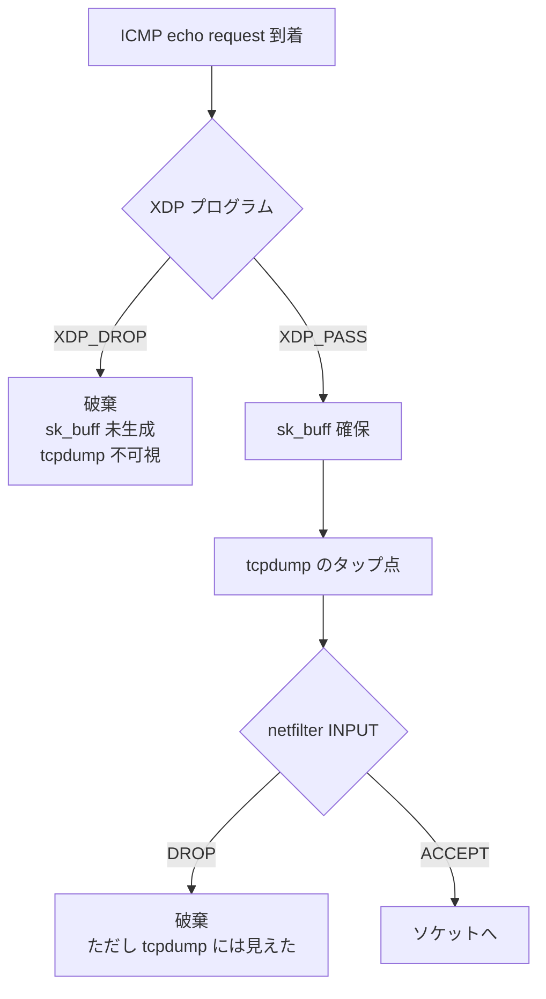

# Lab #46: XDP — Dropping a Packet Before It Becomes a Packet

Expected time: 35 to 50 minutes  
日本語: 想定時間 35〜50分

Reading guide: [`../rfc-notes/xdp-ebpf.md`](../rfc-notes/xdp-ebpf.md)

Prerequisite: [Lab 36: Stateful Firewall — Decide by the Connection, Not the Packet](fw-36-stateful-firewall.md)

## Goal

Lab 36 dropped packets with netfilter. This lab drops the *same* packets with a small eBPF program attached to XDP (34 instructions after verification — `xlated 272B` below), and then puts the two side by side.

Both stop the ping. That is not the interesting part. The interesting part is that **only one of them can be seen with `tcpdump`**. XDP runs on the receive path before the kernel allocates an `sk_buff`; `tcpdump` taps the stack after that allocation. A packet XDP drops therefore cannot appear in a capture at all — not because the capture is misconfigured, but because from the stack's point of view the packet never arrived.

That leaves a debugging problem: if the packet is gone and nothing saw it, how do you prove what removed it? The answer is the second half of eBPF — the program writes to a **map**, and userspace reads it.

日本語: Lab 36 は netfilter でパケットを落としました。この Lab は *同じ* パケットを、XDP に載せた小さな eBPF プログラム(検証後34命令 = 後述の `xlated 272B`)で落とし、両者を並べます。どちらも ping を止めます。面白いのはそこではなく、**片方だけが `tcpdump` で見える** ことです。XDP は受信経路で、カーネルが `sk_buff` を確保する前に走ります。`tcpdump` はその確保より後でスタックをタップします。したがって XDP が落としたパケットはキャプチャに一切現れません——設定ミスではなく、スタックから見れば **そのパケットは到着していない** からです。ここでデバッグの問題が生まれます。パケットが消え、誰も見ていないなら、何が消したとどう証明するのか。その答えが eBPF のもう半分、**マップ** です。プログラムがマップに書き、ユーザ空間が読みます。

By the end, you should be able to explain this:

| | ping replies | tcpdump on the target | evidence it happened |
|---|---|---|---|
| no filter | 2 / 2 | — | — |
| `XDP_DROP` | 0 / 2 | **0** | BPF map counted 4 |
| `iptables -j DROP` | 0 / 2 | **2** | rule counter 4 packets |

## What You Will Learn

理解したいこと:

- Where XDP sits in the receive path, relative to `sk_buff`, netfilter and tcpdump.
- Why the verifier rejects a program without bounds checks — and that it is a *load* failure, not a runtime one.
- That loading and attaching are two separate steps.
- How a BPF map is the only channel from a program back to userspace.
- Why "the packet is gone and nothing captured it" is a symptom worth recognising.

This lab does not cover: AF_XDP and zero-copy, `XDP_REDIRECT`, native (driver) XDP performance, BTF/CO-RE portability, or the tc/BPF hook.

日本語: AF_XDP と zero-copy、`XDP_REDIRECT`、native(ドライバ)XDP の性能、BTF/CO-RE の可搬性、tc/BPF フックは扱いません。

## RFCで読む場所

XDP はカーネルの仕組みなので RFC はありません。

| 資料 | 読むポイント |
|---|---|
| kernel BPF documentation | XDP の位置づけと verdict |
| bpf(2) | プログラムのロード、マップ、verifier |
| bpftool-prog(8) / bpftool-net(8) | load / attach / map dump |
| tcpdump(1) | どこでスタックをタップするか |

## 実験の全体像

```text
  送信側 (root netns)              受信側 (netns h2)
  10.40.0.1  ──── veth ────  10.40.0.2

  受信経路のどこで落とすか:

    NIC/veth
       |
       +--> [ XDP ]  <-- ここで落とすと sk_buff すら作られない
       |                 tcpdump には出ない
       v
    sk_buff 確保
       |
       +--> [ tcpdump のタップ点 ]
       |
       +--> [ netfilter INPUT ]  <-- ここで落とすと tcpdump には出た後
       v
    ソケットへ配送
```



## 必要なもの

推奨環境:

- Linux / WSL2 / Linux VM(BPF 有効なカーネル)
- Docker

**`--ulimit memlock=-1` が必要です。** BPF プログラムとマップのロードは `RLIMIT_MEMLOCK` に課金され、既定の 64k では足りません。`run.sh` は付けています。

使用イメージ:

- `protocol-lab/xdp-lab:alpine3.21`（run.sh が Dockerfile からビルド。clang / llvm / libbpf-dev / bpftool / iproute2 / iptables / tcpdump）

## 実行手順

```bash
./scripts/labctl.sh run xdp-46
```

### 1. 作業ディレクトリへ移動する

```bash
cd protocol-lab/examples/xdp-46
```

### 2. イメージをビルドして実行する

```bash
docker build -t protocol-lab/xdp-lab:alpine3.21 .
docker run --rm --privileged --ulimit memlock=-1 protocol-lab/xdp-lab:alpine3.21
```

BPF オブジェクトはイメージのビルド時にコンパイルされます:

```bash
clang -O2 -g -target bpf -c drop_icmp.bpf.c -o drop_icmp.bpf.o
```

### 3. プログラムを読む

`drop_icmp.bpf.c` は50行足らずです。すべての参照の前に `data_end` との境界チェックが入っています。これは行儀の良さではなく、**無いと verifier がロードを拒否します**。

## 期待出力

- step 2: `xdp  name drop_icmp` としてロードされる(verifier が通った証拠)。
- step 4: ping は 0/2、tcpdump は **0**、BPF マップのカウンタは **4**。
- step 5: ping は 0/2、tcpdump は **2**、iptables のカウンタは 4 packets。

## なぜそう動くのか

**XDP の本質は速さではなく「早さ」です。** 早いということは、それ以降の全部から見えないということです。

- **受信経路の順序**: NIC(ここでは veth)からフレームが来ると、カーネルはまず XDP フックを呼びます。**この時点ではまだ `sk_buff` が存在しません**。XDP が `XDP_DROP` を返すと、そこで終わりです。`sk_buff` の確保も、netfilter も、ソケット配送も起きません。
- **tcpdump が見えない理由**: `tcpdump` は `AF_PACKET` ソケットでスタックをタップします。そのタップ点は `sk_buff` 生成より **後** です。だから XDP が落としたパケットは「キャプチャに写らなかった」のではなく、**キャプチャできる形になる前に消えている** のです。step 4 の `0` はバグではありません。
- **iptables が見える理由**: netfilter の `INPUT` チェーンは、パケットがスタックに受け取られ、`sk_buff` になり、tcpdump のタップ点を通過した **後** にあります。だから step 5 では tcpdump が2発とも捉えた上で、その後に落とされています。**同じ結果、違う場所**。
- **verifier はロード時に証明を要求する**: `if ((void *)(eth + 1) > data_end) return XDP_PASS;` のような境界チェックが1つでも欠けると、プログラムは **ロードに失敗** します。実行時に落ちるのではありません。カーネルは「安全だと証明できないコード」を最初から入れません。これが、任意のコードをカーネルの受信経路に置いても安全な理由です。
- **ロードとアタッチは別**: step 2 でプログラムはカーネルに入りますが、まだどのフックにも繋がっておらず、パケットは1つも通っていません。step 3 でアタッチして初めて動き出します。
- **マップが唯一の出口**: BPF プログラムはユーザ空間を呼べません。できるのはマップに書くことだけです。この Lab では1要素の配列マップをカウンタにし、`bpftool map dump` で読みました。**`4` という値が、「パケットが行方不明になった」のではなく「このプログラムが4つ落とした」ことの証拠**です。可視性を失った代償を、こうやって取り戻します。
- **`generic` モードについて**: native XDP はデバイスドライバの中で走ります。`xdpgeneric` はスタックの受信経路で走る互換モードで、遅い代わりにどこでも動きます。この Lab は挙動を見るのが目的なので generic を使っています。

要点は、**フィルタを「どの層に置くか」は結果ではなく観測可能性を変える**ということです。運用でこれを知らないと、「pingが通らないのに tcpdump に何も出ない」という状況で原因を延々と探すことになります。

## 詰まりやすい点

- **`ip link set dev X xdp obj ...` が `Permission denied` で失敗する**。iproute2 の独自ローダーは libbpf 形式(BTF)のマップ定義を読めません。`bpftool prog load` + `bpftool net attach` を使う。
- **`memlock` 不足**。`--ulimit memlock=-1` が無いとロードが拒否されます。
- **`ip netns exec` の中から `/sys/fs/bpf` のピンが見えない**。`ip netns exec` は対象 namespace 用に sysfs を貼り直すため、その下のピンが隠れます。**bpffs は `/sys` の外**(この Lab では `/bpf`)にマウントする。
- **`bpftool prog load` だけではマップが pin されない**。`pinmaps <dir>` を付ける。
- **tcpdump の出力が空**。`-U` を付けないと、`timeout` で殺されたときバッファが失われることがあります。
- **「tcpdump に出ない = 届いていない」と結論する**。この Lab の主題そのものです。XDP や、その手前のドライバ/ハードウェアで落ちている可能性があります。
- **verifier のエラーを実行時エラーと思う**。ロードの時点で拒否されています。プログラムは一度も走っていません。

## 後片付け

```bash
docker rm -f protocol-lab-xdp-46
```

`labctl.sh run xdp-46` を使った場合は、スクリプトが最後に削除します。

## 確認問題

1. 受信経路上で、XDP・`sk_buff` の確保・tcpdump のタップ点・netfilter INPUT を順に並べよ。
2. XDP が落としたパケットが tcpdump に出ないのはなぜか。「キャプチャの設定が悪い」以外の理由を述べよ。
3. iptables が落としたパケットが tcpdump に出るのはなぜか。
4. verifier が `data_end` チェックを要求するのはなぜか。チェックが無いとどの時点で何が起きるか。
5. BPF プログラムがユーザ空間に情報を渡す方法は何か。この Lab では何を渡したか。
6. マップのカウンタが `4` であることは、何を証明しているか。
7. 「ping が通らないのに tcpdump に何も出ない」とき、疑うべきものを2つ挙げよ。

## References

- [BPF documentation — kernel](https://docs.kernel.org/bpf/)
- [bpf(2)](https://man7.org/linux/man-pages/man2/bpf.2.html)
- [bpftool-prog(8)](https://man7.org/linux/man-pages/man8/bpftool-prog.8.html)
- [bpftool-net(8)](https://man7.org/linux/man-pages/man8/bpftool-net.8.html)
- [tcpdump(1)](https://man7.org/linux/man-pages/man1/tcpdump.1.html)

## 検証済み実行ログ (2026-08-06)

このLabは実機で再現性を確認済みです。

実行環境:

- Ubuntu 26.04 LTS (kernel 7.0.0-28-generic, x86_64)
- Docker 29.1.3（`--privileged --ulimit memlock=-1`）
- lab container: `protocol-lab/xdp-lab:alpine3.21`（Alpine 3.21 + clang / libbpf / bpftool）

`./scripts/labctl.sh run xdp-46` で build → deploy → verify → destroy を実行し、`verification.json` は `"status": "verified"` を返した。

### verifier が通り、プログラムがカーネルに入る

```text
+ bpftool prog load /lab/drop_icmp.bpf.o /bpf/drop_icmp pinmaps /bpf
+ bpftool prog show pinned /bpf/drop_icmp
493: xdp  name drop_icmp  tag c14fad7a9d2b3deb  gpl
	loaded_at 2026-08-06T00:36:12+0000  uid 0
	xlated 272B  jited 162B  memlock 4096B  map_ids 83
	btf_id 251
```

`xlated 272B` / `jited 162B` — 検証を通ったあと JIT でネイティブコードになっている。この時点ではまだどこにもアタッチされていない。

### アタッチして初めて動き出す

```text
+ ip netns exec h2 bpftool net attach xdpgeneric pinned /bpf/drop_icmp dev eth0
+ ip netns exec h2 bpftool net show dev eth0
xdp:
eth0(3) generic id 493
```

### XDP_DROP: ping も止まり、キャプチャも空

```text
ping with XDP attached: 0 of 2 replies
echo requests tcpdump saw on h2: 0
-- the program's own counter --
+ bpftool map dump pinned /bpf/icmp_drops
[{
        "key": 0,
        "value": 4
    }
]
```

tcpdump は **0**。しかしマップは **4** を数えている。パケットは行方不明になったのではなく、スタックに渡る前にプログラムが処理した。

### iptables: 同じ結果、しかし見える

```text
ping with the iptables rule: 0 of 2 replies
echo requests tcpdump saw on h2: 2
+ ip netns exec h2 iptables -L INPUT -v -n
Chain INPUT (policy ACCEPT 0 packets, 0 bytes)
 pkts bytes target     prot opt in     out     source               destination
    4   336 DROP       icmp --  *      *       0.0.0.0/0            0.0.0.0/0
```

ping は同じく 0/2。だが tcpdump は **2発とも捉えている**。パケットはスタックに届き、tcpdump のタップ点を通り、その後 INPUT で落とされた。

### 並べるとこうなる

```text
                        ping replies    tcpdump on h2
no filter                    2               (n/a)
XDP_DROP                     0               0     <- never reached the stack
iptables -j DROP             0               2     <- arrived, then was dropped
```

### Cleanup

```bash
docker rm -f protocol-lab-xdp-46
```
